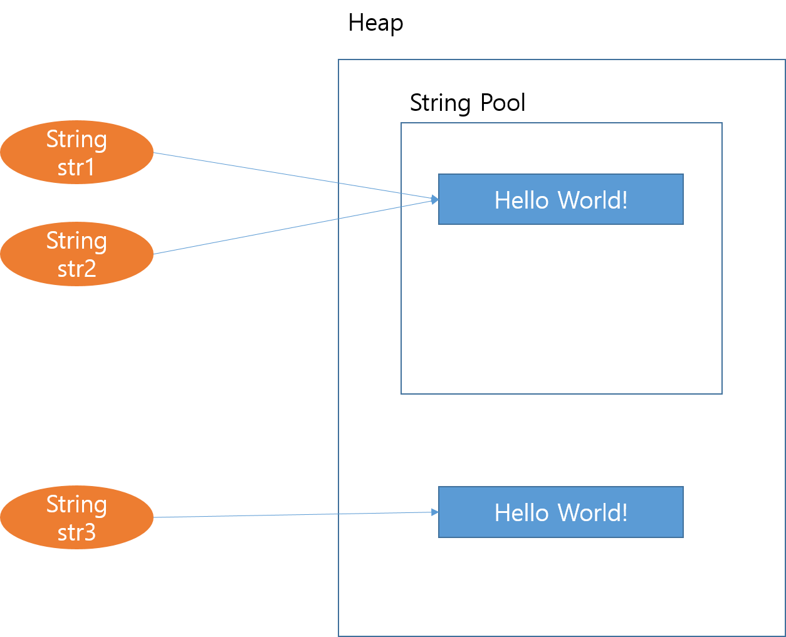

# 자바의 String이 Immutable인 이유

자바에서는 문자열을 처리하기 위해서 `String` 클래스를 많이 사용한다. 그러나 문자열을 `String` 클래스 객체로 생성하면 `String` 객체 내부에 있는 문자열 데이터를 읽을 수만 있고, 변경할 수는 없다. 이렇게 메모리에 인스턴스화 된 이 후에 객체 내부의 데이터나 상태를 변경할 수 없는 클래스 객체를 `Immutable` 하다고 한다. 

자바 언어 설계자가 String 클래스 객체를 `Immutable` 하도록 설계한 이유는 다음과 같은 주제와 관련이 있다.

- Cache
- Security
- Synchronization
- HashCode Caching
- Performance

## Cache

### String Pool

자바 언어에서 쌍 따옴표("")를 이용해서 문자열 리터럴 상수를 표시하면, 자바에서는 내부적으로 `String` 객체를 생성한 뒤 이 문자열을 저장한다. 이때 생성된 `String` 객체는 `String Pool`이라는 힙 내부의 특수한 메모리 영역에 저장된다. 아래 코드를 보자.

```java
String str1 = "Hello World!";
String str2 = "Hello World!";

String str3 = new String("Hello World!");

if (str1 == str2) {
    System.out.println("same object address");
}
if (str1 != str3) {
    System.out.println("different object address");
}
```

위 코드의 실행 결과를 확인해보면 str1, str2는 같은 메모리 주소를 갖는다는 것을 알 수 있다. 자바에서 쌍 따옴표("")를 이용해서 String 문자열 객체를 생성하고 변수에 할당할 때 예전에 동일한 문자열을 쌍 따옴표를 이용해서 만든적이 있다면, String 객체를 새로 생성하지 않고 기존에 있던 String 객체를 참조하게 한다.

</img>

문자열을 이렇게 처리함으로써 불필요한 메모리 할당을 줄일 수 있고, 문자열 처리를 진행할 때 문자열 객체 생성 과정을 생략할 수 있어서 실행시간을 단축시킬 수 있다.

여기서 만약 String 객체가 `Mutable` 하다면(내부 문자열을 수정할 수 있다면) 다음과 같은 시나리오에서 문제가 발생할 수 있다. 앞의 코드와 같이 2개의 String 변수가 동일한 String 객체를 참조하고 있을때, str1을 이용해서 String 객체의 문자열을 "GoodBye Cruel World" 변경한다. 그런데 프로그래머가 String pool에 대한 지식이 없는 사람이여서 str2가 여전히 "Hello World!" 를 나타내고 있다고 생각하고, str2를 사용한다면 본인의 의도와는 전혀 다르게 "GoodBye Cruel" 라는 문자열을 사용하게 된다.

자바 `String` 클래스의 `Immutable` 속성은 이러한 문제를 예방할 수 있다.

## Security

자바에서 문자열 데이터는 사용자의 이름, 전화번호, 계좌 번호 등등 민감한 정보를 담고 있을 수 있다. 또한 JVM이 클래스를 로딩할 때의 정보를 저장하고 있을 수도 있다. 이런 문자열 데이터가 중간 중간에 변경될 수 있다면 아주 critical한 문제가 발생할 수 있다.

아래 코드를 보자.

```java
void criticalMethod(String userName) {
// perform security checks
if (!isAlphaNumeric(userName)) {
    throw new SecurityException(); 
}

// do some secondary tasks
initializeDatabase();

// critical task
connection.executeUpdate("UPDATE Customers SET Status = 'Active' " +
    " WHERE UserName = '" + userName + "'");
}
```

위 `criticalMethod` 메소드는 사용자 이름을 인자로 받아서 먼저 유효성 체크를 진행한다. 그 다음 두번째 작업을 진행하고, 마지막으로 인자로 전달 받은 사용자 이름 문자열을 이용해서 데이터베이스 업데이트를 진행한다.

`criticalMethod` 메소드를 호출하는 사람이 어떤 의도를 갖고 있는지 알 수 없는 상황에서 만약 `String` 클래스 내부의 문자열을 변경할 수 있다면 다음과 같은 문제가 발생할 수 있다. `isAlphaNumeric` 메소드를 이용해서 인자로 전달받은 userName 문자열의 유효성을 체크하고 있지만, 이 if 문을 통과해도 여전히 위험성이 남아있다. `criticalMethod` 메소드를 호출한 쪽에는 아직 userName에 대한 참조를 가지고 있기 때문에 `isAlphaNumeric`의 유효성 체크 코드 다음에 userName의 문자열을 변경할 수 있다. 만약 악의적인 의도를 가진 사람이라면, sql Injection과 같은 동작을 수행하는 문자열로 userName을 변경해둔 뒤 connection.executeUpdate 를 실행하게 하여 공격할 수 있다.

이런 문제점은 `String` 클래스를 `Immutable` 하게 설계함으로써 예방할 수 있다.

## Synchronization

멀티 스레드로 동작하는 어플리케이션에서 서로 다른 스레드들에서 동일한 String 객체에 대해서 참조를 가지고 있고, 이들이 동시에 String 객체에 접근해서 이를 수정한다면 문제가 발생할 수 있다. String 클래스 객체를 `Immutable` 하게 설계한 뒤 String 객체 내부의 문자열을 읽기만 가능하게 한다면 멀티 스레드에서 동시에 String 객체를 수정할 때 발생할 수 있는 문제점을 예방할 수 있다.

## HashCode Caching

자바의 Collection Framework에서는 Hash 알고리즘을 이용한 자료구조들(HashSet, HashMap, HashTable)이 있다. 해쉬 알고리즘의 인자로 String 문자열을 전달하는 경우 String이 `Mutable` 하다면 문제가 발생할 수 있다. 만약 Hash 컨테이너 사용자가 String 변수를 저장하고 나서 String 변수가 가리키는 문자열 데이터를 변경한다면, 이후 이 String 변수를 이용하여 Hash 컨테이너에서 데이터를 찾아오는 과정에서 Hash 값이 달리지기 때문에 원하는 데이터를 못 찾아올 수도 있다. 그렇기 때문에 String 객체를 `Immutable`하게 설계한다면 데이터를 해쉬 자료구조에 저장하고, 다시 찾아오는 시점에서의 Hash 값이 달라지지 않게 되고, 문제를 예방할 수 있게된다.

## Performance

Performance 는 앞의 Cache 이야기와 겹쳐지는 부분이 있다. 자바에서 클래스 객체를 생성하는 연산은 많은 부하가 발생하는 연산이다. 따라서 객체 생성 연산이 적을수록 전체 프로그램의 성능이 향상되는데, String을 `Immutable`로 처리하고 `String pool` 구조를 도입함으로써 String 객체 생성 연산을 효과적으로 줄일 수 있다. String 클래스의 `Immutable`한 특징은 결과적으로 전체적인 프로그램의 성능을 향상시킨다.
