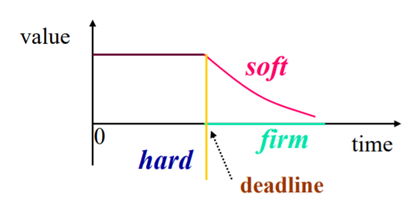
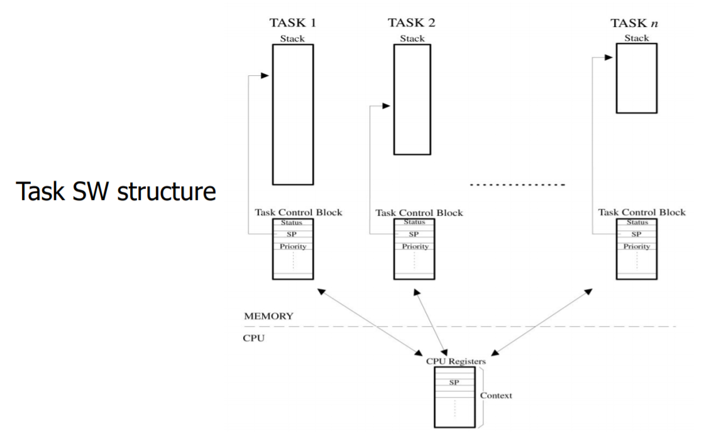
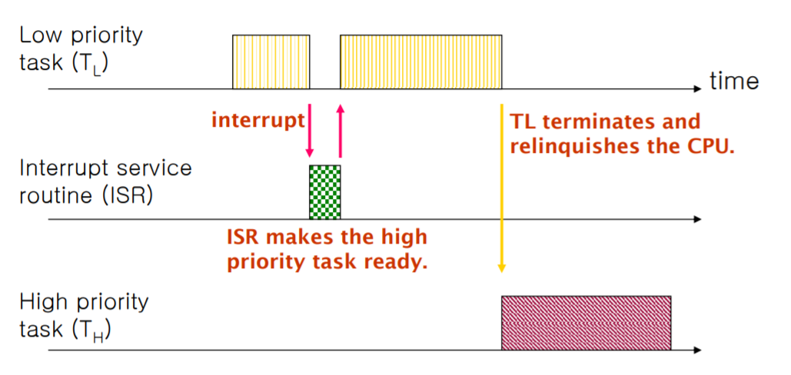
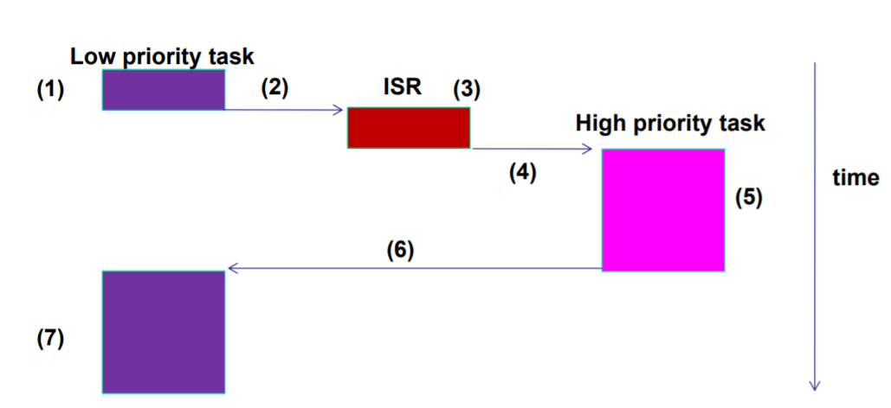
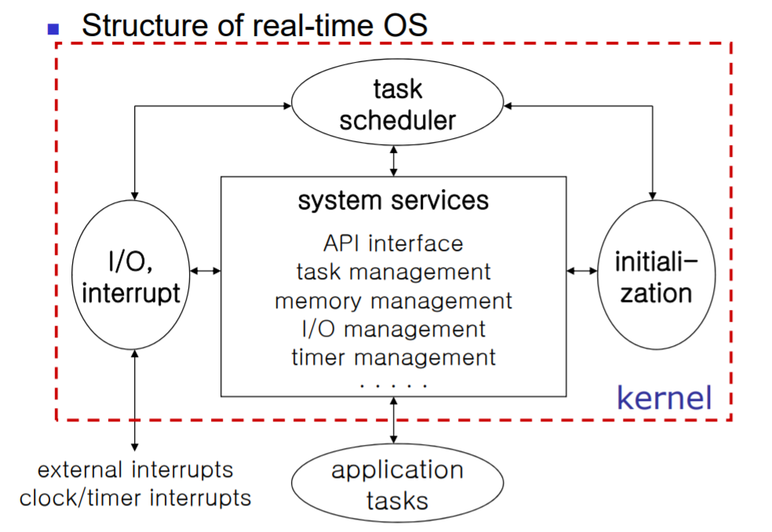
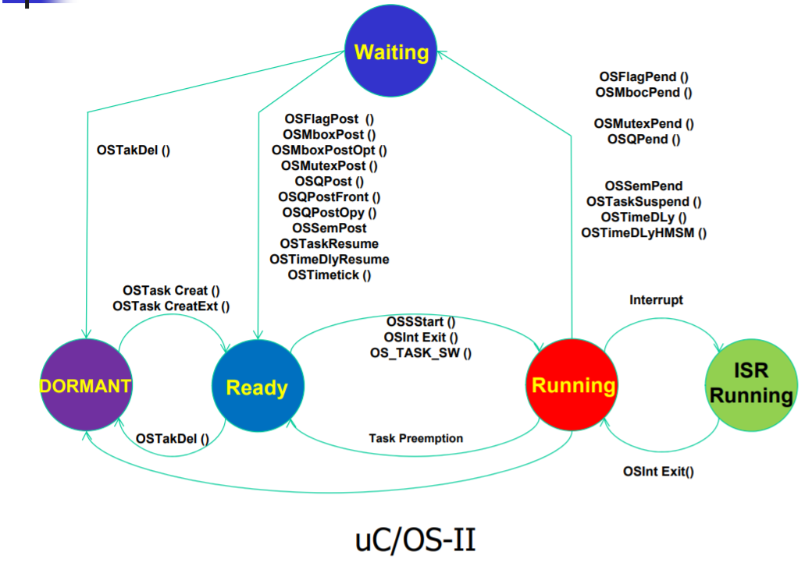
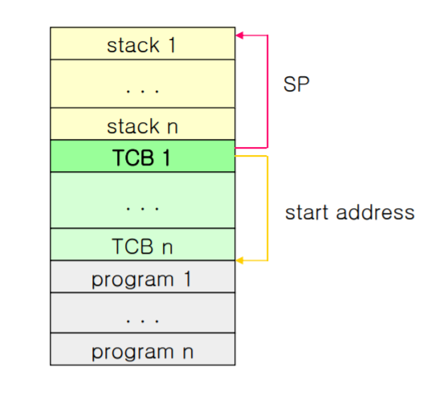
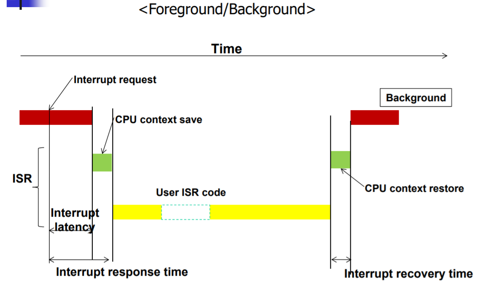
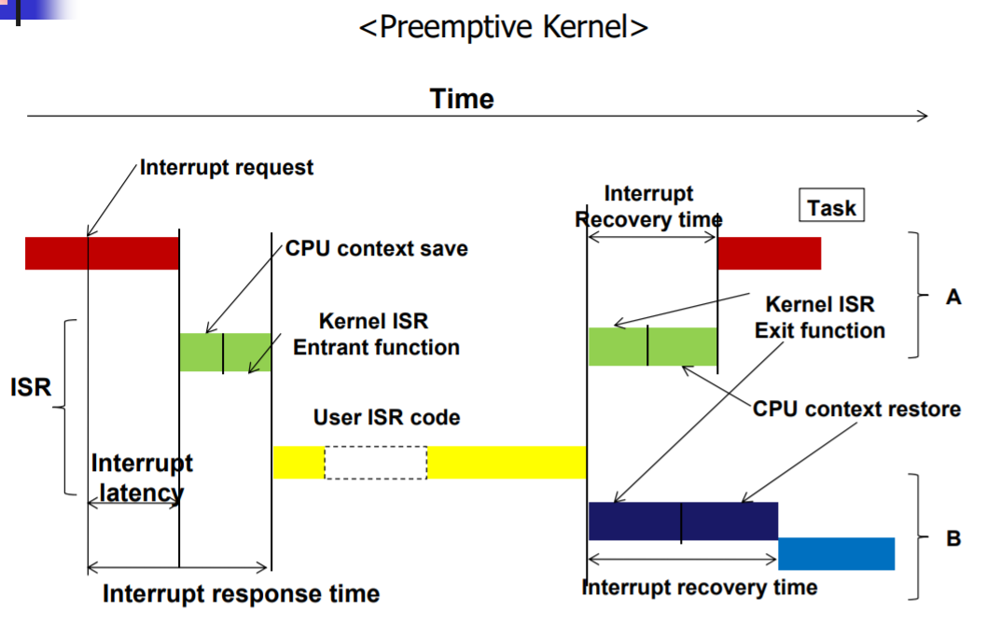
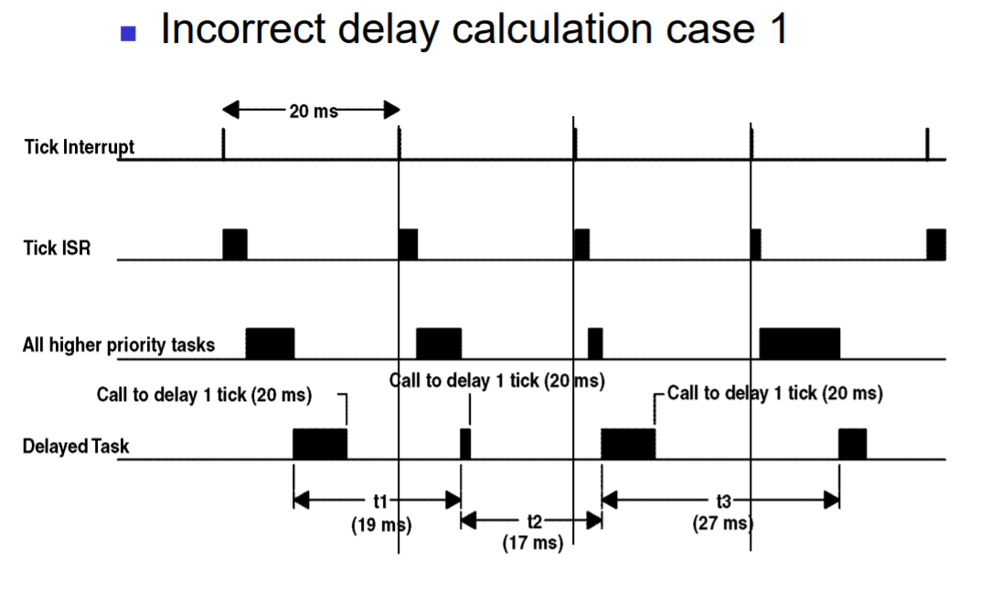

# RTOS Overview

## Overview : Real-Time System

Real-Time System의  correctness는 시스템의 기능적 특성(Functional and Logical character)뿐만 아니라 시간적 특성(Temporal character)까지 고려되는 system이라고 할 수 있다. 시스템이 반드시 지켜야하는 Time Constraint가 존재한다.

Real-Time System이 정해진 시간내에 수행해야 하는 작업을 Task라고 한다. Task는 Time Constraint가 지켜지지 않았을 때의 penalty 정도에 따라서 다음 3가지로 분류할 수 있다.

- Hard real-time task : dead line miss시 가치가 마이너스 무한대로 떨어지는 심각한 경우
- Soft real-time task : dead line miss 후에 가치가 점진적으로 떨어지는 경우
- Firm real-time task : dead line miss 후에 가치가 바로 0으로 떨어지는 경우

## Overview : RTOS(Real Time Operating System)

Real Time System에서 사용하는 운영체제. Real Time이라는 말의 뜻은 작업이 주어졌을 때 정해진 시간내에 해당 작업을 완료해야한다는 의미이다. General Purpose OS는 태스크(스레드)가 얼마다 공평히 cpu자원을 나눠갖는가가 중요하다면, Real time system 용 OS는 자원을 조금 낭비하더라도 주어진 작업을 제한시간 내에 실행할 수 있게하는 것이 더 중요하다. RTOS의 요구사항은 다음과 같다.

- 예측가능하고 일정한 응답 시간
- 우선순위 기반 스케줄링 지원
- Dead Line 기반 스케줄링 지원

## Several Concepts

### Fore Ground / Back Ground

Round Robin with Interrupt에서 하드웨어 인터럽트를 처리하는 ISP와 태스크 처리 루틴이 있는 main 함수 루프를 생각하면 된다.

### Multitasking

task란 어떤 목적을 달성하기 위해서 수행해야 하는 일들을 프로그램의 논리적 단위로 나눈 개념이라 할 수 있다. 목적을 달성하기 위해서는 여러 task가 동시에 수행될 필요가 있으며, 순차적 실행으로는 달성하기 어렵기 때문에 멀티태스킹 개념이 등장하였다. 멀티태스킹에서는 수행해야 할 작업들의 모듈화, 작업들의 수행순서, cpu 사용권 전환, cpu의 효율적인 사용 등을 다룬다.

### Resource

Process나 Task가 사용할 수 있는 모든 요소를 의미한다. 여기에는 하드웨어 자원뿐만 아니라 변수나 배열과 같은 소프트웨어 자원까지 포함된다.

### Shared Resource

하나 이상의 Process나 Task가 공유해서 사용하는 자원을 의미한다. RTOS에서 Dead line missing을 일으킬 수 있는 요인이기 때문에 중요하게 살펴봐야 한다. 어떤 process나 Task가 Shared Resource를 사용하기 위해서는 일단 그 자원에 대한 exclusive access를 얻어야 한다.

### Task

Thread라고도 하며 cpu자원을 할당받아 특정 기능을 수행하는 간단한 프로그램이다. 각 Task는 cpu 레지스터 집합, 우선순위, 스택 사이즈를 할당받는다.

### Context Switch

- Context : Task가 cpu를 점유하여 실행될 때 사용하는 cpu 레지스터의 값들과 같이 Task가 보관해야할 정보들을 의미한다.
- Context Switch : 현재 Running 상태에 있는 Task가 다른 Task에게 cpu를 양보하는 상황을 생각해보자. 이 때 실행되고 있던 Task의 Context를 스택이나 TCB에 저장해두고, 다음에 실행될 Task의 Context를 스택이나 TCB에서 cpu 레지스터로 복사하는 일련의 과정을 Context Switch라고 한다.

### Scheduler

READY 상태에 있는 Task 들 중 다음에 어떤 Task가 실행될 것이지를 결정하는 프로그램이다. Real Time System에서는 우선순위가 가장 높은 Task를 실행시키는 priority 기반 스케줄링을 한다.

### Non-preemptive Kernel

어떤 Task가 수행되고 있을 때, Kernel이 다른 Task가 실행될 수 있도록 할 수 없는 형태. Coopertative Kernel이라고도 한다(프로그래머가 프로그래밍시 non-preemptive에 대한 특성을 고려해야 하기 때문). 테스크가 cpu를 양도하려면 명시적으로 kernel 서비스를 호출 해야한다. 인터럽트에 대해서는 Task의 실행을 중지 시키고, 곧바로 ISR을 실행하며 ISR이 실행된 후에는 반드시 전에 실행하고 있던 Task로 돌아온다.

장점

- 세마포어 등 공유자원을 보호하기 위한 고려를 하지 않아도 된다.
- Task 수행시 비재진입 함수를 사용할 수 있다.
- ISR에 대한 지연시간이 짧다.

단점

- 현재 낮은 우선순위의 Task가 실행 중이라면 높은 우선순위의 Task가 실행 가능 상태가 되더라도 실행이 지연될 수 있다(응답성이 낮아진다). 때문에 Real Time Property가 보장되지 않을 수 있다.

### Preemptive Kernel

우선순위가 높은 Task가 실행 가능 상태에 있으면 해당 Task가
항상 실행되는 형태이다. ISR이 수행될 때 상위 우선순위의 Task를 실행 가능상태로 바꾸고, ISR이 종료되면 스케줄링에 의해 해당 Task가 cpu를 점유하게 된다(ISR는 스케줄링에 대한 통로이다).

### Cyclic Excutive

Multitasking Real Time System 운영체제의 가장 간단한 형태. 미리 모든 Task와 ISR까지 실행 순서를 시간에 따른 table 형태로 정하는 것을 의미한다. 이러한 운영체제가 Real Time Feature를 만족시키기 위해서는 table 구성시 해당 실행순서가 Dead Line을 만족시키는지에 대한 완벽한 계산이 끝나야 한다. Interrupt 처리에 대한 작업도 미리 table 순서에 정해져서 실행된다. 이 때문에 현재 Interrupt 발생했더라도 해당 Interrupt에 대한 처리 순서가 되지 않으면 ISR이 실행되지 않는다.

장점

- 구현이 매우 간단하다
- 오버헤드가 적다
- 모든 운영체제의 동작을 예측하기 쉽다

단점

- Task 실행시 다른 Task의 선점(preemption) 불가능
- 이미 구성된 table에 대해서 다른 작업을 추가하기가 어렵다
- 모든 스케쥴링이 수작업으로 이루어진다

## RTOS Characteristic

- multitasking
- small size
- fast context switch
- fast processing of external interrupt
- external interrupt에 대한 처리가 끝난 시점에 스케줄링이 발생
- simple command line interpreter
- intertask communication and synchronization
- no memory protection : 유저와 시스템이 메모리를 공동으로 사용
- applicaion programs use system calls
- limited memory usage

### General Purpose OS와 비교

RTOS는

- Virtual Memory를 지원하지 않음
- priority 기반 스케줄링
- 특수한 목적으로 사용됨
- 디바이스 드라이버가 존재하지 않음(애플리케이션 레벨에서 해결해야함)
- 파일시스템이 존재하지 않음(필요시 애플리케이션 레벨에서 해결해야함)
- passing pointer를 통해서 task간에 massive data를 전송한다.
- 정적인 resource allocation을 진행한다.

### Function

RTOS에서 제공하는 Kernel system call을 이용하여 프로그래밍을 할 수 있다.

- task management : task create, delete, suspend, resume. scheduling information을 조작할 수 있다.
- intertask communication, synchronization : semaphore, mailbox, event flag, mailqueue
- memory management : dynamic allocation, memory locking

## RTOS Structure

### Multitasking Techniques

RTOS의 Multitasking 구조

- Big loop : 기본적으로 거의 모든 task는 내부의 무한루프를 수행하며, 임베디드 보드(하드웨어)가 켜져있는 동안 계속해서 실행된다.
- Coroutine multitasking: 여러 Task들은 동일한 함수(routine) 코드를 공유해서 사용할 수 있다. 이러한 일이 가능한 이유는 RTOS와 Task가 함께 컴파일되어 실행파일이 만들어지기 때문이다.
- Interrupt driven : Multitasking에서 스케줄링은 대부분 Interrupt에 대한 ISR이 끝난 시점에서 실행되고 Task가 실행될 수 있기 때문에 Interrupt driven이라고 한다.
- Foreground / Background : foreground는 ISR을 처리하는 부분, Background는 내부의 무한루프 부분을 생각하면 된다.

### Task 구조

- TCB : Task가 수행되고 context switch을 가능하게 하기 위해서 TCP(Task Control Block)이라는 자료구조를 관리한다.
- Task Parameter : Task를 생성할 때 여러 파라미터를 전달할 수 있다. 그 중 제일 중요한 것은 priority이다. 이 priority는 Task간에 유일해야하기 때문에 Task 식별자 역할도 수행한다.

### Task State Transition Diagram

### Memory usage

한정된 메모리 자원을 가지고 프로그래밍을 해야한다. 테스크마다 사용할 수 있는 스택 크기도 지정해주어야 한다. 데이터 영역, TCB, 프로그램 코드 모두 메모리를 공유해서 사용한다.

## RTOS Fundamental Concepts

### Scheduling

기본적으로 Priority 기반 스케줄링을 한다. RTOS에서 주로 다루는 이슈는 어떤 Task에 높은 우선순위를 부여할 것인가이다. 이를 결정하는 기준은 Task가 실행되는 주기(내부에서 for문의 한 루프가 실행되는 시간), Task가 지켜야하는 dead line 등이 있다.

- rate monotonic : 실행주기가 가장 짧은 Task에 높은 우선순위를 부여하는 방법이다.(microC/os2 에서 사용)
- earlist deadline first : deadline이 얼마남지 않는 Task에 가장 높은 우선순위를 부여하는 방법이다.

우선순위를 부여하는 방법에는 다음 2가지가 있다.

- static : 한번 부여한 우선순위가 변하지 않음(rate monotonic)
- dynamic : 상황에 따라서 우선순위가 변경될 수 있음(earlist deadline first)

### Mutual exclusion

RTOS에서는 메모리를 공유하고 memory protection을 지원하지 않기 때문에 메모리를 잘 관리해야 한다. 특히 공동으로 사용하는 전역 변수와 같은 경우가 그렇다. 이렇게 주의가 필요한 코드 영역을 critical section이라고 한다.

critical section에 대한 보호가 잘 이루어지지 않으면 priority inversion이 발생할 수 있다. 그 다음에는 dead line missing이 발생할 수도 있다.

priority inversion을 없애기 위해서 priority inheritance protocol 방법이 쓰일 수 있다.

shared data에 대한 concurrent한 사용은 반드시 controll 되어야 하는데, 이 때 사용하는 개념이 Mutual exclusion이다.

### Synchronization

RTOS는 굉장히 단순한 커널이기 때문에 많은 기능적인 부분은 애플리케이션 레벨(테스크 레벨)에서 처리해야 한다. 이 경우에 Task 끼리 서로 정보를 주고 받거나 data sharing이 필요할 수 있다. 이럴 경우에 Synchronization이 필요하다.

- message queue
- mail box
- semaphore
- event flag

### Memory Usage

RTOS에서는 매우 한정된 size의 memory를 잘 사용하는 것이 중요하다. 일반 프로그래밍과 다른 점들이 있는데 그 중 하나는, 각 Task에서 사용할 수 있는 Stack 사이즈를 정하는 것이다. 만일 이 사이즈를 벗어나서 메모리를 사용하게 되면 stack overflow가 발생하게 된다. 이 경우 stack을 늘리던지, 메모리 사용을 줄이던지 2가지 방법이 있다.

### Interrupt

Interrupt가 나타나면 ISR로 항상 preemption 되기 때문에 ISR은 매우 간결하고 빠르게 처리되어야 한다.

- Interrupt latency : 하드웨어 인터럽트가 발생하고 RTOS가 이를 인지하여 ISR을 실행하기 위해 Context switch를 수행하기 전까지 걸린 시간
- Interrupt Response : latency에 더하여 Context switch를 진행하고, Kernel ISR에 대한 entry function을 모두 수행하는데 걸린 시간(ISR이 실행되기 직전까지 걸린시간).
- Interrupt Recovery : ISR이 종료되고, 높은 우선순위 Task가 ready 상태에 있는지 체크한 다음(Kernel ISR에 대한 exit function), 다시 Context switch를 수행하여 Task 실행하기까지 걸린 시간

임베디드 소프트웨어 아키텍쳐마다 이 값들이 달라질 수 있다.

- Round Robin with Interrupt
- Function Queue Scheduling
- RTOS : ISR 전 후에 entry function과 exit function이 추가되어 있어서 이들의 실행시간이 포함되어 계산된다. ISR이 종료된 후, 인터럽트 이전에 실행되던 Task가 아닌 다른 Task가 실행되면 Task switch 비용이 클 수 있다.

scheduling은 보통 ISR 실행 후의 exit function에서 실행된다.

### Clock Ticks

RTOS의 기본 시간 단위이다. 운영체제에서는 대략 10ms마다 Timer Interrupt가 발생하여 Scheduling이 실행될 수 있도록 한다. 이 때 1번의 Timer Interrupt가 발생하는 주기를 Clock Tick이라고 한다.

Kernel은 Clock Tick을 이용하여 특정 Task가 일정 시간동안 delay되게 할 수 있다. 그러나 Delay함수의 delay시간은 정확히 측정되지 않을 수 있다.

위 그림에서 보듯이 Delay 함수를 Tick Interrupt 발생 주기 중간에서 실행하면 Delay가 1 Tick(20ms)보다 짧아질 수도 있고, 높은 우선 순위의 Task 실행에 따라서 1 Tick보다 길게 Delay이 될 수도 있다.
