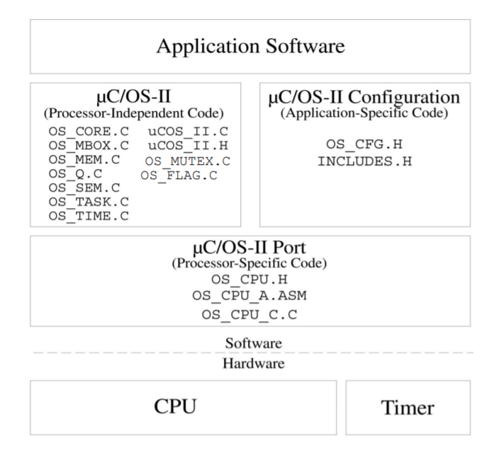
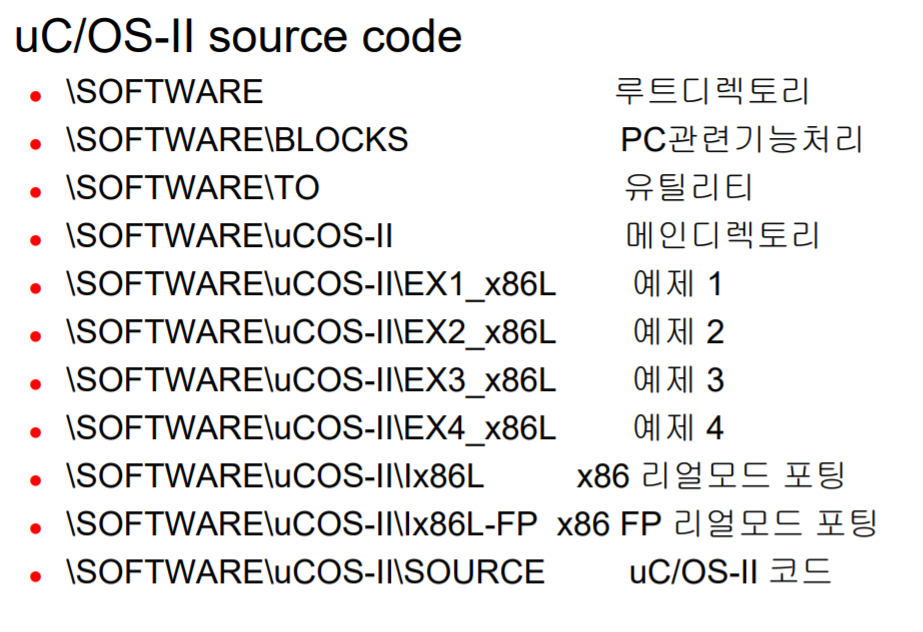
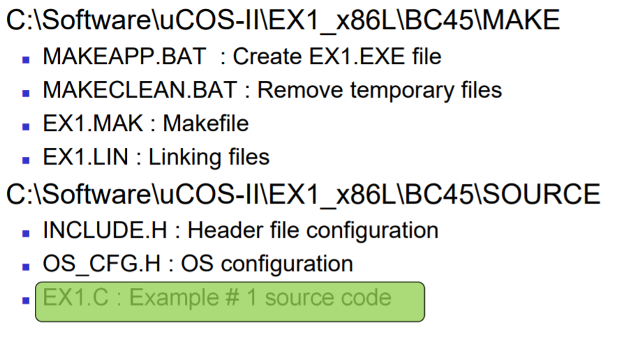

# 실습 2

## 준비

### MicroC/OSII와 임베디드 소프트웨어 구성요소



### 실습 디렉토리 구조



### 소스 코드 내용



- MAKEAPP.BAT : 소스 파일을 컴파일하고 exe 프로그램을 만드는 명령어를 모은 batch 파일

## 주요 함수

```c
void OSTaskCreate( void (*task) (void *pd), void *pdata, OS_STK *ptos, INT8U prio )
```

- 첫번째 인자 : Task의 시작번지. 테스크는 함수형태로 작성된다.
- 두번째 인자 : 전달할 데이터의 주소
- 세번째 인자 : Task가 사용할 스택 주소
- 네번째 인자 : 우선순위

```c
OSTimeDly(x);
OSTimeDlyHMSM(0, 0, 0, 500);
```

- Task를 일정 시간동안 sleep시키는 함수이다. x 클럭틱 만큼 딜레이가 된다.

```c
PC_DispStr( 0, 2, "test", DISP_FGND_BLACK + DISP_BGND_LIGHT_GRAY);
```

- 화면에 메시지를 출력하는 함수
- 1번째 인자로 x좌표, 2번째 인자로 y좌표, 3번째 인자로 화면에 출력할 메시지, 4번째 인자로 전경색-배경색 설정

```c
PC_DispChar(x, y + 5, ' ', DISP_FGND_RED + DISP_BGND_RED);
```

- 화면에 문자를 출력하는 함수. 사용법은 위 함수와 비슷
