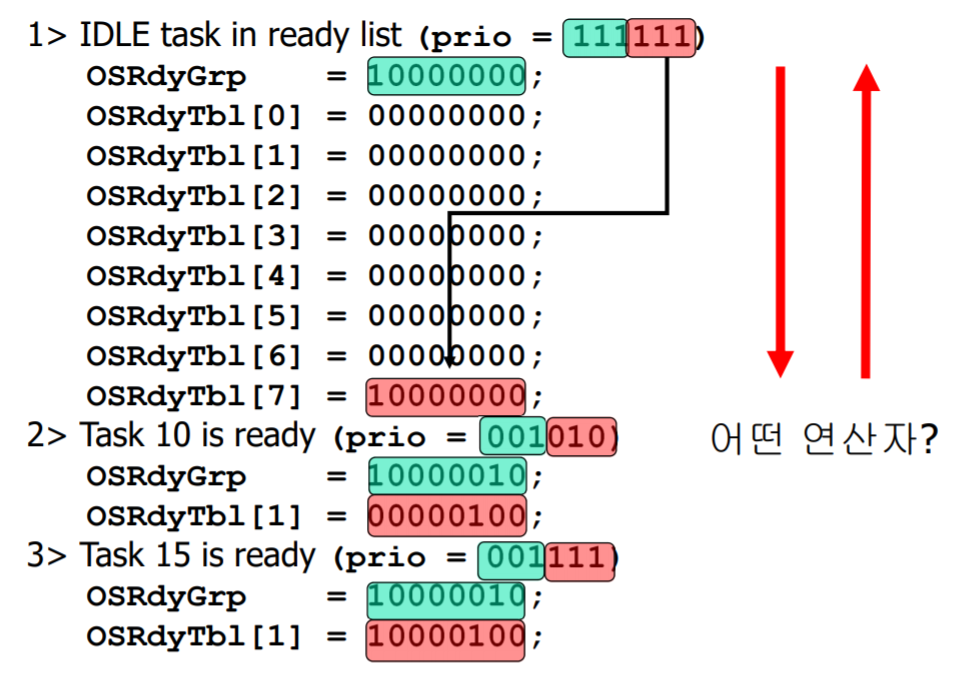
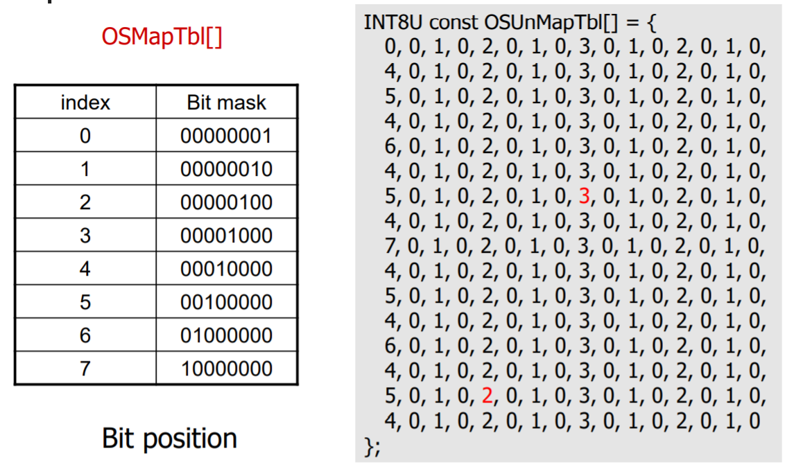

# MicroC/OS-2 Kernel

## MicroC/OS-2 Overview


- PORT 부분 : 실행되는 cpu 환경에 대해서 의존적인 부분. 이 부분을 수정하기 위해서는 실행환경에 대한 배경지식이 요구된다.
- Configuration 부분 : Application 작성시 설정이 가능한 부분

## Task type

- 무한루프가 존재하여 하드웨어가 켜져있으면 계속해서 실행되는 Task
- 일정 작업을 실행하면 바로 delete되는 Task

## Task Scheduling - overview

microC/os2에서는 총 64개의 Task가 생성될 수 있다. 이 중 priority 62번과 63번은 이미 예약되어 사용된다. priority는 Task마다 유일하게 지정되기 때문에 Task의 식별자로 사용될 수 있다.

- 62번 Task : statistics Task. 각종 하드웨어 사용량을 체크하는 Task이다
- 63번 Task : idle Task. 상위 우선순위의 모든 Task가 실행가능하지 않을 때 실행되는 Task. 아무일도 수행하지 않는다.

### Task Scheduling - Task State


- Domant : Task가 아직 OS에 등록되지 않은 상태. OSTaskCreate(), OSTaskCreateExt()과 같은 함수를 이용해서 OS에 등록될 수 있다. 위 두 함수 호출시 실행될 수 있는 Candidate가 된다(Ready 상태). OSTaskCreateExt()는 Task를 생성할 때 추가적으로 인자를 전달할 수 있게 해준다.
- Ready : Scheduler에 의해 Running 상태로 바뀔 수 있는 상태. Running에 대한 candidate
- Running : cpu 자원을 확보하고 실행 중인 상태
- Delay : 실행을 멈추고 일정기간 동안 기다리는 상태. suspend 함수 호출로 만들 수 있다. 스케줄링 될 수 없다. 일정 기간이 지난 후에는 다시 ready 상태로 돌아간다.
- Waiting : 특정 이벤트가 실행될 때가지 실행을 멈추고 기다리는 상태. 스케줄링 될 수 없다.
- ISR : ISR이 실행되는 상태

### Task Scheduling - TCB

Task에 대한 정보를 포함하는 자료구조

#### OS_TCB 구조체의 필드

> *로 표시된 필드는 OSTaskCreateExt()함수를 호출한 경우에만 사용할 수 있다.

- OSTCBStkPtr : 테스크가 사용하는 stack의 top을 가리킨다
- OSTCBExtPtr* : 추가적인 TCB 구조를 사용하고자 할 때, 이 추가 TCP에 대한 포인터
- OSTCBStkBottom* : 테스크가 사용하는 stack의 bottom을 가리킨다.
- OSTCBStkSize : stack size
- OSTCBNext, OSTCBPrev : 다음, 이전 TCB에 대한 포인터
- OSTCBOpt* : Task를 생성할 때 사용하는 옵션
  - OS_TASK_OPT_STK_CHK
  - OS_TASK_OPT_STK_CLR
  - OS_TASK_OPT_SAVE_FP
- OSTCBDly : 딜레이가 끝날때까지 남은 clock tick
- OSTCBStat

#### TCB List

최대 Task에 대한 개수가 제한되어 있고, Task에 대한 우선순위는 static하게 정해지기 때문에 미리 빈 TCB를 여러개 만들어 두고 List 형태로 관리한다. 그 다음 OSTaskCreate 함수가 호출되면 OSTCB free list에 있던 TCB하나를 설정하여 OSTCB list에 추가하는 형태로 관리한다.


## Task Scheduling - Ready list 관리

microC/OS2에서는 어떻게 ready 상태에 있는 task들을 관리하는지, 이 중에서 어떻게 가장 우선순위가 높은 task 찾아내는지 알아보자.

### 자료구조

가장 naive 한 방법은 OSTCBList를 순차적으로 탐색하는 방법이다. 이 경우 우선순위가 높은 Task를 찾는 비용이 많이 들게 된다. RTOS에서는 빠르게 Task가 switch 되어야 Deadline을 맞출수 있기 때문에 바람직하지 않다. 대신 추가적인 자료구조를 도입하여 search 시간을 단축시킨다.

microC/OS2에서는 Ready 상태에 있는 Task를 관리하기 위하여 다음과 같은 4가지 자료구조를 관리한다.

- OSRdyGrp
- OSRdyTbl
- OSMapTbl
- OSUnMapTbl


총 64개의 Task를 8개씩 묶어서 8개의 그룹을 생성한다. 8개 그룹의 상태를 관리하는 것이 **OSRdyGrp** 이다. 총 8개의 bit로 구성되어 있어서, 각 그룹에서 Ready 상태에 있는 Task가 존재하면 해당 그룹에 대응하는 bit를 1로 셋팅하는 방식이다.

**OSRdyTbl**은 각 그룹에 속하는 Task들의 상태를 관리하는 배열이다. 총 8개의 entry로 구성(각 그룹을 의미)되어 있으며, 각 entry는 8개의 Task를 의미하는 8bit로 구성되어 있다.

이제 특정 Task가 Ready 상태가 되면 이들 자료구조를 어떻게 변경시키는지 알아보자. Task 63이 Ready 상태가 된 경우를 예로 들어보자.



총 63번까지의 priority가 존재할 수 있기 때문에 이 우선순위를 6개의 bit로 표현 가능하다. 일단 Task가 Ready 상태가 되면 해당 Task의 우선순위를 이진수로 표현한다. 예제의 경우 **(0b111111)**이다. 이 Task가 몇번째 그룹에 속하는 지는 상위 3개의 bit를 확인하면 된다. 예제의 경우 (0b111 == 7)이다. 그럼 OSRdyGrp의 7번째 비트를 1로 셋팅한다. 그 다음 OSRdyTbl의 7번째 entry(OSRdyTbl[7])를 확인한다. 이때 해당 task에 대응하는 OSRdyTbl[7]의 bit 위치는 하위 3개의 bit를 확인하면 된다. 예제의 경우(0b111 == 7)이다. 그렇다면 OSRdyTbl[7]의 7번째 비트를 1로 셋팅해준다.

비트를 셋팅해주는 과정에서 bit wise OR 연산을 사용한다.

이제 이들 자료구조를 관리하고 프로그래밍하는 코드를 살펴보자. 그 전에 프로그래밍을 쉽게 하기 위하여 도입한, 아직 설명하지 않은 2가지 자료구조를 알아보자.



- OSMapTbl : 0부터 7에 대해서 해당 숫자의 bit가 1로 세팅되어 있는 2진수에 대한 배열이다. bit position에 대응하는 숫자를 찾기위해 도입하였다.
- OSUnMapTbl : 특정 정수에 대해서 LSB를 기준으로 1로 세팅되어 있는 최하위 비트의 위치를 나타내는 배열이다. 이는 가장 우선순위가 높은 Ready Task가 존재하는 그룹의 번호, 또는 그 그룹내의 Task 번호를 쉽게 search하기 위해서 도입하였다.

### Ready List 갱신

이제 한 63번 Task가 Ready 상태가 된 경우 자료구조를 어떻게 갱신하는지에 대한 코드를 살펴보자.


OSRdyGrp을 갱신하기 위해서는 63을 6개의 이진수로 바꾸었을 때 상위 3개의 bit를 확인해야한다. 이는 다음과 같은 코드로 확인 가능하다.

```c
prio >> 3;
```

주의해야 할 것은 이 값은 bit position을 나타내는 정수이지, 해당 bit가 1로 세팅되어 있는 숫자가 아니라는 것이다. 따라서 정상적으로 OSRdyGrp을 갱신하기 위해서는 다음과 같은 코드가 필요하다.

```c
OSRdyGrp |= OSMapTbl[prio >> 3];
```

다음으로 OSRdyTbl을 갱신할 차례이다. 일단 Task가 속한 OSRdyTbl의 Entry는 다음과 같이 찾을 수 있다.

```c
OSRdyTbl[prio >> 3];
```

이 entry에서 63번 Task가 나타내는 비트는 다음과 같이 구할 수 있다.

```c
prio & 0x07;
```

역시 이 값은 해당 bit의 position을 나타내는 정수이지, 해당 bit가 세팅되어 있는 이진수가 아니다. 따라서 다음과 같은 코드를 통해 비트를 세팅해주어야 한다.

```c
OSRdyTbl[prio >> 3] |= OSMapTbl[prio & 0x07];
```

Ready List에서 Task를 삭제하는 것은 위 과정을 반대로 진행하면 된다. 다만 `OSRdyGrp`을 갱신하는 과정에서는 해당 그룹의 모든 Task가 Ready 상태가 아님을 확인한 뒤 갱신해주어야 한다. 다음과 같은 코드로 Ready List에서 Task를 삭제할 수 있다.

```c
if ( (OSRdyTbl[prio >> 3] &= ~OSMapTbl[prio & 0x07]) == 0) {
    OSRdyGrp &= ~OSMapTbl[prio >> 3];
}
```

### Ready List에서 우선순위가 가장 높은 Task Search

자 이제부터 이들 자료구조를 가지고 우선순위가 가장 높은 Task를 찾는 방법에 대해서 알아보자.


일단 OSRdyGrp의 상태를 확인한다. OSUnMapTbl[OSTaskGrp]을 이용하면 현재 Task 그룹 중에서 Ready 상태의 Task가 하나라도 존재하는 우선순위가 가장 높은 그룹을 확인할 수 있다. 이 값을 y라고 해보자.

이제 OSUnMapTbl[y]를 확인하여 해당 그룹에서 Ready 상태로 존재하는 Task 중 가장 우선순위가 높은 Task의 번호를 확인할 수 있다.

자 이제 이것을 어떻게 프로그래밍적으로 자동화할 수 있을지 생각해보자.

일단 다음을 통해서 어떤 그룹에 우선순위가 가장 높은 Ready Task가 있는지 확인할 수 있다.

```c
y = OSUnMap[OSTaskGrp];
```

그런 뒤 다음 코드를 통해서 해당 그룹의 몇번째 Task가 Ready 상태에 있는지 파악할 수 있다.

```c
x = OSUnMap[OSRdyTbl[y]];
```

이제 x와 y값을 이용하여 다음과 같은 식을 통해 우선순위가 가장 높은 Ready 상태의 Task priority 번호를 확인할 수 있다.

```c
(y << 3) + x;
```

y값을 왼쪽으로 3번 쉬프트 한 이유는 그룹번호에 해당하는 정수는 Task의 priority 6bit 중 상위 3bit에 해당하기 때문이다.

마지막 예제를 통해서 다시 한번 우선순위가 가장 높은 Task search 과정을 확인해보자.


현재 OSRdyGrp의 값은 0x68이다. 이를 이진수로 풀어쓰면 01101000이다. 사람은 눈으로 확인하여 맨 마지막에서 3번째 bit가 처음으로 1로 셋팅되어 있음을 알수있다. 맨 마지막에서 첫번째로 만나는 1를 확인하는 이유는 더 낮은 위치(LSB)에서의 그룹이 더 숫자가 작은 우선순위를 포함하고 있기 때문이다.

이제 사람의 눈이 아니라 컴퓨터가 이 비트를 확인하게 하자. 간단히 OSUnMapTbl을 이용하면 이를 달성할 수 있다. `OSUnMapTbl[0x68]`을 보니 이 값이 **3**이다. 위에서 확인한 **3**과 동일하다. 즉 OSRdyTbl[3] entry에 우리가 찾은 Task가 속해있다는 것이다. 이 예제에서는 OSRdyTbl[3]에 0xE4가 저장되어 있다.

이를 이진수로 변환하면 11100100 이 된다. 맨 마지막에서 **2**번째 비트가 1로 셋팅되어 있다. 즉, 이 비트에 해당하는 task가 우리가 찾는 task 이다. 다시 컴퓨터가 이 비트를 찾게 하려면 `OSUnMapTbl[0xE4]`를 확인하면 된다. 이는 **2**다. 위에서 찾은 **2**와 동일하다.

이제 숫자 3은 그룹을 나타내기에 왼쪽으로 3번 쉬프트하고, 2는 그냥 더해주어서 최종적으로 26을 구했다. 즉 26번 Task가 현재 Ready 상태에 있는 task 중 가장 우선순위가 높다.

## Task Scheduling - scheduling

&micro;C/OS2 에서 스케줄링을 하기 위해서 함수들을 알아보자.

- OS_Sched() : 태스크 수준의 스케줄링 함수. 어떤 테스크가 Running 상태에서 waiting 상태로 이동할 때, 다음 run 될 테스크를 결정하기 위해서 사용한다.
- OSIntExit() : ISR 수준의 스케줄링 함수. 하드웨어 인터럽트 또는 주기적인 타이머 인터럽트 이후 스케줄링을 위해서 사용한다.

### 태스크 레벨 스케줄링 함수 : OS_Sched()

```c
void OS_Sched(void)
{
    INT8U y;
    OS_ENTER_CRITICAL();
    if ((OSLockNesting | OSIntNesting) == 0) {
        y = OSUnMapTbl[OSRdyGrp];
        OSPrioHighRdy = (INT8U)((y << 3) + OSUnMapTbl[OSRdyTbl[y]]);
        if (OSPrioHighRdy != OSPrioCur) {
            OSTCBHighRdy = OSTCBPrioTbl[OSPrioHighRdy];
            OSCtxSwCtr++;
            OS_TASK_SW();
        }
    }
    OS_EXIT_CRITICAL();
}
```


OS_Sched() 함수 호출시 Ready 상태에 있는 Task 중 가장 우선순위가 높은 Task를 찾고, 현재 Task와 비교해서 우선순위가 다르면 해당 Task로 switch 한다.

#### OS_TASK_SW() 를 수행하기 전 먼저 Context switch 수행

Context switch가 일어나야 하는 경우, 일단 지금 실행되고 있던 Task의 Context를 저장해야 한다. 실행에 필요한 register 값을 테스크가 사용하는 스택에 저장시킨다. 그 다음 스택 포인터를 해당 Task의 TCB에 저장한다. 이 후에 실행될 Task의 TCB에서 스택 포인터를 복구한 뒤, 해당 Task의 스택에서 Context(Register) 값들을 pop 시킨다.


#### 태스크 수준 context switch

- OS_TASK_SW() 함수 내에서 실행되는 코드?

```c
void OSCtxSw(void)
{
    Values of R1, R2, R3, R4 and so on are pushed to stack;
    OSTCBCur -> OSTCBStkPtr = SP;
    OSTCBCur = OSTCBHighRdy;
    SP = OSTCBCur -> OSTCBStkPtr;
    Values of R1, R2, R3, R4 and so on are poped;
}
```

### ISR에서의 스케줄링

#### ISR의 구조


일단 ISR이 실행되기 전, 그 전에 실행되던 Task의 Context를 저장한다. 그 다음 ISR이 실행되기 전 OSIntEnter() 함수가 실행된다. 그 다음 ISR이 실행된다. 그리고 ISR에서 스케줄링을 실행하는 부분은 OSIntExit() 함수부분이다.

```c
void OSIntExit (void)
{
    OS_ENTER_CRITICAL();
    if ((--OSIntNesting | OSLockNesting) == 0) {
        OSIntExitY = OSUnMapTbl[OSRdyGrp];
        OSPrioHighRdy = (INT8U)((OSIntExitY << 3) +
        OSUnMapTbl[OSRdyTbl[OSIntExitY]]);
        if (OSPrioHighRdy != OSPrioCur) {
            OSTCBHighRdy = OSTCBPrioTbl[OSPrioHighRdy];
            OSCtxSwCtr++;
            OSIntCtxSw();
        }
    }
    OS_EXIT_CRITICAL();
}
```

이 함수의 내용은 태스크 레벨 스케줄링의 OS_Sched() 함수와 거의 유사하다. 다만 차이점은 내부에서 Task를 switch 하는 OSCtxSw(), OSIntCtxSw()에 있다. 이전 태스크의 Context는 OSIntExit() 함수를 호출하기 전에 저장하기 때문에 이 부분에 대한 코드가 OSIntCtxSw()에는 존재하지 않는다는 것이다.

```c
void OSIntCtxSw(void)
{
    Call_OSTaskSwHook();
    OSTCBCur = OSTCBHighRdy;
    OSPrioCur = OSPrioHighRdy;
    SP = OSTCBHighRdy -> OSTCPStkPtr;
    POP R4, R3, R2, R1 from the task's stack;
    Execute a return from interrupt instruction;
}
```

### Clock Tick

&micro;C/OS 2에서는 일정 주기마다 타이머 인터럽트가 발생한다. 한 타이머 인터럽트에서 다음 타이머 인터럽트가 발생하는 간격을 1 Clock Tick이라고 한다. Task를 일정 기간동안 Waiting 상태로 유지하는 것이나 타임아웃을 발생시키기 위해서 사용된다.
타이머 인터럽트도 그에 대응하는 ISR을 수행하게 된다. 그에 따라 일정 주기마다 스케줄링이 실행되어 높은 우선순위의 Ready Task가 실행되게 할 수 있다.

```c
void OSTimeTick(void)
{
    while(ptcb -> OSTCBPrio != OS_IDLE_PRIO) {
        OS_ENTER_CRITICAL();
        if (ptcb -> OSTCBDly != 0) {
            if (--ptcb->OSTCBDly == 0) {
                if (!(ptcb->OSTCBStat & OS_STAT_SUSPEND)) {
                    OSRdyGrp |= ptcb->OSTCBBitY;
                    OSRdyTbl[ptcb->OSTCBY] |= ptcb->OSTCBBitX;
                } else {
                    ptcb->OSTCBDly = 1;
                }
            }
        }
        ptcb = ptcb->OSTCBNext;
        OS_EXIT_CRITICAL();
    }
}
```
