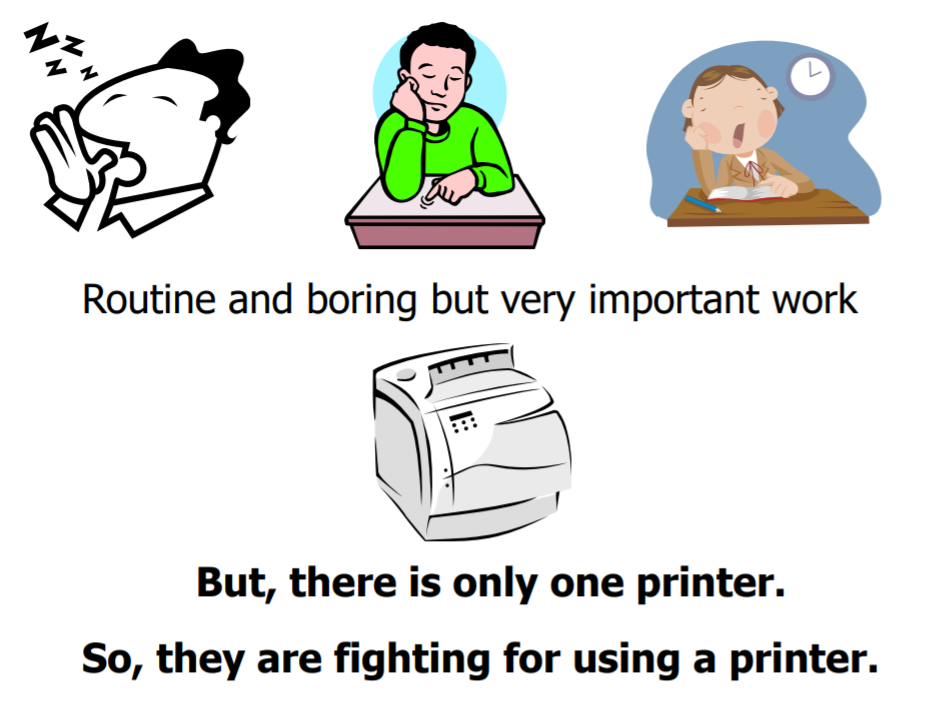
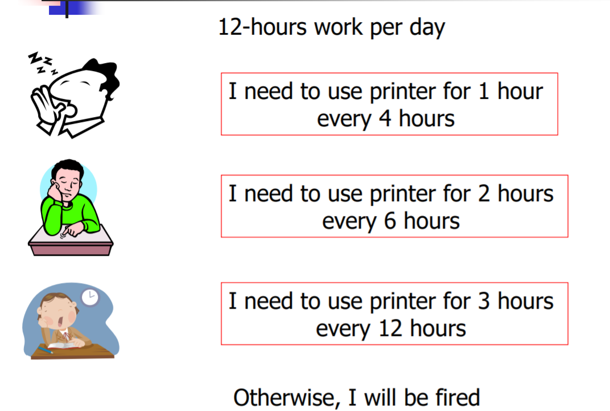
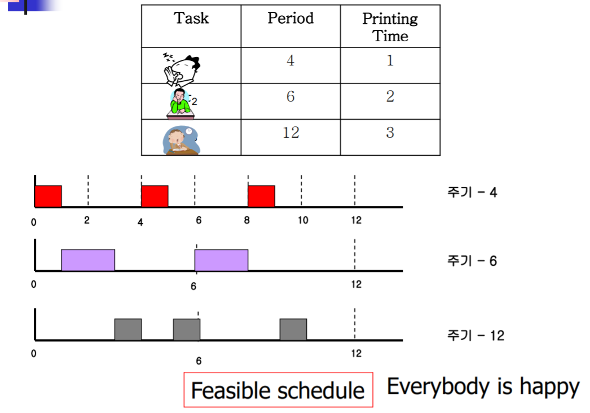
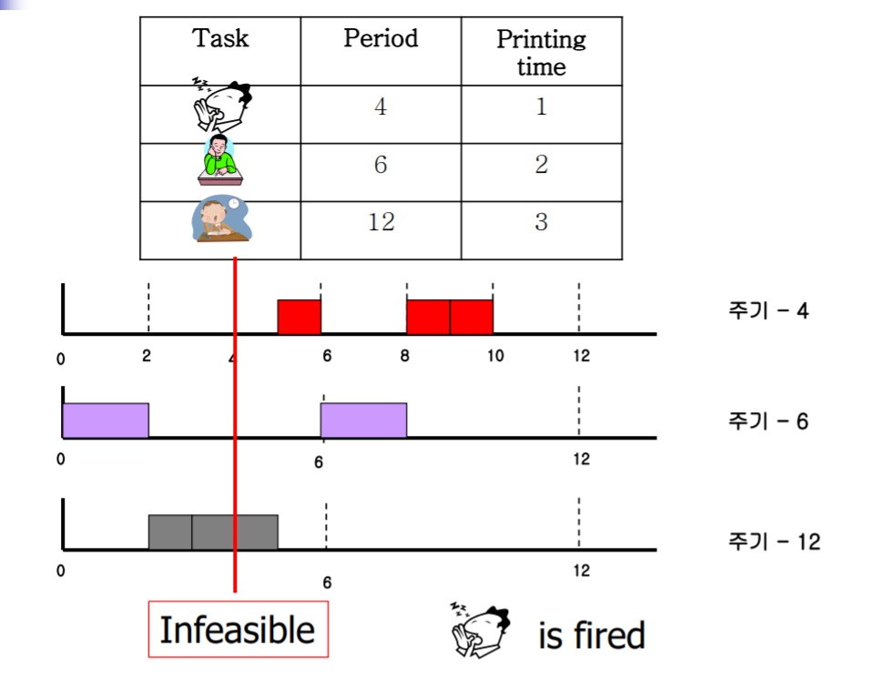
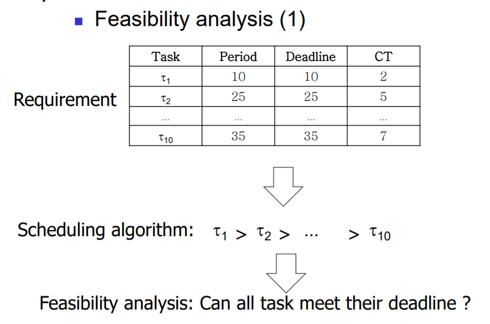
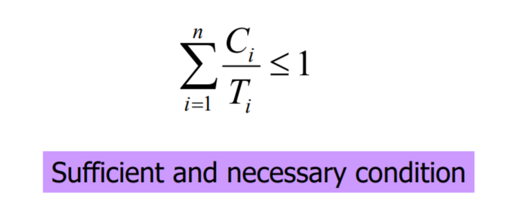

# Ch04 Real-Time Scheduling

RTOS에서는 주로 priority 기반의 스케줄링을 한다고 배웠다. 스케줄러는 Ready 상태에 있는 Task들 중 우선순위가 가장 높은 Task를 실행시킨다. 그렇다면 전체 시스템의 Deadline을 맟추기 위해서는 어떤 Task에게 우선순위를 높게 주어야 할까? 이런 이슈를 해결해줄 RTOS에서의 스케줄링에 대한 이론들을 알아보자.

## Motivating Example

여기 3명의 사람이 존재한다. 이들은 같은 직장에서 각각의 주기마다 프린트를 하는 업무를 맡고 있다. 회사에 프린터는 1대만 존재하여 이 3 사람이 공유해서 사용해야한다. 이들의 업무에는 제약조건이 있는데, 반드시 주기내에 프린트를 해야한다는 것이다. 그렇지 않으면 회사에서 짤리게 된다.

A라는 사람은 4 시간 이라는 주기 동안 프린트를 1 번 해야한다. 이 사람의 프린트는 1시간이 걸린다. B라는 사람은 6시간 이라는 주기 동안 프린트를 1 번 해야한다. 이 사람의 프린트는 2시간이 걸린다. C라는 사람은 12시간 라는 시간동안 프린트를 1번 해야한다. 이 사람의 프린트는 3시간이 걸린다.

이제 이 사람들에게 프린터를 사용할 수 있는 우선순위를 어떻게 부여 하느냐에 따라서 모든 사람이 Deadline을 만족시키는지 알아보자.

첫번째 방법은 Deadline의 주기가 짧은 사람에게 우선순위를 높게 부여하는 것이다. A, B, C 순으로 우선순위가 부여된다. 그림에서 확인할 수 있듯이, 각 사람이 자신의 Deadline에 맞춰서 프린트를 할 수 있다.

두번째 방법으로 B, C, A 순으로 우선순위를 부여해보자. 그림에서 확인할 수 있듯이, Deadline을 만족시키지 못하는 사람이 발생한다.

이렇듯 우선순위 기반 스케줄링에서 어떤 Task에 우선순위를 높게 부여하는지에 따라서 전체 Task의 Deadline 만족 여부가 달라질 수 있음을 알 수 있다.

## Scheduling

### 기본 개념

RTOS에서 Scheduler는 반드시 task들의 real time property를 만족시켜야 한다. real time property라고 하는 것은 각 task의 deadline이 만족되어야함을 의미한다. scheduler가 real time property를 만족시키는지 확인하기 위해서는 feasiblility analysis가 가장 중요하다.

보통 임베디드 시스템에서 각 테스크를 타우 (&tau;) 기호로 표현한다. period와 deadline은 거의 같다고 보면 되고, CT는 Computation Time을 의미한다. CT는 주로 worst case를 가지고 계산하게된다. 이러한 feasibility analysis는 제품을 출시하기 전 design time에 수행되어야 하는 중요한 작업이다.

### Scheduling의 두가지 방식

이제 어떻게 우선순위를 부여할 것인지에 대한 이론을 본격적으로 알아보자. 우선순위를 부여하는 기준은 크게 **Task의 실행주기**와 **Task의 Deadline** 을 고를 수 있다. 가장 짧은 실행주기를 갖는 Task에게 높은 우선순위를 부여하는 방법을 **Rate Monotonic Scheduling**이라고 한다. 또다른 방법은 가장 Deadline이 임박한 Task에게 높은 우선순위를 부여하는 것이다. 이와 같은 방법을 **Earlist First Scheduling**이라고 한다.

우선순위를 부여하는 방법은 2가지가 있다.

- Static : 우선순위를 처음 부여하고나서 그 뒤로는 바뀌지 않음(Rate Monotonic Scheduling)
- Dynamic : 우선순위를 부여하고나서 필요에 따라 우선순위를 변경(Earlist First Scheduling)

## Scheduler - Rate Monotonic Scheduling(RMS)

실행주기가 가장 짧은 Task에게 높은 우선순위를 부여하는 방법이다. 기본적으로 static priority 기반 스케줄링에서 사용되는 방법이다. 또한 각 Task가 periodic한 시스템에서 사용되는 방식이다.

우선순위 기반 스케줄링에서 static하게 우선순위를 부여한다면 가장 많은 Task의 Deadline을 만족시키는 방법은 Rate Monotonic Scheduling임이 증명되었다.

증명 : 두 개의 Task t1, t2가 있다. 이들의 실행 주기(Deadline)은 각각 T1, T2이다. 이때 T1 < T2이다. 또한 이들의 실행시간을 C1, C2라고 해보자.

(1) RMS 방법을 사용한다면 전체 Task가 feasible 하기 위해서는 다음과 같은 조건을 만족시켜야한다.

$$
\left \lfloor \frac{T2}{T1} \right \rfloor \sdot C1 + C2 <= T2
$$

floor(T2/T1)는 T2 시간동안 t1이 실행되어야 하는 횟수를 의미한다.

(2) 그러나 t2에게 더 높은 우선순위를 부여하면 다음과 같은 조건도 추가적으로 만족시켜야 한다.

$$
C1 + C2 <= T1
$$

C2항이 더해지는 이유는 t2가 우선순위가 높기 때문에 t1이 실행되기 위해서는 항상 먼저 t2가 실행되어야 하기 때문이다.

위 부등식에서 좌변과 우변에 모두 floor(T2/T1)을 곱해보자.

$$
\left \lfloor \frac{T2}{T1} \right \rfloor \sdot C1 + \left \lfloor \frac{T2}{T1} \right \rfloor \sdot C2 <= \left \lfloor \frac{T2}{T1} \right \rfloor \sdot T1 <= T2
$$

위 조건은 RMS의 방법을 이용한 우선순위 부여방법보다 더 강력한(strict) 조건이며, 이는 RMS의 방법이 가능한 많은 Task의 Deadline을 만족시키는 가장 효과적인 방법임을 의미한다.

### Task 들의 feasiblity 확인하기

RMS 방식으로 Task들의 우선순위를 부여해야 가능한 많은 Task가 Deadline 안에 수행됨을 배웠다. 그렇다면 어떻게 해야 모든 Task가 Deadline 안에 수행될 수 있을까? 모든 Task가 Deadline을 만족하는 경우를 `feasible`하다고 표현한다.

RMS에서는 다음과 같은 수식을 만족하면 모든 Task의 Deadline이 만족됨이 증명되었다.

$$
U =
\sum_{i=1}^n
U_i =
\sum_{i=1}^n
\frac{C_i}{T_i}
<= n \sdot (2^{1 \over n} - 1)
$$

여기서 주의해야 할 것은 이 부등식은 feasible하기 위한 충분조건이라는 것이다. 즉, 모든 테스크에 대한 Utilization이 위 조건을 만족시키면 feasible하다. 그러나 위 조건을 만족시키지 못한다고 하여도 feasible 할 수 있는 case가 존재한다.

> 참고: 필요 충분조건은 모든 Task의 period가 상호 배수 관계에 있을때 U값이 1보다 작거나 같은 경우이다.

## Scheduler - Earlist First Scheduling(EFS)

기본적으로 Dynamic priority 방식에서 사용하는 scheduling 기법이다. 모든 Task 중 Deadline에 가장 임박한 Task에 가장 높은 우선순위를 부여하는 방식이다. 반드시 우선순위를 recalculate 할 수 있는 환경에서 사용되어야 한다.

EFS에서는 다음과 같은 조건을 만족시킬경우 feasible 함이 증명되었다. 이 조건은 feasible 하기 위한 필요 충분조건이다.

