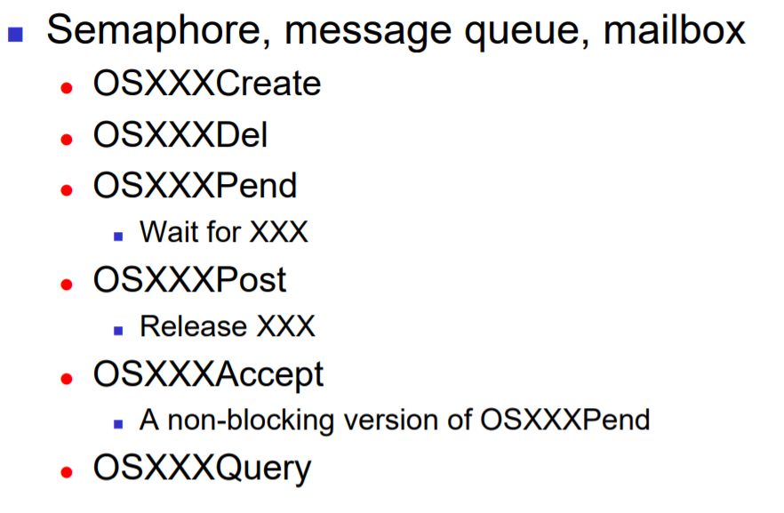
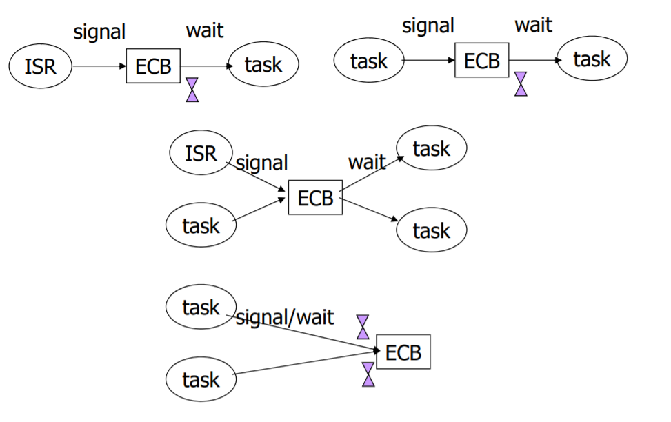
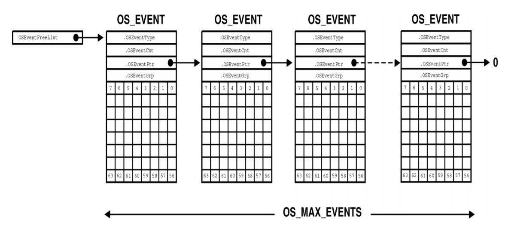
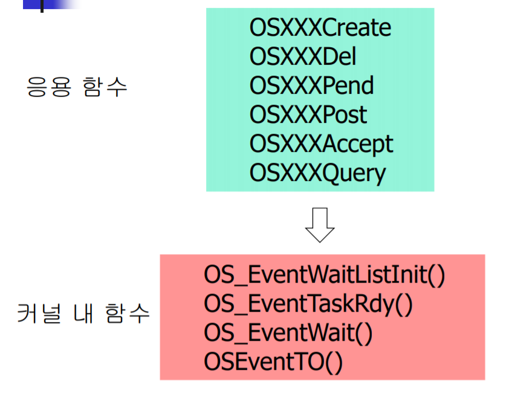
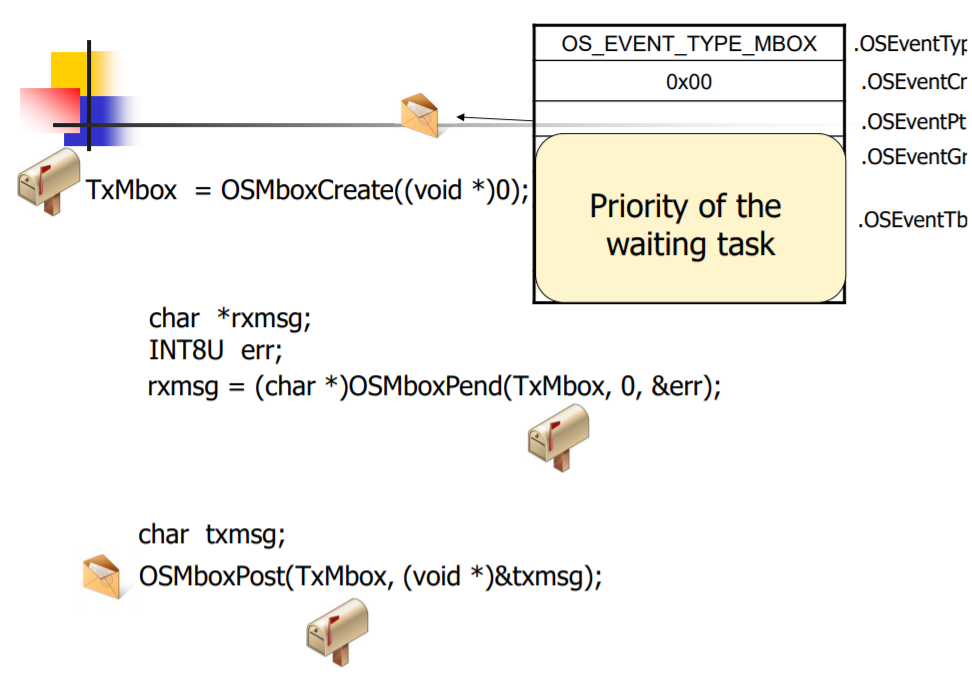
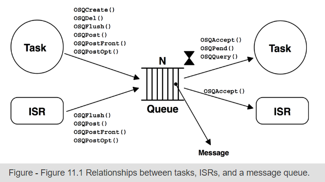
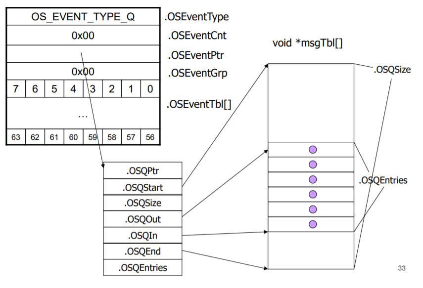
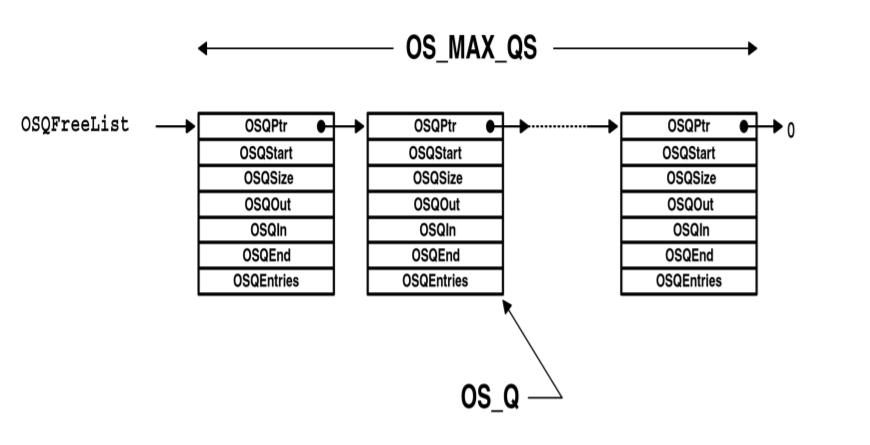
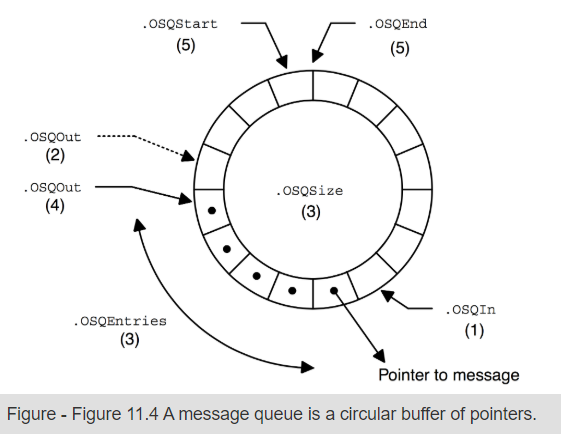
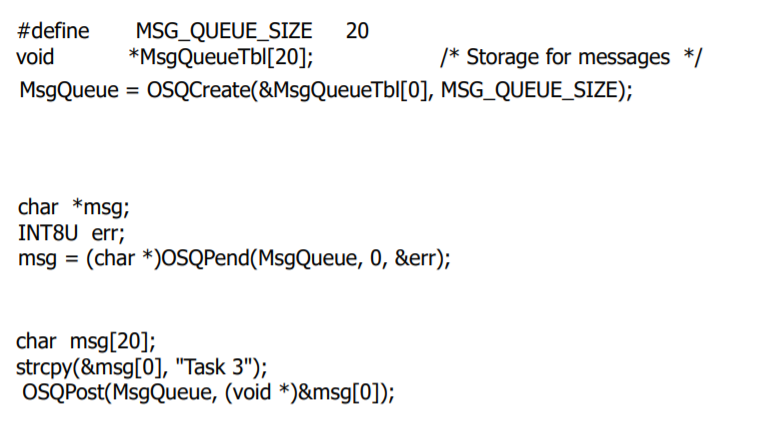

# Task Synchronization 1

- mail box, message queue, semaphore, mutex

## Task Synchronization을 위한 자료구조 - Event Control Block(ECB)

- mail box, message queue, semaphore, mutex와 같은 동기화 함수를 사용하기 위해서 특정 자료구조를 도입하였다.
- Event Control Block은 특정 Synchronization 알고리즘을 수행하기 위한 여러 정보를 담고 있는 구조체이다.
- 스케줄러가 OSRdyGrp과 OSRdyTbl을 관리하는 것과 유사한 형태로 되어있다.
- mail box, message queue, semaphore, mutex에서 동일하게 사용하도록 Event Control Block과 Synchronization 관련 함수들의 이름은 동일한 형태로 작성되어 있다.



Event Control Block을 통해서 Synchronization을 수행하는 형태는 다음 그림처럼 여러개이다.



### Event Control Block Structure : struct OS_EVENT

Event Control Block은 다음과 같은 형태의 구조체 형태로 선언되어 있다.

```c
typedef struct {
    void *OSEventPtr;   // OSEventType 마다 용도가 다름
    INT16U OSEventCnt;  // OSEventType 마다 용도가 다름
    INT8U OSEventType;
    INT8U OSEventGrp;   // 특정 이벤트를 기다리는 Task 정보
    INT8U OSEventTbl[OS_EVENT_TBL_SIZE]; // 특정 이벤트를 기다리는 Task 정보
} OS_EVENT;
```

- OSEventType : ECB의 용도를 나타내는 필드
  - OS_EVENT_TYPE_SEM
  - OS_EVENT_TYPE_MUTEX
  - OS_EVENT_TYPE_MBOX
  - OS_EVENT_TYPE_Q
- OSEventCnt
  - 세마포어 : 세마포어 카운트 저장
  - 상호 배제 세마포어(MUTEX) : PIP 저장
- OSEventPtr : 메시지 큐나 mail box에서만 사용됨. 생성된 해당 메시지에 대한 포인터
- OSEventGrp, OSEventTbl : 특정 이벤트 발생을 기다리는 태스크들의 리스트

### 이벤트 대기상태 Task 리스트 관리

#### 이벤트 대기 Task insertion

```c
pevent->OSEventGrp |= OSMapTbl[prio >> 3];
pevent->OSEventTbl[prio >> 3] |= OSMapTbl[prio & 0x07];
```

#### 이벤트 대기 list에서 Task 제거

```c
if (pevent->OSEventTbl[prio >> 3] &= ~OSMapTbl[prio & 0x07])
    pevent->OSEventGrp &= ~OSMapTbl[prio >> 3];
```

#### 이벤트 대기 list 중 우선순위가 가장 높은 Task 찾기

```c
y = OSUnMapTbl[pevent->OSEventGrp];
x = OSUnMapTbl[pevent->OSEventTbl[y]];
prio = (y << 3) + x;
```

### Free Event Control Block

TCB와 마찬가지로 ECB 역시 미리 여러개의 OS_EVENT 구조체를 만들어두고 관리한다. 이렇게 미리 만들어 두고 관리하는 이유는 ECB가 필요할 때 ECB를 생성하는 시간을 소모하지 않고 빠른시간 내에 사용하기 위해서이다.  
미리 생성되는 ECB 개수는 OS_CFG.H 파일에서 OS_MAX_EVENTS 값을 통해 설정할 수 있다. 초기에 OS_Init 함수를 호출하면 모든 ECB가 OSEventFreeList에 연결되어 관리된다. 이 후 ECB를 생성하는 함수를 호출하면, OSEventFreeList에서 삭제되어 사용된다.



### ECB 제어관련 함수들



- OS_EventWaitListInit(OS_EVENT * pevent) : OSXXXCreate 함수에서 호출되는 함수. 세마포어, 메시지 큐, 메일박스 생성시 ECB를 생성할 때, 해당 event에 대한 대기 리스트를 초기화하는 함수. 아직 ECB를 기다리는 태스크가 존재하지 않는다는 것을 의미한다.
- OS_EventTaskRdy() : 특정 이벤트가 발생하여 이벤트에 대해서 대기하고 있던 우선순위가 가장 높은 Task를 다시 Ready 상태로 바꾸는 것. OSXXXPost() 함수에서 호출되는 함수이다.
- OS_EventWait() : 특정 이벤트가 발생하기를 기다리는 태스크에 대해서 ECB 대기리스트에 추가하고, 해당 Task는 Wait 상태로 전환하는 것. OSXXXPend() 함수에서 호출하는 함수이다.
- OSEventTO() : 특정 이벤트가 발생하기를 기다리는 태스크에 대해서 미리 설정한 시간이 지나면 대기 리스트에서 제거하고 다시 Ready 상태로 전환하는 것. 역시 OSXXXPend() 함수에서 호출하는 함수이다.

```c
void OS_EventTaskRdy(OS_EVENT *pevent, void *msg, INT8U msk)
{
    // 이벤트 대기 테스크 중 우선순위가 가장 높은 것
    y = OSUnMapTbl[pevent->OSEventGrp];
    bity = OSMapTbl[y];
    x = OSUnMapTbl[pevent->OSEventTbl[y]];
    bitx = OSMapTbl[x];
    prio = (INT8U)((y << 3) + x);

    // 이벤트 대기 리스트에서 제거
    if ((pevent->OSEventTbl[y] &= ~bity) == 0)
        pevent->OSEventGrp &= ~bitx;

    // ptcb 셋팅
    // msk : OS_EVENT_SEM, OS_EVENT_Q, OS_EVENT_MUTEX, OS_EVENT_MBOX
    ptcb = OSTCBPrioTbl[prio];
    ptcb->OSTCBDly = 0;
    ptcb->OSTCBEventPtr = (OS_EVENT *)0;
    ptcb->OSTCBStat &= ~msk;

    // Ready 리스트에 삽입
    if (ptcb->OSTCBStat == OS_STAT_RDY) {
        OSRdyGrp |= bity;
        OSRdyTbl[y] |= bitx;
    }
}
```

```c
void OS_EventTaskWait(OS_EVENT * pevent)
{
    // OSTCVEventPtr 설정
    OSTCBCur->OSTCVEventPtr = pevent;

    // Ready 리스트에서 제거
    if ((OSRdyTbl[OSTCBCur->OSTCBY] &= ~OSTCBCur->OSTCBBitX) == 0)
        OSRdyGrp &= ~OSTCBCur->OSTCBBitY;

    // ECB 대기리스트에 삽입
    pevent->OSEventGrp |= OSTCBCur->OSTCBBitY;
    pevent->OSEventTbl[OSTCBCur->OSTCBY] |= OSTCBCur->OSTCBBitX;
}
```

```c
void OSEventTO(OS_EVENT * pevent)
{
    // ECB 대기리스트에서 삭제
    if ((pevent->OSEventTbl[OSTCBCur->OSTCBY] &= ~OSTCBCur->OSTCBBitX) == 0)
        pevent->OSEventGrp &= ~OSTCBCur->OSTCBBitY;

    // 해당 TCB가 event를 가리키지 않도록 셋팅
    OSTCBCur->OSTCBStat = OS_STAT_RDY;
    OSTCBCur->OSEventPtr = (OS_EVENT *)0;
}
```

## Mailbox

### mailbox 생성

```c
OS_EVENT * OSMboxCreate(void * msg);
```

- 설명 : mailbox에 대한 ECB를 생성하는 함수.
- 매개변수
  - void * msg : mailbox에 전달할 메시지 포인터. 처음 만들때는 보통 널포인터를 전달.
- 반환값
  - OS_EVENT * : 생성된 ECB에 대한 포인터. 이 후 OSMboxPend나 OSMboxPost에서 인자로 전달될 수 있다.

### mailbox 삭제

```c
OS_EVENT *OSMboxDel(OS_EVENT * pevent, INT8U opt, INT8U * err);
```

- 설명 : 생성된 mailbox에 대한 ECB를 삭제하는 함수.
- 매개변수 : 삭제하고자 하는 ECB에 대한 포인터, 옵션, (설정에 따라서)메일 박스에 대해서 wait하고 있는 Task가 있는 경우 에러를 저장할 변수 포인터
- 반환값 : 제대로 삭제된 경우 널 포인터.

### mailbox에서 메시지 기다리기

```c
void* OSMboxPend(OS_EVENT * pevent, INT16U timeout, INT8U * err);
```

- 설명 : 인자로 전달한 ECB에 이벤트가 발생(메일이 도착)할 때까지 Task를 대기시켰다가, 메세지가 도착하면 해당 메시지를 반환해주는 함수
  - pevent->OSEventPtr 값이 NULL이 아닌 경우 : 해당 메시지를 반환하고, pevent->OSEventPtr은 NULL로 설정
  - Task가 wait 상태에 있다가 ECB에 메시지가 도착하고, wait 상태의 Task가 다시 Ready 상태의 HPT가 되면 message는 이 함수를 호출한 Task에 넘겨진다.
- 매개변수
  - OS_EVENT * pevent : 메시지를 대기할 ECB에 대한 포인터
  - INT16U timeout : 최대로 대기할 시간. 여기에 인자로 0을 전달할 경우 메시지가 도착할 때까지 무한정 대기한다.
  - INT8U * err : 에러발생시 에러 코드를 저장할 변수 포인터
- 반환값 : ECB에 도착한 메시지 포인터

### mailbox에 메시지 보내기

```c
INT8U OSMboxPost(OS_EVENT * pevent, void * msg);
```

- 설명 : pevent로 가리켜지는 ECB의 메일박스에, 또는 ECB의 메일박스에서 메시지를 대기하고 있던 Task에 메시지를 전달하는 함수이다.
- 매개변수
  - OS_EVENT * pevent : 메시지를 전달할 mailbox(ECB)에 대한 포인터
  - void * msg : 전달할 메시지에 대한 포인터
- 반환값 : 에러 코드 또는 함수 실행 결과 코드

### 기다리지 않고 mailbox에서 메시지 읽기

```c
void *OSMboxAccept(OS_EVENT * pevent)
```

- 설명 : 인자로 전달한 ECB의 메일박스에 메시지가 존재하는 경우 바로 해당 메시지를 읽고, 메시지가 존재하지 않는 경우 wait하지 않고 바로 다음 코드를 실행한다.

### mailbox에 대기 중인 모든 Task에게 메시지를 BroadCast 하기

```c
INT8U OSMboxPostOpt(OS_EVENT * pevent, void * msg, INT8U opt);
```

- 설명 : OSMboxPost() 함수에서 기능이 추가된 형태, 적절한 opt 값을 전달하면 메일박스에서 메일을 대기하고 있는 모든 Task에게 메시지를 전달할 수 있다.

### 사용 예시



### 코드 분석

```c
void  *OSMboxPend (OS_EVENT *pevent, INT16U timeout, INT8U *err)
{
#if OS_CRITICAL_METHOD == 3
    OS_CPU_SR  cpu_sr;
#endif
    void      *msg;


    if (OSIntNesting > 0) {                            (1)
        *err = OS_ERR_PEND_ISR;
        return ((void *)0);
    }
#if OS_ARG_CHK_EN > 0
    if (pevent == (OS_EVENT *)0) {                     (2)
        *err = OS_ERR_PEVENT_NULL;
        return ((void *)0);
    }
    if (pevent->OSEventType != OS_EVENT_TYPE_MBOX) {   (3)
        *err = OS_ERR_EVENT_TYPE;
        return ((void *)0);
    }
#endif
    OS_ENTER_CRITICAL();
    msg = pevent->OSEventPtr;                          (4)
    if (msg != (void *)0) {
        pevent->OSEventPtr = (void *)0;                (5)
        OS_EXIT_CRITICAL();
        *err = OS_NO_ERR;
        return (msg);                                  (6)
    }
    OSTCBCur->OSTCBStat |= OS_STAT_MBOX;               (7)
    OSTCBCur->OSTCBDly   = timeout;                    (8)
    OS_EventTaskWait(pevent);                          (9)
    OS_EXIT_CRITICAL();
    OS_Sched();                                       (10)
    OS_ENTER_CRITICAL();
    msg = OSTCBCur->OSTCBMsg;
    if (msg != (void *)0) {                           (11)
        OSTCBCur->OSTCBMsg      = (void *)0;
        OSTCBCur->OSTCBStat     = OS_STAT_RDY;
        OSTCBCur->OSTCBEventPtr = (OS_EVENT *)0;
        OS_EXIT_CRITICAL();
        *err                    = OS_NO_ERR;
        return (msg);                                 (12)
    }
    OS_EventTO(pevent);                               (13)
    OS_EXIT_CRITICAL();
    *err = OS_TIMEOUT;
    return ((void *)0);                               (14)
}
```

- (4) : 메시지가 있을 경우 pevent->OSEventptr 값을 NULL로 설정하고, 해당 메시지를 반환한다.
- (7), (8), (9) : 메일박스에 메시지가 없을 경우, 해당 테스크를 이벤트 대기 리스트에 추가한다.
- (10) : Task가 suspend 되었기 때문에 다른 태스크가 실행되도록 스케줄링을 호출한다. 메일박스에 메시지가 전달될때까지 Task는 이 부분에서 block 된다.
- (11) : 메일박스에 메시지가 도착하여 OSMboxPost에서 테스크에 메시지를 전달해준 경우이다.(이 부분의 if문이 걸리지 않았다면 timeout으로 인해 block에서 풀린 경우이다.)
- (13) : Timeout 된경우 OSEventTO를 통해서 이벤트 대기리스트에서 Task를 제거한다. 그리고 NULL 포인터를 반환한다.

```c
INT8U  OSMboxPost (OS_EVENT *pevent, void *msg)
{
#if OS_CRITICAL_METHOD == 3
    OS_CPU_SR  cpu_sr;
#endif


#if OS_ARG_CHK_EN > 0
    if (pevent == (OS_EVENT *)0) {                    (1)
        return (OS_ERR_PEVENT_NULL);
    }
    if (msg == (void *)0) {
        return (OS_ERR_POST_NULL_PTR);
    }
    if (pevent->OSEventType != OS_EVENT_TYPE_MBOX) {
        return (OS_ERR_EVENT_TYPE);
    }
#endif
    OS_ENTER_CRITICAL();
    if (pevent->OSEventGrp != 0x00) {                 (2)
        OS_EventTaskRdy(pevent, msg, OS_STAT_MBOX);   (3)
        OS_EXIT_CRITICAL();
        OS_Sched();                                   (4)
        return (OS_NO_ERR);
    }
    if (pevent->OSEventPtr != (void *)0) {            (5)
        OS_EXIT_CRITICAL();
        return (OS_MBOX_FULL);
    }
    pevent->OSEventPtr = msg;                         (6)
    OS_EXIT_CRITICAL();
    return (OS_NO_ERR);
}
```

- (2) : 메일박스를 대기하고 있는 Task가 존재하는 경우 `OS_EventTaskRdy(pevent, msg, OS_STAT_MBOX)`를 통해 Task에 메시지를 전달한다. 그 다음 `OS_Sched()` 스케줄링을 호출한다.
- (5) : 메일박스에 이미 메시지가 존재하는 경우 에러를 발생시킨다.
- (6) : 메시지를 대기하는 Task도 없고, 메일박스도 비어있다면, 메일박스에 메시지를 저장하고 리턴한다.

```c
INT8U  OSMboxPostOpt (OS_EVENT *pevent, void *msg, INT8U opt)
{
#if OS_CRITICAL_METHOD == 3
    OS_CPU_SR  cpu_sr;
#endif


#if OS_ARG_CHK_EN > 0
    if (pevent == (OS_EVENT *)0) {                              (1)
        return (OS_ERR_PEVENT_NULL);
    }
    if (msg == (void *)0) {
        return (OS_ERR_POST_NULL_PTR);
    }
    if (pevent->OSEventType != OS_EVENT_TYPE_MBOX) {
        return (OS_ERR_EVENT_TYPE);
    }
#endif
    OS_ENTER_CRITICAL();
    if (pevent->OSEventGrp != 0x00) {                           (2)
        if ((opt & OS_POST_OPT_BROADCAST) != 0x00) {            (3)
            while (pevent->OSEventGrp != 0x00) {                (4)
                OS_EventTaskRdy(pevent, msg, OS_STAT_MBOX);     (5)
            }
        } else {
            OS_EventTaskRdy(pevent, msg, OS_STAT_MBOX);         (6)
        }
        OS_EXIT_CRITICAL();
        OS_Sched();                                             (7)
        return (OS_NO_ERR);
    }
    if (pevent->OSEventPtr != (void *)0) {                      (8)
        OS_EXIT_CRITICAL();
        return (OS_MBOX_FULL);
    }
    pevent->OSEventPtr = msg;                                   (9)
    OS_EXIT_CRITICAL();
    return (OS_NO_ERR);
}
```

- (3), (4) : opt에 OS_POST_OPT_BROADCAST 옵션이 설정되어 있는 경우 while 루프를 돌며 메시지를 기다리고 있던 모든 Task에 메시지를 전달한다.

```c
void  *OSMboxAccept (OS_EVENT *pevent)
{
#if OS_CRITICAL_METHOD == 3
    OS_CPU_SR  cpu_sr;
#endif
    void      *msg;
  
  
#if OS_ARG_CHK_EN > 0
    if (pevent == (OS_EVENT *)0) {                       (1)
        return ((void *)0);
    }
    if (pevent->OSEventType != OS_EVENT_TYPE_MBOX) {     (2)
        return ((void *)0);
    }
#endif
    OS_ENTER_CRITICAL();
    msg                = pevent->OSEventPtr;             (3)
    pevent->OSEventPtr = (void *)0;                      (4)
    OS_EXIT_CRITICAL();
    return (msg);                                        (5)
}
```

- waiting 없이 메일박스에 메시지가 있으면 가져오고, 없으면 바로 다음 코드를 수행한다.

## Message queue

여러 개의 message를 전송할 때 사용된다.



여러개의 Message를 저장할 수 있는 Queue 구조로 되어있다. Mailbox의 배열이라고도 생각할 수 있다(단 wait 리스트는 큐에 대해서 하나만 생성되는).

### Message queue ECB 구조



[Message queue 참고 사이트](https://doc.micrium.com/display/osiidoc/Message+Queue+Management#MessageQueueManagement-Sendingamessagetoaqueue(FIFO),OSQPost())

Message queue를 생성하려면 먼저 메시지들을 저장할 pointer 배열을 만들어야 한다. 이 배열의 주소는 Message queue를 생성하는 `OSQCreate()` 함수의 인자로 전달된다.



Message queue가 생성되면 Queue control block이 생성되어 queue에 대한 정보를 관리한다. 이 Q Control block은 ECB의 OSEventPtr로 가리켜진다.

#### Queue Control Block 필드들의 의미



### Message queue 생성

```c
OS_EVENT * OSQCreate(void ** start, INT16U size);
```

- 설명 : 메시지큐를 생성한다.
- 매개변수
  - void ** start : 메시지들을 저장할 포인터 배열 주소
  - INT16U : 앞서 전달한 포인터 배열 크기. 메시지 큐에 저장될 수 있는 entry 개수.
- 반환값 : 생성된 메시지 큐에 대한 ECB

### Message queue에 메시지 오기를 기다림

```c
void * OSQPend(OS_EVENT * pevent, INT16U timeout, INT8U * err);
```

- 설명 : 메시지 큐에 들어온 메시지가 있다면 반환한다. 메시지 큐에 메시지가 없다면, 메시지가 들어올 때까지 대기 상태를 유지한다. 이 후 메시지 큐에 메시지가 들어오거나 timeout되면 새로 들어온 메시지를 꺼낸다.
- 매개변수
  - OS_EVENT * pevent : 메시지 큐에 대한 ECB
  - INT16U timeout : 최대로 기다릴 시간 (clock tick 단위)
  - INT8U * err : 에러 발생시 에러 코드를 담을 변수의 주소
- 반환값 : 메시지가 존재하는 경우 Message에 대한 포인터

### Message queue에 배달된 모든 메시지 삭제

```c
INT8U OSQFlush(OS_EVENT * pevent);
```

### Message를 기다리는 모든 Task에 BroadCasting

```c
INT8U OSQPostOpt(OS_EVENT * pevent, void * msg, INT8U opt);
```

- 설명
- 매개변수
  - INT8U opt : 이 값에 OS_POST_OPT_BROADCAST를 전달하면 모든 Task에 메시지를 전달할 수 있다.

### Non-blocking message queue

```c
void * OSQAccept(OS_EVENT * pevent);
```

### Message queue 사용 예시



## 참고

[µC/OS-II Documentation](https://doc.micrium.com/display/osiidoc/Message+Mailbox+Management#MessageMailboxManagement-Sendingamessagetoamailbox,OSMboxPost())

> 이 문서는 인하대학교 임베디드 소프트웨어 강의를 듣고 정리한 내용입니다. 중간 중간 나오는 그림들은 강의 슬라이드에서 가져온 내용입니다. 또한 &micro;C/OSII 공식 문서(µC/OS-II Documentation)를 참고하였습니다. 문제가 되는 경우 자진 삭제하겠습니다.
