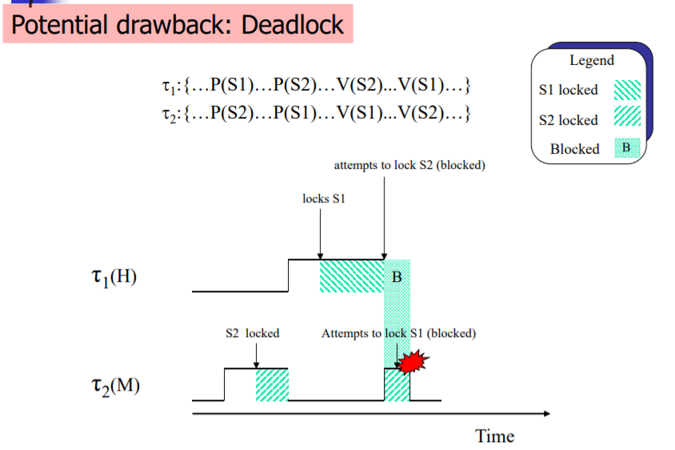

# Priority Inversion

## Task Synchronization

임베디드 시스템에서는 어떤 목적을 달성하기 위해서는 여러 Task가 협력할 필요가 있다. 이들 Task간 메시지를 주고 받거나, 실행 순서를 결정하는 많은 방법들이 존재한다.

### Critical Section

코드상에서 오직 하나의 Task만 진입하여 해당 영역을 한번에 완전히 실행할 필요가 있을 때 이런 영역을 **Critical Section** 이라고 한다. 보통 공유 변수를 접근하는 코드 영역이 Critical Section이 된다. 이러한 Critical Section을 보호하기 위해서는 Mutual Exculsion(상호 배제)가 필요하고, 이런 목적으로 쓰이는 동기화 알고리즘 중에는 **Mutex**나 **Semaphore**가 있다.

## 우선순위 전도 현상 (Priority Inversion)

Task 동기화 방법으로 Semaphore나 Mutex를 사용할 때 발생하는 현상 중에 하나가 **우선순위 전도 현상(Priority Inversion)** 이다. 위 그림을 보자. 시스템에서 S라고 표시되는 세마포어가 있고, 각각 higt, medium, low의 우선순위를 갖는 Task J1, J2, J3가 있다. t0 시점에서 J3가 수행되기 시작하고 t1 시점에서 세마포어 S를 획득하였고, t2 시점에서 J1이 실행가능 상태가 되어서 preemption하여 실행되기 시작한다. t3 시점에서 세마포어 S를 획득하려 하지만 이미 J3가 세마포어를 소유하고 있기 때문에 **J3가 세마포어를 내려놓을때까지 잠시동안 block** 되고 다시 J3가 실행된다. 여기까지는 아무 문제 없는 정상적인 상황이다. 그런데 이때 J2가 t4 시점에서 실행되기 시작하여 J3를 preemption 한다면, 그리고 J2가 매우 긴 시간동안 실행된다면, J1는 자기보다 우선순위가 낮은 J2에 의해서 마지 우선순위가 전도된 것처럼 block되고 실행되지 못하게 된다. 궁극적으로 J1은 Dead line을 만족시키지 못할 수 있다.

이런 문제를 해결하기 위해서 다음과 같은 2가지 방법이 고안되었다.

- **Priority Inheritance Protocol**
- **Priority Ceiling Protocol**

## Priority Inheritance Protocol

우선순위 낮은 태스크가 소유하고 있는 자원(세마포 또는 뮤텍스)를 우선순위 높은 태스크가 try 할때, 우선순위 높은 태스크의 우선순위를 우선순위 낮은 태스크가 갖도록 한다. 이러한 상속은 높은 우선순위를 상속받은 태스크가 자원을 post 할때까지 유지된다.

priority inheritance protocol에 의해서 t2 시점에서 J3는 J1의 우선순위를 상속받는다. 따라서 t3 시점에서 J2가 실행가능상태가 되더라도, preemption 되지 않고 t4시점까지 계속 실행된다. 그 다음 자원 S를 unblock 하고, 우선순위도 다시 원래대로 회복되어 J1이 J2에 밀리지 않고 실행된다.

Priority Inheritance Protocol은 우선순위 전도 현상은 해결했지만 다음과 같은 2가지 문제상황이 발생할 수 있다.

### Deadlock

첫번째 문제상황은 데드락이다. 위 그림과 같이 2개의 태스크(&tau;1, &tau;2)가 있고, 세마포어 2개(S1, S2)가 있다고 하자. 세마포어 초기값은 모두 1이라고 가정한다. &tau;1의 우선순위가 &tau;2 보다 높다. 이때 &tau;2가 먼저 실행되기 시작하여 S2를 lock하고 곧이어 &tau;1이 실행되기 시작하여 S1을 lock한다. 그 다음 S2를 lock하려하는 순간 이미 &tau;2에 의해 소유되어있어서 block되고 &tau;2로 실행을 넘긴다. 최종적 다시 &tau;2는 S1을 lock하려 할때 이미 &tau;1에 의해 소유되기 때문에 실행되지 못하고 두 테스크 모두 상대편이 가지고 있는 자원을 소유할 수 있을때까지 기다리는 Dead lock 상태가 된다.

### Chained Blocking

두번째 문제상황은 테스크가 계속해서 blocking 되는 Chained Blocking이다. 위 그림에서 3가지 테스크와 2가지 세마포가 있다. &tau;3가 S2를 lock하고, &tau;2가 S1을 lock한 이후 &tau;1이 실행되기 시작한다. &tau;1은 S1을 lock하려고 하지만 이미 &tau;2에 의해 소유되고 있기 때문에 &tau;2가 S1를 unlock 할 때까지 block된다. &tau;2가 S1을 unlock하면 다시 &tau;1이 시작되어 S1을 lock하고 실행을 진행한다. 다시 S2를 lock하려고 하면 &tau;3에 의해 이미 소유되고 있기 때문에 &tau;1이 S2를 unlock할때까지 block 되고, &tau;3가 실행된다. &tau;1이 S2를 unlock하면 다시 &tau;1이 실행된다. &tau;1은 자신보다 우선순위가 낮은 태스크들이 소유하고 있는 동기화 자원에 의해서 연속적으로 blocking을 경험한다. Task의 실행시간 계산에는 이러한 blocking 상황은 고려되지 않으며, 따라서 이런 연속적인 blocking은 예상외의 긴 실행시간을 만들게 되며 최종적으로 Deadline missing을 일으킬 수 있는 원인이 되기도 한다.

이러한 문제를 해결하기 위해서 Priority Ceiling Protocol이 고안되었다.

## Priority Ceiling Protocol

priority ceiling protocol을 설명하기 위해서는 먼저 몇가지 용어를 정의해야한다.

- **Semaphore Ceiling** : semaphore에 접근하려고 하는 테스크들 중 가장 높은 우선순위를 갖는 테스크의 우선순위값. 이 값은 시스템이 시작되기 전에 계산될 수 있으며 정적인 값이다.
- **System Ceiling** : 어느 시점에서 다른 Task들에 의해 소유되고 있는 세마포어의 semaphore ceiling의 상한값. 이 값은 시스템의 특정 시점마다 바뀌며, Task마다 계산되는 상대적인 값이다.

priority ceiling protocol은 Task가 어떤 세마포어를 lock하려고 할때, **Task의 우선순위가 System Ceiling 값보다 낮은 경우 Task를 blocking** 하는 방법이다. 이는 자신이 어떤 공유 자원을 소유한 상태에서 자기보다 높은 우선순위를 갖는 태스크가 소유하고 있을 지도 모르는 다른 공유 자원을 소유하려는 시도를 차단하여 Deadlock을 방지하고, chained blocking 현상을 해결할 수 있다.

위 그림은 priority ceiling protocol을 통해서 Deadlock 상황이 해결된 것을 나타내는 그림이다. 일단 각 세마포어의 ceiling 값은 모두 1이다. &tau;1이 S1을 lock하려고 할때, &tau;2는 S2를 소유하고 있고, S2의 ceiling 값이 1이기 때문에 1의 우선순위를 갖는 &tau;1은 이 시점에서 S1을 lock하지 못하고 block된다. &tau;2가 S1과 S2를 모두 unlock한 시점에서야 &tau;1이 실행되어 S1을 lock할 수 있게 되었다.

위 그림은 priority ceiling protocol을 통해서 chained blocking 현상이 해결된 것을 나타내는 그림이다. 테스크는 공유 자원을 소유하기 위해서 기껏해야 최대 1번의 blocking 만을 경험하게 된다.
