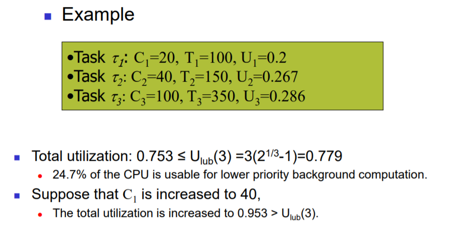
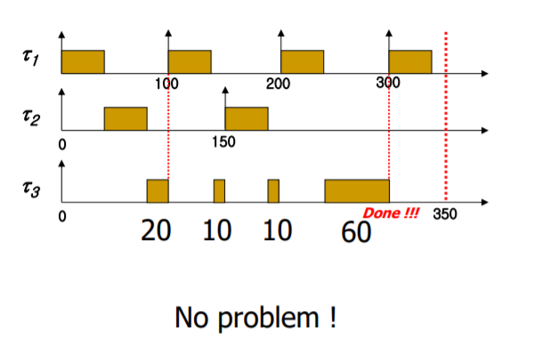

# Rate-monotonic scheduling에서의 feasibility

## Motivation

앞 장에서 배웠던 Rate monotonic scheduling 방법에서의 feasibility test 식 **Utilization bound test**는 전체 테스크가 feasible하기 위한 **충분조건**이다.

$$
U =
\sum_{i=1}^n
U_i =
\sum_{i=1}^n
\frac{C_i}{T_i}
<= n \sdot (2^{1 \over n} - 1)
$$

위 식을 만족 시키는 시스템은 feasible함이 보장되지만, 위 식을 만족시키지 않는다고 해서 만드시 infeasible 한 것은 아니다(위 식은 feasible하기 위한 충분조건이기 때문에).

위 예는 전체 CPU 사용율의 값이 Utilization bound test를 만족하는 예이다. 그런데 &tau;1의 Computation time 을 40으로 늘리는 경우를 생각해보자. 이 경우 전체 CPU 사용율 값은 Utilization bound test를 통과하지 못한다. 그러나 다음 그림을 보면, 전체 시스템이 feasible 한 것을 알 수 있다.

이렇듯 Utilization bound test는 매우 pessimistic한 조건임을 알 수 있다. 따라서 feasible한 case를 조금 더 많이 체크할 수 있는 조건이 필요하다.

## Schedulability Test

이제 새롭게 feasibility test를 도입한다. 먼저 다음과 같은 식을 정의한다.

$$
W_i(t) = \sum_{j = 1}^{i} C_j \lceil {t \over T_j} \rceil
$$

i는 테스크를 나타나는 기호이다. 이는 어느 시점 t에서 자기보다 우선순위가 높거나 같은 테스크들에 대해서 위 식을 계산한 값이다. 또 살펴볼 기호는 다음과 같다.

$$
L_i(t) = { W_i(t) \over t}
$$

$$
L_i = min_{(0 <= t <= Ti)}\{L_i(t) \}
$$

$$
L = max_{(1 <= i <= n)}{Li}
$$

task i가 feasible 하기 위해서는 Li <= 1 조건을 만족해야한다. 또한 전체 시스템이 feasible 하기 위해서는 L <= 1 조건을 만족해야한다.

전체 시스템이 feasible 한지를 판단하기 위해 모든 시점에서 위 식을 계산해야 할까? 그렇지 않다. 각 테스크별로 위 식을 판단해야하는 Scheduling Point가 있는데 다음과 같다.

$$
S_i = \{kT_j | j = 1, 2, ... i, k = 1, ... \lfloor{T_i \over T_j}\rfloor \}
$$

즉, 자신의 주기보다 작거나 같은 시점 중에서 자신 보다 우선순위가 높거나 같은 테스크의 주기의 배수들에서만 위에서 정의한 조건을 판단해보면 된다.

$$
L_i = min_{(t \in S_i)}\{L_i(t) \}
$$
