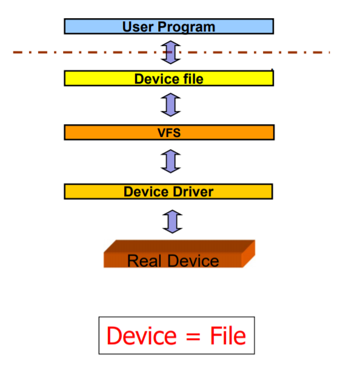
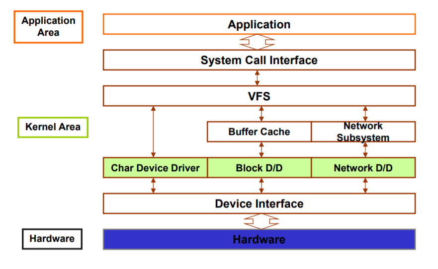
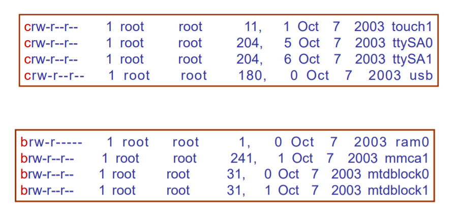
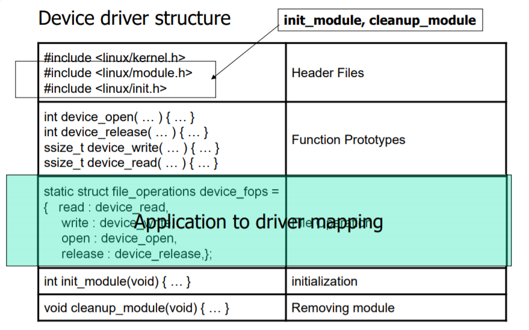
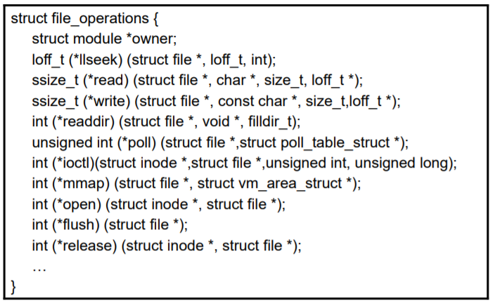
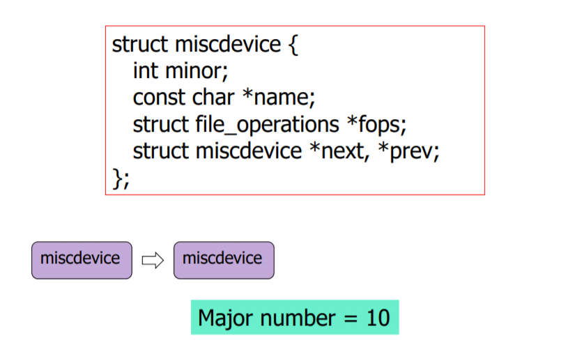

# How Device driver in Linux work

이 단원의 핵심 개념

- 실행되고 있는 Linux 커널에 Device Driver 라는 커널 프로그램을 삽입하기
- Linux의 공통 인터페이스인 파일 입출력 함수로 장치(Device)를 제어하기 위해서 Device Driver가 하는 일
- Misc Device Driver

## Basic Concept

### Device Driver

Computer에는 많은 주변 장치들이 연결되어 있다. 이러한 주변장치를 control하고 management하는 프로그램을 **Device Driver** 라고 한다. 또한 Device Driver는 프로그래머에게 익숙한 `read`, `write`와 같은 파일 입출력 함수로 디바이스를 제어할 수 있도록 하는 인터페이스의 역할을 한다.

### Dynamic module linking

이러한 Device driver는 응용프로그램이 아니라 커널에서 동작하는 커널 프로그램이다. Device driver를 제작하고 나서는 현재 실행중인 커널에 포함시켜야 하는데, 이러한 기능을 **Dynamic Module linking** 이라고 한다. linux에서는 `insmod` 와 `rmmod`로 device driver를 커널에 추가하거나 제거할 수 있다.

### Policy

어떤 분야에서 소프트웨어를 사용하는 방식을 **Policy** 라고 한다. 그러나 Device Driver는 어떤 분야의 소프트웨어에서도 동일한 방식으로 사용될 수 있어야 한다. 이를 **Policy free** 라고 한다. 이는 해당 Device를 사용하는 구체적인 내용을 응용 프로그램에게 맡기고, Device Driver는 장치에 대한 접근 방식만을 제공하면 되도록 한다.

### Linux에서의 Device : Device File



앞선 설명에서 Device driver가 장치를 컨트롤할 때 파일 입출력 함수로 컨트롤 할 수 있는 인터페이스를 제공한다고 하였다. 여기서 Linux는 Device를 하나의 파일로서 처리하는 것을 알 수 있다. Linux에서 장치를 컨트롤 하기 위해서는 먼저 해당 장치에 대한 driver가 필요하며, 그 다음으로 장치를 나타내는 파일(**Device file**)을 생성할 필요가 있다. 이러한 파일은 `mknod` 명령어를 통해서 생성한다. 보통 이러한 Device file은 **/dev** 폴더에 모여있다.



장치들은 해당 장치가 처리하는 데이터의 특성에 따라서 다음과 같이 3가지 분류로 나누어질 수 있다.

- **Character Device** : 장치는 데이터를 **stream of bytes** 로 생각하고 처리한다. 프린터, 모니터, 콘솔, 키보드 등이 여기에 해당한다. 버퍼캐시가 존재하지 않는다.
- **Block Device** : 입출력하는 데이터의 크기가 **블록(Block)** 단위이다. 하드디스크와 같은 저장장치가 여기에 해당한다. 버퍼캐시가 존재한다. 또한 장치를 사용하기 위해서는 먼저 `mount` 라는 명령어를 사용해야 한다.
- **Network Device** : 다른 컴퓨터와 데이터를 주고받을 수 있도록 고안된 장치이다.

### Major Number / Minor Number

Linux 커널에서는 각각의 Device Driver를 구분하기 위해서 **Major Number** 라는 숫자를 할당한다. 또한 동일 Device Driver를 통해서 컨트롤 할 수 있는 여러 장치들에 대한 파일을 구분하기 위해서 장치마다 **Minor Number** 를 할당한다.



위 그림을 보면 맨 앞에 c나 b로 이 장치가 character device인지 block device인지를 나타내고 있다. 오른편에는 204, 11과 같이 해당 장치 파일과 연관된 driver의 major 넘버를 표시하고 있고, 0, 1, 2 처럼 0부터 시작하는 숫자로 장치파일을 구분하는 minor 넘버를 표시하고 있다.

이러한 장치파일을 만들기 위해서는 다음과 같이 `mknod` 명령어를 사용해야 한다.

```sh
$ mknod "/dev/testdevice" c major_number minor_number
```

## Device Driver 작성

Device Driver는 보통 다음과 같은 포맷으로 작성된다.



Device Driver를 작성할 때 거의 대부분 반드시 작성하는 몇가지 함수가 있다.

### int init_module(void)

이 함수는 Device driver가 `insmod` 명령어를 통해서 커널에 포함될 때 자동으로 실행된다. 커널에 Device Driver를 위한 메모리를 할당하고, Driver를 등록하는 일을 한다. 이 함수 내부에서는 또한 다음과 같은 함수가 반드시 호출된다.

```c
int register_chrdev(unsigned int major_number, const char * name, struct file_operations * fops)
```

이 함수는 device driver에 대한 major number를 등록하고, 파일 입출력 함수와 장치 드라이버 내부의 커널 함수를 매핑시켜주는 file_operations 구조체 변수를 등록한다. 또한 Device driver에 대한 이름을 등록할 수 있는데, 이 이름은 보통 `\proc\devices` 파일에서 찾을 수 있다. Device Driver에 대한 Major 넘버는 커널 내에서 유일해야 하기 때문에 신중하게 등록해야 하는데, 다행이도 위 함수의 첫번재 인자에 0을 전달하면 커널이 현재 사용하지 않는 major number 중 하나를 할당하고, 이 값을 반환해준다.

### void cleanup_module(void)

`rmmod` 명령어를 통해 Device Driver를 커널에서 제거할때 자동으로 호출되는 함수이다. 커널에서 Device Driver에 대한 메모리를 해제한다. 이 함수 내부에서는 다음과 같은 함수가 반드시 호출된다.

```c
void unregister_chrdev(unsigned int major_number, const char * name);
```

### open, release, read, write, ioctl



제목과 같이 파일 관련 시스템 호출들과 이름이 비슷한 몇가지 함수들이 거의 대부분 정의된다. 그러나 이들 함수의 매개변수들은 시스템 호출 라이브러리들과 다르다. 이는 해당 함수들이 커널 내부에서 쓰이는 함수들이기 때문이다.

- open : 해당 장치 파일을 open 할 때 자동으로 호출되는 함수.
- release : 해당 장치 파일을 close 하거나, 응용프로그램이 종료될때 자동으로 호출되는 함수.
- read, write, ioctl : 디바이스에 데이터를 전송하거나 받거나, 디바이스를 제어하는 함수

Device Driver는 **file_operations** 라는 구조체를 통해서 응용프로그램에서 사용되는 파일 관련 시스템 호출과 장치를 제어하는 위 함수들을 맵핑시켜주는 역할을 한다.

### Implementation of a simple device driver

```c
#include <linux/module.h>
#include <linux/fs.h>
#include <linux/kernel.h>
#include <linux/init.h>
#include <asm/uaccess.h>

static char device_name[20];
static int result; // holds the return value from register_chrdev
static int major_number=0; // holds major number

int test_open(struct inode *inode, struct file *file)
{
    printk("Open call for test device ₩n");
    return 0;
}

int test_release(struct inode *inode, struct file *file)
{
    printk("Release call for Char Device ₩n");
    return 0;
}

ssize_t test_read(struct file *file, char *buffer, size_t length, loff_t *offset)
{
    printk("Read Call for test device₩n");
    return 0;
}
ssize_t test_write(struct file *file, const char *buffer, size_t length, loff_t *offset)
{
    char val;
    printk("Write Call for test device₩n ");
    return 0;
}
struct file_operations test_fops = {
    open : test_open,// open
    read : test_read, // read
    write : test_write, // write
    release : test_release,// release
};

int init_module(void)
{
    printk("TEST DEVICE DRIVER ₩n");
    strcpy(device_name, "TEST_Device");
    result= register_chrdev(major_number, device_name, &test_fops);
    if(result<0) {
        printk("device: can get major number");
        return result;
    }
    if(major_number==0) major_number=result;
    printk("major_number:%d₩n",major_number);
    return 0;
}

void cleanup_module(void)
{
    printk("Clean Up Module₩n");
    unregister_chrdev(major_number,device_name);
}
MODULE_LICENSE("GPL");
MODULE_DESCRIPTION("dummy module");
MODULE_AUTHOR("EMBEDDED");
```

> 해당 Device driver 사용 예제

```c
#include <stdio.h>
#include <fcntl.h>
#include <errno.h>
static int fd;
int main(int argc, char **argv){
    char buf[1];
    if((fd = open("/dev/test", O_RDWR)) <= 0) {
        fprintf(stderr,"Open error: %s₩n",strerror(errno));
        return 0;
    }
    read(fd,buf,1);
    write(fd,buf,1);
    close(fd);
}
```

## Misc Device Driver

장치를 사용하기 위해서는 장치에 대한 Device Driver를 만들고, insmod로 등록하고, mknod로 장치에 대한 파일을 만들어주어야 한다. 그런데 **비교적 작고 간단한 장치들에 대해서도 이와 같은 과정을 반복하는 것이 조금 번거로울 수 있다.** 또한 작은 device 들에 대한 driver 마다 major number를 할당하게 되면 **major number 자원이 비효율적으로 소모될 수 있다.**

이와 같은 문제점을 해결하기 위해서 **Misc Device Driver**라는 개념이 등장하였다. Misc Device Driver란 작은 장치들에 대한 Driver들에 대해서 **10번**이라는 공통의 Major number를 부여하고, 이들에 대해서는 일반적인 device driver와는 다르게 Misc Device Driver 리스트들로 관리하는 것을 말한다.

### Misc Device Driver 리스트



Linux에서는 Misc Device Driver를 위해서 `struct miscdevice`라는 구조체를 관리한다. 이 구조체는 misc device driver를 관리하는 리스트의 노드 역할을 한다. 이 구조체 내의 **minor** 라는 멤버는 일반적인 Device File에 대한 minor number 개념과는 전혀 다른 것이다. 이 minor 멤버는 10번이라는 공통의 major 넘버를 갖는 misc device driver 들 중에서 특정 장치의 driver를 구분하는 역할로 사용된다. 이 driver를 insmod하여 커널에 등록하면 이 구조체의 두 번째 인자인 name 에 해당하는 이름의 장치 파일이 `/dev/` 디렉토리에 생성된다.

### Misc Device Driver 작성

Misc Device Driver를 작성하는 과정은 대부분 일반 Device Driver를 작성하는 과정과 유사하지만, init_module과 cleanup_module이 아닌 다른 함수들을 통해서 driver를 등록하게 된다.

#### struct miscdevice 구조체

```c
struct miscdevice kdriver_driver {
    .minor = MISC_DYNAMIC_MINOR,
    .fops = &kdriver_fops,
    .name = "kdriver"
}
```

파일 입출력 함수 매핑관계를 갖고 있는 file_operations 변수를 register_chrdev에 전달하는 것과 달리 miscdevice 구조체 변수에 멤버로 할당한다.

#### misc_register, misc_deregister

이 miscdevice 구조체 변수를 misc_register, misc_deregister 함수의 인자로 전달한다. 이 함수는 다시 프로그래머가 정의한 함수에서 호출되며, 다시 이 정의 함수들은 module_init, module_exit이라는 함수를 호출할 때 인자로 전달된다.

> example

```c
#include <linux/module.h>
#include <linux/kernel.h>
#include <linux/init.h>
#include <linux/fs.h>
#include <linux/miscdevice.h>
#include <linux/mutex.h>

static int kdriver_open(struct inode * inode, struct file * file){
    printk("kdriver_open, ₩n");
    return 0;
}

static int kdriver_release(struct inode * inode, struct file * file){
    printk("kdriver_release, ₩n");
    return 0;
}

static ssize_t kdriver_read(struct file * file, char * buf, size_t length, loff_t * ofs){
    printk("kdriver_read, ₩n");
    return 0;
}

static ssize_t kdriver_write(struct file * file, const char * buf, size_t length, loff_t * ofs){
    printk("kdriver_write, ₩n");
    return 0;
}

static DEFINE_MUTEX(kdriver_mutex);
static long kdriver_ioctl(struct file * file, unsigned int cmd, unsigned long arg){
    printk("kdriver_ioctl, ₩n");
    switch(cmd){
        default:
        return ENOTTY;
    }
    return 0;
}

static struct file_operations kdriver_fops = {
    .owner = THIS_MODULE,
    .open = kdriver_open,
    .release = kdriver_release,
    .read = kdriver_read,
    .write = kdriver_write,
    .unlocked_ioctl = kdriver_ioctl,
};

static struct miscdevice kdriver_driver = {
    .minor = MISC_DYNAMIC_MINOR,
    .name = "kdriver",
    .fops = &kdriver_fops,
};
static int kdriver_init(void){
    printk("kdriver_init, ₩n");
    return misc_register(&kdriver_driver);
}

static void kdriver_exit(void){
    printk("kdriver_exit, ₩n");
    misc_deregister(&kdriver_driver);
}

module_init(kdriver_init);
module_exit(kdriver_exit);
MODULE_AUTHOR("Author of the kdriver to put it here.");
MODULE_DESCRIPTION("Description of the kdriver to put it here.");
MODULE_LICENSE("Dual BSD/GPL");
```
