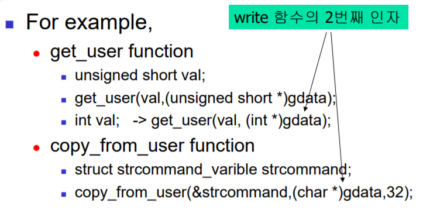

# Chapter 12 Sample device drivers in Linux

주요 개념

- Linux GPIO
- Linux Memory related function
- Led Driver
- Vibrator Driver

## Linux GPIO

Embedded Linux에서 프로세서에 연결된 GPIO 핀을 사용하기 위해서는 다음과 같은 함수들을 사용할 수 있다.

- **#include <linux/gpio.h>** : gpio 핀 설정에 필요한 헤더
- **int gpio_request(unsigned int gpio, const char *label)** : 해당 GPIO 핀을 사용하겠다고 선언하는 함수이다.
- **void gpio_free(unsigned int gpio)** : 해당 GPIO 핀을 더이상 사용하지 않겠다고 선언하는 함수이다.
- **int gpio_direction_output(unsigned int gpio, int value)** : 해당 GPIO 핀을 출력용으로 사용하도록 설정하는 함수이다.
- **int gpio_direction_input(unsigned int gpio)** : 해당 GPIO 핀을 입력용으로 사용하도록 설정하는 함수이다.
- **void gpio_set_value(unsigned int gpio, int value)** : 해당 GPIO 핀에 신호를 출력하는 함수
- **int gpio_get_value(unsigned int gpio)** : 해당 GPIO 핀이 나타내고 있는 신호를 읽어들이는 함수

## Linux Memory related function

사용자가 read나 write 와 같은 함수에서 사용자 프로그램의 메모리 정보를 전달한다고 해서 이를 디바이스 프로그램 내의 맵핑된 함수들에서 사용할 수는 없다. 사용자 프로그램의 메모리 영역과 커널 프로그램의 영역은 매우 엄격하게 구분되어 있기 때문이다. 따라서 이 2가지 영역 사이에서 데이터를 주고받기 위해서는 이를 지원하는 커널 함수의 도움을 받아야 하는데 다음과 같은 함수들이 존재한다.

- int get_user(void x, void *addr) : 사용자 영역에서의 메모리 addr 에서 sizeof(addr) 만큼의 데이터를 읽어서 val에 저장한다.
- int set_user(void x, void *addr) : val에 있는 내용을 사용자 영역의 메모리 addr에 sizeof(addr) 만큼 쓴다.
- int copy_to_user(void *to, void *from, unsigned long size) : from 에 해당하는 메모리 영역(커널)에서 size 만큼 읽어서 to(유저)에 복사한다.
- int copy_from_user(void *to, void *from, unsigned long size) : from 에 해당하는 메모리 영역(유저)에서 size 만큼 읽어서 to(커널)에 복사한다.

get_user, set_user의 경우 미리 정의된 자료형의 데이털르 주고받는 경우 copy_from_user, copy_to_user보다 더 좋은 성능을 나타낸다.
