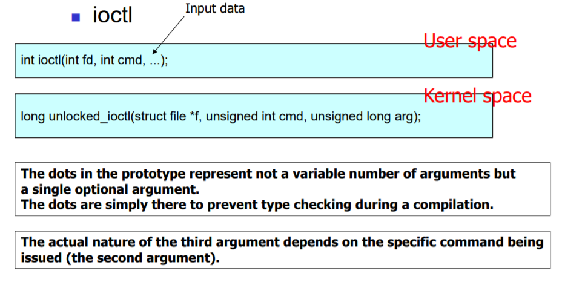
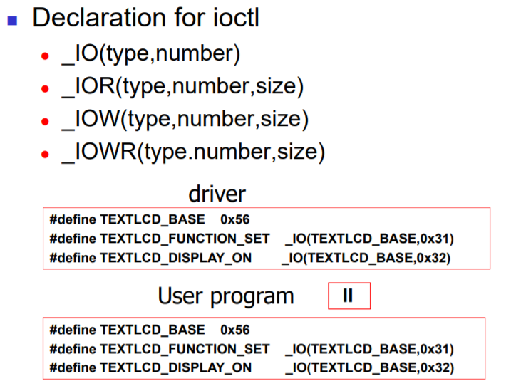
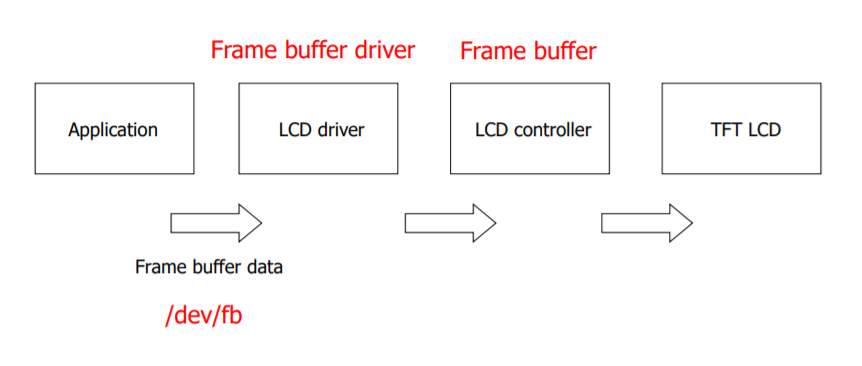
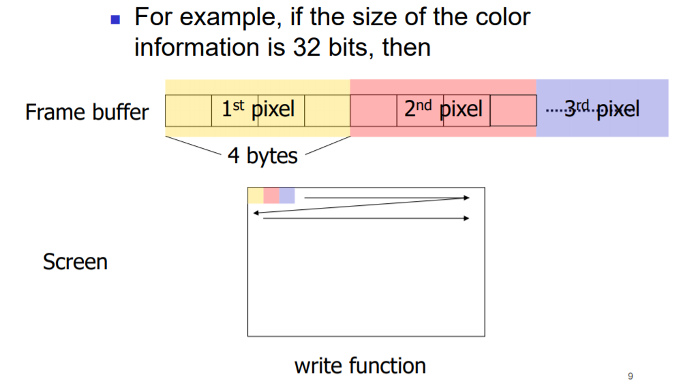
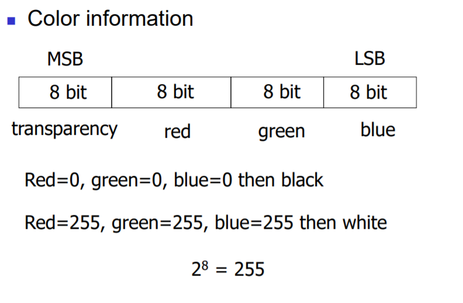
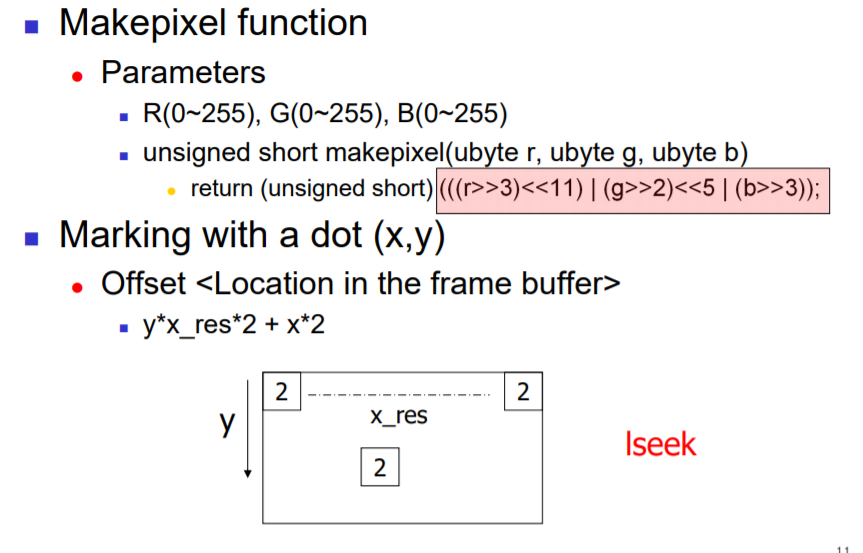
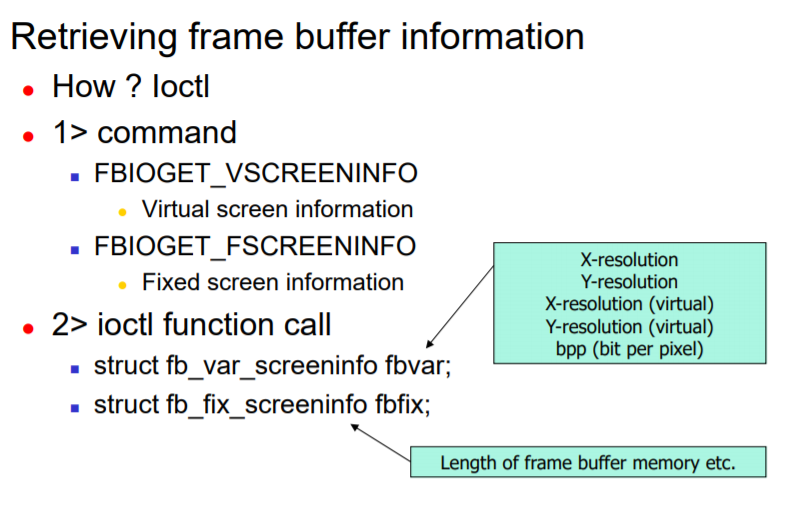
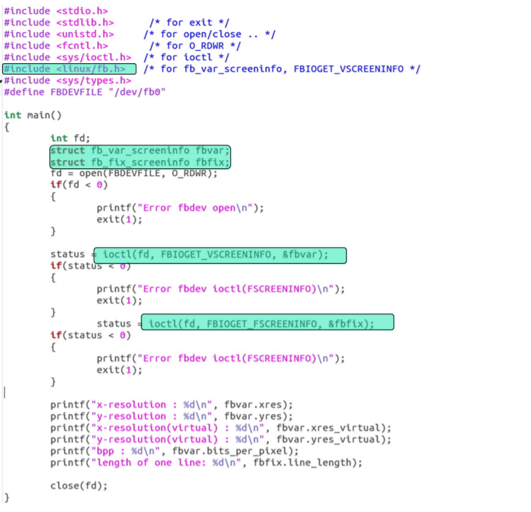

# Chapter13 Linux Device Driver(ioctl)

주요개념

- ioctl : 특정 디바이스에만 적용되는 명령들을 정의하고 수행하는 함수
- Frame buffer  control

## ioctl

ioctl은 특정 장치에만 해당되는 동작을 수행할때 자주 사용되는 함수이다. 사용자 영역에서 ioctl 시스템 호출 선언과 커널 영역에서 이에 대응하는 unlocked_ioctl 함수의 선언은 다음과 같은 형태로 되어있다.



ioctl 함수의 세번째 인자가 ...과 같이 특별한 형태로 되어있다. 이는 컴파일 시 세번째 인자에 대한 type checking을 진행하지 않겠다는 의미이다. 또한 2번째 인자인 cmd에 따라서 3번째 인자에 의미가 부여되는 특별한 형태로 되어있다.

unlocked_ioctl을 작성하기 전에 먼저 cmd에 대입할 명령어에 대한 정의를 작성해야 한다. 이들 명령어는 숫자로 되어 있으며, 커널 시스템 전체에서 unique 해야한다. 이를 관리하기 위해서 **ioctl_number.txt** 라는 파일에 해당 커널에서 사용하는 ioctl cmd 리스트가 기록되어 있다.

### ioctl command number

ioctl의 command 넘버는 다음과 같은 형태로 작성된다.

- type : Device Driver마다 사용될 ioctl의 기본이 되는 base number의 역할을 한다. 다시 특정 ioctl command에 대응하는 명령어 숫자들은 이 type 숫자에 일련번호(number)를 추가하는 형태로 작성한다. 이 숫자는 커널내에서 유일해야 하며 따라서 ioctl_number.txt 파일을 참고해서 작성해야 한다.
- Number : 위에서 정의한 Type에 덧붙여서 개개의 ioctl command를 구분하는 일련번호의 일을 수행한다.
- Direction : 경우에 따라서 데이터가 흘러가는 방향을 추가적으로 ioctl command number에 나타낼 수 있다.
- size : 또한 주고받는 데이터의 사이즈를 나타낼 수도 있다.

이러한 ioctl command number는 다음과 같은 매크로 함수를 통해서 생성한다.



위 #define 문에서 데이터의 이동 방향이나, size는 커널과 사용자 프로그램에게 약간의 정보를 제공하기 위해 사용된다. 또한 위에서 정의한 ioctl command number는 디바이스 드라이버 뿐만 아니라 이를 이용하는 사용자 프로그램에서도 정의해야 한다. 보통 이 정의들을 헤더로 묶어서 이 헤더를 인클루드 하는 방식을 사용한다.

## Frame buffer control

모든 그래픽 디스플레이 시스템은 video/display contoller를 가지고 있다. 이 controller 내부에서는 **frame buffer** 라고 알려진 메모리 영역을 가지고 있는데, 이는 화면에서 보여지는 이미지를 픽셀 형태로 나눈뒤 배열 형태로 나타낸 것을 의미한다. 픽셀은 디스플레이의 한 기본 영역에서의 color 정보를 가지고 있다.



Frame buffer driver는 display controller 를 작동 시켜서 내부의 frame buffer를 조작하는 일을 수행한다. 리눅스에서 디스플레이 장치는 보통 `/dev/fb` 라는 이름의 장치 파일로 식별된다.




픽셀은 2바이트, 4바이트, 8바이트 등으로 다양하게 표현될 수 있다. 4바이트로 표현되는 경우 투명도, r, g, b 값을 각 1바이트가 나타내게 된다.



우리가 살펴볼 예제에서는 각 픽셀을 2바이트 값으로 나타내며 상위 5비트는 R, 그 다음 6비트는 G, 하위 5비트는 B를 표현하도록 한다. 2바이트 내에서 각 1바이트의 컬러 값들을 집어넣기 위해 위와 같은 함수를 정의할 수 있다.

### 화면에 빨간색 칠하기 예제

```c
#define FBDEVFILE "/dev/fb"
unsigned short makepixel(ubyte r, ubyte g, ubyte b)
{
    return (unsigned short)(((r>>3)<<11)|((g>>2)<<6)|(b>>3));
}
int main()
{
    int fd;
    int status;
    unsigned short pixel;
    int offset;
    fd = open(FBDEVFILE, O_RDWR);
    if(fd < 0)
    {
        printf("Error fbdev open ₩n");
        exit(1);
    }
    /* red pixel @ (50,100) */
    offset = 100*COLS*2 + 50*2;
    if(lseek(fd, offset, SEEK_SET) < 0)
    {
        printf("Error fbdev lseek₩n");
        exit(1);
    }
    pixel = makepixel(255,0,0); /* red pixel */
    write(fd, &pixel, 2); /* write 2byte(16bit) */
    close(fd);
    exit(0);
    return 0;
}
```

### ioctl을 통해서 Frame Buffer의 정보 구하기



