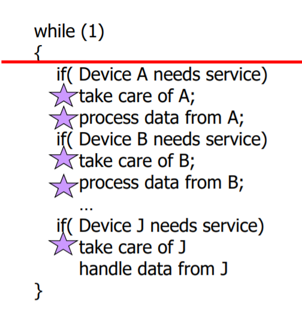
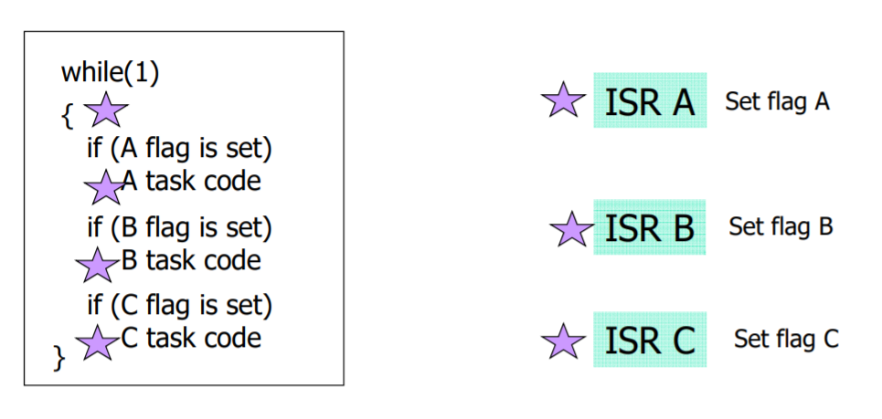
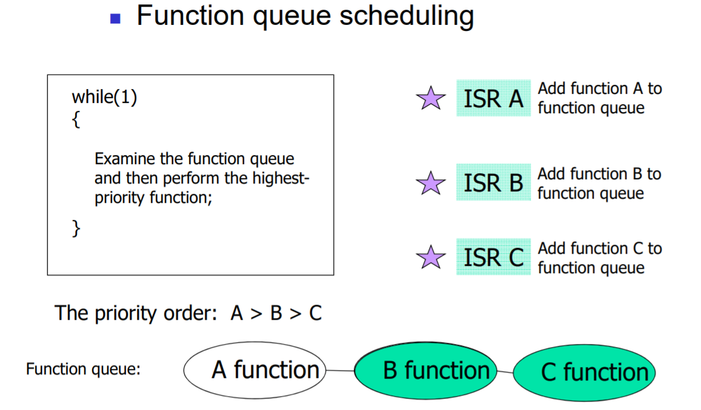
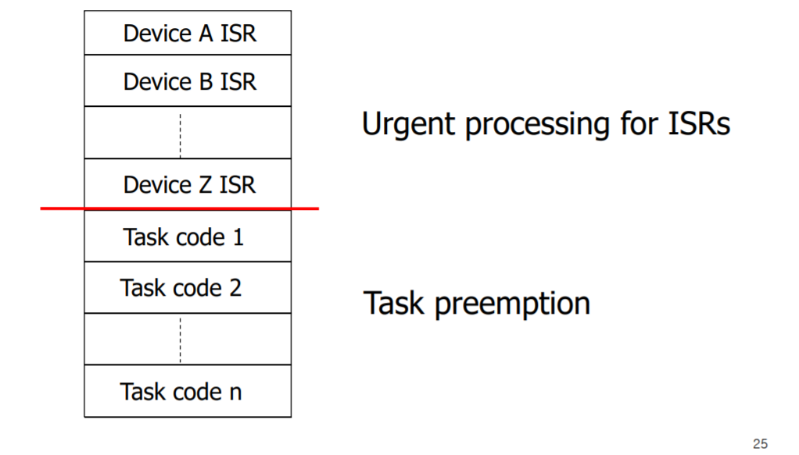

# Embedded Software

## 임베디드 시스템의 정의

임베디드 시스템은 `특정한 기능`을 수행하기 위하여 `하드웨어` 와 `소프트웨어`를 조합한 형태의 시스템이다.

특정 목적만으로 제작된 `하드웨어`를 사용하는 것이 대부분이기 때문에 일반용도의 `pc`와는 다르게 하드웨어 스펙이 제품마다 다르며, 이 때문에 임베디드 시스템을 구축할 `하드웨어`를 이해하는 것이 중요하다.

또한 `하드웨어` 아키텍쳐 위에서 실행될 수 있는 `소프트웨어` 아키텍쳐를 이해하는것 역시 중요하다.

임베디드 시스템에는 다음과 같은 특징들이 존재한다.

- 하드웨어와 소프트웨어의 결합
- 특정 목표로 만들어지는 시스템 (Dedicated function)
- Cross development platform
- 다른 시스템의 일부로 존재
- Real Time Feature

## 임베디드 시스템의 특징

### 1. `하드웨어` + `소프트웨어`

앞서 이야기한대로 임베디드 시스템은 특수한 목적을 가지고 개발되기 때문에 어떤 목적이냐에 따라서 사용하는 하드웨어들이 달라진다. 그에 따라서 사용할 수 있는 자원의 크기, 마이크로프로세서의 성능, 주변기기 등을 파악하는 것이 시스템을 구축하는 데에 있어서 중요한 사항이 된다.

이러한 하드웨어 스펙에 더불어 그 위에서 동작할 수 있는 소프트웨어에 대한 이해도 중요해진다.

### 2. Dedicated Function(Special-purpose system)

일반 `pc`와 다르게 `임베디드 시스템`은 군사, 의학, 가전기기 등등 특수한 이용목적이 정해진 시스템을 개발하기 위하여 사용된다.

### 3. Cross development platform

임베디드 시스템은 pc와 같은 다른 머신에서 개발된 다음 해당 시스템이 실행될 머신 위에 이동시키는 방법으로 구축한다. 이 때 개발을 진행하는 머신을 `호스트`, 시스템이 실행될 머신을 `타겟`이라고 한다.

`호스트`에서 개발된 프로그램을 `타겟`으로 옮기기 위해서는 이 둘을 연결해줄 케이블이 필요하다. 다양한 종류가 있을 수 있는데, 현재에는 `USB` 케이블을 보편적으로 사용한다. 이 외에도 `Serial` 케이블이나, `Ethernet` 케이블 등, 두 개의 머신을 연결 시킬 수 있는 다양한 케이블을 사용할 수 있다.

특별히 `JTAG` 케이블에 대해서 알아보자. 이 케이블의 특별한 점은 바로 `Fusing` 기능이라고 불리는 `Rom writing`이 가능하다는 것이다. 임베디드 시스템에서는 주로 `플래시 메모리`를 저장장치로 사용한다. `JTAG` 케이블은 바로 이 `플래시 메모리`에 바로 writing이 가능하다. 이와 같은 특징은 임베디드 하드웨어가 아무런 프로그램이나 데이터 정보가 없을 때 유용하게 사용할 수 있다. 호스트와 타겟을 `usb`로 연결하기 위해서는 적어도 `usb` 커넥션을 지원하는 프로그램이 존재해야 하는데, 이마저도 없는 깨끗한 하드웨어일 경우 `usb` 연결이 불가능하다. 바로 이때 `JTAG` 케이블을 이용하여 플래시에 곧바로 writing을 수행하여 하드웨어에 `usb` 커넥션 프로그램과 같은 적절한 데이터를 입력시킬 수 있다.

### 4. 다른 시스템의 일부로 존재

임베디드 시스템은 종종 다른 시스템의 일부로서 존재할 수 있다. pc의 키보드나 자동차의 제동장치 시스템의 예를 들 수 있다.

### 5. Real-Time Feature

임베디드 시스템은 특수한 목적을 위해서 구축된다고 하였다. 이러한 특수 목적들은 보통 `정해진 시간` 내에 실행되어야 하는 제약들이 있다. 우주선이나 군사 미사일의 경우 정해진 시간내에 궤도를 계산해야 하는 제약이 존재한다. 이러한 dead line이 임베디드 시스템의 또다른 특징이다.

이러한 데드라인이 지켜지지 않았을 때의 피해정도로 시스템을 분류할 수 있다.

- Hard Realtime : miss가 매우 큰 영향
- Soft Realtime : miss가 경미한 영향

## Embedded software architecture

- Round Robin
- Round Robin with Interrupt
- Function queue scheduling
- Real-time operating system
- Embedded Linux

### Device Handling의 두 단계

- Device check routine : 디바이스에서 어떤 신호를 발생시키는지를 확인한다. 디바이스에 발생한 신호를 처리하는 것을 Interrupt Service Routine(ISR)라고 한다. 디바이스에서 신호가 발생한 뒤 빠른 시간내에 ISR를 실행하는 것이 중요하며, ISR 실행시간 역시 짧은 것이 좋다.
- Data processing routine : 디바이스에서 데이터를 읽어내어 처리한다. Task routine 이라고 한다. 주로 ISR보다 긴 시간이 사용된다.

### Round Robin 방식

말 그대로 모든 디바이스 장치에 대해서 돌아가면서(Round Robin) 확인하고 데이터를 처리하는 것이다. 가장 간단한 형태이다. 가장 간단한 형태이니만큼 간단한 시스템에서만 사용된다. 예를 들어 A~J까지의 10개의 장치가 존재하고 각 장치의 ISR가 1ms, 각 장치로부터의 task routine 처리 시간이 100ms라면, J장치에서 신호가 발생했을때 J 장치의 ISR를 처리하는 시간은 909ms가 지난 후이다(현재 프로그램 코드가 빨간색 선에 있다고 가정했을때). 이 같은 구조는 ISR의 처리시간을 매우 많이 지연시킬 수 있는 구조이다.

### Round Robin with Interrupt 방식

하드웨어에서 신호가 발생했을 때 해당 장치의 신호를 처리하는 ISR가 Interrupt하여 ISR가 우선 처리되도록 하는 방식. 특정 장치에 대한 인터럽트 처리를 함수로 떼어내어 처리한다. 그리고 이에 대한 우선순위를 높게 부여한다. 하드웨어에서 인터럽트가 발생했을때, 해당 하드웨어의 ISR가 프로그램 실행을 preemption한다.  
여기서 각 ISR간의 priority가 있을 수 있다. 그러나 task routine간의 priority는 모두 동일하기 때문에, 각 task routine은 FIFO 순서대로 처리된다.

### Function Queue Scheduling 방식

task routine 간에도 priority를 부여한 방식이다. task routine도 별도의 function 형태를 갖는다. 우선 ISA는 다른 task routine보다 높은 우선순위를 갖는다. 대신 task routine간에도 우선순위가 있어서 높은 우선순위를 갖는 task routine이 먼저 실행된다.  
그러나 task routine간에 `preemption`이 지원되지 않는다. 따라서 낮은 우선순위의 task routine이 매우 긴 시간동안 실행되어야 할 때, 높은 우선순위의 task routine이 function queue에 들어오게 되면 높은 우선순위 task의 실행시간에 영향이 있을수 있다.

### Real-time operating systems

마침내 task routine간의 preemption이 지원되는 형태이다. 스케쥴러가 task의 실행 순서를 결정한다. 특정 task가 정해진 deadline 이내에 실행됨을 보장한다.

### Embedded Linux

원래는 데스크탑 또는 서버 시스템을 위해서 개발된 os이다. 그러나 다음과 같은 장점이 있어서 임베디드 시스템에도 사용하려는 시도가 있다.

- open source
- low cost : 개발, 훈련 및 고용 비용, 로열티 비용이 거의 없다

데스크탑 버전과의 차이

- 데스트탑 버전의 필요없는 기능을 제거하여 사이즈를 줄였다(커널 컴파일)
- 필요한 기능을 추가하기도 한다

## Platform

하드웨어 프로그래밍과 응용프로그램 개발 사이에 또하나의 계층(Platform software)을 추가하여 하드웨어 프로그래밍 환경을 숨기는 것(안드로이드, 타이젠 등등). 따라서 응용프로그래머들이 효과적으로 프로그래밍 할 수 있는 인터페이스를 제공한다.

### Android software stack

1. Linux Kernel : 메모리 관리, cpu 관리, 네트워크 관리 등등..
2. Libraries : c/c++ libraries
3. android run time
4. Application framework : 클래스와 변수 등등
5. Application
