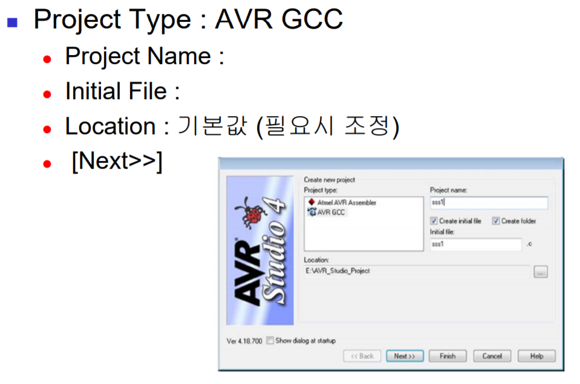

# Progrmming on an embedded system 1

이번 시간부터 실제 임베디드 보드 위에서 프로그래밍 하는 방법들을 배운다.

## 개관

교차 개발환경(cross development programming)에서 프로그래밍 하게 된다.

### 보드 구성


- 프로세서 : Atmega 128
- LED
- FND (7 segment)
- GPIO 핀 : 8개 묶음 6개(A~F) + 5개 묶음 1개(G) = 총 53개의 핀
- BUZZER
- 스위치 2개

### Atmega 128

- RISC(Reduced Instruction Set Computer) 구조
- 133 종 명령어 세트
- 최대 16Mhz, 16 MIPS(Million Instruction Per Second) 성능
- 32개의 8bit 범용 레지스터
- 128KB의 ISP(In System Programming) 방식의 프로그램용 flash memory, 4KB의 SRAM, EEPROM 내장
- GPIO 핀 : 8개 묶음 6개(A~F) + 5개 묶음 1개(G) = 총 53개의 핀. GPIO 핀을 이용해서 하드웨어를 제어하거나 신호를 처리할 수 있다.
- 8개의 외부 인터럽트를 포함한 34개의 인터럽트 벡터 내장. 인터럽트 벡터에는 인터럽트 핸들러의 주소가 저장되어 있다.

### 메모리 구조


- 프로그램 메모리 : 프로그램 코드를 저장하고 실행하기 위해서 필요한 메모리. 시스템을 시작하기 위한 부트 플래시 섹션과, 응용프로그램을 위한 애플리케이션 플래시 섹션으로 나누어져 있다. 16bit 워드가 64K개(즉 128KB)로 구성되어 있다.
- 데이터 메모리 : 프로그램이 실행될 때 임시로 데이터를 저장하는 메모리. 4KB의 SRAM, EEPROM, 8bit 32개 레지스터로 구성됨.

### GPIO

- General Perpose Input Output 헤더 핀을 의미한다. General Perpose이기 때문에 입력으로 사용할 수도 있고, 출력으로 사용할 수도 있다.
- 출력으로 사용시 0과 1의 출력 신호를 임의로 만들어줄 수 있는 구조를 가진다.
- 입력으로 사용할 때는 외부 인터럽트를 처리할 수 있도록 하는 기능이 있을 수 있다.
- 또한 칩의 고유한 기능(UART)으로 사용될수 도 있다.

#### GPIO 레지스터

GPIO 핀의 사용을 결정하려면 해당 핀과 연관된 DDR 레지스터 값을 적절히 설정해야한다. 관련 레지스터는 입출력 방향 전환용 레지스터, 출력용 레지스터, 입력용 데이터 레지스터가 있다. 내부적으로 pull-up 저항을 가지고 있는 경우가 많다.

> AFIO(Alternate Function Input Output) : GPIO로 사용하고 남은 핀들은 칩의 고유 기능으로 사용할 수 있다. 입출력 헤더 핀 위치가 고정적이다.

### Pull Up, Pull Down

입력 핀에 나타나는 floating 현상을 제거하기 위한 방법. 항상 전원에 연결하거나, 항상 그라운드에 연결해서 입력이 없을때 일정한 정의된 상태(defined state)를 유지하게 한다.


### ATmega128 GPIO 관련 레지스터

- DDRx (Data Direction Register) : 각 포트에 대한 데이터 입출력 방향 지정용 레지스터. DDRA~DDRG의 값에 1을 대입할 경우 해당 포트를 출력용으로, 0을 대입할 경우 해당 포트를 입력용으로 사용하게 된다.
- PORTx (Port Output Register) : 데이터 출력 레지스터. 출력을 원하는 포트의 데이터 값을 PORTx 레지스터에 쓰면 됨
- PINx (Port Input Register) : 데이터 입력 레지스터. 포트와 연관된 PINx 값을 읽으면 그것이 현재 입력된 값임.
- SFIOR (Special Function Input Output Register) : SFIOR의 비트2 값을 '1'로 셋팅하면 플업 저항이 비활성화되고(기본 상태), '0'으로 하면 활성화 됨.

> AFIO를 configuration하는 레지스터가 추가될 수 있다. 우리가 공부하는 보드에는 없다.

### 지연 함수

사용자 정의 지연 함수는 다음과 같은 루프 형태로 구현할 수 있다.

```c
void delay(unsinged char i) {
    while(i--);
}

void main(void)
{
    delay(1000);
}
```

MCU 상태, 클럭 속도에 따라 프로그램 수행 시간이 달라질 수 있기 때문에 매우 부정확한 방법이다.

시스템에서 제공하는 지연 함수를 사용하면 보다 정확한 딜레이를 할 수 있다.

```c
#include <util/delay.h>  // 반드시 관련 헤더 파일 인클루드

_delay_ms(unsigned int i);
_delay_us(unsigned int i);
```

### volatile 변수

컴파일러는 최적화를 위해서 코드의 내용을 변경할 수 있다. Genral perpose 프로그램에서는 이러한 최적화가 성능을 향상 시키는데 도움이 될 수 있다. 그러나 임베디드 시스템에서는 이러한 최적화가 오히려 버그의 원인이 될 수 있다.

컴파일러에 의한 최적화를 막기 위해 `volatile` 변수를 사용할 수 있다. 다음과 같은 곳에서 사용될 수 있다.

- 인터럽트 루틴과 메인 루틴에서 같은 변수를 사용하는 경우
- 자동변수의 경우 일정시간 CPU에서 operation을 수행해주기를 원하는 경우
- 코드의 순서를 지키고 싶은 경우
- I/O 레지스터 등을 메모리맵에 매핑시켜서 사용하는 경우

```c
volatile int i, a, b;
a = 0;
b = 0;
for (i = 0; i < 10; i++)
    b += a * 100;       // volatile 키워드가 없다면
                        // b += 0으로 최적화될 수 있음
// -------------------------------------------------

volatile int a;
a = 10;   // volatile이 없다면 최적화로 삭제될 수 있음

a = 20;
```

## 실습 키트와 개발 환경

- AVR Studio 4 설치
- WinAVR 설치
- CP2 102 드라이버 준비(USB 연결을 지원해준다.) : www.silabs.com -> CP210x_VCP_Win_XP_S2K3_Vista_7.exe 다운로드 및 드라이버 설치





## LED


먼저 LED가 어떻게 연결되어 있는지 회로를 확인해야 한다. LED를 켜기 위해서는 LED 신호에 1을 인가해야한다. 어떤 GPIO 연결되어 있는지 확인한 다음, 해당 GPIO와 연관된 레지스터에 값을 쓴다.

```c
#include <avr/io.h>   // ATmega 128 레지스터가 정의되어 있는 곳

int main()
{
    DDRA = 0xFF;  // Port A를 출력용으로 셋팅
    PORTA = 0xFF; // GPIO A를 모두 1로 설정 (LED 켜기)
}
```

## FND : Flexible Numeric Device

7세트먼트 또는 8세그먼트(점 포함) LED. 숫자 또는 알파벳을 표현할 수 있다.


세그먼트를 구성하는 LED는 발광 다이오드로 양 단자의 전압차가 발생하면 빛을 방출한다. 두개의 단자 중 긴 쪽을 애노드(Anode), 짧은 쪽을 캐소드(Cathode)라고 한다.

전체 8개의 세그먼트는 하나의 공통 단자를 공유할 수도 있다. 이 공통 단자가 애노드이면 Anode common, 캐소드이면 Cathode common이라고 한다. 세그먼트의 빛을 발산하기 위해서 Anode common을 사용한다면 나머지 핀에 0을, Cathode common을 사용한다면 나머지 핀에 1을 입력하면 된다.


### FND 회로도


- C 포트에 FND Data 신호가 연결되어 있다.
- G 포트의 하위 4개의 핀에 FND Selection 신호가 연결되어 있다.

### FND (WCN4-0036SR4-C11)

- 4개의 7 Segment를 내장
- 4개의 Segment가 숫자를 나타내는 신호는 공유하고, Selection 신호를 통해서 어떤 순서의 7 Segment가 빛날 것인지를 결정. 한번에 하나의 세그먼트만 빛을 방출할 수 있다(세그먼트를 빠르게 반복하면서 빛을 내어 동시에 빛을 방출하는 듯한 효과를 낼 수도 있음).


#### FND 숫자 표현


#### 프로그래밍

먼저 selection 신호와 연관된 PORTG 레지스터 값을 적절히 설정하여 어떤 세그먼트가 빛을 방출할 것인지 결정한다. 그 다음 PORTC에 적절한 값을 설정하여 숫자를 표현한다.

- 예제 1

```c
#include <avr/io.h>

void main()
{
    unsigned char FND_DATA[19] = {0x3f, 0x06, 0x5b, 0x4f, ...};

    DDRC = 0xff;    // C 포트를 출력용으로 설정
    DDRG = 0x0f;    // G 포트 하위 4개 핀을 출력용으로 설정
    PORTC = FND_DATA[7];    // C 포트는 FND 데이터 신호
    PORTG = 0x01;           // G 포트는 FND 선택 신호
}
```

- 예제 2

```c
#include <avr/io.h>
#define F_CPU 1600000UL
#include <util/delay.h>

unsigned char digit[10] = {0x3f, 0x06, 0x5b, 0x4f, 0x66, 0x6d, 0x7d, 0x27, 0x7f, 0x6f};
unsigned char fnd_sel[4] = {0x01, 0x02, 0x04, 0x04};

int main()
{
    int i = 0;
    DDRC = 0xff;
    DDRG = 0x0f;

    while(1)
    {
        for (i = 0; i < 4; i++)
        {
            PORTC = digit[4 - i];
            PORTG = fnd_sel[i];
            _delay_ms(2);
        }
    }
}
```
