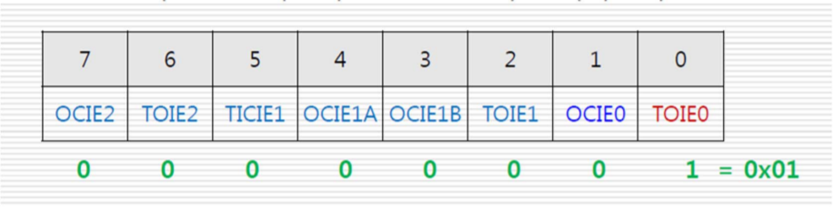

# Programming on an embedded system 2

## 스위치


JKIT-128-1 에서 스위치는 외부 인터럽트를 사용할 수 있는 입출력 포트 PE4, 5에 할당되어 있다. 스위치가 눌려지지 않았을 때 1, 눌렸을 때 0이 되도록 설계되었다(pull-up resister).


외부 이벤트(여기서는 스위치가 눌렸을때)에 대해서 반응하는 방법에는 폴링 방식과 인터럽트 방식이 존재한다. 다음은 폴링 방식으로 스위치를 처리하는 코드이다.

```c
#include <avr/io.h>

int main(void)
{
    DDRA = 0xff;
    DDRE = 0x00;
    while(1)
    {
        if((PINE & 0x10) == 0x00) {
            PORTA = 0xff;
        }
        else {
            PORTA = 0x00;
        }
    }
}
```

## 인터럽트

인터럽트는 외부 이벤트에 대해서 비동기적인 처리를 가능하게 한다. 폴링 방식은 외부 이벤트가 발생할 때까지 다른 작업을 수행하지 않고 기다리는 방식이라면, 인터럽트 방식은 외부 이벤트가 발생할 전에는 다른 작업을 수행하면서, 이벤트가 발생하는 시점에서 이벤트를 처리하는 방식이다.

### ATmega128 인터럽트

리셋 포함 총 35개의 인터럽트 벡터를 가진다. 외부핀을 통한 외부 인터럽트는 8개를 사용할 수 있다.

> 인터럽트 벡터(Interrupt Vector) : 인터럽트를 처리할 수 있는 서비스 루틴들의 주소를 가지고 있는 공간

### 외부 인터럽트의 트리거

인터럽트 발생의 유무를 판단하는 근거


- edge trigger : 입력신호가 변경되는 순간을 인터럽트 트리거로 사용하는 경우
  - 하강 에지(Falling edge) 트리거 : high에서 low로 변경되는 시점
  - 상승 에지(rising edge) 트리거 : low에서 high로 변경되는 시점
- level trigger : 입력신호가 일정 시간 동안 원하는 레벨을 유지하면 트리거하는 경우. 평상시 high로 있다가 low로 변환되어 일정시간 유지되면 트리거함.

### ATmega128 인터럽트 설정 과정

1. SREG 설정 : 전체 인터럽트 허용 세팅
2. EIMSK 설정 : 인터럽트 가능 비트 세팅
3. EICRA, EICRB 설정 : level or edge trigger 설정

#### SREG

ALU 연산 후 결과와 상태를 표시하는 레지스터임. 인터럽트의 경우 제어 레지스터의 의미를 가짐.


#### EIMSK(External Interrupt Mask register)

외부 인터럽트의 개별적인 허용 설정. INTn 값이 1로 설정되면 외부 인터럽트 활성화.


#### EICRA, EICRB

외부 인터럽트의 트리거 설정. 8개의 인터럽트마다 2개의 비트가 필요하기 때문에 EICRA, EICRB 2개의 레지스터로 설정.

EICRA : 외부 인터럽트 0~3 을 위해 사용됨.


EICRB : 외부 인터럽트 4~7 을 위해 사용됨.


### ISR 등록


위 그림과 같은 방식으로 ISR을 등록할 수 있다. 인터럽트가 발생하면 무조권 분기하여 실행되기 때문에 ISR은 간결하게 작성해야 한다. 그렇지 않으면 다른 Task의 실행이 지연될 수 있기 때문이다.

### 스위치 예제 프로그램

```c
#include <avr/io.h>
#include <avr/interrupt.h>
#define F_CPU 1600000UL
#include <util/delay.h>

unsigned char digit[10] = {0x3f, 0x06, 0x5b, 0x4f, 0x66, 0x6d, 0x7c, 0x07, 0x7f, 0x67};
unsigned char fnd_sel[4] = {0x01, 0x02, 0x04, 0x08};
volatile int count = 0;

ISR(INT4_vect) {
    count++;
    _delay_ms(100); // debouncing
}

void display_fnd(int count) {
    int i, fnd[4];
    fnd[3] = (count / 1000) % 10;
    fnd[2] = (count / 100) % 10;
    fnd[1] = (count / 10) % 10;
    fnd[0] = count % 10;

    for (i = 0; i < 4; i++) {
        PORTC = digit[fnd[i]];
        PORTG = fnd_sel[i];
        _delay_ms(2);
    }
}

int main()
{
    DDRC = 0xff;
    DDRG = 0x0f;
    DDRE = 0xef;    // PE4 번 핀을 입력으로 설정
    EICRB = 0x02;   // falling edge triger 설정
    EIMSK = 0x10;   // INT4 인터럽트 허용
    SREG |= (1 << 7);   // 전체 인터럽트 허용
    while(1)
        display_fnd(count);

    return 0;
}
```

### 스위치 실습

SW1을 한 번 누르면 Start하고 다시 누르면 Stop하며, SW2를 누르면 초기화되는 1/100 스톱워치 만들기

```c
#include <avr/io.h>
#include <avr/interrupt.h>
#define F_CPU 1600000UL
#include <util/delay.h>

typedef unsigned char uc;

const uc digit[10] = {0x3f, 0x06, 0x5b, 0x4f, 0x66, 0x6d, 0x7c, 0x07, 0x7f, 0x67};
const uc fnd_sel[4] = {0x01, 0x02, 0x04, 0x08};
const uc dot = 0x80;
uc num[4] = {digit[0], digit[0] + dot, digit[0], digit[0]};
volatile int i, j, k, n;
volatile int stop_flag = 1;

// start, stop 버튼 (SW1)
ISR(INT_vect4) {
    stop_flag = (stop_flag) ? 0 : 1;
    _delay_ms(100); // debouncing
}

// 스톱워치 reset 버튼 (SW2)
ISR(INT_vect5) {
    i, j, k, n = 0;
    num[0] = num[2] = num[3] = digit[0];
    num[1] = digit[0] + dot;
    stop_flag = 1;
}

void printNum(const uc* _num) {
    int i;

    for (i = 0; i < 4; i++) {
        PORTC = _num[i];
        PORTG = fnd_sel[4 - i];
        _delay_us(2500);    // 2.5 ms * 4 = 10ms
    }
}

int main() {

    DDRC = 0xff;
    DDRG = 0x0f;

    // PE4, 5 핀 인터럽트 설정
    DDRE = 0xcf;        // 0b1100 1111
    EICRB = 0x0a;       // 0b0000 1010, edge triger 설정
    EIMSK = 0x30;       // 0b0011 0000, 인터럽트 허용
    SREG |= (1 << 7);   // 전체 인터럽트 허용

    for (i = 0; ; i++) {
        if (i == 10)
            i = 0; // 99.99초에서 초기화
        num[0] = digit[i];
        for (j = 0; j <10; j++) {
            num[1] = digit[j] + dot; // 2번째 숫자는 점(dot) 포함
            for (k = 0; k < 10; k++) {
                num[2] = digit[k];
                for (n = 0; n < 10; n++) {
                    num[3] = digit[n];
                    do {
                        printNum(num);
                    } while(stop_flag);
                }
            }
        }
    }
    return 0;
}
```

2번째 구현

```c
#include <avr/io.h>
#include <avr/interrupt.h>
#define F_CPU 1600000UL
#include <util/delay.h>

typedef unsigned char uc;

const uc digit[10] = {0x3f, 0x06, 0x5b, 0x4f, 0x66, 0x6d, 0x7c, 0x07, 0x7f, 0x67};
const uc fnd_sel[4] = {0x01, 0x02, 0x04, 0x08};
const uc dot = 0x80;
uc num[4] = {digit[0], digit[0] + dot, digit[0], digit[0]};
volatile int i, j, k, n;
volatile int stop_flag = 1;
volatile int reset_flag = 0;

// start, stop 버튼 (SW1)
ISR(INT_vect4) {
    stop_flag = (stop_flag) ? 0 : 1;
    _delay_ms(100); // debouncing
}

// 스톱워치 reset 버튼 (SW2)
ISR(INT_vect5) {
    reset_flag = 1;
    _delay_ms(100); // debouncing
}

void printNum(const uc* _num) {
    int i;

    for (i = 0; i < 4; i++) {
        PORTC = _num[i];
        PORTG = fnd_sel[4 - i];
        _delay_us(2500);    // 2.5 ms * 4 = 10ms
    }
}

void reset() {
    i, j, k, n = 0;
    num[0] = num[2] = num[3] = digit[0];
    num[1] = digit[0] + dot;
    reset_flag = 0;
    stop_flag = 1;
}

int main() {

    DDRC = 0xff;
    DDRG = 0x0f;

    // PE4, 5 핀 인터럽트 설정
    DDRE = 0xcf;        // 0b1100 1111
    EICRB = 0x0a;       // 0b0000 1010, edge triger 설정
    EIMSK = 0x30;       // 0b0011 0000, 인터럽트 허용
    SREG |= (1 << 7);   // 전체 인터럽트 허용

    for (i = 0; ; i++) {
        if (i == 10)
            i = 0; // 99.99초에서 초기화
        num[0] = digit[i];
        for (j = 0; j <10; j++) {
            num[1] = digit[j] + dot; // 2번째 숫자는 점(dot) 포함
            for (k = 0; k < 10; k++) {
                num[2] = digit[k];
                for (n = 0; n < 10; n++) {
                    num[3] = digit[n];
                    if (reset_flag) {
                        reset();
                    }

                    do {
                        printNum(num);
                    } while(stop_flag);
                }
            }
        }
    }
    return 0;
}
```

실습 코드

```c
/* switch example */

#include <avr/io.h>
#include <avr/interrupt.h>
#define F_CPU 16000000UL
#include <util/delay.h>

#define START 1
#define STOP 0

typedef unsigned char uc;
const uc digit[10] = {0x3f, 0x06, 0x5b, 0x4f, 0x66, 0x6d, 0x7d, 0x27, 0x7f, 0x6f};
const uc fnd_sel[4] = {0x01, 0x02, 0x04, 0x08};
const uc dot = 0x80;

volatile int count = 0;
volatile int signal = 0;

ISR (INT4_vect) {
    if (signal == START) {
        signal = STOP;
    } else {
        signal = START;
    }
    _delay_ms(100);
}

ISR (INT5_vect) {
    if (signal == STOP) {
        count = 0;
    }
    _delay_ms(100);
}

void display_fnd(int count) {
    int i;
    uc fnd[4];
    fnd[3] = digit[(count / 1000) % 10];
    fnd[2] = digit[(count / 100) % 10] + dot;
    fnd[1] = digit[(count / 10) % 10];
    fnd[0] = digit[count % 10];

    for (i = 0; i < 4; i++) {
        PORTC = fnd[i];
        PORTG = fnd_sel[i];
        _delay_us(2500);
    }
}

int main() {

    DDRC = 0xff;
    DDRG = 0x0f;

    // PE4, 5 �� ���ͷ�Ʈ ����
    DDRE = 0xcf;        // 0b1100 1111
    EICRB = 0x0a;       // 0b0000 1010, falling edge triger ����
    EIMSK = 0x30;       // 0b0011 0000, ���ͷ�Ʈ ���
    SREG |= (1 << 7);   // ��ü ���ͷ�Ʈ ���


    for(;;) {
        display_fnd(count);
        if (signal == START) {
            count = (count + 1) % 10000;
        }
    }

    return 0;
}
```

## 버저(Buzzer), 타이머/카운터

### 개요

Passive Buzzer : DC Pulse에 반응하여 소리를 냄. DC Pulse의 주파수 형태에 따라서 다른 소리를 생성한다.


JKIT-128-1 보드에서 PB 4번에 연결되어 있다.

단순한 버저 울리기 프로그램

```c
#include <avr/io.h>
#define F_CPU 1600000UL
#include <util/delay.h>

int main() {

    DDRB = 0x10;

    for(;;) {
        PORTB = 0x10;
        _delay_ms(1);
        PORTB = 0x10;
        _delay_ms(1);
    }

    return 0;
}
```

#### 버저를 이용해서 음계를 표현하려면 어떻게 해야할까


도를 내려면 어떻게 해야할까? : 도의 파장은 1/1046.6 = 955&micro;s. 따라서 버저에 478&micro;s 를 high로 유지하고, 478&micro;s 를 low로 유지하면 된다.

#### how

1. Timer 주기 설정
2. 정해진 시간(478&micro;s) 이 후 인터럽트 발생
3. 인터럽트 핸들러에서 on/off 설정

### 타이머/카운터


- **타이머** : MCU 내부 클럭을 세는 장치. MCU 내부 클럭을 세어 일정 간격의 펄스를 만들거나, 일정 시간 경과 후 인터럽트를 발생 시키는 경우 사용.
- **카운터** : MCU 외부에서 들어오는 클럭을 세는 장치. 외부 핀을 통해서 들어오는 펄스를 세어 특정 값이 되거나 Overflow가 되는 경우 인터럽트를 발생.

#### ATmega128의 타이머/카운터

총 4개의 타이머/카운터가 존재

- 타이머 0, 2 : 8비트 타이머로 서로 기능 유사
- 타이머 1, 3 : 16비트 타이머로 서로 기능 유사
- 인터럽트 기능
  - 오버플로우(overflow) 인터럽트 : 카운트 값이 오버플로우가 되는 경우 발생
  - 출력 비교(Output Comparison) 인터럽트 : 카운트 값이 출력 비교 레지스터의 값과 같게 되는 경우 발생

#### 8비트 타이머/카운터의 특징

- 4개의 타이머/카운터 중 0번 2번에 해당
- 비동기 동작모드의 8bit up/down 카운터
- 8비트 카운터 : 총 0~255까지 셀 수 있음
- 10비트 프리스케일러
- 각종 인터럽트 기능 보유
  - Normal mode : 카운터가 오버플로우될 때 인터럽트 발생
  - CTC mode : 카운터 값과 출력비교 레지스터(OCR)값을 비교하여 동일하면 인터럽트 발생.

#### 프리스케일러(Prescaler)

고속의 클럭에 의해서 발생하는 문제를 해결하기 위해서 클럭을 분주하여 더 긴 주기를 갖는 클럭을 생성하는 방법.

고속 클럭의 문제점 : ATmega128은 16Mhz 주파수의 클럭을 가지고 있음. 62ns의 주기를 같은 클럭을 8bit 타이머로 256까지 세어봤자 16&micro;s 까지만 확인할 수 있다.

10비트 프리스케일러를 이용해서 한 클럭의 주기(62ns)를 최대 1024배 할 수 있다(한 클럭의 주기가 63ms로 확장된다). 이를 활용하여 8비트 카운터로 최대 16ms 크기의 타이머를 만들 수 있다.

> 분주(나눌 分, 두루 周) : 전파의 주파수를 1/n 하는 일. 이때 n을 분주비라고 한다.

### 8bit 타이머/카운터 관련 레지스터

- TCCR : Prescaler를 활용한 클럭 주기 설정
- TCNT : 처음에 카운터에 설정할 값 지정
- TIMSK : 인터럽트 허용 설정

#### TCCRn (Timer/Counter Control Register n)


- 타이머/카운터 제어레지스터
- 동작모드, 프리스케일러 등 타이머/카운터의 전반적인 동작을 설정한다.


#### TCNTn (Timer/Counter Register n)

- 8비트는 n=0, 2
- 타이머의 카운트값을 저장하는 레지스터
- Read/Write 둘 다 가능
- TCNT 값이 오버플로우 되면 자동으로 0으로 클리어되고, 분주된 주기마다 1씩 값 증가

#### TIMSK (Timer Interrupt Mask Register)

타이머/카운터 0, 1, 2 에 대한 인터럽트를 enable 설정하는 레지스터



- TOIE0(비트0) : 오버플로우에 대한 인터럽트 허용
- OCIE0(비트1) : 출력비교 인터럽트에 대한 허용

### 타이머로 원하는 시간 세팅하는 방법

1. Prescaler 값을 정하여 타이머의 기본 주기 계산. ex) TCCR0 = 0x03으로 설정하면 32분주. 따라서 한 클럭의 주기는 2&micro;s.
2. 100&micro;s의 타이머를 설정하려면 100/2 = 50 클럭이 필요. 따라서 TCNT0에 (256-50) = 206 설정.
3. TIMSK의 관련 인터럽트 필드를 1로 설정하면 됨.

#### '도' 음계 내기

- '도'음의 주파수는 1046.6 Hz. 즉 주기가 956&micro;s. 따라서 버저를 478&micro;s 동안 high로 설정하고, 478&micro;s 동안 low를 유지하면 된다.
- 478&micro;s 를 체크하는 타이머/카운트를 설정하여 인터럽트 발생때마다 on/off를 설정해주면 된다.
- 478&micro;s 타이머/카운터를 설정하기 위해서 일단 TCCR0 = 0x03으로 설정하여 32분주 프리스케일러로 설정. 그 결과 한 클럭의 주기가 2&micro;s인 타이머를 생성할 수 있다.
- 478&micro;s를 세려면 478 / 2 = 239 클럭이 필요. 따라서 TCNT0 값을 (256-239) = 17로 설정.
- 마지막으로 TIMSK 레지스터 값을 0x01로 설정하여 타이머/카운터0 을 오버플로우 인터럽트 enable로 설정하면 된다.

#### 32분주 프리스케일러 타이머/카운터 사용시 음계에 따른 TCNT0값


#### 예제 프로그램

```c
#include <avr/io.h>
#include <avr/interrupt.h>
#define ON 1
#define OFF 0
#define DO_data 17

volatile int state = OFF;

ISR(TIMER0_OVF_vect) {
    if (state == ON) {
        PORTB = 0x00;
        state = OFF;
    }
    else {
        PORTB = 0x10;
        state = on;
    }
    TCNT0 = DO_data;
}

int main() {

    DDRB = 0x10;
    TCCR0 = 0x03; // 32 분주 설정
    TIMSK = 0x01; // 타이머0 오버플로우 인터럽트 설정
    TCNT0 = DO_data;
    sei();        // 전역 인터럽트 설정. SREG |= 1 << 7과 동일

    while(1);

    return 0;
}
```

#### 버저 실습 : 음악 출력

- 박자를 출력해야하기 때문에 타이머가 하나 더 필요
- 1박자를 1초라고 가정했을 때(60bpm), 1초를 카운트 할 수 있는 타이머가 필요. 8bit 타이머/카운터로는 최대 16ms까지밖에 셀 수 없기 때문에 16bit 카운터(타이머/카운터1)를 사용해야함
- 1024 분주를 사용했을 때 클럭의 1주기는 64&micro;s. 16비트 카운터를 이용하면 64&micro;s x 2^16 = 4.194s까지 카운트 할 수 있다.
- 1초를 카운트 하기 위해서는 1,000,000 / 64 = 15,625 클럭이 필요. 따라서 TCNT1 값에 (2^16 - 15,625) 값을 설정하면 1초마타 인터럽트를 얻을 수 있다.

> 음악 출력

```c
/* playing children's song */

#include <avr/io.h>
#include <avr/interrupt.h>
#define F_CPU 16000000UL
#include <util/delay.h>

#define ON 1
#define OFF 0

#define DO 17
#define RE 43
#define MI 66
#define FA 77
#define SOL 97
#define LA 114
#define TI 129
#define UDO 137

typedef unsigned char uc;

//const uc melody[8] = {DO, RE, MI, FA, SOL, LA, TI, UDO};
/* mountain rabbit
const uc melody[] = {SOL, MI, MI, SOL, MI, DO, RE, MI, RE, DO, MI, SOL, UDO, SOL, UDO, SOL, UDO, SOL, MI, SOL, RE, FA, MI, RE, DO};
*/

/* my face like apple */
const uc melody[] = {DO, RE, MI, MI, FA, MI, RE, RE, MI, FA, FA, SOL, FA, MI, MI, FA, SOL, SOL, UDO, LA, SOL, SOL, DO, RE, MI, MI, RE, DO};

volatile int mel_idx = 0;
volatile int state = OFF;

ISR (TIMER0_OVF_vect) {
    if (state == ON) {
        PORTB = 0x00;
        state = OFF;
    }
    else {
        PORTB = 0x10;
        state = ON;
    }
    TCNT0 = melody[mel_idx];
}

ISR (INT4_vect) {
    TIMSK ^= 0x01;
    _delay_ms(10);
}


ISR (INT5_vect) {
    mel_idx = (mel_idx + 1) % 8;
    _delay_ms(10);
}


int main()
{
    DDRB = 0x10;
    DDRE = 0xCF;
    EICRB = 0x0a;
    EIMSK = 0x30;

    TCCR0 = 0x03; // 32 ���� ����
    TIMSK = 0x01; // Ÿ�̸�0 �����÷ο� ���ͷ�Ʈ ����

    TCNT0 = melody[mel_idx];

    sei();

    while(1) {
        mel_idx = (mel_idx + 1) % 28;
        _delay_ms(1000);
    }

    return 0;
}
```
