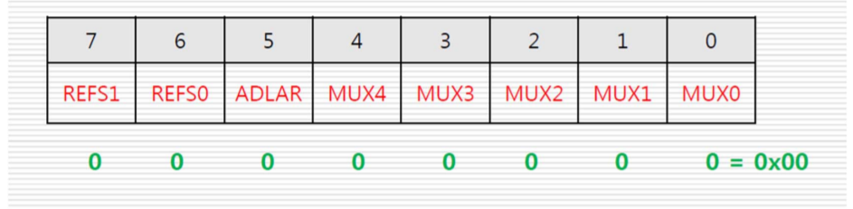

# Promgramming_on_an_embedded_system3

## 광센서, A/D 컨버터

### CdS 센서

황화카드뮴 센서. 빛이 밝으면 내부 저항이 내려가고, 빛이 어두워지면 내부 저항이 올라가는 성질을 가지고 있음.


빛의 양에 따라서 저항값이 달라지는 가변저항의 역할을 하기 때문에 특정 시점에서 달라지는 전압값을 이용하여 빛의 양을 측정할 수 있다.

전압값은 아날로그 물리량이다. 이를 마이크로프로세서에서 처리하기 위해서는 디지털 값으로 변환해야한다. 이와 같은 기능을 하는 것이 A/D Converter(Analog Digital Converter)이다.

### A/D 컨버터

아날로그 데이터를 직렬 또는 병렬 디지털 데이터로 변환하는 장치. 측정하려는 아날로그 물리량의 범위 및 시스템의 응용 목적에 따라서 적절한 정밀도와 분해능을 갖는 컨버터를 사용한다.

#### 분해능(Resolution)

- 디지털 데이터를 한 단위 변화시키기 위한 아날로그 입력의 최소 변화
- n비트 컨버터의 경우 표현할 수 있는 최소 데이터 범위는 1/(2^n)

#### 변환시간(Conversion time)

아날로그 데이터를 디지털 데이터로 변환시키는데 걸리는 시간. 초당 샘플링 개수 (샘플링 속도)로 표현된다.

> jkit-128-1 에서는 10비트 분해능, 13~260&micro;s (50 khz ~ 1Mhz) 의 성능을 갖는 A/D 컨버터 사용

### ATmega128에서 A/D 컨버터 관련 레지스터

- **ADMUX** : A/D 컨버터 멀티플렉서 선택 레지스터
- **ADCSRA** : A/D 컨버터 제어 및 상태 레지스터A
- **ADCH, ADCL** : A/D 컨버터 데이터 레지스터

### ADMUX (ADC Multiplexer Selection Register)

- ADC 모듈의 기준 전압 설정
- 변환된 데이터의 정렬 설정
- ADC 모듈의 아날로그 입력 채널 설정



> 우리가 사용할 jkit-128-1 에서는 이 레지스터를 0으로 설정하여 특별히 해줄 것이 거의 없다.

#### REFS1, REFS2 (비트 7, 6)

Reference Selection Bit. ADC 모듈의 기준 전압 설정 비트. jkit-128-1 모듈에서는 5V (AREF) 만 사용할 수 있다.


#### ADLAR (비트 5), MUX 4~0 (비트 4~0)

- ADLAR : ADC Left Adjust Result. 변환된 데이터를 ADCH, ADCL 16비트 상에서 왼쪽으로 정렬할 것인지를 설정하는 비트.
- MUX 4~0 : Analog Channel and Gain Bit. 아날로그 입력 채널 선택. 설정할 필요 없음.


### ADCSRA (ADC Control and Status Register A)

ADC 모듈의 동작을 설정하고, 동작 상태를 확인할 수 있는 레지스터.


#### ADEN (비트 7)

- ADC Enable. ADC 모듈이 동작하도록 설정.

#### ADSC (비트 6)

- ADC Start Conversion.
- 1로 설정하면 변환 시작. 가장 처음 변환은 25개의 ADC 클록 주기가 필요. 이 후 변환은 13개 클록이 요구됨.
- 변환이 종료된 후 자동으로 0으로 초기화된다.

#### ADFR (비트 5)

- ADC Free Running 모드 설정
- 이 비트가 1로 설정되어 있으면 자동으로 계속 변환을 시작함. (Free Running mode)
- 이 비트가 0으로 설정되어 있으면 사용자가 수동으로 ADSC를 1로 설정할 때만 변환이 이루어진다. (Single Conversion mode)

#### ADIF (비트 4)

- ADC Interrupt Flag
- ADC 인터럽트 요청 플래그. ADC 변환이 끝나고 ADCH, ADCL 데이터 레지스터에 값이 업데이트 되면 이 비트가 1로 설정된다
- 만약 ADIE 값이 1로 설정되어 있고, SREG 7비트가 1로 설정되어 있으면 ADC 변환이 끝난 시점에서 ADIF 가 1로 설정되고, ADC 인터럽트가 발생한다

#### ADIE (비트 3)

- ADC Interrupt Enable
- ADC 변환 완료 인터럽트 허용
- ADC 변환 완료 인터럽트를 개별적으로 설정
- SREG 의 비트 7(I)이 1로 설정되어 있어야 한다.

#### ADPS2~0 (비트 2~0)

- ADC Prescaler Selection bit. 특별히 고려할 필요 없음

### ADCH, ADCL

- AD 컨버터의 변환 결과를 저장하는 데이터 레지스터
- 변환 결과의 10비트 값이 ADCH, ADCL 2개의 레지스터에 나뉘어서 저장된다.
- 변환 결과는 기준 전압에 대한 비율 상수를 의미한다.
- 예를 들어 기준 전압이 5V인 경우, 0은 0V, 1023은 5V를 의미한다.


### jkit-128-1에서 사용하는 CdS 센서 규격


### 보드 연결 회로도


CDS는 F 포트 0번 핀에 연결되어 있다. 또한 PF0은 ADC 컨버터 0번 채널에 연결되어 있다. CdS 센서의 저항 연결은 위와 같이 되어 있다. 이를 토대로 CdS 센서의 저항값에 따른 ADC 변환 데이터 값은 다음 식을 통해서 계산할 수 있다.

$$
{R_{23} \over (R_{GL5337} + R_{23})} * 1023
$$

### ADC를 이용한 프로그래밍 과정

#### 초기화

- ADMUX : AREF 설정. 입력 채널 설정(MUX). 우정렬. -> 0x00
- ADCSRA : ADEN 1 설정. ADFR 0 설정. 분주 설정 (111)

### 데이터 읽기

- ADCSRA : ADSC 1설정
- ADCH, ADCL : 데이터 읽기

> 가로등 켜기 예제

```c
#include <avr/io.h>
#define CDS_VALUE   871
void init_adc();
unsigned short read_adc();
void show_adc(unsigned short value);

void init_adc()
{
    ADMUX = 0x00;
    ADCSRA = 0x87;
}

unsigned short read_adc()
{
    unsigned char adc_low, adc_high;
    unsigned short value;

    ADCSRA |= 0x40;     // start conversion
    while((ADCSRA & 0x10) != 0x10); // ADC 변환 완료 검사

    adc_low = ADCL;
    adc_high = ADCH;
    value = (adc_high << 8) | adc_low;
    // adc_high char형인데 overflow 안나나?

    return value;
}

void show_adc(unsigned short value)
{
    if (value < CDS_VALUE)
        PORTA = 0xff;
    else
        PORTA = 0x00;
}

int main()
{
    // CdS 센서 PF0 핀에 연결되어 있던데
    // 입출력 세팅 안해도 되는가?
    unsigned short value;
    DDRA = 0xff;
    init_adc();
    while(1)
    {
        value = read_adc();
        show_adc(value);
    }
}
```

## 온도 센서, I2C protocol

### I2C protocol

- Phlips 사가 제안한 근거리용 직렬 동기식 데이터 전송 프로토콜
- 2개의 연결선을 통해서 클록 신호와 데이터 신호를 주고받는다.
- 2개의 연결선을 사용하기 때문에 TWI(Two Wired Interface)라고도 한다.
- 연결선 하나는 클록 신호를 주고받기 위한 것으로 SCL이라고 한다.
- 연결선의 다른 하나는 데이터 신호를 주고받기 위한 것으로 SDA라고 한다.
- 여러개의 Slave Device를 제어하는 Multi arbitration을 제공한다.
- Slave 지정은 7비트 어드레스를 이용하며, 모든 Slave Device에게 신호를 전달하는 Broad Casting도 제공된다.


### 기본 전송 포맷


I2C를 이용해서 신호를 전달하기 위해서는 위 그림과 같은 기본 전송 포맷을 따라야 한다.

- START 신호 : 데이터를 전달하거나, 전달 받기 전에 데이터 송수신을 시작하라는 의미의 신호이다. 이 신호는 SCL이 High인 상태에서 SDA가 High에서 Low로 떨어질때 발생한다.
- STOP 신호 : 데이터 송수신이 모두 끝났다는 의미의 신호이다. 이 신호는 SCL이 High인 상태에서 SDA가 Low에서 High로 올라갈때 발생한다.
- DATA 신호 : 실제 데이터를 전송하는 신호이다. SDA가 일정상태를 유지하고 있을 때 SCL이 High, Low로 이동하는 경우 그 때의 SDA 비트가 데이터로 전송된다.

### 데이터 포맷

I2C에서 사용하는 신호와 이 신호를 발생시키는 방법을 알아보았다. 다음은 신호와 데이터를 송수신하는 I2C 데이터 포맷(프로토콜)을 알아보자.


I2C에서 사용하는 데이터 포맷은 READ, WRITE 2가지로 구분할 수 있다. 2가지 모두 Master Device가 Slave에게 START 신호와 데이터를 송수신할 (Read 또는 Write신호가 담긴) Slave Address를 먼저 전송한다. 그 다음 Acknowlegement를 받는다. 이 후 데이터를 전송하거나 수신하고, Ack신호를 전송하거나 수신하는 과정을 반복한다. 전송하는 Data의 Byte 수는 가변적일 수 있다. 마지막으로 데이터 송수신을 마치는 P(Stop) 신호를 전송한다. 다음 그림은 데이터 송수신시 SCL, SDA 선의 신호 예이다.


데이터 송수신 동작은 Slave를 지정하는 Address cycle과 Data를 전송하는 Data cycle로 구성할 수 있다.

### Jkit-128-1 에서 온도센서 연결 개념

- aTS75 를 사용
- 7비트 slave address를 지원
- 상위 4개의 비트는 1001로 고정되어 있음
- 하위 3개의 비트는 000, 100 둘 중의 하나를 사용
- 온도센서는 100을 사용하여 Slave address가 1001100 된다.


### ATmega128 TWI 관련 레지스터

I2C 프로토콜(TWI)은 하드웨어 레벨에서의 프로토콜이다. ATmega128에서 TWI 방식으로 Slave Device를 컨트롤 하기 위해서는 TWI 관련 레지스터들을 알고, 이 레지스터들을 설정하는 방법대로 적절한 값을 할당해주면 된다.

- TWBR : SCL 클록의 진동수를 맞추는 레지스터. jkit-128-1의 하드웨어 로직에 알맞게 설정해주면 된다.
- TWDR : 쓰기의 경우 Slave Device에 전송할 SDA 데이터(8bits)를 저장한다. 읽기의 경우 Slave Device로 부터 전송받은 데이터가 저장된다.
- TWCR : TWI의 동작 방식을 컨트롤하는 레지스터이다.
- TWSR : TWI wire의 상태를 체크하는 레지스터이다.

#### TWBR (TWI Bit Rate Register)


#### TWDR (TWI Dada Register)


- 쓰기의 경우 송수신할 디바이스의 Address 또는 데이터의 값이 저장된다.
- 읽기의 경우 Slave Device로부터 전송받은 데이터가 저장된다.

#### TWCR (TWI Control Register)


TWI 동작을 컨트롤 하는 레지스터이다. 각 비트 위치별로 TWI를 제어하는 일련의 동작이 정의되어 있다.

- TWINT (TWI Interrupt Flag, 비트 7) : TWI 관련 동작이 종료된 경우 1로 설정되는 플래그 비트이다. 이 비트는 자동으로 clear 되지 않는다. TWINT가 1로 설정되어 있는 경우에는 SCL이 항상 0을 유지하기 때문에 TWI를 다시 동작하기 위해서는 TWINT 비트를 clear 해주어야 한다. TWINT 비트를 clear하는 방법은 이 비트에 명시적으로 1을 설정해주는 것이다. 모든 데이터 송수신에 앞서 이 비트를 1로 설정해준다.
- TWEA (TWI Enable Acknowledgement, 비트 6) : Slave Device로부터 1 바이트 데이터를 올바르게 전송받은 경우, 이 비트를 1로 설정하여 Slave Device에게 ack 신호를 전송할 수 있다.
- TWSTA (TWI START, 비트 5) : TWI의 시작신호를 전송할 수 있는 비트이다. 다시 clear 되어야 한다.
- TWSTO (TWI STOP, 비트 4) : TWI의 종료신호를 전송할 수 있는 비트이다. 자동으로 clear 된다.
- TWWC
- TWEN (TWI Enable, 비트 2) : TWI의 2개 버스(SCL, SDA)를 사용 가능하도록 활성화 시키는 비트이다.

위 비트 설명을 토대로 시작, 종료, 데이터 송수신시에 반복적으로 설정해주어야 하는 비트들을 정리하면 다음과 같다.


#### TWSR (TWI Status Register)

TWI 동작 상태를 저장하는 레지스터이다.


- TWS[7-3] (TWI Status) : TWI 진행 상태 표시값
- TWPS[1-0] : TWI 클록 계산을 위한 프리스케일러값 설정
  - 00 : 1 분주
  - 01 : 4 분주
  - 10 : 16 분주
  - 11 : 64 분주

### TWI 동작 예시

#### Master 쓰기


- START 신호 전송
  - TWCR : TWINT, TWEN ,TWSTA 비트 설정
  - TWSR : TWSR & 0xF8 == 0x08 이 될 때까지 대기
- 데이터를 송수신할 Slave address, write 비트 설정
  - TWDA : Slave address + write (0b1001100?)
  - TWCR : TWINT, TWEN
- ACK 체크
  - TWSR : TWSR & 0xF8 == 0x18 일 때까지 대기
- 보내고자 하는 데이터 설정
  - TWDA : 1바이트 data 설정
  - TWCR : TWINT, TWEN
- ACK 체크
  - TWSR : TWSR & 0xF8 == 0x28 일 때까지 대기
- STOP 신호 전송
  - TWCR : TWINT, TWEN, TWSTO 비트 설정

> 예제

```c
void write_twi_1byte_nopreset(char reg, char data)
{
    TWCR = (1 << TWINT) | (1<<TWSTA) | (1<<TWEN);// START 전송
    while (((TWCR & (1 << TWINT)) == 0x00) || (TWSR & 0xf8) != 0x08) ;
    // START 상태 검사, 이후 모두 상태 검사
    TWDR = ATS75_ADDR | 0; // SLA+W 준비, W=0
    TWCR = (1 << TWINT) | (1 << TWEN); // SLA+W 전송
    while (((TWCR & (1 << TWINT)) == 0x00) || (TWSR & 0xf8) != 0x18) ;
    TWDR = reg; // aTS75 Reg 값 준비
    TWCR = (1 << TWINT) | (1 << TWEN); // aTS75 Reg 값 전송
    while (((TWCR & (1 << TWINT)) == 0x00) || (TWSR & 0xf8) != 0x28) ;
    TWDR = data; // DATA 준비
    TWCR = (1 << TWINT) | (1 << TWEN); // DATA 전송
    while (((TWCR & (1 << TWINT)) == 0x00) || (TWSR & 0xf8) != 0x28) ;
    TWCR = (1 << TWINT) | (1 << TWSTO) | (1 << TWEN); // STOP 전송
}
```

#### Master 읽기


- START 신호 전송
  - TWCR : TWINT, TWEN, TWSTA 비트 설정
  - TWSR : TWSR & 0xF8 == 0x08 이 될 때까지 대기
- 데이터를 송수신할 Slave address, read 비트 설정
  - TWDA : Slave address + read (0b1001100?) 설정
  - TWCR : TWINT, TWEN
- ACK 체크
  - TWSR : TWSR & 0xF8 == 0x40 일 때까지 대기
- 데이터 수신 및 Ack 신호 전달
  - TWCR : TWINT, TWEA, TWEN
  - TWSR : TWSR & 0xF8 == 0x50 일 때까지 대기
- 데이터 확인
  - TWDR : 데이터 확인
  - 여러 데이터의 경우 데이터 수신, 데이터 확인 과정을 반복
- STOP 신호 전송
  - TWCR : TWINT, TWEN, TWSTO 비트 설정

> 예제

```c
int read_twi_2byte_nopreset(char reg)
{
    char high_byte, low_byte;
    TWCR = (1 << TWINT) | (1<<TWSTA) | (1<<TWEN);// START 전송
    while (((TWCR & (1 << TWINT)) == 0x00) || (TWSR & 0xf8) != 0x08) ;
    // START 상태 검사, 이후 ACK 및 상태 검사
    TWDR = ATS75_ADDR | 0; // SLA+W 준비, W=0
    TWCR = (1 << TWINT) | (1 << TWEN); // SLA+W 전송
    while (((TWCR & (1 << TWINT)) == 0x00) || (TWSR & 0xf8) != 0x18) ;
    TWDR = reg; // aTS75 Reg 값 준비
    TWCR = (1 << TWINT) | (1 << TWEN); // aTS75 Reg 값 전송
    while (((TWCR & (1 << TWINT)) == 0x00) || (TWSR & 0xf8) != 0x28) ;
    TWCR = (1 << TWINT) | (1<<TWSTA) | (1<<TWEN);// RESTART 전송
    while (((TWCR & (1 << TWINT)) == 0x00) || (TWSR & 0xf8) != 0x10) ;
    // RESTART 상태 검사, 이후 ACK, NO_ACK 상태 검사
    TWDR = ATS75_ADDR | 1; // SLA+R 준비, R=1
    TWCR = (1 << TWINT) | (1 << TWEN); // SLA+R 전송
    while (((TWCR & (1 << TWINT)) == 0x00) || (TWSR & 0xf8) != 0x40) ;
    TWCR = (1 << TWINT) | (1 << TWEN | 1 << TWEA);// 1st DATA 준비
    while(((TWCR & (1 << TWINT)) == 0x00) || (TWSR & 0xf8) != 0x50);
    high_byte = TWDR; // 1st DATA 수신
    TWCR = (1 << TWINT) | (1 << TWEN);// 2nd DATA 준비
    while(((TWCR & (1 << TWINT)) == 0x00) || (TWSR & 0xf8) != 0x58);
    low_byte = TWDR; // 2nd DATA 수신
    TWCR = (1 << TWINT) | (1 << TWSTO) | (1 << TWEN); // STOP 전송
    return((high_byte<<8) | low_byte); // 수신 DATA 리턴
}
```
