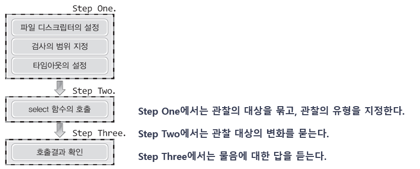
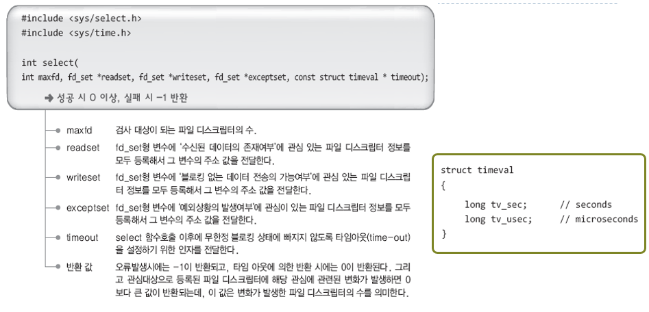
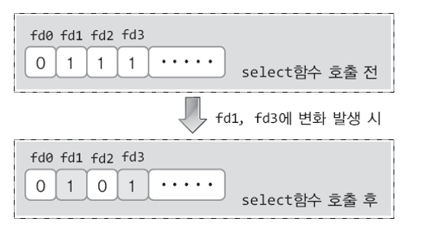

# Ch12 IO 멀티플렉싱

## 12.1 IO 멀티플렉싱 기반 서버

### 멀티 프로세스 기반 서버의 단점

- 프로세스는 하나의 독립적인 메모리 공간을 갖는 프로그램이다. 멀티 프로세스 기반 서버에 많은 수의 연결 요청이 들어오면 그만큼 많은 수의 프로세스가 생성되고, 자원을 많이 소모하게 된다.
- 프로세스간에 메모리 공유가 되지 않기 때문에 서로 통신을 하기 위해서는 복잡한 과정을 거처야 한다.
- 멀티 프로세스의 실행흐름을 고려해야하기 때문에 구현이 쉽지 않다.

### 멀티 프로세스 기반 서버의 대안

- 하나의 프로세스가 다수의 클라이언트에게 서비스할 수 있도록 한다.
- 이를 위해서는 하나의 프로세스가 여러개의 소켓을 동시에 관리할 수 있어야 한다.
- unix의 select 함수를 기반으로 멀티플렉싱한다.

## 12.2 select 함수의 이해와 서버의 구현

select 함수를 이용하면 배열 형태로 저장된 파일 디스크립터들에 대해서 다음과 같은 질문을 할 수 있다.

- 수신한 데이터가 있는 소켓이 있는가?
- 블로킹 되지않고 쓰기 연산을 할 수 있는 소켓이 있는가?
- 예외 상황이 발생한 소켓이 있는가?

select 함수는 보통 다음과 같은 순서를 거쳐서 호출하게 된다.



### 파일 디스크립터의 설정 : fd_set

select를 통해서 관찰할 소켓 또는 파일 디스크립터들을 모아두는 자료형이 있는데 바로 `fd_set`이다. `fd_set`형 변수에 비트 연산을 통해서 관찰하고 싶은 파일 디스크립터들을 표현할 수 있다.

직접 비트를 설정하기 않고, 미리 정의된 매크로 함수들을 사용한다. 다음과 같은 매크로 함수들이 있다.

- FD_ZERO(fd_set * fdset) : 인자로 전달한 fd_set 변수의 모든 비트를 0으로 설정한다. 초기에 fd_set를 사용하기 전에 초기화로 사용한다.
- FD_SET(int fd, fd_set * fdset) : fd에 해당하는 fdset의 비트를 1로 설정한다.
- FD_CLR(int fd, fd_set * fdset) : fd에 해당하는 fdset의 비트를 0으로 설정한다.
- FD_ISSET(int fd, fd_set * fdset) : fd에 해당하는 fdset의 비트가 1로 설정되어 있는지 검사한다.

### select 함수의 소개



- readset, writeset, exceptset 중 관찰하고 싶지 않은 것들은 NULL 값을 전달하면 된다.

### select 함수 이후 fd_set 변수값



주의해야 할 것이 있는데, select 함수에 전달한 fd_set 변수에 대해서 관심이 있는 파일 디스크립터를 1로 설정하고 전달한 다음, 어떤 이벤트가 발생해서 select가 반환된 경우이다. 이 때 fd_set 변수에는 이벤트가 발생한 파일 디스크립터에 대해서만 1로 남아있고, 나머지 비트들은 0으로 해제가 되어 있다. 만약 다음번 select 함수 호출에서도 동일한 fd_set 변수를 사용한다면, 전에 관심이 있던 파일 디스크립터에 대한 비트가 0으로 해제된체 전달될 수 있다. 따라서 select 함수에 전달하는 fd_set 변수는 원래 전달하고자 했던 fd_set 변수의 사본을 전달하는 것이 좋다.

### 멀티 플렉싱 서버 구현 예제

```c
...

int main(int argc, char * argv[])
{
    int serv_sock, clnt_sock;
    struct sockaddr_in serv_adr, clnt_adr;
    struct timeval timeout;
    fd_set reads, cpy_reads;

    socklen_t adr_sz;
    int fd_max, str_len, fd_num, i;
    char buf[BUF_SIZE];
    if (argc != 2) {
        printf("Usage : %s <port> \n", argv[0]);
        exit(1);
    }

    serv_sock = socket(PF_INET, SOCK_STREAM, 0);
    memset(&serv_adr, 0, sizeof(serv_adr));
    serv_adr.sin_family = AF_INET;
    serv_adr.sin_addr.s_addr = htonl(INADDR_ANY);
    serv_adr.sin_port = htons(atoi(argv[1]));

    if (bind(serv_sock, (struct sockaddr*)&serv_adr, sizeof(serv_adr)) == -1)
        error_handling("bind() error");
    if (listen(serv_sock, 5) == -1)
        error_handling("listen() error");

    FD_ZERO(&reads);
    FD_SET(serv_sock, &reads); // 연결 요청도 읽기 관찰 대상으로 포함
    fd_max=serv_sock;

    while(1)
    {
        cpy_reads=reads;  // 반드시 사본을 select에 넘겨야한다.
        timeout.tv_sec = 5;
        timeout.tv_usec = 5000;

        if ((fd_num = select(fd_max + 1, &cpy_reads, 0, 0, &timeout)) == -1)
            break;

        if (fd_num == 0)
            continue;

        for (i = 0; i < fd_max + 1; i++) {
            if (FD_ISSET(i, &cpy_reads))
            {
                if (i == serv_sock)
                {
                    adr_sz = sizeof(clnt_adr);
                    clnt_sock = accept(serv_sock, (struct sockaddr*)&clnt_adr, &adr_sz);
                    FD_SET(clnt_sock, &reads);
                    if (fd_max < clnt_sock)
                        fd_max = clnt_sock;
                    printf("connected client : %d\n", clnt_sock);
                }
                else {
                    str_len = read(i, buf, BUF_SIZE);
                    if (str_len == 0) {
                        FD_CLR(i, &reads);
                        close(i);
                        printf("closed client : %d\n", i);
                    }
                    else {
                        write(i, buf, str_len);
                    }
                }
            }
        }
    }
    close(serv_sock);
    return 0;
}
```
