# 실습2

## 프로토콜의 이해와 소켓 생성함수의 이해

프로토콜이란 인터넷 상에서 통신하는 프로그램들끼리의 규약과 같은 것이다. 소켓을 생성할 때 어떤 프로토콜을 사용하는 소켓인지 설정해주어야 한다.

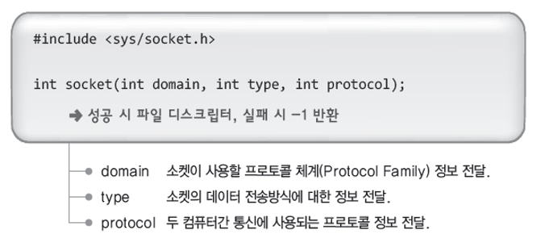

- **프토로콜 체계(Protocol Family)** : 프로토콜의 종류가 많고, 이들의 분류 또한 존재한다. 주로 사용할 체계는 `PF_INET`이다  
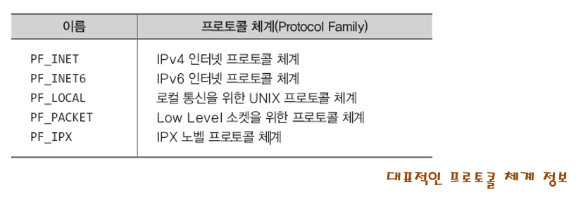  
- **TYPE** : 소켓이 데이터를 전송하는 방식에는 2가지가 있다. 하나는 **연결 지향형**이고 다른 하나는 **비연결 지향형**이 있다.
  - 연결 지향형 : 두 호스트에서 데이터를 주고 받는 것에 대한 신뢰성이 보장된다(중간에 데이터가 소멸하지 않는다). 데이터는 항상 순서대로 전송된다. 데이터는 스트림 형식으로 전송되며 데이터의 경계가 없다. 소켓 대 소켓은 반드시 1대1 연결이다.(TCP 방식)
  - 비연결 지향형 : 두 호스트에서 데이터를 주고 받는 것에 대한 신뢰성이 보장되지 않는다(데이터의 손실 및 파손 우려가 있다). 전송 순서에 상관없이 빠른 데이터 전달을 목적으로 한다. 한번에 보낼 수 있는 데이터의 크기가 정해져 있어서 데이터에 경계가 있다. (UDP 방식)
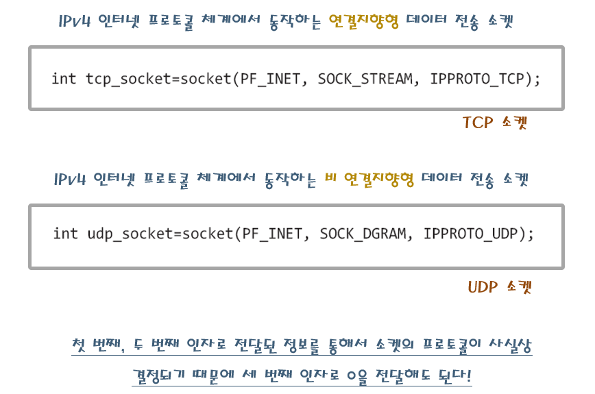

## Ch03-1 IP Address 주소체계

모든 end system에는 IP 주소가 있다. IPv4 방식의 주소는 4바이트 주소체계이다. 이 방식의 주소가 부족해질 것을 고려하여 8바이트 방식의 IPv6 주소 체계가 고안되기도 했다.

<!-- bind 함수에 대한 내용 -->

### IP 주소의 분류(class)

하나의 라우터, 그 라우터에 연결되어 있는 access network 내의 호스트에는 각각 IP주소가 있다. IP 주소는 네트워크 주소, 호스트 주소로 구분될 수 있다. 네트워크 주소를 이용해서 라우터까지 이동하며, 호스트 주소를 이용하여 원하는 호스트에 도착하는 구조이다.

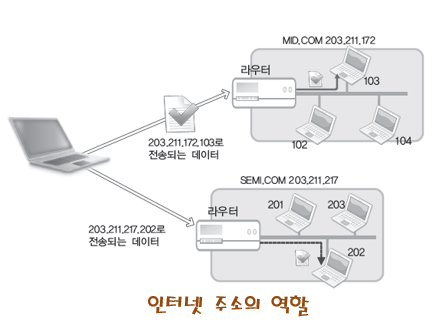

IP주소 내에서 네트워크 주소에 관련된 바이트의 숫자로 주소에 대한 분류(class)를 나눌 수 있다.

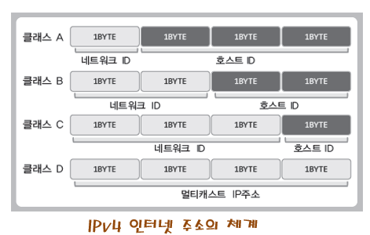

클래스별 네트워크 주소와 호스트 주소의 경계

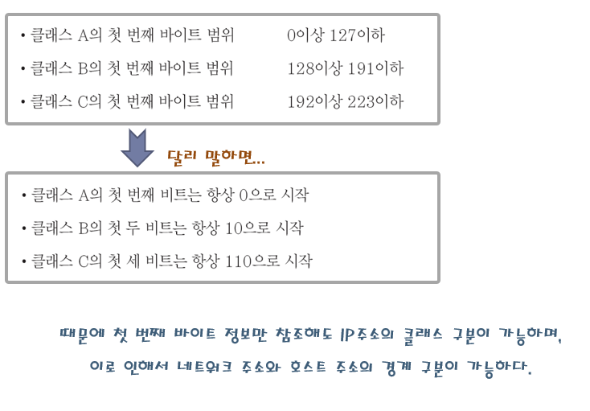

### PORT 번호

하나의 컴퓨터에는 여러개의 소켓이 설치될 수 있다. 이런 경우에 IP주소만으로 데이터를 전송받을 프로그램을 지정할 수 없다. 이런 문제를 해결하기 위해 port 번호가 탄생하였다.

PORT 번호는 16비트로 구성되어 있다. 이때 0~1023은 well-known 포트라고하여 자주 사용하는 프로그램에 대해서 미리 예약되어 있다.

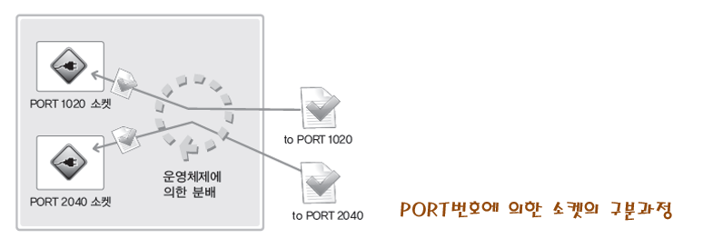

## Ch03-2 주소 정보의 표현

### IPv4 기반 주소 체계 표현을 위한 구조체

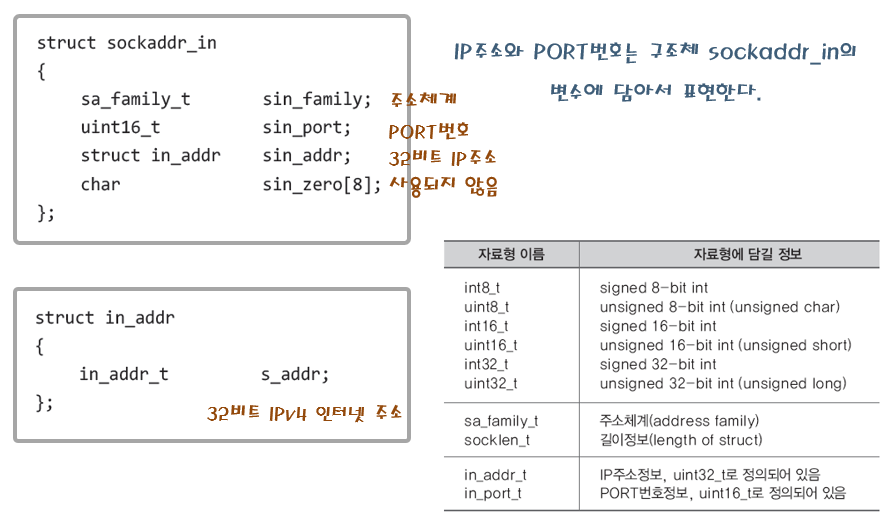

IP 표현을 위한 구조체 `in_addr`를 포함한 다른 여러 정보를 감싼 구조체 `sockaddr_in` 형태

- sin_family : 주소체계에 대한 정보를 저장한다. 우리는 주로 `AF_INET`을 사용한다.  
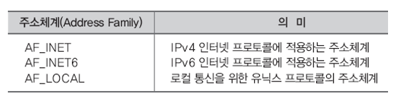  
- sin_port : 포트 넘버. 네트워크 바이트 순서로 저장해야 한다.
- sin_addr : IP주소를 저장한다. 네트워크 바이트 순서로 저장해야한다. IP주소를 감싸고 있는 `in_addr` 구조체 형태로 되어있다.
- sin_zero : 사용되지 않는다. 원래는 주소체계 표현을 이용해서 `sockaddr` 구조체를 이용한다. 이를 이용해 다른 종류의 프로토콜을 포함한 여러 주소체계를 표시할 수 있다. 그러나 주로 IPv4 기반 방법을 사용하며, IPv4를 표현하기 위해서는 `sockaddr` 구조체가 조금 불편하게 설정되어 있다. 이를 해결하기 위해 `sockaddr_in`을 설계하여 이곳에 IPv4에 대한 정보를 저장하고 `sockaddr *` 형으로 형변환하여 사용한다. 이 때 `sockaddr_in`의 크기를 `sockaddr`와 동일하게 만들어 주기 위해서 사용하지 않는 바이트 범위에 대해 `sin_zero`가 일종의 place holder 역할을 한다.  
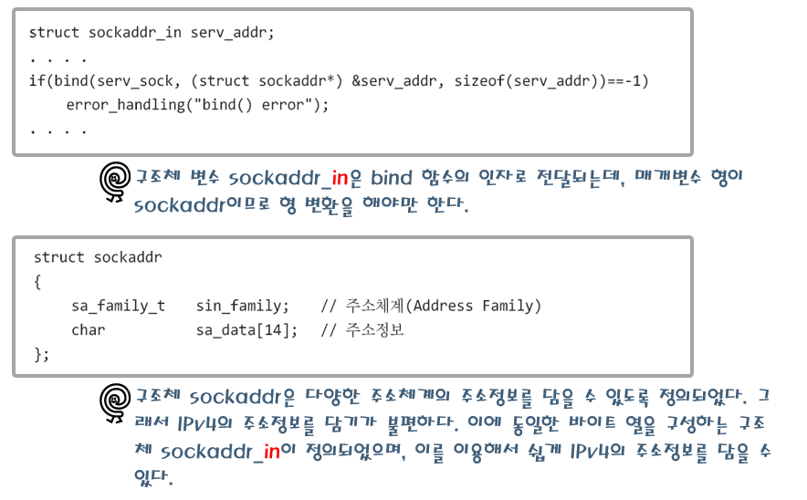

## Ch03-3 네트워크 바이트 주소와 인터넷 주소 변환

### 네트워크 바이트 순서

컴퓨터에서 데이터를 저장할 때, 데이터의 상위 바이트를 메모리의 상위 바이트부터 채워 놓는 방식(**빅 엔디안**)과 하위 바이트부터 채워 놓는 방식(**리틀 엔디안**) 방식이 있다. 머신마다 사용하는 엔디안 방식이 다르기 때문에 그냥 데이터를 주고 받아서는 안된다.  
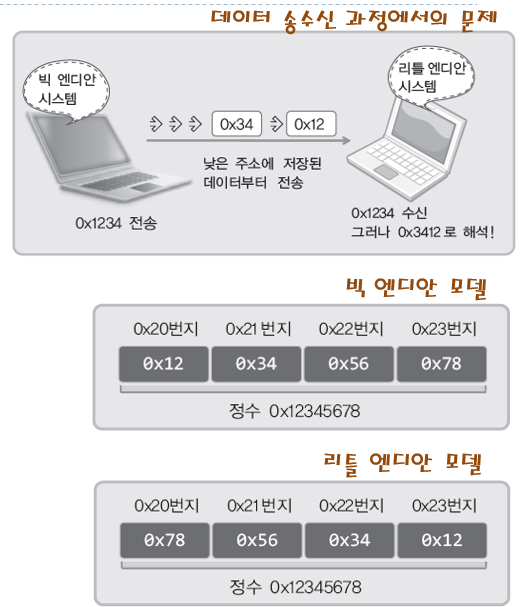

호스트 시스템에서 사용하는 엔디안 방식을 호스트 바이트 순서라고한다. 여러 호스트에서 바이트 순서가 다름으로 인해 나타나는 문제을 막기 위해서 **네트워크 바이트** 순서라는 개념이 도입되었다. **네트워크 바이트** 순서란 네트워크 통신에서는 무조건 기본 바이트순서(빅 엔디안)을 사용하도록 하는 것이다.

### 인터넷 주소 변환

네트워크에서는 네트워크 바이트 순서만을 사용할 수 있기 때문에 호스트 바이트 순서와 네트워크 바이트 순서가 다르다면 호스트에서의 주소 데이터를 적절히 변환해줄 필요가 있다. 다음과 같은 함수들이 존재한다.

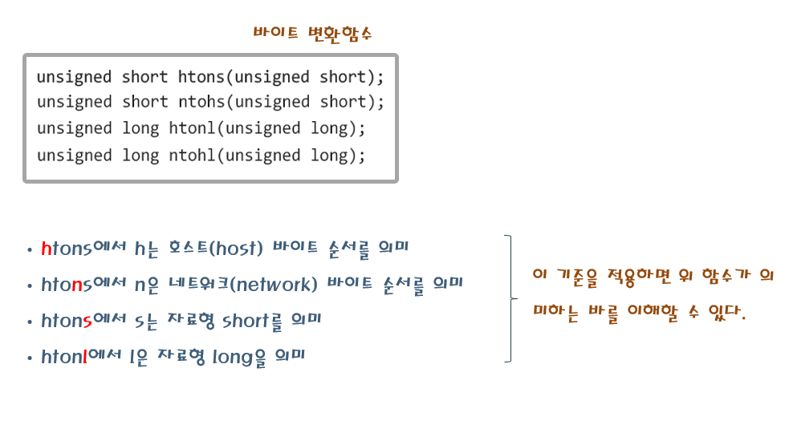

- unsigned short 형은 16 bit 자료형이다. s가 붙은 것들은 포트번호 변환에 사용된다.
- unsigned long 형은 32 bit 자료형으로 ip 주소 변환에 사용된다.

## Ch03-4 인터넷 주소의 초기화와 할당

`bind` 함수를 사용하여 소켓에 인터넷 주소와 포트번호를 할당하기 위해 수행하는 과정에 대해서 알아보자.

### inet_addr 함수

`inet_addr` 함수는 "127.0.0.1" 과 같이 문자열 형태로 표현된 ip 주소를 정수형태의 주소로 변환하여 반환해주는 함수이다.

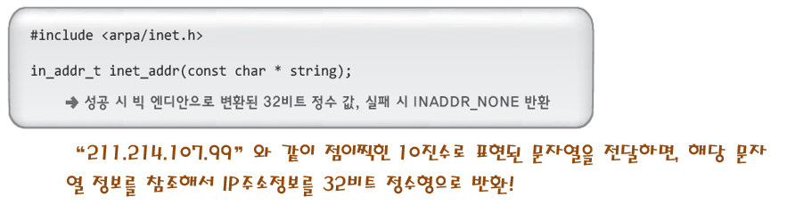

### inet_aton 함수

`inet_addr`함수와 유사하다. 다만, 문자열 형태의 ip주소를 받은 다음, 이를 정수 형태의 주소로 변환한 뒤, 인자로 전달한 inet_addr 변수에 자동으로 설정하는 것이 다르다.

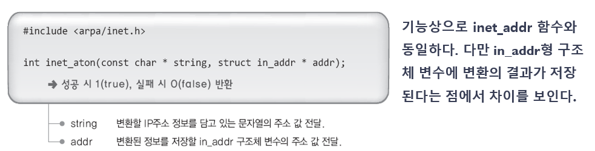

### inet_ntoa 함수

`inet_aton`과 정반대의 기능을 한다.

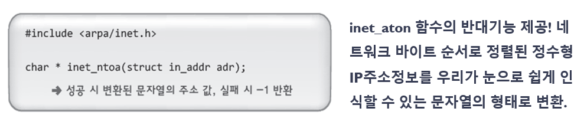

### 일반적인 인터넷 주소 초기화 과정

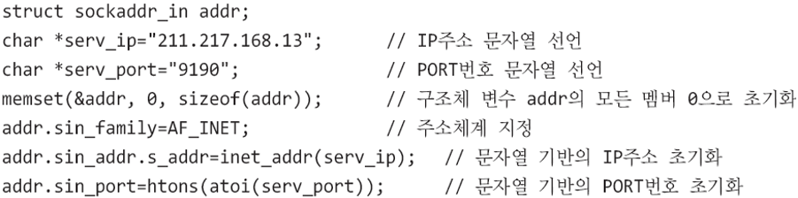

### INADDR_ANY

현재 실행되고 있는 호스트의 ip주소를 나타낸다.

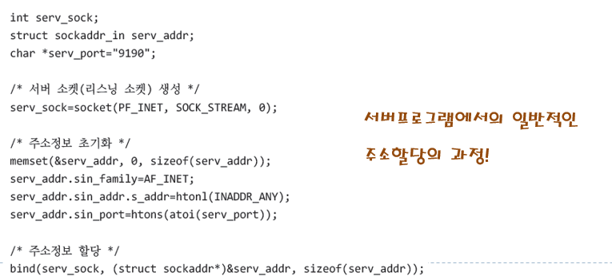
