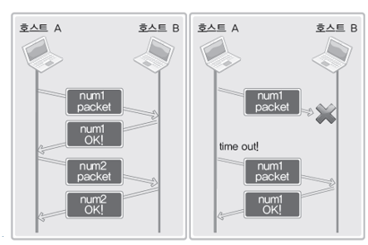

# 실습 3

## Ch04-1 TCP와 UDP에 대한 이해

### TCP/IP 프로토콜 스택

네트워크를 계층화하여 이해하기도 쉽고, 각 계층의 전문가가 해당 계층만 신경쓰면 되기 때문에 구현하기도 쉽다.


### Link 계층, IP 계층

Link 계층 : 한 라우터에서 연결된 다른 라우터까지 데이터를 송수신하는 물리적인 연결 및 데이터 송수신이 이루어지는 부분이다. LAN, WAN과 같은 물리적인 네트워크 표준 프로토콜이 정의된 영역이다.

IP 계층 : 경로 설정과 관련있는 프로토콜이 있는 계층이다.


### TCP/UDP 계층

데이터가 전송이 되었는지, 아닌지 확인하는 과정이 존재하기 때문에 실제적으로 데이터 송수신과 관련이 있는 부분이다.

- TCP : 데이터 전송의 신뢰성을 보장하는 프로토콜
- UDP : 데이터 전송의 신뢰성을 보장하지 않는 프로토콜

TCP가 신뢰성을 보장하는 대강의 원리는 다음과 같다.

송신자 호스트가 데이터 패킷을 수신자 호스트로 전송하고, 수신자 호스트는 데이터 패킷을 수신했다면 수신 성공에 대한 패킷을 송신자 호스트에게 보낸다. 만일 송신자 호스트가 이 패킷을 다시 전달받지 못하면 이전 패킷을 다시 보내게 된다.



### Applicatoin 계층

응용 프로그래머가 네트워크 애플리케이션을 작성하는 계층이다. Application계층은 TCP/UDP 게층의 서비스를 이용하며 이에 대한 인터페이스가 소켓이다. 프로그래머는 소켓의 사용법만 알면 트랜스포트 계층 서비스를 잘 이용할 수 있기 때문에 Application 계층에서의 개발에만 신경쓰면 된다.

### TCP 서버의 기본적인 함수 호출 순서


### 연결 요청 대기상태로의 진입


listen 함수를 호출하여 소켓을 연결 요청 대기상태로 만든다. listen함수를 호출하여야만 진정으로 연결을 수락할 수 있는 소켓이 만들어진다. 이 소켓을 **서버 소켓** 또는 **리스닝 소켓** 이라고 한다.

이 함수의 2번째 인자 `backlog`는 서버 소켓이 클라이언트와 연결되어 있을때, 해당 서버로 연결 요청을 수행하는 다른 클라이언트를 위한 큐의 크기를 지정한다. 다른 클라이언트는 연결 요청 큐에 대기하고, 서버가 연결을 끊은 뒤 다시 accept하면 큐의 맨 앞에 있던 클라이언트와 연결된다.


### 클라이언트 연결 요청 수락


accept 함수를 통해서 클라이언트의 연결 요청을 수락할 수 있다. 이 때 클라이언트와 실제로 데이터를 주고받는 소켓에 대한 파일 디스크립터가 반환된다.

### TCP 클라이언트의 기본적인 함수 호출 순서


서버에 연결요청을 할때 클라이언트의 정보도 함께 전송한다고 하였다. connect 함수 호출시 운영체제는 연결 요청 데이터와 함께 클라이언트의 정보를 붙이고 남는 포트 번호 역시 해당 패킷에 추가하게 된다.

### 클라이언트와 서버 함수 호출 관계


## Ch 04-3 Iterative 기반의 서버, 클라이언트의 구현

> echoserver.c

```c
...

int main(int argc, char* argv[]) {
    ...

    serv_sock = socket(PF_INET, SOCK_STREAM, 0);
    if(serv_sock == -1)
        error_handling("socket() error");

    memset(&serv_adr, 0, sizeof(serv_adr));
    serv_adr.sin_family = AF_INET;
    serv_adr.sin_addr.s_addr = htonl(INADDR_ANY);
    serv_adr.sin_port = htons(atoi(argv[1]));

    if(bind(serv_sock, (struct sockaddr*)&serv_adr, sizeof(serv_adr)) == -1)
        error_handling("bind() error");

    if(listen(serv_sock, 5) == -1) 
        error_handling("listen() error");

    clnt_adr_sz = sizeof(clnt_adr);

    for (i = 0; i<5; i++) {
        clnt_sock = accept(serv_sock, (struct sockaddr*)&clnt_adr, &clnt_adr_sz);
        if(clnt_sock == -1)
            error_handling("accept() error");
        else
            printf("Connnect client %d\n", i + 1);

        while((str_len = read(clnt_sock, message, BUF_SIZE)) != 0)
            write(clnt_sock, message, str_len);

        close(serv_sock);
        return 0;
    }
}
```

> echoclient.c

```c
...

int main(int argc, char* argv[]) {
    ...

    sock=socket(PF_INET, SOCK_STREAM, 0);
    if(sock == -1)
        error_handling("socket() error");

    memset(&serv_adr, 0, sizeof(serv_adr));
    serv_adr.sin_family = AF_INET;
    serv_adr.sin_addr.s_addr = inet_addr(argv[1]);
    serv_adr.sin_port = htons(atoi(argv[2]));

    if(connect(sock, (struct sockaddr*)&serv_adr, sizeof(serv_adr)) == -1)
        error_handling("connect() error");
    else
        puts("Connected...............");

    while(1)
    {
        fputs("Input message(Q to quit): ", stdout);
        fgets(message, BUF_SIZE, stdin);

        if(!strcmp(message, "q\n") || !strcmp(message, "Q\n"))
            break;

        write(sock, message, strlen(message));
        str_len=read(sock, message, BUF_SIZE-1);
        message[str_len]=0;
        printf("Message from server: %s", message);
    }
    close(sock);
    return 0;
}
```

### echoclient.c 에서 문제가 될 수 있는 부분

```c
str_len=read(sock, message, BUF_SIZE-1);
message[str_len]=0;
printf("Message from server: %s", message);
```

서버에서 보낸 데이터를 한번의 read함수 호출로 읽어들일 수 있다는 가정에서 작성한 코드이다. 그러나 TCP에서는 데이터가 스트림 형태로 전송되기 때문에 한번의 read함수로 모든 데이터를 읽을 수 없을 수도 있다.
