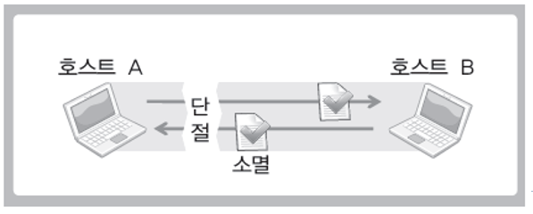
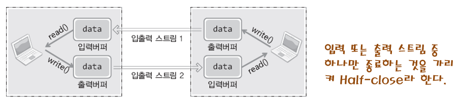
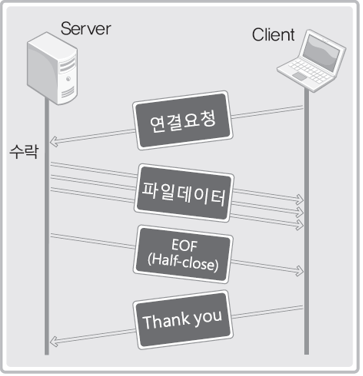
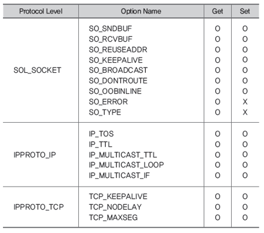
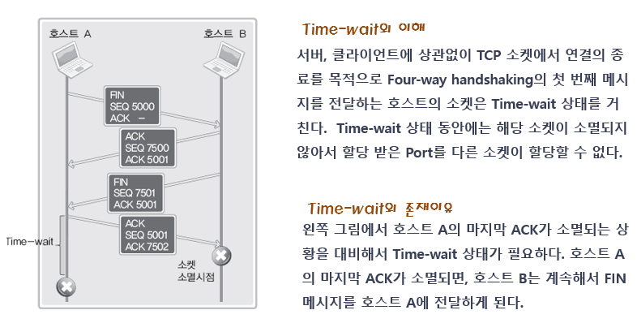
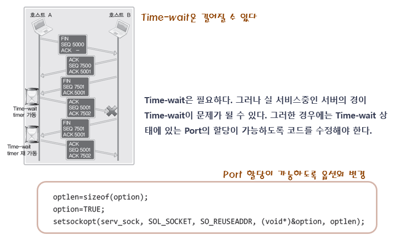
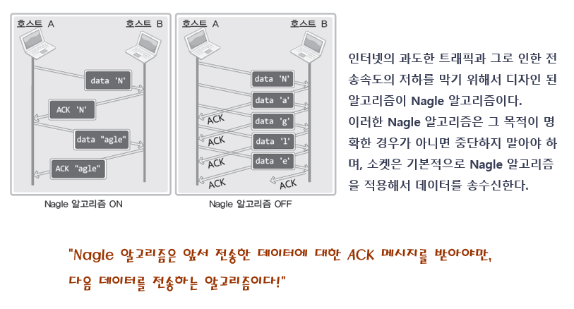
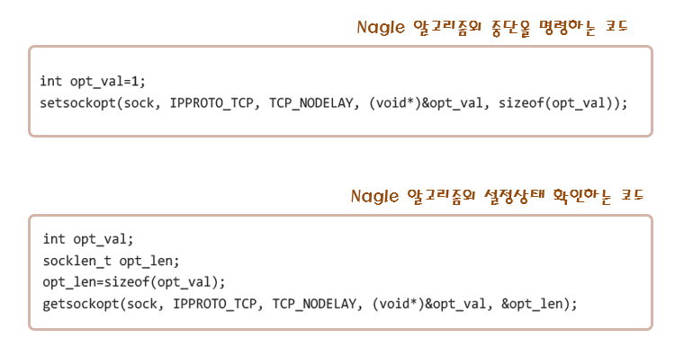

# 실습 9 정리

## Ch07-1 TCP 기반의 Half-close

### close함수와 closesocket 함수의 의미



- close 함수는 소켓의 완전 소멸을 의미한다.
- 소켓이 소멸되므로 더이상 입출력이 불가능하다.
- 소켓의 출력 버퍼는 버퍼에 남아있는 데이터를 모두 전송할 때까지 남아 있을 수 있으나, 입력 버퍼는 close 호출을 한 뒤 바로 소멸된다.
- 상대방의 상태와 상관없이 일방적인 종료의 형태를 띈다.
- 상대방이 아직 보내지 않은 데이터들을 받지 못하는 경우가 있다.
- 이러한 문제의 대안으로 **Half-close** 기법이 존재한다.

### TCP 기반의 Half-close



- 종료를 원한다는 것은 더이상 보낼 데이터가 존재하지 않는다는 것이다.
- 따라서 출력 버퍼는 닫아주어도 된다.
- 다만 상대방이 종료를 원하는지 알지 못하므로 입력 버퍼는 종료시키지 않을 필요가 있다.

### Half-close를 호출하는 c 함수

```c
#include <sys/socket.h>

int shutdown(int sock, int howto);
```

- 반환값 : 성공시 0, 실패시 -1
- sock : Half-close를 하는 소켓
- howto : 종료 방법에 대한 정보 전달
  - SHUT_RD : 입력 스트림 종료
  - SHUT_WR : 출력 스트림 종료
  - SHUT_RDWR : 입출력 스트림 종료
- close의 또다른 기능은 상대방으로 EOF를 전송하여 더이상 보낼 데이터가 존재하지 않음을 알리는 것이다. Half-close를 호출하여 출력 버퍼만 닫아줘도 상대방에게 EOF를 전송할 수 있어서 상대 호스트의 종료를 기다릴 수 있다.

> file_server.c

```c
...

int main(int argc, char* argv[])
{
    int serv_sd, clnt_sd;
    FILE *fp;
    char buf[BUF_SIZE];
    int read_cnt;

    struct sockaddr_in serv_adr, clnt_adr;
    socklen_t clnt_adr_sz;

    if (argc != 2) {
        printf("Usage : %s <port>\n", argv[0]);
        exit(1);
    }

    fp = fopen("file_server.c", "rb");
    serv_sd = socket(PF_INET, SOCK_STREAM, 0);

    memset(&serv_adr, 0, sizeof(serv_adr));
    serv_adr.sin_family=AF_INET;
    serv_adr.sin_addr.s_addr = htonl(INADDR_ANY);
    serv_adr.sin_port = htons(atoi(argv[1]));

    bind(serv_sd, (struct sockaddr*)&serv_adr, sizeof(serv_adr));
    listen(serv_sd, 5);

    clnt_adr_sz = sizeof(clnt_adr);
    clnt_sd = accept(serv_sd, (struct sockaddr*)&clnt_adr, &clnt_adr_sz);

    while(1)
    {
        // fread(버퍼, 데이터 하나 크기, 데이터 개수, 파일 포인터)
        read_cnt = fread((void*)buf, 1, BUF_SIZE, fp);
        if (read_cnt < BUF_SIZE)
        {
            write(clnt_sd, buf, read_cnt);
            break;
        }
        write(clnt_sd, buf, read_cnt);
    }

    // 출력 버퍼만 닫기
    shutdown(clnt_sd, SHUT_WR);
    // Half-close 이기 때문에 입력을 계속 받을 수 있다.
    read(clnt_sd, buf, BUF_SIZE);
    printf("Message from client : %s \n", buf);

    fclose(fp);
    close(clnt_sd); close(serv_sd);
    return 0;
}
```

> file_client.c

```c
...
int main(int argc, char* argv[])
{
    int sd;
    FILE *fp;

    char buf[BUF_SIZE];
    int read_cnt;

    struct sockaddr_in serv_adr;

    if (argc != 3) {
        printf("Usage : %s <ip> <port>\n", argv[0]);
        exit(1);
    }

    fp = fopen("receive.dat", "wb");
    sd = socket(PF_INET, SOCK_STREAM, 0);

    memset(&serv_adr, 0, sizeof(serv_adr));
    serv_adr.sin_family=AF_INET;
    serv_adr.sin_addr.s_addr = inet_addr(argv[1]);
    serv_adr.sin_port = htons(atoi(argv[2]));

    connect(sd, (struct sockaddr*)&serv_adr, sizeof(serv_adr));

    while((read_cnt=read(sd, buf, BUF_SIZE)) != 0)
        fwrite((void*)buf, 1, read_cnt, fp);

    puts("Received file data");
    write(sd, "Thank you", 10);
    fclose(fp);
    close(sd);
    return 0;
}
```



## Ch09-1 소켓의 옵션과 입출력 버퍼의 크기

### 소켓의 다양한 옵션



소켓의 옵션을 변경하거나, 옵션을 읽어올 때 사용하는 상수들이다. 이러한 소켓의 옵션은 계층별로 구분된다. IPPROTO_IP 은 IP 레벨 관련, IPPROTO_TCP는 TCP 레벨 관련, SOL_SOCKET은 소켓 레벨 관련 상수라고 생각하면 된다.

위 사진에서 SOL_SOCKET 레벨의 SO_TYPE 옵션은 set으로 설정할 수 없음을 알 수 있다. 한번 설정한 소켓의 타입은 앞으로 배울 setsockopt 함수로도 변경할 수 없음을 의미한다.

```c
#include <sys/socket.h>

int getsockopt(int sock, int level, int optname, void *optval, socklen_t *optlen);
```

- 반환값 : 성공시 0, 실패시 -1
- 매개값
  - sock : 정보를 받아올 소켓의 descriptor
  - level : 확인할 소켓 옵션의 프로토콜 레벨
  - optname : 확인할 옵션 이름 전달
  - optval : 확인 정보를 저장할 버퍼의 주소
  - optlen : 확인 정보 저장용 버퍼의 크기가 담긴 변수의 주소. 함수 호출이 완료되면 이 주소에 해당하는 변수에 대한 옵션 정보의 크기가 저장된다.

```c
int setsockopt(int sock, int level, int optname, void *optval, socklen_t optlen);
```

- 반환값 : 성공시 0, 실패시 -1
- 매개값
  - sock : 옵션 정보를 설정할 소켓의 descriptor
  - level : 설정할 옵션의 프로토콜 level
  - optname : 설정할 옵션의 이름
  - optval : 설정할 정보가 저장되어 있는 버퍼의 주소
  - optlen : 설정할 정보가 저장되어 있는 버퍼의 크기

> set_buf.c

```c
int main(int argc, char* argv[])
{
    int sock;
    int snd_buf = 1024 * 3, rcv_buf = 1024 * 3;
    int state;
    socklen_t len;

    sock = socket(PF_INET, SOCK_STREAM, 0);
    state = setsockopt(sock, SOL_SOCKET, SO_RCVBUF, (void*)&rcv_buf, sizeof(rcv_buf));
    if (state)
        error_handling("setsockopt() error");

    state = setsockopt(sock, SOL_SOCKET, SO_SNDBUF, (void*)&snd_buf, sizeof(snd_buf));
    if (state)
        error_handling("setsockopt() error");

    len = sizeof(snd_buf);
    state = getsockopt(sock, SOL_SOCKET, SO_SNDBUF, (void*)&snd_buf, &len);
    if (state)
        error_handling("getsockopt() error");

    len = sizeof(rcv_buf);
    state = getsockopt(sock, SOL_SOCKET, SO_RCVBUF, (void*)&rcv_buf, &len);
    if (state)
        error_handling("getsockopt() error");

    printf("Input buffer size: %d \n", rcv_buf);
    printf("Output buffer size: %d \n", snd_buf);

    return 0;
}
```

## Ch09-2 SO_REUSEADDR



4-way 연결 종료 과정에서 먼저 fin 신호를 보내는 호스트에 대해서 상대방이 fin 신호를 보내오면 해당 ack 신호를 보내고 연결을 완전히 종료할 때까지 일정시간을 기다리게 된다. 이는 상대방에게 보낸 ack 신호가 중간에 손실되어 상대방이 fin 신호를 재전송하게 되는 상황을 대비한 것이다. 이러한 Time-wait 때문에 Time-wait 동안은 사용했던 포트 번호를 다른 프로세스가 사용할 수 없게 된다.



호스트가 Time-wait를 기다리지 않고 바로 포트 번호를 재사용할 수 있게 하려면 SO_REUSEADDR 옵션을 설정할 수 있다.

## Ch09-3 TCP_NODELAY

네트워크 프로세스가 데이터를 연속적으로 생산하고, 이 데이터를 하위계층(트랜스포트 계층)으로 전송하는 속도가 매우 느리다면 TCP 계층에서는 작은 크기의 애플리케이션 데이터를 담은 여러 세그먼트를 계속해서 생산하여 수신자측에 전송하게 된다. 작은 크기의 페이로드에 상대적으로 큰 세그먼트 헤더를 붙이게 되고, 이들 세그먼트가 여러개 생성되기 때문에 네트워크에 부담이 있을 수 있다.

### Nagle 알고리즘

상대방이 전에 보낸 세그먼트에 대한 ack 신호를 보내기 전까지 다른 패킷을 전송하지 않고 기다린다. 기다리는 동안 상위계층(애플리케이션)에서 전달받은 데이터를 버퍼에 저장해두고, ack 신호가 들어오면 이들 데이터를 한번에 전송하게 된다.



Nagle 알고리즘을 사용하면 버퍼에 일정 크기의 데이터가 쌓일 때까지 기다려서 큰 크기의 데이터를 한번에 세그먼트로 만들어 수신자 측에 보내기 때문에 네트워크의 부담을 줄일 수 있다.

#### Nagle 알고리즘 중단 코드

그러나 게임이나 영상통화와 같은 애플리케이션은 상대방이 ack 신호를 보내기 전에 데이터가 곧바로 전송되어 반응성을 높이는 것이 중요하기 때문에 이러한 애플리케이션에는 Nagle 알고리즘을 사용하지 않는 것이 좋다. Nagle 알고리즘을 중단하기 위해서 TCP_NODELAY 옵션을 설정할 수 있다.


