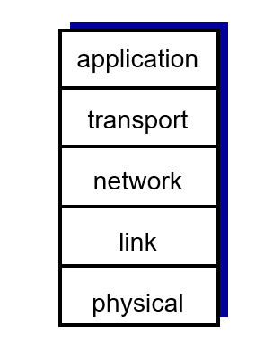

# Chapter 1 Introduction

## 1.1 What is the Internet

### 1.1.1 `nuts ans bolts view`

인터넷을 구성하는 하드웨어, 소프트웨어, 데이터 구성요소로 바라보는 관점이다. 이러한 관점에서 인터넷은 전 세계에 존재하는 수십억 개의 컴퓨팅 장치를 연결하는 네트워크이다.

host system(end system) + cable + data(packet(3계층), frame, signal ...)

호스트 시스템은 통신링크(Communication Link)와 패킷 스위치(Packet switch)로 연결되어 있다.

용어 정리 :

- bandwidth : 호스트 시스템을 연결하는 통신 링크에서 전달할 수 있는 데이터의 전송 속도. 초당 비트수(bps)로 계산한다.
- router와 packet switch : 통신 링크로 이동하는 데이터 패킷이 목적지 호스트 시스템으로 이동할 수 있도록 경로를 지정해주는 장치.
- ISP(Internet Service Provider) : 통신링크와 패킷 스위치등을 설치하여 지역 또는 국가간 네트워크 연결을 제공하는 서비스 업체(SK Broadband, AT&T 등등)
- Internet : network of networks, 인터넷 서비스 제공자(ISP)에 의해서 연결되어 있는 네트워크. 네트워크에서 가장 중요한 점은 reliablity(동일한 기능을 일정하게 제공할 수 있는 능력)
- Protocol : 인터넷에서 데이터를 교환하는 규칙. 대표적으로 TCP/IP가 존재한다.
- IETF : 인터넷 프로토콜에 대한 표준을 정하는 기구. 여기에서 특정 분야에 대한 RFC를 정한다.
- RFC

### 1.1.2 What is `protocol`

서로 소통하는 방법에 대한 규칙이다. packet에 대한 format을 지정하기도 하고, message에 대한 순서, 요청에 대한 action을 지정하기도 한다.

### 1.1.3 `service view`

어플리케이션에 서비스를 제공하는 `infrastructure`. 인터넷을 이용해서 어플리케이션과 엔드 시스템간 데이터를 주고받을 수 있도록하는 프로그래밍 interface api.

## 1.2 Network Edge

### A closer look at network structure

- network edge :
  - hosts : clients and servers
- access networks, physical media : end system을 다른 end system과 연결하는 경로상에서, 가장 첫번째로 만나게 되는 라우터(가장자리 라우터)까지의 네트워크. wired, wireless links
- network core(back bone) : access network를 연결하는 network

> `Cloud Computing` : 유비쿼터스와 비슷한 개념. 언제 어디서든지 인터넷에 연결되어 있다면 사용할 수 있는 컴퓨팅 서비스. 구름 뒤에 가려진 부분처럼, 가려진 공간에서 무언가 시스템을 설치하고 서비스를 제공해서 cloud라는 이름이 붙었다.

### 1.2.1 Access networks(접속 네트워크) and physical media

- Digital subscriber line (DSL) : 전화와 인터넷을 동시에 송수신할 수 있는 형태의 네트워크. 옛날 방식. 업로드 속도와 다운로드 속도의 차이가 존재(다운로드 > 업로드)
- Cable network : 케이블 TV를 제공하는 회선을 이용해서 인터넷도 제공하는 방식.  

cable headend에서 CMTS 까지는 광케이블, cable headend에서 cable modem까지는 동축케이블로 연결되어 있다. 2가지 종류의 케이블이 쓰여서 HGC라는 용어가 붙음. Cable modem에서 통신신호의 업스트림과 다운스트림 채널을 나눈다(업로드, 다운로드 속도가 다름).
- Home network : LAN(Local Area Network)를 이용해서 기업 또는 가정의 end system들을 한 번에 access network에 연결하는 방식. 여러가지 LAN 기술이 있지만 가장 많이 사용하는 방식은 이더넷 케이블을 이용해서 이더넷 스위치에 연결하는 것이다.  
  
가정용 라우터에 AP(Access Pointer)를 달아서 무선 네트워크(`Wifi`, `IEEE 802.11`)를 지원할 수도 있다.
- Wireless access network

### 1.2.2 물리 매체(Physical Media)

1 비트를 한 end system에서 다른 end system으로 전송한다고 했을 때, 많은 송신기-수신기 짝을 거치게 된다. 송신기-수신기 사이에는 물리 매체(Physical Media)가 있으며, 이 물리 매체 상에서 전자파나 광펄스의 형태로 전파된다.

- guide media(유도 매체) : 광섬유나 동축 케이블과 같은 견고한 매체를 통해서 신호를 유도하여 데이터를 전송하는 형태
- unguide media(비유도 매체) : 무선 LAN 혹은 디지털 위성채널처럼 모든 방향으로 신호를 보내 데이터를 전송하는 형태

물리 매체의 종류

- 꼬임 쌍선(Twisted pair) : 가장 싸고, 가장 많이 이용하는 형태. 2 개의 절연 동선이 나선 형태로 꼬아져있다. 다른 쌍선들과의 전기 간섭을 줄이기 위해 나선 형태로 꼬아놓았다.  

- 동축 케이블(coaxial cable) : 2개의 구리선이 평행하지 않고, 동심원 형태로 되어있다. 일반적으로 꼬임 쌍선보다 더 높은 데이터 전송률을 보인다. 주로 케이블 tv 업체가 인터넷 서비스도 제공할 때 사용된다. 동축 케이블은 유도 공유 매체로 사용할 수 있다. 많은 수신기가 케이블에 직접 연결 될 수 있고, 모든 종단 시스템은 다른 하나의 종단 시스템이 방출하는 신호를 수신할 수 있다.  

- 광섬유(fiber optical cable) : 비트를 나타내는 광펄스를 전송하는 가늘고 유연한 매체. 전자기장의 간섭도 없고, 초당 10GB에서 100GB에 이르는 놀라운 전송속도를 보여준다. 또한 100km까지는 신호 감쇠현상도 매우 적다. 그러나 비용이 매우 크기 때문에 주로 국가간 네트워크를 연결하는데 사용된다.
- 라디오 채널 : 전자기 스펙트럼으로 신호를 전달한다. 물리 매체가 필요없고, 벽을 관통할 수 있으며, 이동 사용자에게 연결성을 제공하고 먼 거리까지 신호를 전달할 수 있는 것이 장점이다. 그러나 신호를 전달하는 환경(다른 라디오 전파의 간섭, 물체에 의한 방해)에 따라서 영향을 받을 수 있다.  
1~2m의 매우 짧은 거리에 동작하는 채널, 10에서 수백m에 걸쳐 근거리 네트워크로 동작하는 채널, 수십km에 걸쳐 광역에서 작동하는 채널, 위성 라디오 채널 등이 있다.

## 1.2 네트워크 코어(Network Core)

엔드 시스템을 연결하는 패킷 스위치와 네트워크 링크  

### 1.3.1 패킷 교환

하나의 end system에서 다른 end system으로 데이터를 전송할 때 어플리케이션 레벨에서 메시지를 주고 받는다. 이 메시지는 서로간의 동작을 제어하는 컨트롤일 수도 있고, jpeg, mp3와 같은 파일을 포함할 수 있다. 송신 end system에서 메시지를 수신 end system으로 보내기 위해, 송신 시스템은 긴 애플리케이션 layer 메시지를 패킷(packet)이라고 하는 작은 단위로 나누다. 각 패킷은 통신링크와 패킷 스위치를 거치게 된다. 패킷은 링크의 최대 전송속도로 통신 링크상에서 전송된다. 따라서 R bit/sec를 갖는 통신링크 상에서 L bits의 패킷을 전송할때 총 L/R sec 의 시간이 소요된다.  

### `저장-후-전달`

대부분의 패킷 스위치는 패킷을 전달할 때 `저장-후-전달` 방식을 사용한다. 즉, 하나의 패킷에 있는 비트를 전송받으면 곧바로 다른 링크로 해당 비트를 전송할 수 있는 것이 아니라, 완전한 패킷이 스위치에 전송될때까지 기다린 다음 비트를 전송할 수 있음을 의미한다.  

패킷을 저장한 뒤 전송하는 과정에서 딜레이가 발생한다. R bit/sec의 bandwidth를 갖는 N개의 링크로 구성된 네트워크에서 길이 L bits의 패킷을 전송하는데 걸리는 지연시간은 다음과 같다.  
$$
delay = N{L \over R}
$$

### `큐잉 지연과 패킷 손실`

패킷 스위치에는 여러 링크가 연결되어 있다. 패킷 스위치는 각 링크에 대해서 출력 버퍼(출력 큐)를 가지고 있다. 도착하는 패킷이 링크를 통해서 전송되려고 할때 해당 링크가 이미 다른 패킷을 전송하고 있다면 패킷은 출력 버퍼에 저장될 필요가 있다. 이 과정에서 `저장-후-전달`에 더하여 `큐잉 지연`이 발생한다.  

위 그림에서 짧은 기간동안 라우터에 도착하는 패킷의 전송 속도가 1.5Mbps를 초과하게 되면 패킷은 출력 버퍼에 큐잉된다.  
버퍼의 크기는 유한하기 때문에 만약 출력 버퍼가 가득찬 상황에서 해당 링크로 패킷이 도착하게 되면 해당 패킷 또는 버퍼에 있던 패킷이 손실될 수 있다(`패킷 손실`)

### `전달 테이블`과 `라우팅 프로토콜`

라우터에 접속된 여러 통신링크 중 하나에서 오는 패킷을 어떻게 목적지로 향하는 다른 통신링크로 전달하는 가에 대해서 알아보자.  
인터넷에 연결된 모든 end system은 IP 주소를 가지고 있다. 송신 end system에서 수신 end system으로 패킷을 전송할 때 수신 시스템에 대한 IP 주소를 패킷의 헤더에 포함시킨다. 패킷을 수신한 라우터는 헤더에 존재하는 IP 주소를 활용한다. IP 주소는 우편 주소처럼 계층이 존재(예를 들어 인천광역시 / 남구 / 인주대로)하는데, 라우터는 내부의 전달 테이블(forwarding table)을 가지고 있어서 특정 IP의 특정 계층에 대한 전달 링크를 맵핑하여 관리한다. 이를 통해 패킷을 적절한 링크로 다시 전송할 수 있다.  
  
여기서 다시 어떻게 라우터에 전달 테이블을 설정할 것인가에 대한 의문이 남는다. 인터넷은 자동으로 라우터에 전달 테이블을 설정하는 `라우팅 프로토콜`을 갖는다. 이는 나중에 알아본다.

### 1.3.2 회선 교환(Circuit Switch)

링크와 스위치로 연결된 네트워크에서 데이터를 이동시는 방식에는 패킷 교환과 회선 교환의 2가지 방식이 존재한다.

### `회선 교환(Circuit Switch)`

회선 교환 방식에서 두 개의 end system이 통신하기 위해서는 링크자원(버퍼, 링크 전송률)이 통신세션(session)간에 예약된다. 패킷 교환 방식은 링크 자원을 예약하지 않는다. 이러한 방식을 사용하는 대표적인 예가 `전화망`이다. 전화망을 통해 송신자와 수신자가 통화를 하려고 할때, 네트워크 스위치들은 해당 연결 상태를 유지해야 한다. 이러한 연결을 정보통신 용어로 `회선(Circuit)`이라고 한다. 네트워크가 회선을 설정할 때, 그 연결이 이루어지는 동안 네트워크 링크에 일정한 전송률을 예약한다. 주어진 전송속도가 송신자-수신자 연결을 위해 예약되므로, 송신자는 보장된 일정 전송률로 데이터를 보낼 수 있다.  
이와 달리 패킷 교환 방식에서는 송신자가 보낸 패킷이 전송될 때 링크의 자원(회선)을 예약하지 않는다. 패킷이 전송될 링크가 혼잡하다면 출력 버퍼에 패킷이 저장 될 수 있으며, 이 과정에서 지연이 발생한다. 따라서 보장된 속도로 패킷이 전송되지 않을 수 있다.

### 회선 교환 네트워크에서 다중화

링크 내의 한 회선은 `주파수-분할 다중화(Frequency-division multiplexing, FDM)`와 `시-분할 다중화(Time-division multiplexing, TDM)`으로 구현된다.  

FDM에서 링크에서 설정된 회선에 대해 특정 주파수 대역을 예약한다. 주로 4kHz 폭의 주파수 대역을 고정 제공한다. 이러한 폭을 `대역폭(bandwidth)` 라고 한다.  
TDM에서는 시간을 일정한 `프레임`으로 나누고, 각 프레임을 다시 일정한 `슬롯`으로 나눈다. 하나의 회선에 대해서 특정 슬롯 동안의 전체 주파수 대역폭을 고정해서 사용할 수 있게 해준다. 모든 프레임에서 해당 슬롯을 특정 연결에 할당한다.  
이 방식의 단점은 회선이 사용되지 않는 idle time에 자원을 낭비하게 된다는 것이다. 또한 종단간 회선을 설정하고 대역폭을 유지하는 것이 복잡하고, 스위치간 운영을 조절하는 복잡한 소프트웨어가 필요하다.

### `패킷 교환` 대 `회선 교환`

다음과 같은 예를 보자. 각 인터넷 사용자가 1 Mbps의 링크를 공유한다고 하자. 각 사용자는 활동시간과 비활동시간을 번갈아가며 나타내며 활동시간은 전체 시간의 10%이다. 활동시간에는 100kbps의 속도로 데이터를 생산해낸다고 하자.  
회선교환 방식은 링크의 자원을 예약해야하기 때문에 동시에 최대 10명의 사용자만이 인터넷을 사용할 수 있다. 회선이 연결되어 있는 동안 사용자가 사용을 하든 안하든 간에 해당 회선은 연결이 끝날때까지 유지되어야 하며 이는 자원낭비이다.  
패킷 교환 방식의 경우 만약 전체 사용자가 35명일 때 11명 이상의 사용자가 동시에 인터넷을 사용할 확률은 0.0004이다. 때문에 패킷 교환 방식은 회선 교환 방식에 비교해서 거의 동일한 수준의 딜레이를 발생시키면서 더 적은 비용으로 네트워크를 구성할 수 있으며 동시에 더 많은 사람들이 사용할 수 있게 된다.(패킷 교환 방식의 구축 비용이 더 적기 때문에)

### 1.3.3 네트워크의 네트워크

End system이 인터넷에 연결되기 위해서는 지역의 ISP와 연결되어있어야 한다(access ISP). 또한 이러한 access ISP끼리도 연결이 되어있어야 두 개의 end system이 패킷을 주고받을 수 있게 된다. 어떻게 access ISP과 연결되어질 것인가는 돈과 국제 관계가 고려되야함

- 실현 불가능한 구조 : 모든 access ISP가 서로 연결된 형태  

- 네트워크 구조 1 : 전세계의 access ISP에 대해 연결 서비스를 제공하는 글로벌 transit ISP  
  
access ISP가 고객, 글로벌 transit ISP가 서비스 제공자가 된다.
- 네트워크 구조 2 : 글로벌 transit ISP가 여러 곳 생겨서 경쟁이 일어난 형태  
  
  - 시장 경쟁에 의한 서비스 요금 하락 덕분에, access ISP는 구조1보다 구조2를 더 선호하게 된다.
  - 이들 글로벌 ISP끼리도 연결이 되어 있어야 국제적으로 통신이 가능할 수 있다.
- 네트워크 구조 3 : 한 지역에 대한 서비스를 제공하는 지역 ISP가 추가된 형태  

- 네트워크 구조 4 : 멀티홈, PoP, IXP, 피어링와 같은 구조가 추가된 형태
- 네트워크 구조 5 : 구글과 같은 컨텐츠 제공자가 자신들만의 전세계적 네트워크를 구성하고, 이 네트워크가 자신들의 서비스만을 목적으로 사용되는 형태  

종합해서 네트워크는 다음과 같은 계층구조를 가지게 되었다.  

> Content Provider Network : 구글과 같은 컨텐츠회사가 네트워크를 제공할 정도로 커져버린 형태

## 1.4 delay, loss, throughput in networks

### 1.4.1 패킷 교환 네트워크에서 지연(delay)개요

패킷 교환 네트워크에서는 위의 4가지 지연이 발생할 수 있다.

- 처리 지연(nodal processing delay) : 라우터에서 패킷을 분해하여 어떤 링크로 다시 보낼지에 대해 처리하는 과정에서 발생하는 지연. 패킷의 비트 단위 오류를 체크하는 과정도 포함될 수 있다. 일반적으로 마이크로초 단위이며 이는 무시될 수 있다.
- 큐잉 지연(queueing delay) : 패킷이 링크로 보내지기 전에 앞서 도착한 다른 패킷이 링크에서 전달되고 있을 수 있으며 후에 도착한 패킷은 버퍼에 보관된다. 버퍼에서 앞서 도착한 패킷들이 모두 보내지기를 기다리는 과정을 큐잉 지연이라고 한다. 데이터가 라우터에 도착하는 평균율과 패킷의 도착 특성에 대한 함수로 표현될 수 있다.
- 전송 지연(transmission delay) : 패킷이 라우터에서 링크로 보내지는 과정에서 처리되는 시간이다. 패킷의 길이가 L bits 이고 링크 전송 속도가 R bit/sec 라면 전송 지연은 다음과 같다.

$$
{L \over R} (sec)
$$

- 전파 지연(propagation delay) : 데이터가 링크의 실제 물리 매체에서 전파되는 데에 걸리는 시간이다. 보통 전파속도는 빛의 속도(2x10^8)로 계산된다.

전송 지연과 전파 지연은 완전히 다른 개념이다. 이는 고속도로와 요금계산소에서의 지연으로 생각해볼수 있다. 요금 계산소에서 대기하는 시간을 전송 지연, 고속도로에서 실제 이동하는 시간을 전파 지연에 비유할 수 있다.

이러한 지연들은 라우터와 네트워크의 종류, 사용되는 물리 매체의 종류에 따라서 영향력이 달라질 수 있다.

### 1.4.2 큐잉 지연(delay)과 패킷 손실(loss)

지연 중에서 학문적으로 가장 연구가 활발히 되는 것이 큐잉 지연이라고한다. 언제 큐잉 지연이 작아지고 언제 큐잉지연이 커지는가? 큐잉 지연에 영향을 줄 수 있는 것들은 패킷이 시간에 따라 라우터에 도착하는 평균율, 링크 전송속도, 패킷의 도착 특성 등이 있다.

패킷이 시간에 따라 큐에 도착하는 평균율을 a(packet/sec)라고 해보자. 모든 패킷의 길이가 L(bits)로 동일하다고 할 때, 큐에 도착하는 비트의 평균율은 La(bits/sec)가 된다. 링크의 전송속도를 R(sec)이라고 하자. 이때 **`트래픽 강도(Traffic Intensity)`** 는 다음과 같은 수식이다.

$$
{{La} \over R}
$$

이 트래픽 강도가 1이 넘어가게 되면, 링크에서 처리할 수 있는 것보다 더 많은 패킷이 큐에 도착하게 되므로 큐의 길이와 큐잉 지연은 무한히 늘어나게 된다. 트래픽 강도가 1 미만인 경우에는 패킷이 도착하는 특성에 따라서 큐잉 지연이 달라질 수 있다.

예를 들어 1초에 1개의 패킷을 처리할 수 있는 큐가 있다고 하자. 이때 10개의 패킷이 1초에 하나씩 큐에 들어오는 경우와 10개의 패킷이 10초 간격으로 한번에 들어오는 경우를 생각해보자. 첫번째 경우는 앞서 도착한 패킷이 모두 처리된 후에 다음 패킷이 도착하게 되기 때문에 패킷이 큐에서 기다리는 시간은 전혀 없다. 두번째 경우는 처음 도착한 패킷만 지연시간이 없게 되며, 나머지 패킷들은 그 앞에 있는 패킷의 숫자만큼 기다리게 된다.

앞서 설명한 2가지 상황은 상당히 극단적인 예시였다. 실제 패킷 도착 특성은 랜덤(random)한 특성을 가지게 된다. 트래픽 강도만으로 큐잉 지연에 대한 모든 특성을 설명하기는 충분하지 않지만, 큐잉 지연에 대한 어느정도의 직관을 얻는데는 유용하다. 일반적으로 트래픽 강도에 대한 평균 큐잉 지연은 다음과 같은 특성을 보인다고 한다.  

트래픽 강도가 1에 가까워지면 트래픽 도착 특성의 가변성으로 인해 평균 큐잉 지연시간이 무한히 늘어나는 특성을 보인다. 또한 중요한 점이 트래픽 강도의 변화에 비해 평균 큐잉 지연이 급속도로 증가하는 것이다.

### 패킷 손실

앞서 트래픽 강도가 1에 가까워지면 큐가 무한히 늘어난다고 하였다. 실제적으로 라우터는 물리장치이기 때문에 성능에 한계가 있으며 버퍼의 크기 역시 제한적이다. 이 때문에 큐가 가득차는 상황이 발생할 수 있다. 이 때 패킷이 큐에 도착하게 되면 더이상 큐에 들어갈 수 없게된다. 이 경우 라우터는 해당 패킷을 drop할 수 있으며 이는 패킷 손실(loss)가 일어남을 의미한다. 이러한 패킷 손실에 대처하기 위해 end system은 손실된 패킷을 재전송할 수도 있다.

### 1.4.3 종단간 지연

두 개의 end system이 있고, 이 종단들 사이에 N-1개의 라우터가 있다고 하자. 네트워크는 혼잡하지 않아서 큐잉지연이 무시될 수 있다로 할 때, 두 종단간 총 노드지연은 다음과 같이 일반화 할 수 있다.

$$
d(end-end) = N(d(proc) + d(trans) + d(prop))
$$

### Traceroute

한 호스트 시스템에서 다른 호스트 시스템으로의 네트워크 상태를 진단할 수 있는 프로그램이다. 송신 호스트에서 목적지 호스트까지 N-1개의 라우터가 있다고 해보자. traceroute 프로그램은 N개의 패킷을 경로상에 있는 라우터와 목적지 호스트로 전송하며, 각 라우터는 해당 패킷을 받고 송신 호스트로 패킷을 전송한다. 송신 호스트는 각 라우터에서 패킷이 되돌아 오는 시간 및 각 라우터의 이름을 확인하여 목적지 호스트로의 경로를 확인할 수 있고, 네트워크 상태를 진단할 수 있다. 실제로는 이러한 과정을 3번씩 진행하기 때문에 총 3N개의 패킷을 전송한다.

### 1.4.4 컴퓨터 네트워크에서의 처리율

쉽게 생각해서 두 개의 호스트 A, B가 있을 때, A에서 B로 데이터를 보내는 경우 B에서 데이터를 전달받는 속도를 의미한다. 컴퓨터 네트워크의 성능을 진단하는 또하나의 지표가 된다.

처리율은 어느 순간에서의 데이터 전달 속도인 순간 처리율(instantaneous throuput)이 있고, 전체 시간동안 전달된 데이터양을 측정하는 평균 처리율(average throuput)이 있다. 화상 통화나 인터넷 게임, 실시간 영상 매체에서는 순간 처리율이 중요해질 수 있고, 파일 다운로드와 같은 경우는 순간 처리율이 덜 중요할 수도 있다.

호스트들을 연결하는 네트워크 상에서 중요한 개념 중에 **병목현상(bottle neck)** 이 있다.

위 그림과 같이 서버에서 클라이언트로 데이터를 보내는 경우를 생각해보자. 두 호스트 사이에는 하나의 라우터가 존재한다. 서버에서 라우터까지의 링크 속도는 Rs, 라우터에서 클라이언트로의 링크 속도는 Rc로 나타낸다. 이 때 전체 처리율은 min{Rs, Rc} 즉, 병목링크(bottle-neck link)에 의해 결정된다.

네트워크상에서의 또다른 시나리오에는 다음이 있다.

10개의 서버와 10개의 클라이언트가 있다고 하자. 이들을 연결하는 네트워크 코어에서 모든 호스트가 동시에 이용하는 공통링크(속도 R)이 있다고 할 때, 한 서버에서 클라이언트로의 데이터 처리율은 min{Rs, Rc, R/10}과 같다. 즉 공통링크에서는 이를 사용하는 다운로드 개수만큼 비례해서 줄어든 공통 링크 속도가 포함된다. 만약 이 공통 링크의 속도가 매우 크다면 이를 무시한 min{Rs, Rc}가 될 수도 있다.

## 1.5 프로토콜 계층과 서비스 구조

복잡하고 많은 end system과 네트워크 코어가 연결된 네트워크 구조 이해하기

### 1.5.1 계층 구조

세상에는 복잡한 시스템들이 존재한다. 이러한 시스템을 이해하기 위해서 해당 시스템을 이용하는 일련의 과정을 살펴볼 수 있다. 항공시스템을 예로 들어보자.

항공 시스템을 이용하는 과정은 위 그림과 같다. 티켓을 사고, 수화물을 맡기고, 탑승구에서 탑승하여, 이륙장으로 이동한 뒤, 이륙하고, 국제 관제 센터에 지시에 따라서 비행한 뒤, 목적지에 착륙한다. 다시 탑승구로 이동하고, 내린 뒤, 수화물을 찾고, 경우에 따라서 비행에 대한 항의를 티켓 데스크에서 할 수도 있다.

시스템에서 수평적으로 구분할 수 잇는 계층이 존재한다는 것을 확인할 수 있다. 각 과정에서는 그곳에서만의 서비스를 제공하고, 다음 서비스로 안내하는 것을 볼 수 있다.

이러한 계층 구조는

- 복잡한 시스템을 이해하는 데에 도움을 줄 수 있다.
- 또한 한 계층에서 서비스를 제공하고, 바로 다음 서비스로 안내하는(호출하는) 구조는 유지보수를 쉽게한다. 한 계층에서의 서비스 **구현**이 달라진다고 해서, 나머지 서비스에 대한 영향을 주는 것이 아니기 때문이다 (예를 들어 탑승구에서 키 순서대로 탑승을 하도록 서비스를 바꾼다고 해서 이륙 과정이 달라질 필요가 없다).

### 프로토콜의 계층화

항공 시스템에서의 계층화처럼, 인터넷을 구성하는 네트워크 프로토콜 역시 계층화가 되어 있다. 프로토콜은 네트워크를 구성하는 각 계층으로 분산되어 구현된다. 앞서 말한것 처럼 이러한 계층화는 네트워크 구조에 대한 이해를 돕고, 시스템의 유지보수를 쉽게 한다. (여기서 `프로토콜`은 항공시스템에서 `서비스`에 대응되는 것 같음)

한 계층에서의 프로토콜은 하드웨어와 소프트웨어의 조합으로 구현된다. 예를 들어 HTTP와 SMTP와 같은 프로토콜은 애플리케이션 계층에서 종단 시스템의 소프트웨어로 구현된다. 링크 계층에서의 프로토콜은 네트워크 인터페이스 카드와 같은 하드웨어로 구현된다.

프로토콜 계층화의 단점을 이야기하는 사람도 있다.

- 한 계층에서 하는 일이 다른 계층에서 중복하여 수행할 수 있다.
- 특정 계층에서만 확인해야하는 정보를 다른 계층에서도 확인하는 경우가 있을 수 있다.(계층화 목적에 위배됨)

인터넷 네트워크 상의 프로토콜 계층을 합해 놓은 것을 **프로토콜 스택(protocol stack)** 이라고 한다.

- **인터넷 5계층 프로토콜 스택**  

  - 애플리케이션 계층 : 네트워크 애플리케이션과 애플리케이션 프로토콜이 존재하는 곳이다. 애플리케이션 프로토콜은 여러 end system에 분산되어 있다. HTTP, FTP, SMTP 등이 존재한다. 애플리케이션 계층에서 두 end system간에 주고 받는 정보 패킷을 메시지라고 한다. 이 메시지를 통해서 서로의 통신을 조절하는 프로토콜을 수행한다.
  - 트랜스포트 계층 : 클라이언트, 서버 간에 애플리케이션 계층 메시지를 전송하는 서비스를 제공한다. 트랜스포트 계층에서 수행하는 프로토콜에는 TCP와 UDP가 있다. TCP는 연결 지향형, UDP는 비연결 지향형 프로토콜을 수행한다. TCP는 두 종단 시스템간의 메시지 전송에 대한 신뢰성을 보장한다. 데이터는 순서대로 전송되고, 연결은 항상 1대1로 수행된다. 또한 흐름제어 및 혼잡제어 기능을 수행한다. UDP는 종단 시스템간의 메시지 전송에 대한 신뢰성을 보장하지 않는 간단한 프로토콜이다. 이 계층에서의 정보 패킷은 세그먼트(segment)라고 한다.
  - 네트워크 계층 : 트랜스포트 계층에서 세그먼트를 IP주소와 함께 다시 네트워크 계층으로 전달한다. 네트워크 계층은 이를 목적지 종단 시스템의 네트워크 계층에 전송하는 역할을 한다. 네트워크 계층에서는 데이터그램에 IP 필드를 설정하여 라우터와 종단 시스템에서 이 정보를 보고 어떤일을 수행할지를 결정한다. 이를 IP 프로토콜이라고 한다. 또한 라우터는 데이터그램을 목적지 종단 시스템으로 이어지는 경로를 설정하여 보낼 수 있는데 이 같은 기능을 라우팅 프로토콜이라고 한다.
  - 링크 계층 : 링크 계층에서는 한 라우터에서 다른 라우터로 데이터그램을 이동시키는 역할을 한다. 네트워크 계층의 데이터그램을 받아서 링크 반대편 노드의 링크계층으로 전송한다. 해당 링크 계층은 그 노드의 네트워크 계층으로 데이터그램을 전송한다. 링크계층에서 데이터를 전송할 때 특정 링크에서 채택한 프로토콜에 의존한다(이더넷, 와이파이, 케이블 접속). 링크계층에서 다루는 데이터 단위를 프레임이라고 한다.
  - 물리 계층 : 링크 계층에서는 프레임 단위로 다른 링크 계층에 데이터를 보내는 반면, 물리 계층에서는 프레임 안의 비트 단위로 데이터를 전송한다. 물리 계층에서의 프로토콜은 전송 매체에 의존한다(꼬임 쌍선, 동축케이블 등등)
- **OSI 모델** : ISO에서 제시한 인터넷 프로토콜 스택 모델이다. 애플리에키션 계층과 트랜스포트 계층에 2 가지 계층, 프레젠테이션 계층과 세션 계층을 추가한 형태이다. 프레젠테이션 계층에서는 데이터 기술, 데이터 암호화, 데이터 압축 기능을 제공한다. 데이터 기술은 애플리케이션이 데이터가 어떤 포맷을 갖는지 신경쓰지 않게 해준다. 세션 계층에서는 데이터 교환의 경계와 동기화 서비스를 제공한다. 이 2 계층이 필요한지 말지는 애플리케이션 개발자가 결정해야한다.

### 1.5.2 캡슐화

각 계층에서는 상위 계층에서의 정보 패킷에 필요한 헤더를 붙여 다음 계층으로 전달한다. 이 같은 과정을 캡슐화(encapsulation)라고 한다. 각 계층에서의 패킷은 헤더 필드와 페이로드 필드(상위 계층의 패킷)으로 구분할 수 있다.
