# Chapter 2 애플리케이션 계층

## 2.1 네트워크 애플리케이션의 원리

네트워크 애플리케이션을 개발하는 상황을 생각해보자. 네트워크 애플리케이션은 여러 종단 시스템에 분리되어 있을 수 있다. 예를 들어 웹 서버가 웹 애플리케이션 서비스를 제공하고, 클라이언트에서는 웹 브라우저를 통해서 해당 서비스를 이용하게 할 수 있다.

이러한 네트워크 애플리케이션은 애플리케이션 계층에서의 개발만 신경쓰면 된다. 네트워크 코어에 대한 개발을 필요치 않으며 그렇게 할 수도 없다. 종단 시스템에서면 애플리케이션이 존재할 수 있다는 개념이 빠르고 광범위한 애플리케이션 발전의 원동력이 되었다.

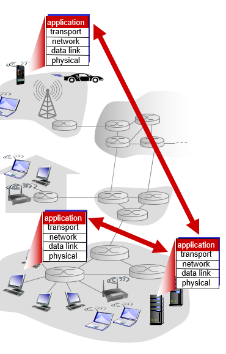

### 2.1.1 네트워크 애플리케이션 구조

- **클라이언트-서버 모델** : 항상 켜저 있는 호스트 시스템(서버)에 가끔 또는 항상 커져있는 호스트 시스템(클라이언트)가 요청을 보내는 구조. 웹 애플리케이션이 그 예이다. 클라이언트가 브라우저를 통해 서버에 객체를 요청하면, 서버는 해당 객체를 응답한다. 서버에는 고정IP가 부여되어 있다. 클라이언트끼리는 직접 통신하지 않는다. 인기있는 서비스의 경우 많은 트래픽을 처리하기 위해 하나의 호스트로 서버를 구성하지 않고 많은 서버를 가지고 있는 데이터 센터를 운영할 수 있다.
- **P2P (Peer-to-Peer) 모델** : P2P 모델에서는 서버를 조금 또는 완전히 의존하지 않을 수 있다. 각 호스트는 서버가 아니라 간헐적으로 연결되어 있는 다른 호스트(peer)와 연결된다. 이들 호스트는 서버가 소유하지 않는다. 하나의 호스트는 다른 호스트로 요청을 할 수 있을 뿐만 아니라, 다른 호스트에 서비스를 제공하는 역할까지 한다. 비트토렌트같은 프로그램이 그 예이다. P2P 모델의 가장 큰 특징은 자가 확장성(self scalability)이다. 즉 새로운 사용자가 등장하면 그에 따라서 서비스 용량과 서비스 요청이 함께 증가한다. 이 모델은 클라이언트-서버 모델과는 다르게 서버 시스템 구축에 대한 비용이 들지 않는다. 대신 많은 수의 호스트에 분산되어 있는 시스템에 대한 보안, 성능, 신뢰성 문제에 직면하고 있다.

### 2.1.2 프로세스 간 통신

운영체제에서 실제로 통신하는 것은 프로그램이 아니라 프로세스(process)이다. 한 호스트내에서 프로세스끼리의 통신은 운영체제별로 다르다. 그보다 우리는 네트워크에 연결된 프로세스간의 통신에 관심이 있다. 이들 프로세스는 애플리케이션 계층에서 메시지 형태로 통신을 한다.

#### 클라이언트와 서버 프로세스

네트워크에서 메시지를 주고 받는 프로세스는 `클라이언트`와 `서버` 둘 중 하나로 이름 지을 수 있다. 일반적으로 요청을 하는 입장을 `클라이언트`, 요청을 받는 입장을 `서버`라고 할수 있다. 다음과 같이 정의할 수도 있다.

> 두 프로세스 간의 통신 세션에서 통신을 초기화(다른 프로세스와 세션을 시작하기 위해서 접속을 초기화)하는 프로세스를 클라이언트라 하고, 세션을 시작하기 위해 접속을 기다리는 프로세스를 서버라고 한다.

P2P 모델에서 호스트는 클라이언트와 서버 2 역할을 모두 수행할 수 있다. 통신 세션이 시작할때 데이터를 받는 쪽을 클라이언트, 보내는 쪽을 서버라고 부른다.

#### 프로세스와 컴퓨터 네트워크 사이의 인터페이스

프로세스는 컴퓨터 네트워크를 통해 메시지를 다른 호스트 시스템에 있는 프로세스에 전송한다. 이 전송은 애플리케이션 계층에서 이루어지며 그 하위 계층(트랜스포트) 계층에서 제공하는 서비스를 사용한다. 애플리케이션 계층에서 트랜스포트 계층의 서비스를 사용하기 위한 일종의 인터페이스로서 소켓(socket)이 존재한다. 이 소켓은 어플리케이션 계층에서 사용할 수 있는 네트워크 서비스에 대한 API라고도 할 수 있다. 애플리케이션 개발자는 소켓의 애플리케이션 부분에 대한 통제권을 갖지만, 트랜스포트 계층에 대한 통제권은 거의 갖지 못한다. 만약 가능하다면 프로토콜(TCP, UDP) 선택이나 해당 프로토콜에서 사용하는 버퍼 크기 정도를 인자로 전달할 수 있을 뿐이다.  
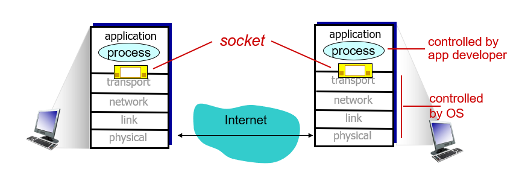

#### 프로세스 주소

한 호스트에서는 여러개의 네트워크 프로세스가 실행될 수 있다. 따라서 호스트에 메시지를 전달하기 위해서는 해당 호스트를 식별하는 주소(IP 주소) 뿐만 아니라 프로세스 식별을 위한 번호(정확히는 소켓을 식별하기 위한), 포트번호(Port)가 필요하다.

### 2.1.3 어플리케이션이 이용가능한 트랜스포트 서비스

소켓은 어플리케이션이 네트워크를 통해서 메시지를 보낼 수 있는 통로 역할을 한다. 따라서 어플리케이션 개발자는 소켓을 통해 제공되는 트랜스포트 서비스의 종류(프로토콜)을 적절하게 선택해야한다. 이를 선택하는 기준에는 다음 4가지가 있을 수 있다.

#### 데이터 신뢰성 (Data Integrity)

데이터가 중간에 손실되지 않고 수신자 호스트에 전송되는 것을 보장하는 것을 **신뢰적 데이터 전송**이라고 한다. 이러한 신뢰적 데이터 전송을 요구하는 예는 문서, 텍스트 메시지, 은행 재무 정보등이 있다. 반면 영상 비디오나 화상통화와 같이 데이터 손실이 큰 영향을 미치지 않는 프로그램도 있다. 이러한 프로그램을 **손실 허용 애플리케이션(loss-tolerant application)** 이라고 한다.

#### 처리율 (Throughput)

트랜스포트 계층에서는 네트워크에서의 트래픽을 파악하고 일정한 처리율을 보장하는 서비스를 제공한다. 처리율에 민감한 앱을 대역폭에 민감한 애플리케이션, 반대를 탄력적 애플리케이션이라고 한다.

#### 시간 (Timing)

트랜스포트 계층은 일정 시간내에 데이터가 전송되도록 하는 시간보장 서비스를 제공하기도 한다.

#### 보안 (Security)

트랜스포트 계층에서 데이터를 전송할 때 암호화에 복호화 서비스를 제공한다. 애플리케이션은 트랜스포트 계층에서의 보안 서비스를 확신하고 데이터를 전송할 수 있다.

### 2.1.4 인터넷 전송 프로토콜이 제공하는 서비스

TCP방식과 UDP 방식의 2가지가 존재한다.

#### TCP

- 연결 지향형 프로토콜이다. 서로간 통신을 하기 전에 미리 연결을 수행해야한다.
- 데이터 전송의 신뢰성이 보장된다.
- 흐름 제어 기능을 수행한다. 수신자의 받는 속도보다 더 빨리 전송하지 않도록 한다.
- 혼잡 제어 기능을 수행한다. 네트워크의 상황을 파악하여 데이터를 전송하는 속도를 제어한다.
- 데이터 스트림 형태로 전송을 한다. 데이터 사이의 경계가 존재하지 않는다.

#### UDP

- 비연결 지향형 프로토콜이다. 데이터를 전송할 때 미리 연결을 하지 않는다.
- 데이터 전송의 신뢰성이 보장되지 않는다.
- 흐름 제어, 혼잡제어와 같은 기능이 없다. 매우 단순한 프로토콜이다.
- 데이터 전송의 신뢰성보다는 신속성을 중요시한다.
- 데이터를 일정 크기의 단위(Datagram)로 전송을 한다. 데이터 사이의 경계가 존재한다.
- Datagram의 전송 순서가 달라질 수 있다.

#### 인터넷 전송 프로토콜이 제공하지 않는 서비스

TCP와 UDP는 암호화, 처리율과 시간보장 서비스는 제공하지 않는다. 대신 애플리케이션 레벨에서 이러한 서비스가 제공되지 않더라도 잘 동작하도록 설계가 되어있다.

### 2.1.5 애플리케이션 계층 프로토콜

애플리케이션 계층 프로토콜은 애플리케이션이 주고 받는 메시지에 대한 규칙이다. 다음과 같은 것들을 다룬다.

- 메시지의 타입
- 메시지가 어떻게 작성되는지(필드와 systax)
- 필드에 담겨 있는 데이터가 무엇을 의미하는지(semantic)
- 메시지를 주고받을 때 사용하는 규칙은 무엇인지

## 2.2 Web and HTTP

웹 페이지는 여러 객체로 구성되어 있다. 기본적인 HTML 문서가 있으며 여기에 여러 객체에 대한 reference가 적혀져 있다. 웹브라우저는 이러한 reference url을 이용해서 object들을 서버로부터 다운로드 한다.

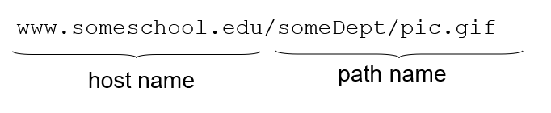

웹에서는 기본적으로 클라이언트-서버구조로 이루어져 있다. 웹에서 사용하는 애플리케이션 레벨 프로토콜은 HTTP(Hyper Text Tranfer Protocol)이다.

클라이언트에서 서버에 요청을 보내는 것을 reqeust, 서버에서 클라이언트로 응답을 보내는 것을 response라고 한다.

HTTP는 4계층 프로토콜인 TCP를 사용한다. client는 먼저 server에서 TCP 연결 요청을 한다. 그 다음 서버는 연결 요청을 수락한다. 다음에 client는 TCP 연결을 통해서 객체에 대한 HTTP request 메시지를 보낸다. 서버는 HTTP 메시지를 수신한 다음 클라이언트에서 요청한 객체와 함께 HTTP response 메시지를 보내고 TCP 연결을 끊는다. client에서는 서버에서 받은 HTTP response를 분석하고 객체를 웹 브라우저에 렌더링한다.

HTTP의 중요한 개념 중 하나는 **stateless**이다. 즉, 이전 연결에 대한 정보가 다음 연결에 영향을 주지 않는다.

### non-persistant HTTP, persistent HTTP

- RTT(Round Trip Tim) : 작은 패킷이 서버로 전송되어 클라이언트로 돌아오기까지 걸린시간

#### non-persistent HTTP

한번의 TCP connection에서 하나의 객체만 전송가능한 형태이다. 예를들어 10개의 ojbect로 구성된 HTML 문서를 서버로 요청하는 상황은 다음과 같다.

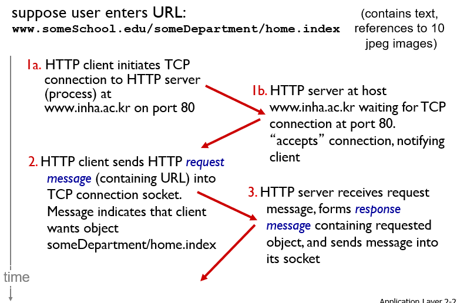
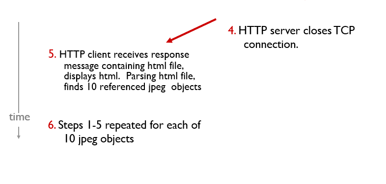

하나의 객체를 다운받을 때마다 **2RTT + 데이터전송시간** 이 걸린다.

웹 문서가 여러개의 객체로 이루어진 경우에 모든 객체를 다운 받기 위해서 반복해서 연결을 하고 연결을 끊는 이런 방식은 비효율적일 수 있다. 이를 해결하기 위해서 한번의 요청시 많은 수의 connection을 많들어 두는 방법이 있다.

#### persistent HTTP

한번 TCP connection이 이루어지고 난 뒤 계속해서 연결을 유지해놓는 형태이다. 한번의 TCP 연결을 통해 여러 객체와 HTTP 메시지를 주고받을 수 있다. 이 경우 한 객체를 전송받는데 걸리는 시간은 각각 **1RTT+ 파일전송시간** 이 된다.

### Cookies

HTTP는 stateless 하여 연결 정보(상태 정보)를 저장하지 않는다고 하였다. 그러나 웹에서는 사용자의 상태 정보를 저장해두는 방법이 있는데 그것이 바로 **Cookies** 이다. Cookies는 다음 4가지 요소로 이루어져 있다.

- HTTP response header 라인에 존재하는 쿠키정보
- HTTP request header 라인에 존재하는 쿠키정보
- 사용자 호스트에서 웹브라우저에 의해 관리되는 쿠키파일
- 웹 사이트의 벡엔드에서 관리되는 데이터베이스

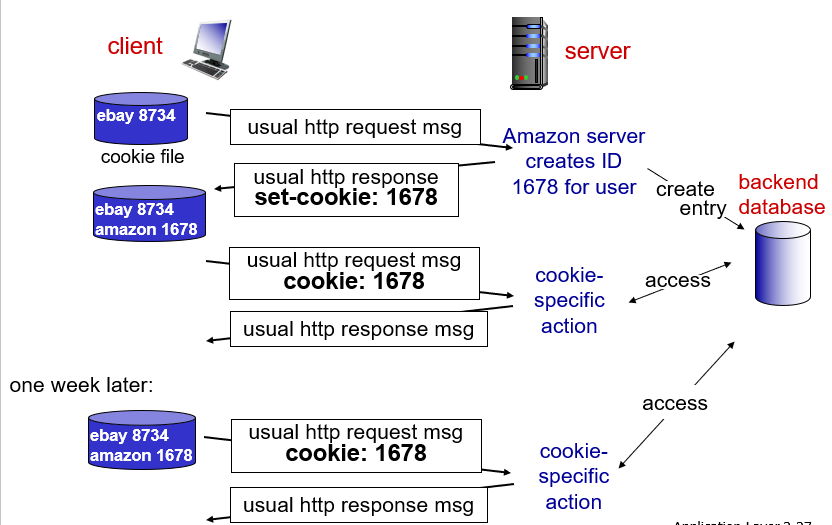

쿠키를 통해 클라이언트의 상태 정보를 저장해두면 다음과 같이 활용할 수 있다.

- 사용자에 따라서 광고 타겟팅을 할 수 있다.
- 인증이나 세션정보를 저장할 수 있다.
- 장바구니와 같은 상태정보를 저장하는 기능을 구현할 수 있다.

그러나 사용자 정보가 유출될 수 있다는 위험성이 있다.

### Web caches(proxy server)

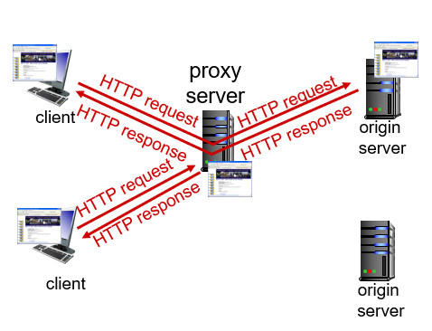

클라이언트와 서버 사이에 캐시 형태의 서버를 하나 추가할 수 있다. 이를 **proxy server** 라고 한다. 주된 목적은 origin server의 개입 없이도 HTTP 통신을 할 수 있게하고 인터넷 속도를 향상시키기 위함이다. 요청하는 객체가 proxy server에 있다면 proxy 서버가 클라이언트에게 해당 객체를 전송하고, 없다면 orgin server에게 해당 객체를 받은 다음 클라이언트에 전달한다. 인터넷 속도 향상, ip 우회, 특정 시설의 access link에서의 트래픽 감소 등의 목적으로 사용될 수 있다.

> proxy는 영어로 대리인, 위임자라는 뜻을 가지고 있다.

Web caching에 대해서 다음과 같은 예시를 보자

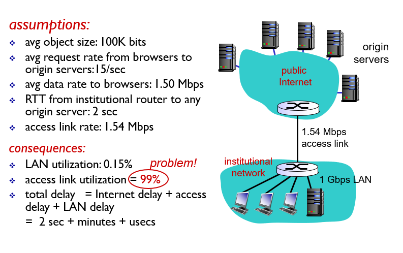

시설 내부의 Lan 속도는 1Gbps에 달하는데, access link의 속도는 1.54 Mbps 밖에 안되는 안습의 상황이다. 위 그림에서 설명한 대로 access link에서의 지연시간 때문에 응답 시간이 매우 길어졌다. 이를 해결하기 위해 다음과 같이 access link를 교체하는 방법이 있다.

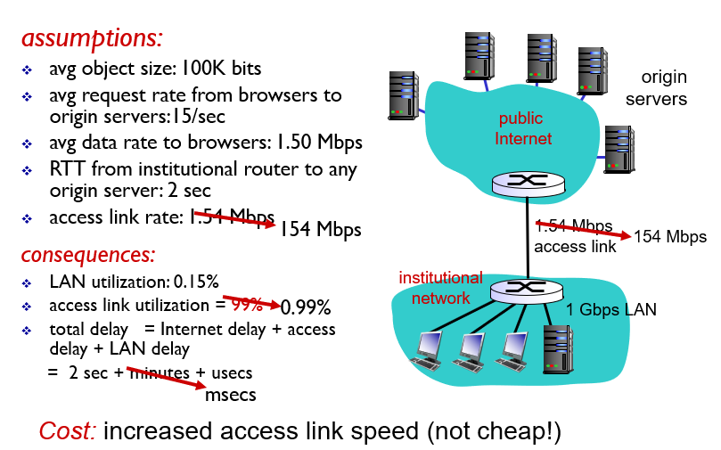

access link에 대한 성능이 100배 향상되었고, 그에 따라서 access link에서의 지연시간도 무시할 수 있는 정도로 떨어졌다. 이제 전체 지연시간은 인터넷 지연시간인 2초 정도로 떨어진다. 그러나 기관의 access link는 가격이 매우 비싸서 이와 같은 해결책은 엄청난 비용이 들어간다. 만약 기관의 호스트들이 모두 비슷한 컨텐츠를 이용한다면 기관내에 웹 캐시를 두어 성능을 향상시키는 방법이 있다.

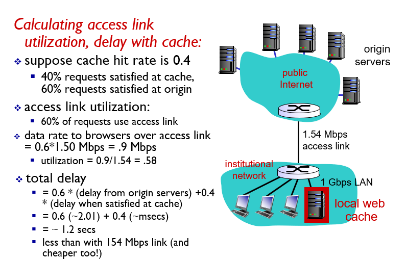

웹 캐시에 대한 적중률이 0.4 정도 된다고 가정해보자. 그럼 전체 트래픽의 0.6 정도만이 access link를 사용하게 된다. 이와 같은 access link에서의 트래픽 강도는 access link의 지연시간을 무시할 수 있을 만큼 떨어뜨린다. 외부 서버로 향하는 통신의 지연시간과 내부 캐시로의 통신 지연시간을 고려하여 전체 지연시간을 계산해보면 대략 1.2초가 된다. 이는 고가의 access link를 설치하는 것보다 저렴하면서, 성능은 보다 개선시킨다.

그러나 장기적인 플랜을 가지고 성능을 개선한다면 위의 예시보다 많은 것들을 고려하여 개선책을 선택해야한다.

## 2.3 FTP(File Transfer Protocol)

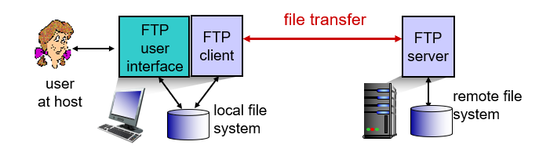

파일 전송 프로그램에서 사용하는 어플리케이션 프로토콜이다.

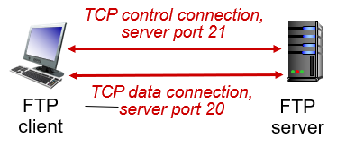

FTP의 특징은 파일전송프로그램의 동작을 제어하는 control을 위한 connection과 data 전송을 위한 connection이 분리(separate)되어 있다는 것이다. control 명령을 위한 connection은 21 port로 형성되고, data 전송을 위한 conneciton은 22 port로 형성된다. FTP는 control 정보를 **out of band** 에서 전송한다고 표현한다.

## 2.4 electronic mail

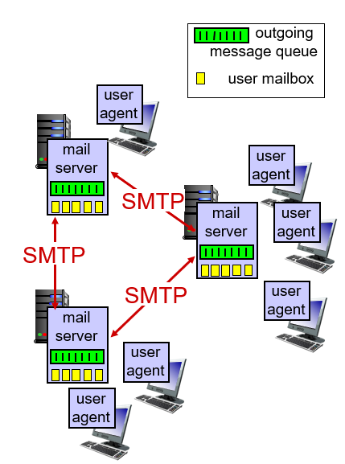

전자 메일은 다음과 같은 3가지 요소로 이루어져 있다.

- user agent : 사용자가 메일을 쓰고, 메일을 읽을 때 사용
- mail server : 사용자가 메일을 보내면 메일 서버의 큐로 보내지고, 수신자의 메일 서버 박스에 메일을 전송
- SMTP protocol : 메일 서버끼리의 프로토콜

### SMTP

메일을 보내면 바로 수신자 호스트로 보내지는 것이 아니라 메일서버에 저장이된다. 실제로 메일을 주고받는 것은 메일 서버끼리이다.

트랜스포트 프로토콜로 TCP 방식을 사용하며 25번 포트를 사용한다. 메일 내용은 반드시 ASCII 로 작성되어야 한다.

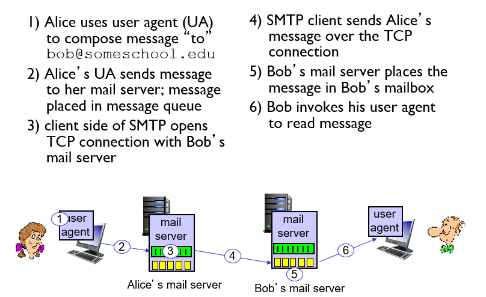

### POP3

user agent에서 메일 서버에 있는 메일을 다운로드할 때 사용하는 프로토콜이다. 간단한 형태로 작성되어 있다. TCP connetion을 사용하며 connection 동안 사용자의 상태정보를 저장할 수 있다.

### IMAP

user agent에서 메일 서버에 있는 메일을 확인할 때 사용하는 프로토콜이다. POP3와는 다르게 서버에 메일을 모아서 저장해둘 수 있고, 서버에 디렉토리 구조를 형성하여 메일을 정리할 수도 있다. 역시 TCP connection을 사용하며 여러 session 간에 사용자 정보를 유지한다(디렉토리와 메시지 맵핑과 같은)

### HTTP

웹 메일을 사용하여 메일을 확인할 때 사용하는 프로토콜이다. 메일 서버에 있는 메일을 확인할 때 HTTP를 사용한다.

## 2.5 DNS

IP address와 domain name를 맵핑해주는 시스템이다. 여러 데이터베이스에 분산 처리되어 있고, 많은 name server들의 계층구조를 가진다.

### DNS service, structure

- host의 ip address와 domain name을 매핑해준다.
- host의 aliasing
- 여러 ip를 하나의 domain name에 매핑하여 부하 분산을 하기도 한다.

DNS는 centralize가 아니라 분산 및 계층화구조로 되어있다.

centralize 의 단점

- single point of failure
- traffic volume
- 어떤 지점에서 거리는 멀어짐
- doesn't scale

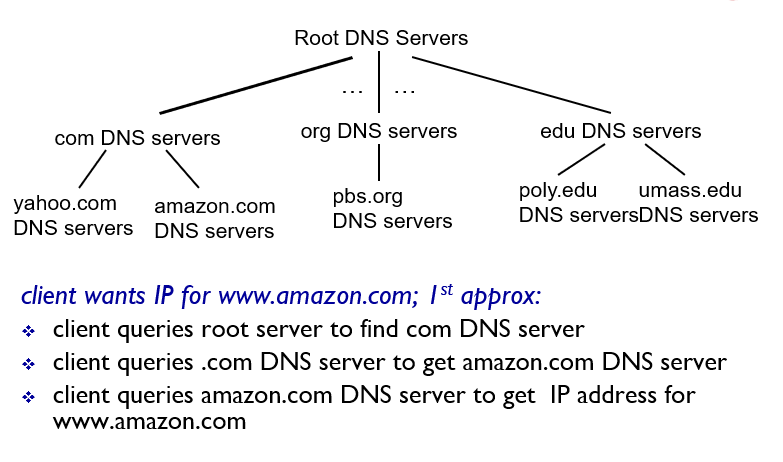

DNS서버는 계층 구조로 되어 있다.

- ROOT DNS server : 최상위 서버. 전세계의 13개 기관에서 관리한다.
- TLD(Top Level Domain Server) : com, kr, org와 같은 그룹을 관리하는 서버
- authoritative server : 실제 도메인 네임과 ip 매핑을 관리하는 서버
- Local DNS 서버 : 계층 구조에는 들어가지 않지만, ISP에서 제공하는 일종의 proxy server. cache 기능도 수행한다.

### DNS name resolution example

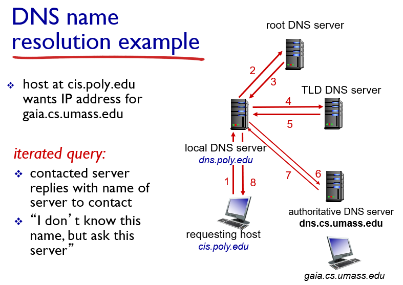

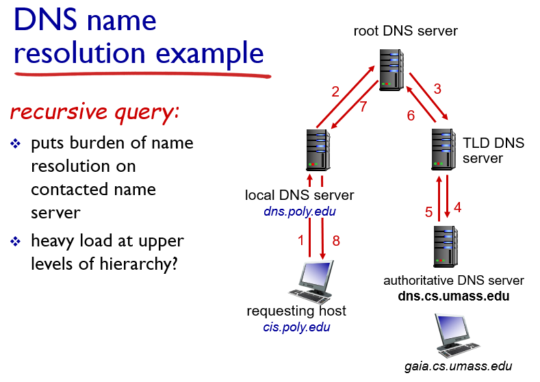

## 2.6 P2P applications

한 호스트가 클라이언트와 서버의 역할을 모두 수행할 수 있다. 파일을 일정 단위의 chunk로 나누어서 여러 호스트가 관리한다.

## 2.7 Socket programming with UDP and TCP

5계층에서 4계층 프로토콜을 소개하는 이유는 5계층에서 바로 4계층 서비스를 이용하기 때문이다. 어플리케이션에서 네트워크를 통해 메시지를 주고 받기 위한 통로 역할을 한다.

### TCP(Tranfer Control Protocol)

- 연결 지향형 프로토콜이다. 데이터 전송의 신뢰성이 보장된다. 반드시 1대1 연결이어야한다.
- 흐름 제어 기능을 수행한다. 수신자의 받는 속도보다 더 빨리 전송하지 않도록 한다.
- 혼잡 제어 기능을 수행한다. 네트워크의 상황을 파악하여 데이터를 전송하는 속도를 제어한다.
- 데이터 스트림 형태로 전송을 한다. 데이터 사이의 경계가 존재하지 않는다.

### UDP(User Datagram Protocol)

- 비연결 지향형 프로토콜이다. 데이터 전송의 신뢰성이 보장되지 않는다.
- 흐름 제어, 혼잡제어와 같은 기능이 없다. 매우 단순한 프로토콜이다.
- 데이터를 일정 크기의 단위(Datagram)로 전송을 한다. 데이터 사이의 경계가 존재한다.
- Datagram의 전송 순서가 달라질 수 있다.
- 데이터 전송의 신뢰성보다는 신속성을 중요시한다.
