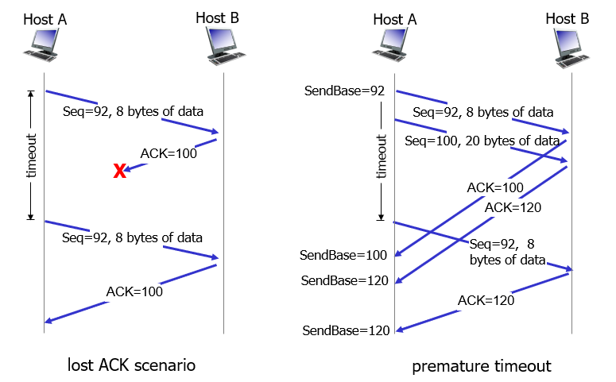
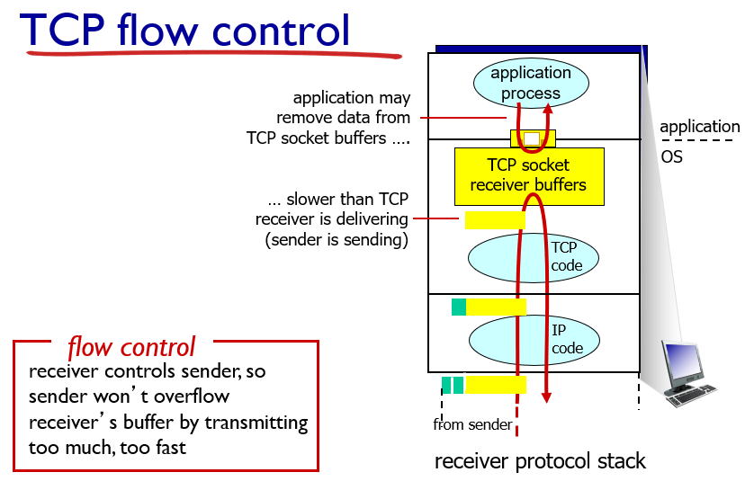
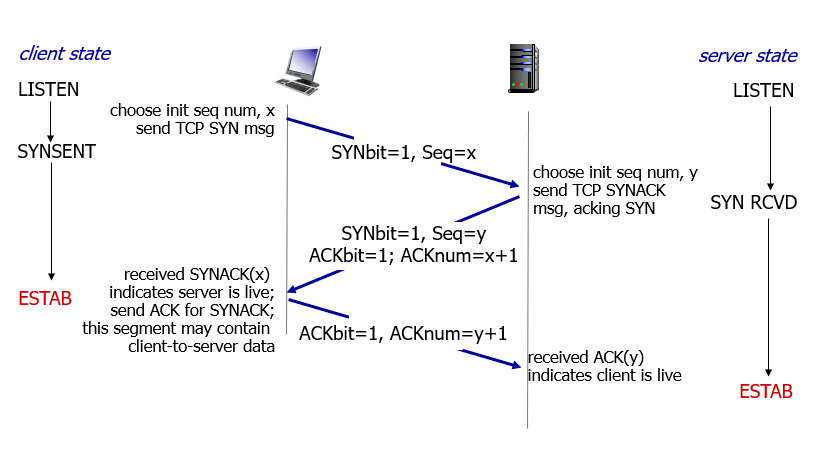
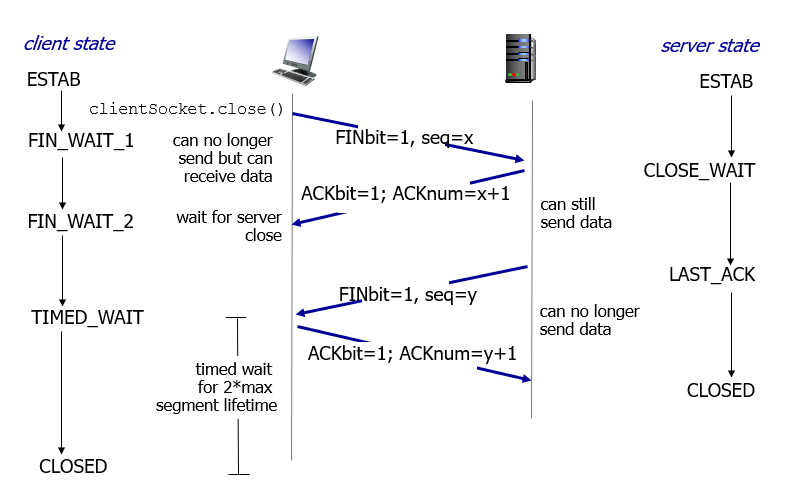
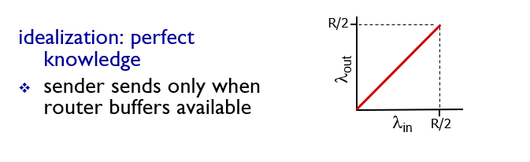
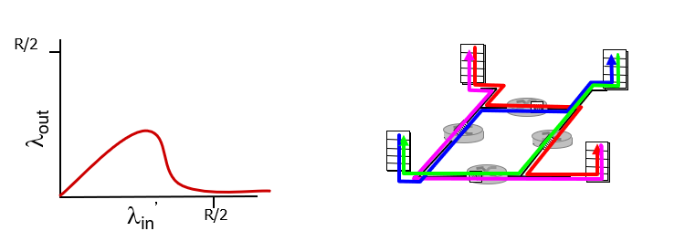

# Ch03 Transport Layer

이 장의 목표 : 트랜스포트 계층에서 제공하는 서비스들에 대한 원리와 이 원리가 어떻게 구현되어 있는지를 안다.

## 3.1 트랜스포트 계층 서비스 및 개요

트랜스포트 계층의 서비스는 한마디로 양쪽의 네트워크 호스트에서 실행되는 **프로세스** 간의 **논리적 통신(Logical Communication)** 을 제공하는 것이다. 애플리케이션은 메시지를 전송하기 위해서 사용되는 물리적인 하위 구조에 상관없이 트랜스포트 계층을 사용하여 논리적인 통신을 할 수 있다.

트랜스포트 계층은 네트워크 코어가 아니라 호스트 시스템 상에서 구현된다. 트랜스포트 계층에서는 애플리케이션 계층의 프로세스에게서 다른 end system에 존재하는 프로세스로 보낼 데이터(message)를 전달받는다. 그 다음 이 message를 적당이 나눈뒤 트랜스포트 계층 헤더를 추가한다. 이 트랜스포트 계층에서의 데이터 패킷을 **세그먼트(segment)** 라고 한다. 그 다음 아래 계층인 네트워크 계층 서비스를 이용하여 수신자의 end system의 네트워크 계층으로 세그먼트를 보낸다. 수신자 호스트에 존재하는 트랜스포트 계층은 네트워크 계층으로부터 송신자가 보낸 세그먼트를 받은 뒤 이를 다시 위 계층에 존재하는 프로세스로 전달하는 역할을 한다.

애플리케이션은 트랜스포트 계층의 서비스를 이용하기 위해서 2가지 이상의 프로토콜을 사용할 수 있는데, `TCP`와 `UDP`가 대표적인 프로토콜이다.

### 3.1.1 트랜스포트 계층과 네트워크 계층 사이의 관계

트랜스포트 계층을 다루는 chapter에서 네트워크 계층을 언급하는 이유는 무엇일까? 그것은 트랜스포트 계층이 직접적으로 사용하는 서비스가 바로 아래 계층인 네트워크 계층의 서비스이기 때문이다.

트랜스포트 계층이 통신하는 두 호스트 상에서 동작하는 **프로세스들 간의 논리적 통신** 을 제공한다면, 네트워크 계층은 **호스트 간의 논리적 통신** 을 제공한다. 다음과 같은 비유로 이해해볼 수 있다.

위에서 서술했다시피 트랜스포트 계층은 바로 아래 네트워크 계층 서비스를 이용하여 데이터를 전송한다. 그렇기 때문에 트랜스포트 계층의 서비스는 네트워크 계층 서비스에 의존적일 수 밖에 없다. 그러나 모든 부분에서 의존적인 것은 아니다. 네트워크 계층에서 제공하지 않는 서비스를 트랜스포트 계층에서 더욱 강화하여 제공하는 경우도 있다. 예를 들어 TCP는 신뢰적 데이터 전송을 보장하는데, 네트워크 서비스는 데이터의 신뢰적 전송을 보장하지 않는다. 트랜스포트 계층에서 기능을 추가하여 서비스를 강화한 형태이다.

### 3.1.2 인터넷 트랜스포트 계층의 개요

인터넷 트랜스포트 계층에서 제공하는 프로토콜은 **TCP**와 **UDP**가 있다.

네트워크 계층에서의 프로토콜을 잠깐만 살펴보자. 이 계층에 존재하는 프로토콜은 IP(Internet Protocol)이다. 트랜스포트 계층으로부터 받은 세그먼트에 네트워크 계층 헤더를 붙여서 캡슐화한다. 이 계층에서 사용하는 데이터패킷 용어를 **데이터그램(datagram)** 이라고 한다. 네트워크 상에서 존재하는 라우터들은 네트워크 계층에서 붙인 헤더에만 접근할 수 있고, 또 그것에만 영향을 받는다. IP 프로토콜은 호스트들 간의 논리적 통신을 제공하는 **최선형 전달 서비스(best-effort delivery service)** 이다. IP 프로토콜은 데이터그램이 라우터들을 지나 수신자 호스트로 전달되게 하는 비신뢰적인 서비스이다. 데이터그램이 손실되지 않는지, 순서대로 전달되는지, 데이터그램의 무결성이 깨지지는 않았는지 보장하지 않는다.

이제 TCP와 UDP에 대해서 간략하게 살펴보자. 이들 프로토콜은 네트워크 계층에서 제공하는 **호스트와 호스트간의 통신**을 **프로세스와 프로세스간의 통신** 으로 확장한다. 이것을 트랜스포트 **Multiplexing** 과 **Demultiplexing** 이라고 한다. 또한 애플리케이션 메시지를 분할하고 트랜스포트 헤더를 붙일때 오류 검출 필드를 붙여 데이터 전송의 **무결성 확인** 기능을 제공하기도 한다. 위에서 언급한 2가지 기능이 UDP에서 제공하는 기능의 전부이다. UDP는 프로세스들 간의 비신뢰적이고 비연결적인 데이터 전송을 제공한다.

반면에 TCP는 데이터 전송간에 **혼잡제어**와 **흐름제어**와 같은 추가적인 기능을 제공한다. 또한 TCP는 프로세스들 간의 **신뢰적 데이터 전송기능**을 제공한다.

## 3.2 다중화와 역다중화(Multiplexing과 Demultiplexing)

호스트 시스템에서는 여러 개의 네트워크 프로세스가 실행될 수 있다. 각 프로세스는 네트워크 상에 연결된 다른 호스트의 프로세스와 통신하며 메시지를 주고 받는다. 목적지 호스트의 트랜스포트 계층은 네트워크 계층으로부터 받은 데이터그램을 세그먼트로 풀고, 해당 메시지를 적절한 프로세스로 전달한다. 그렇다면 트랜스포트 계층은 여러 프로세스 중 어떻게 적절한 프로세스에게 메시지를 전달하는 것일까? 반대로 한 호스트에서 동작하는 여러 프로세스에서 생성한 메시지를 어떻게 모두 다 다른 목적지로 보낼 수 있을까?

앞에서 언급한 질문 중 첫번째를 Demultiplexing, 두번째를 Multiplexing이라고 한다. 앞서 애플리케이션 계층에서 실행되는 모든 네트워크 애플리케이션에는 포트번호가 부여된다는 것을 배웠다. 사실 포트번호는 프로세스에 부여되는 것이 아니라, 이들 프로세스가 네트워크 서비스를 이용하기 위해서 생성은 소켓에 부여되는 번호이다. 호스트에서 실행되는 네트워크 프로세스가 여러 개일 수 있는 만큼, 생성되는 소켓도 여러개가 될 수 있다. 적절하게 Demultiplexing 하기 위해서는 소켓을 식별할 수 있는 유일한 식별자가 필요해진다. 트랜스포트 계층의 프로토콜(TCP, UDP)마다 소켓을 구별하기 위한 식별자를 소켓에 부여한다.

트랜스포트 계층에서는 메세지에 적절한 헤더 정보를 추가하는데, 목적지 프로세스 소켓의 포트번호와 출발지 프로세스 소켓의 포트번호를 추가한다. 네트워크 계층에서는 이에 추가하여 출발지와 목적지 IP 주소 정보를 헤더에 추가하여 데이터그램을 완성시킨다. 이렇게 하여 여러 프로세스로부터 받은 메세지들을 모두 적절한 목적지로 이동할 수 있도록 Multiplexing 할 수 있다.

네트워크 계층을 통해서 목적지 호스트의 네트워크로 데이터그램을 이동시키면, 목적지 호스트의 네트워크 계층은 다시 트랜스포트 계층으로 패킷을 전송한다. 트랜스포트 계층에서는 세그먼트의 헤더정보에 담긴 목적지 포트번호를 확인하여 적절한 프로세스의 소켓에 메세지를 전달한다. 이 과정이 Demultiplexing의 원리이다. 지금 서술한 Demultiplexing은 목적지 포트번호만을 확인하는 UDP 프로토콜의 과정이다. TCP 프로토콜에서는 목적지 소켓을 특정하기 위해 추가적인 정보(출발지 포트번호, 목적지 포트번호, 출발지 IP, 목적지 IP)를 확인한다.

### 비연결형 다중화와 역다중화

비연결형 트랜스포트 프로토콜에서는 Multiplexing과 Demultiplexing 을 위해서 세그먼트 헤더에 출발지 포트번호와 목적지 포트번호를 설정하고 확인한다. 수신자 호스트에서 세그먼트를 수신한 트랜스포트 계층은 목적지 포트번호를 보고 적절한 프로세스의 소켓에 메시지를 전달한다. 출발지 포트번호는 메시지 수신자가 다시 송신자에게 응답메시지를 보내고 싶을 경우, 출발지 포트번호를 목적지 포트번호로 설정하여 사용하기 위해서 추가된다.

그림에서 양쪽 두개의 호스트에서 가운데 호스트로 동일한 목적지 포트 번호를 설정하여 세그먼트를 전달하는 것을 볼 수 있다. 비연결형에서는 소켓을 구별하는 식별자로 목적지 포트번호만을 사용하기 때문에 이들 데이터는 모두 동일한 프로세스의 소켓으로 전달된다.

### 연결형 다중화와 역다중화

TCP 연결형 다중화는 좀 더 추가적인 정보를 살펴봐야한다. 프로세스가 소유하는 소켓은 다음의 4개의 튜플로 식별된다.

- 출발지 IP와 출발지 포트번호
- 목적지 IP와 목적지 포트번호

TCP 프로토콜을 사용하는 프로세스는 여러개의 연결을 수행하여 많은 소켓을 생성하여 사용할 수 있다. 트랜스포트 계층에서 Demultiplexing을 수행하기 위해서는 세그먼트 헤더에 포함된 4가지 튜플을 확인하여 적절한 프로세스 소켓에 메시지를 전달한다(초기 서버 연결 요청은 제외). 위 그림에서 B라는 IP주소를 갖는 호스트에 3개의 세그먼트가 모두 동일한 목적지 포트번호를 갖고 전송되고 있으나, 모두 다른 소켓으로 메시지가 전송되는 것을 볼 수 있다. 이는 TCP 연결에서는 소켓을 식별하기 위해 목적지 포트 번호에 더하여 추가적인 3가지 정보(목적지 IP, 출발지 IP, 출발지 포트번호)를 사용하기 때문이다.

## 3.3 비연결형 트랜스포트: UDP

UDP는 매우 간단한 기능만을 제공하는 트랜스포트 프로토콜이다. UDP는 네트워크 프로세스에서 메시지를 받아서 포트번호를 설정하여 세그먼트로 만들고 네트워크 계층으로 전달한다(Multiplexing). 목적지에서는 네트워크계층에서 받은 세그먼트를 다시 목적지 포트번호와 동일한 소켓에서 전달한다(Demultiplexing). 네트워크 애플리케이션은 거의 IP를 이용해서 통신하는 것과 같다. 네트워크 계층은 데이터그램을 best effort delivery 방식으로 전달하기 때문에 UDP 역시 best effort delivery라고 할 수 있다. 이 때문에 중간에 패킷이  손실되거나, 패킷의 순서가 바뀌어서 전달될 수도 있는 비신뢰적인 데이터 전송이다. 호스트간의 논리적 통신 서비스만을 제공하고, TCP와 같이 혼잡제어나 흐름제어와 같은 추가적인 기능을 제공하지 않는 단순한 데이터 전송이다. 또한 TCP처럼 서로 통신하기 전에 handshaking 과정이 없는 비연결형 트랜스포트이다.

UDP는 주로 영상미디어처럼 데이터의 일부가 손실되어도 큰 지장이 없는 loss tolerant 애플리케이션에 사용될 수 있고, DNS에서도 사용될 수 있는데 TCP처럼 우선 연결이 필요한 통신은 느리기 때문에 빠른 데이터 전송이 필요한 UDP가 선호된다. 그리고 네트워크의 상태를 점검하는 SNMP에서도 UDP가 사용되는데, 혼잡한 상태의 네트워크에서 자동으로 패킷전송 속도를 조절하는 TCP를 이용해서는 네트워크 상태를 진단하기 어렵기 때문이다.

TCP가 더 많은 기능을 제공함에도 UDP가 존재하는 이유는 다음과 같다.

- 애플리케이션 레벨에서 무슨 데이터를 언제 보낼지에 대해 더 정교한 제어가 가능하다.
- 통신을 하기 전 미리 연결을 하지 않는다. 통신을 하기 전 상대적으로 긴 연결과정이 없기 때문에 빠른 전송이 필요한 DNS 같은 곳에서 선호된다.
- 연결 상태를 저장하지 않는다. TCP에서는 서로 통신하기 위해 출력버퍼, 입력버퍼, 혼잡제어 조절을 위한 파라미터 등 연결상태를 저장하게 된다. UDP에서는 이러한 연결상태를 저장하지 않기 때문에 적은 오버헤드로 더 많은 연결을 할 수 있다.
- 패킷 사이즈가 줄어든다. UDP에서 추가하는 세그먼트 헤더는 8바이트인 반면 TCP에서 추가하는 세그먼트 헤더는 20바이트나 된다.

### 3.3.1 UDP 세그먼트 구조

UDP에서는 네트워크 프로세스로부터 받은 메시지에 16bit로 구성된 필드 4개를 붙여서 세그먼트로 만든다. 출발지 포트번호와 목적지 포트번호, UDP 세그먼트의 전체 바이트길이, checksum 비트가 그 헤더 필드들이다. 포트번호는 Multiplexing과 Demultiplexing에 사용된다. checksum 필드는 오류검출을 위해 사용된다.

### 3.3.2 UDP 체크섬

송신자 입장에서 UDP 체크섬 필드를 구성하는 방법은 다음과 같다. 전체 UDP 세그먼트의 데이터를 16bit 워드 단위로 모두 더하고, 그 과정에서 발생한 최상위비트 캐리는 윤회식으로 맨아래 비트에 더하며, 최종적으로 덧셈 결과에 1의 보수를 취한 결과와 같다. 이 과정은 위 그림에서 다시 확인할 수 있다. 수신자는 다시 segment의 모든 필드를 더하고 checksum 필드까지 더한다. 그 결과가 1111111111111111 과 같으면 세그먼트에 오류가 없다는 것을 확인할 수 있다.

이러한 checksum은 신뢰적 데이터 전송과는 상관이 없는 개념이다. 신뢰적 데이터 전송은 수신자에서 패킷을 잘 받았는지에 대해서 확인하는 과정이 필요하다.

UDP 체크섬 필드는 세그먼트에 오류 존재 여부만 확인해줄뿐, 오류 회복에 대해서는 아무런 조치를 취하지 않는다. UDP 프로토콜이 오류가 있는 세그먼트를 발견했을때, 해당 세그먼트를 버리거나, 아니면 소켓에서 경고를 주면서 해당 세그먼트를 전달하는 것 뿐이다.

## 3.4 신뢰성 있는 데이터 전송의 원리

신뢰성 있는 데이터 전송은 네트워크에서 가장 중요한 10가지 개념 중 하나로 생각되는 만큼 중요하며, 트랜스포트 계층뿐만 아니라 네트워크 계층이나, 링크 계층에서도 적용될 수 있는 보편적인 개념이다.

위 그림은 앞으로 우리가 제작할 신뢰성 있는 데이터 전송원리의 프레임워크이다. (a) 우리는 상위 계층에게 신뢰성 있는 데이터 전송 서비스를 제공하는 것이 목표이다. 그러나 하위 계층(네트워크 계층)이 제공하는 서비스가 비신뢰적인 서비스라는 점이 우리의 작업을 어렵게 하는 요소이다.

(b) 그림은 우리가 구축할 서비스가 어떤 형태의 인터페이스로 실행될 것인가를 간략하게 보여준다. 송신자와 수신자의 트랜스포트 계층에는 우리가 구현할 reliable data transfer protocol(rdt)가 존재한다. 송신자의 상위 계층에서 데이터를 전송하기 위해서는 rdt의 rdt_send() 함수를 호출하면서 수행될 수 있다. 다음으로 하위 계층의 서비스를 이용해서 수신자의 rdt에 패킷을 전송하기 위해서는 하위계층(udt)의 udt_send() 함수를 호출하면서 수행될 수 있다. 수신자쪽에서는 하위계층(udt)가 송신자쪽에서 보낸 패킷을 수신한 경우 수신자 rdt의 rdt_rcv() 함수를 호출하여 패킷을 rdt에 보낼 수 있다. 마지막으로 rdt에서 상위 계층으로 데이터를 전달하기 위해 deliver_data() 함수를 호출한다.

문제를 간단하게 하기 위해서 우리가 사용하는 하위계층은 패킷을 순서대로 전달한다고 가정한다. 또한 송신자측에서 수신자측의 한 방향으로만 데이터를 전달한다고 가정한다. 그러나 데이터가 아닌 제어 신호는 양방향으로 전달될 수 있다.

그리고 송신자측과 수신자측의 프로토콜 동작을 표현하기 위해서 FSM(Finite State Machine)을 사용할 것이다. state transition은 화살표로 표현하고, 특정 이벤트 발생은 선으로 표현한다. 선 위에는 발생한 이벤트가, 그 아래에는 event로 인해 state transition이 발생할때 동작하는 action들이 나타난다. &Lambda; 기호는 아무런 동작을 수행하지 않거나, 아무런 이벤트가 발생하지 않음을 의미하는 기호로 사용된다.

### 3.4.1 신뢰적인 데이터 전달 프로토콜의 구축

우리는 하위 계층에 대한 가정을 점차 늘려가면서 조금씩 rdt를 구현할 것이다.

#### reliable transfer over a reliable channel : rdt 1.0

가장 첫번째로 하위 계층의 서비스가 패킷을 손상시키지 않으며 패킷 손실도 없는 reliable한 channel임을 가정한다. 이러한 가정에서 우리가 구현하는 rdt의 송신자, 수신자의 FSM은 다음 그림과 같다.

reliable한 하위 채널을 사용하기 때문에 송신자가 보낸 패킷은 무조건적으로 수신자에게 도달된다.

#### reliable transfer over a channel with bit errors : rdt 2.0

다음으로 하위 채널이 제공하는 서비스가 패킷의 비트 일부를 손상(flip 등등...) 시키는 경우를 생각해보자. 일단 송신자가 보낸 패킷에 손상이 있는지 여부를 확인하기 위해서 패킷에 checksum 필드가 추가되어야 한다. 패킷에 손상이 있을때 수신자는 어떻게 error를 복구시킬까?

이에 대한 대답을 하기전에 일상생활에서 비슷한 예를 들어보자. A, B 두 사람이 통화를 하고 있고 A가 B에게 010-1234-5678이라는 전화번호를 알려주고 있는 상황이라고 가정해보자. A는 -로 구분된 숫자 그룹(패킷)을 B에게 알려준다. 만일 우리가 B라고 했을때 숫자 그룹을 잘 알아들었으면 (네~)하고 수신여부를 A에게 알려줄 수 있다. 또한 잘 못 알아들었을때 (뭐라구요?)하고 잘못된 수신을 A에게 전달하여 잘 못들은 부분을 다시 알려줄 것을 요구할 수 있다.

비슷한 동작을 rdt에서도 수행할 수 있다. 수신자측은 송신자가 보낸 패킷에 오류가 없는 경우 송신자에게 positive acknowledgements 신호 (ACK)를 피드백으로 보낸다. 또한 패킷에 오류가 있는 경우에는 negative acknowledgements 신호 (NAK)를 피드백으로 보낸다.

송신자쪽에서는 수신자로부터 NAK 피드백을 받으면 패킷이 손상되었다는 것을 감지하고 전에 보냈던 패킷과 동일한 패킷을 수신자에게 보낸다. 수신자로부터 ACK 피드백을 받으면 다시 상위 계층으로부터 rdt_send 호출이 일어날 때까지 대기하게 된다.

송신자는 다음 패킷을 보내기 전에 반드시 수신자로부터 ACK 신호를 받을때까지 기다려야하기 때문에 이 방식의 특징을 `stop-and-wait`라고 한다.

rdt 2.0은 잘 동작하는 것처럼 보이지만 치명적인 결함이 있다. 바로 **ACK과 NAK이 손상되었을 가능성을 고려하지 않은 것이다.**

#### rdt 2.1 : handles garbled ACK/NAKS

일단 ACK/NAK 신호가 손상되었다는 것을 확인할 수 있도록 ACK/NAK 패킷에 checksum 비트가 추가되어야한다. 그 다음 실제적으로 ACK/NAK 신호가 손상되었다면 송신자는 어떻게 대처할 수 있을까?

여러 방식이 있을 수 있지만, 송신자는 ACK/NAK 패킷에 손상이 있는 경우 단순히 전에 보낸 패킷을 재전송한다. 그러나 단순히 재전송만 이루어져서는 안된다. 수신자는 송신자에게 보낸 ACK/NAK 신호에 손상이 있었는지 알 수 없기 때문에 송신자가 다시 보낸 데이터가 전에 보낸 데이터를 다시 보낸 것인지, 아니면 새로운 패킷인건지 알 길이 없기 때문이다.

이러한 문제를 해결하기 위해서 송신자는 패킷을 전송할 때 패킷에 **순서번호(sequece number)** 를 붙여서 전송한다. 다음은 이러한 방식으로 동작하는 sender의 FSM을 나타내는 그림이다.

다음은 수신자 측의 FSM을 나타낸다. 수신자는 이전 번호에 대한 패킷이 송신자로부터 중복으로 들어오는 경우 수신자가 보낸 ACK 패킷이 손상되었다는 것을 감지하고 해당 패킷을 버린 다음 다시한번 ACK 패킷을 전송한다. 수신한 패킷이 손상되어 보낸 NAK 패킷이 손상된 경우 역시 송신 측에서 피드백 패킷 손상에 대한 대처가 이전 패킷을 재전송하는 것이기 때문에 잘 해결된다. 수신자는 기다리고 있던 다음 번호의 패킷을 잘 전달받은 경우에만 다른 번호의 패킷을 기다리는 상태로 전이한다.

여기서 순서번호(sequence number)는 0과 1 두가지만 사용되고 있는데, 이는 패킷을 한번에 하나씩만 보내는 특성에 의한 것이다. 송신자와 수신자가 한번에 처리하는 패킷이 단 하나이기 때문에 이 패킷이 이전 패킷인지 아닌지만 구분하면 된다. 이 후에 다루어지는 파이프라이닝 패킷 전송 기법에서는 sequence number가 여러개가 될 수 있다.

#### rdt 2.2 : NAK free protocol

rdt 2.1의 수신자에서 좀 더 개선할 수 있는 여지가 있다. 송신자가 보낸 패킷에 손상이 있는 경우 NAK 패킷을 보내는 것이 아니라 이전 패킷에 대한 ACK 신호를 다시 보냄으로써 해당 패킷을 재전송하도록 요구하는 것이다. 단, 이를 위해서 수신자가 보낸 ACK 패킷이 송신자의 어떤 sequence number 패킷에 대한 것인지를 확인할 수 있도록 ACK 패킷에도 sequence number를 부여해야 한다. 다음 그림은 rdt 2.2의 송신자, 수신자측 FSM이다.

#### rdt 3.0 : channels with errors and loss

마지막으로 하위 계층이 데이터 손상뿐만 아니라 **데이터 손실**까지도 걱정해야하는 채널임을 가정해보자. 송신자가 보낸 패킷 또는 수신자가 보낸 ACK 패킷이 중간에 손실될 수 있다. 이 경우 송신자는 패킷을 보내놓고 아무리 기다려도 수신자측으로부터 ACK 패킷을 받을 수 없다.

이 경우 송신자측에서 일정시간이 지나도 ACK 패킷을 전송받지 못한다면 이전에 보낸 패킷을 재전송하는 방법이 있다. 이 때 패킷의 전송이 단순지연 때문에 늦게 도착하여 ACK 패킷 도달이 일정 시간 이상 늦어진 경우에도 재전송을 하게된다. 그러나 이같은 중복전송 문제는 앞서 도입한 sequnce number를 통해서 해결할 수 있다.

여기서 필요한 것은 송신자측이 기다리는 일정시간을 결정하는 것과 일정 시간이 지나면 interrupt 할 수 있도록 하는 count timer를 도입하는 것이다. 다음 그림은 rdt 3.0 에서 sender의 FSM이다.

그림에서 보면 송신자측은 자신의 보낸 특정 sequence number 패킷에 대한 ACK신호가 돌아오지 않는 경우에는 돌아올때까지 기다리다가 timeout 되면 다시 재전송을 하고 timer를 시작한다. 또한 흥미로운 것은 자신이 보낸 sequence number 패킷과는 다른 sequence number의 ACK 신호가 돌아오는 경우 아무 action도 취하지 않는 것이다. 이 경우 수신자 측에서 패킷 손상을 감지하여 이전 패킷에 대한 ACK 신호를 보낸것으로 자연스럽게 timeout이 되어 손상되었던 패킷을 재전송하도록 한다.

다음 그림은 rdt 3.0에서의 여러가지 시나리오를 보여준다.

### 3.4.2 파이프라인된 신뢰적 데이터 전송 프로토콜

우리가 구현한 rdt 3.0 프로토콜은 이제 기능적으로 잘 동작한다. 그러나 이 rdt 3.0 은 성능적으로 너무 구리(stink)다. 이러한 악취의 원인은 우리의 rdt가 기본적을 **stop-and-wait** 방식으로 동작하기 때문이다. 다음 그림을 보자.

송신자에서 수신자까지 간단하게 1Gbps 성능을 갖는 링크로 연결되어 있다고 해보자. 이 둘간의 거리가 상당히 멀어서 패킷이 링크를 타고 전송되는 시간이 15ms이다(RTT는 30ms). 또한 전체 8000 bit 크기의 패킷을 전송하는 상황이고, 수신자는 패킷을 모두 다 받자마자 매우 작은 ACK 패킷을 보낸다고 가정하자.

이때 송신자가 패킷을 보내고 다음 패킷을 보낼 수 있을 때까지의 시간에 비해, 실제로 패킷을 보내는 데 사용하는 시간의 비율(**사용율, Utilization**)은 0.00027 밖에 되질 않는다. 또한 1 Gbps의 성능을 가진 링크를 통해서 고작 266 Kbps의 throuput을 보이고있는 기가막힌 상황이다.

이러한 문제를 해결하기 위해서 우리는 한번에 하나의 패킷만 보내는 것이 아니라, 한번에 여러 패킷을 동시에 보내는 **파이프라이닝(Pipe lining)** 기법을 도입할 수 있다.

파이프 라이닝 기법을 도입하기 위해서 기존의 rdt 3.0 에서 추가되어야 하는 것들을 알아보자.

- sequence number가 여러 개가 되어야 한다. 기존의 rdt 3.0에서는 한번에 보내는 패킷이 단 하나였기 때문에 sequence number는 이전 패킷인지 아닌지만 구분할 수 있는 0, 1 두 가지였다. 그러나 이번에는 여러개의 패킷이 동시에 보내질 수 있기 때문에 이들을 구분할 수 있는 여러개의 sequence number가 필요해진다. 패킷에 부여할 순서번호의 범위는 보통 세그먼트의 특정 헤더 필드에 정해져있다. 이 필드가 만약 k bit로 구성되어 있다면 부여할 수 있는 순서번호는 [0, 2^k]가 된다.
- 송신자와 수신자에서 패킷에 대한 버퍼링이 필요해진다.

위 그림을 보면 파이프라이닝 기법을 도입하여 한번에 3개의 패킷을 보내고 있다. 이 때 송신자의 Utilization이 3배 증가하는 성능 향상을 확인할 수 있다. 이러한 파이프라이닝 기법은 2종류(Go-Back-N, Selective Repeat)가 있다.

### 3.4.3 Go-Back-N (GBN)

[GBN 애니메이션](https://media.pearsoncmg.com/aw/ecs_kurose_compnetwork_7/cw/content/interactiveanimations/go-back-n-protocol/index.html)

Go-Back-N 기법은 송신자가 파이프라이닝으로 여러개의 패킷을 보내고 수신자가 일부 패킷을 받지 못한 경우(또는 ACK 패킷이 손상된 경우), 해당 패킷부터 일정 개수의 패킷을 모두 재전송하는 방법이다.

송신자에서 패킷에 부여할 수 있는 순서번호에는 특정 이름이 부여된다. 송신자가 패킷을 보내고 나서 ACK을 기다리는 것 중 가장 오래된 것을 **base**로 가리킨다. 송신자가 아직 송신하지는 않았지만 사용할 수 있는 순서번호의 위치는 **nextseqnum**로 가리킨다.

한번에 보낼 수 있는 패킷 개수의 범위, 패킷을 송신했으나 아직 ACK 패킷을 전송받지 못한 패킷 중 가장 오래된 것으로 부터 새로 패킷을 전송할 수 있는 순서번호의 범위는 보통 N의 개수로 한정되어 있다(왜 무한으로 설정하지 않았는지는 다음에 배운다). 이를 **윈도우 크기(Window size)** 라고 한다. 수신자로부터 ACK 패킷을 받을 때마다 사용할 수 있는 순서번호의 범위가 한 칸씩 오른쪽으로 이동하는 것이 마치 창문을 이동시키는 것과 같아서 착안한 이름이다.

특정 순서번호에 부여된 이름과 윈도우 크기(N)을 통해 순서번호를 총 4개의 범위로 분류할 수 있다. [0, base-1]
범위의 초록색부분은 송신자에서 전송을 하고 수신자로부터 ACK 패킷도 받은 패킷에 대한 순서번호를 나타낸다. [base, nextseqnum - 1] 범위의 노란색은 송신자가 패킷을 전송했으나 아직 ACK 패킷을 받지 못한 부분이고, [nextseqnum, base + N - 1] 범위의 파란색은 아직 해당 패킷을 전송하지는 않았지만 상위 계층으로부터 rdt_send() 호출이 있으면 사용가능한 순서번호를 뜻한다. 하얀색은 아직까지 쓸 수 없는 번호를 뜻한다.

송신자는 한번에 최대 N개의 패킷을 동시에 보낸다. 수신자는 각 패킷을 정상적으로 수신했을 경우 각 패킷n에 대해서 ACKn 신호를 보낸다. 송신자는 수신자로부터 패킷n에 대한 ACKn 신호를 받으면 base를 n + 1로 옮기게된다.

상위계층에서 데이터를 전송할때 아직 수신자로부터 ACK 패킷을 받지 못한 것들이 N개일 때는 패킷을 전송할 수 없다. 이 경우 rdt에서는 해당 데이터를 다시 상위 계층에 반환하거나, 버퍼에 저장해두고 패킷을 전송할 수 있을 때 다시 전송할 수 있다.

만일 전송한 패킷이 중간에 손실되는 경우는 어떻게 할까? 윈도우 사이즈가 5이고, 송신자가 1,2,3,4,5 패킷을 한번에 전송했다고 가정해보자. 중간에 패킷 3이 손실되었다. 그럼 수신자는 1번 패킷을 받고 ACK1을 보낸다. 2번 패킷을 받은 다음 ACK2를 보낸다. 3번 패킷을 받길 기대하는데 4번 패킷이 들어온다. 이 경우 수신자는 패킷 순서가 잘못됨을 감지하고 3번 패킷부터 제대로 수신하지 못했다는 의미로 ACK2를 재전송한다. 나머지 4, 5번 패킷이 수신자로 들어오는 경우에도 동일하게 ACK2를 전송한다.

송신자는 ACK1, ACK2를 받은 뒤 base를 3으로 조정한다. ACK3가 들어오기를 기대하지만, ACK2만 2번 더 들어온다. 이 경우 base는 더이상 진행하지 못하고 3에 멈춰있다. 수신자로부터 ACKn 패킷을 받은 뒤부터 송신자는 ACK(n+1)에 대한 타이머를 작동시킨다. 그리고 일정시간이 지나면 timeout 되어 (n+1)번 패킷부터 전송했던 패킷을 모두 다시 재전송한다. 이 경우 송신자는 ACK3에 대한 타이머를 작동시킨뒤, 일정 시간이 지나 timeout 되면 패킷 3, 4, 5를 재전송하게 된다.

다음 그림은 지금까지 설명한 송신자의 FSM을 나타낸다. 이 그림은 변수 base와 nextseqnum, 그리고 약간의 프로그래밍 코드가 들어가있는 확장된 FSM이다. 이벤트에서 &Lambda;로 표시된 부분은 초기화를 뜻한다.

앞서 설명하면서 수신자는 패킷을 한번에 하나씩 처리하는 것을 은연중에 암시하였다. 수신자는 다음에 들어올 패킷의 순서번호에 대한 **기대번호(expected number)** 를 가지고 해당 패킷이 들어오면 패킷에서 데이터를 추출하여 상위 계층으로 전달한다. 그리고 기대번호를 1 증가시킨다. 만약 기대한 번호가 아닌 번호가 들어온다면 수신자는 단순히 해당 패킷을 버린다. 이러한 설계는 수신자로부터 잘못된 순서로 들어온 패킷을 저장할 버퍼라던지 기타 다른 사항들을 구현할 필요없이 간단하게 수신자 측을 구현할 수 있게 해준다. 다음은 수신자 측의 FSM에 대한 그림이다.

여기서 수신자의 ACK 패킷을 **cumulative acknowledgement** 라고 한다. 이런 방식의 ACK 신호는 다음과 같은 동작을 가능하게한다.

만약 송신자 측에서 1,2,3,4,5 패킷을 보내고, 수신자 측에서 모든 패킷을 수신하여 ACK 1,2,3,4,5를 돌려보냈다고 해보자. 만약 중간에 ACK 3,4 가 손실되었다면 어떻게 될까? 송신자는 ACK 1,2를 돌려받고 나서 바로 ACK 5를 받게 된다. 이때 송신자는 모든 패킷이 정상적으로 수신자에게 전송되었음을 확신할 수 있다. 왜냐하면 수신자는 한번에 하나씩 패킷을 처리하고 해당 패킷에 대한 ACK 신호를 전송하기 때문에 ACK 5가 돌아오기 위해서는 패킷 3, 4가 반드시 먼저 처리되어 ACK 3, 4를 보내야 하기 때문이다.

다음 그림은 GNB 방식의 파이프라인 동작을 나타낸 그림이다.

### 3.4.4 Selective Repeat (SR)

[Selective Repeat 애니메이션](https://media.pearsoncmg.com/aw/ecs_kurose_compnetwork_7/cw/content/interactiveanimations/selective-repeat-protocol/index.html)

Selective Repeat 파이프라이닝 기법은 송신자가 ACK 패킷을 받지 못한 패킷부터 다른 모든 패킷을 다시 재전송하는 GBN과는 다르게 송신자가 받지 못한 개별 ACK 패킷에 대해서 타이머를 두고, 각각을 재전송한다. 재전송이 필요하지 않는 패킷에 대해서는 재전송하지 않음으로써 네트워크에 불필요한 부하를 주지 않을 수 있다.

그러나 개별 패킷에 대한 타이머를 설정해야하고, 수신자 측에서는 수신 순서가 바뀐 패킷에 대해서 단순히 무시(GNB 방식)하는 것이 아니라 일단 각 패킷에 대해서 ACK 신호를 보내고 버퍼를 구현하여 여기에 저장시켜야한다.

또한 수신자 쪽에서도 수신할 수 있는 순서번호(sequence number)의 윈도우 사이즈를 설정하여 각 범위의 패킷마다 다른 동작을 수행하여야한다. 수신자가 현재 수신하기를 기대하는 패킷의 순서번호를 rcv_base라고 한다. 만약 [rcv_base, rcv_base + N - 1] 범위의 패킷이 들어온다면 해당 패킷에 대한 ACK 신호를 보내준다. rcv_base에 해당하는 패킷이 들어온 경우 패킷에서 데이터를 추출하여 바로 상위 계층으로 전달한 뒤 ACK 패킷을 전송하고 rcv_base를 한칸 이동시킨다. 또한 rcv_base 패킷보다 그 다음 패킷들이 먼저 들어올 수 있다. 이 경우 일단 해당 패킷에 대한 ACK 패킷을 전송한 뒤 패킷을 버퍼에 저장 해둔다. 그리고 후에 rcv_base 에 대한 패킷이 들어오면 rcv_base 부터 순서대로 패킷에 데이터를 추출하여 상위 계층으로 보내고 rcv_base를 아직 수신하지 못한 패킷의 순서번호 중 가장 작은 값으로 이동시킨다.

위 그림에서도 알 수 있듯이 송신자와 수신자의 window 위치는 동기화 되지 않을 수 있다. 따라서 송신자는 수신자에서 [rcv_base - N, rcv_base - 1] 에 해당하는 패킷을 재전송할 수도 있다. 이 경우 수신자는 역시 해당 패킷에도 ACK 신호를 전달할 필요가 있다.

송신자는 패킷을 보낸뒤 ACK 신호를 기다린다. 현재 기다리고 있는 send_base에 대한 ACK 신호가 아닌 다음 패킷에 대한 ACK신호가 들어온다면 그에 해당하는 패킷에만 ACK 신호를 받았음을 표시하고 send_base는 그대로 유지한다. send_base 패킷에 대한 ACK 신호를 수신하면 아직 ACK 신호를 전송 받지 못한 순서 번호 중 가장 작은 번호로 send_ base를 이동시킨다.

다음 그림은 Selective repeat에서 송신자와 수신자의 동작을 설명하는 그림이다.

다음 그림은 selective repeat에서 발생할 수 있는 시나리오를 나타내는 그림이다.

Selective Repeat은 GNB 방식에 비해서 불필요한 재전송을 줄여 네트워크 코어에 부담을 주지 않는 장점이 있다. 그러나 송신자에서 각 패킷 순서 번호에 대한 타이머를 개별적으로 구현해야 하는점, 수신자에서 윈도우와 패킷에 대한 버퍼를 관리해야 하는점 등 GNB 보다 추가적인 기능을 구현해야 하는 단점이 있다.

또한 송신자와 수신자의 윈도우가 동기화 되지 않는다는 점에서 문제가 될 수 있는 여지가 있다. 특히 윈도우 사이즈가 전체 순서번호 범위의 절반을 초과하게 될 경우 다음과 같은 딜레마가 발생할 수 있다.

이 시스템에서 사용할 수 있는 순서번호의 범위는 0에서 3까지 총 4개이다. 그런데 윈도우 사이즈는 3으로 설정되어 있다. 그럼 다음 2가지 상황이 혼란을 초래할 수 있다. (a) 송신자에서 처음에 패킷 0, 1, 2를 전송하고 수신자는 모든 패킷을 정상적으로 수신한뒤 ACK 0, 1, 2를 돌려보낸다. 이 후에 송신자는 다시 패킷 3, 0, 1를 전송할 수 있다. 그런데 패킷 3이 중간에 손실되어 버려서 수신자에게 패킷 0 만이 전송된다. (b) 상황은 다음과 같다. (a)와 마찬가지로 송신자가 패킷 0, 1, 2를 보낸뒤 수신자가 정상적으로 수신하고 ACK 0, 1, 2를 돌려 보낸다. 그런데 이 과정에서 ACK 0, 1, 2가 모두 손실되어버린다. 송신자는 패킷 0에 대한 ACK을 기다리다가 timeout 되어 이전의 패킷 0을 재전송하게 된다.

자 이제 혼란이 시작된다. 수신자는 패킷 0, 1, 2를 정상적으로 수신하고 ACK 0, 1, 2까지 보냈다는 점이 (a), (b)에서 동일하다. 또한 이 후에 송신자로부터 다시 들어오는 패킷에 대한 순서번호가 0이라는 것도 동일하다. 그러나 (a)의 경우 새로운 패킷에 대한 순서번호인 반면 (b)는 송신자가 재전송한 패킷에 대한 순서번호이다. 네트워크는 송신자와 수신자 사이에 존재하는 암막과 같은 역할을 한다. 수신자는 지금 들어온 0의 순서번호를 갖는 패킷이 송신자로부터 재전송된 것인지, 아니면 새로운 패킷인지 절대로 구분하지 못한다.

이러한 문제를 피하기 위해서는 송신자와 수신자가 사용할 수 있는 순서번호에 대한 윈도우 크기가, 순서번호 범위의 절반 이하여야 한다.

## 3.5 연결지향형 트랜스포트 : TCP

### 3.5.1 TCP 연결

이제 앞서 공부했던 신뢰적 데이터 전송원리를 적용하여 개발한 트랜스포트 프로토콜 TCP에 대해서 먼저 간략히 소개해보자.

- Point to Point 통신 : TCP 연결을 통해서 통신을 하면 반드시 TCP로 연결된 하나의 네트워크 프로세스와 하나의 네트워크 프로세스 간의 통신만이 가능하다.
- 연결 지향형 프로토콜(Connection-Oriented protocol) : 네트워크 상의 두 프로세스가 TCP 방식으로 통신하기 위해서는 미리 두 프로세스간의 연결(Connection)이 형성되어야 한다. TCP Connection을 생성하기 위해서는 three-way handshake라는 방식이 사용된다.
- 신뢰적인 바이트 스트림 단위 전송 : TCP에서는 애플리케이션에서 전송하는 데이터를 경계가 없는 바이트 스트림으로 간주한다. 신뢰적이라고 함은 TCP를 통해서 통신하는 네트워크 애플리케이션은 송수신 하는 데이터 바이트 스트림이 손실 및 손상이 없고 항상 올바른 순서가 유지됨을 보장한다는 의미이다.
- MSS(Maximum Segment Size) : 세그먼트의 애플리케이션 메시지에 할당할 수 있는 최대 크기
- full duplex 통신 : 하나의 TCP Connection을 통해서 송신과 수신이 동시에 이루어질 수 있다.
- flow controlled : 수신자가 받을 수 있는 속도 이상으로 데이터를 전송하지 않도록 조절할 수 있다.
- pipelined

### 3.5.3 TCP 세그먼트 구조

TCP 세그먼트는 보통의 경우 20바이트로 구성되어 있다. TCP 헤더의 크기 정보는 head len이라는 필드에 32bit 워드 단위로 기록된다. 다음은 TCP 세그먼트의 주요한 필드들에 대한 설명이다.

- 16bit source port #, dest port # : Multiplexing과 Demultiplexing을 위한 필드
- 32bit sequence number : pipe line된 여러개의 세그먼트를 전송할 경우, 세그먼트를 구분하는 순서번호. 순서번호는 데이터 스트림의 바이트마다 부여되며 세그먼트에 대한 순서번호는 그 세그먼트가 가지고 있는 데이터 바이트 중 첫번째 바이트의 순서번호를 의미한다.
- 32bit acknowledgement number : pipe line된 여러개의 세그먼트를 수신할 경우, 특정 세그먼트를 수신했다는 것을 구분하기 위한 확인 응답 번호. n번호의 세그먼트를 정상 수신한 경우 n+1번의 acknowledgement number를 송신자 측에 전송한다.
- 4bit head len : TCP 세그먼트 헤더 크기를 32bit 워드 단위로 나타낸것
- 6bit not used
- UAPRSF
  - U : Urgent data를 의미함. 실제로는 사용되지 않음
  - A : aknowledgement number가 유효함을 나타내는 필드
  - P : PSH. 수신자가 곧바로 수신한 데이터를 상위 계층에 전송해야함을 의미. 실제로는 사용하지 않는다.
  - R, S, F: TCP 연결 및 해제 신호 전송시 사용하는 필드
- receive window : 수신자의 수신 버퍼 크기를 체크하여 송신속도를 조절하는 flow control 시에 사용하는 필드
- checksum : 세그먼트에 손상이 있는지 없는지 체크하는 필드
- Urg Data pointer : 잘 사용하지 않음
- Options : TCP에 대한 서비스 옵션들을 설정하는 필드.

#### 순서번호와 확인 응답 번호

TCP에서 순서번호는 세그먼트 단위로 부여되는 것이 아니라 전송되는 데이터 스트림의 바이트 단위로 부여된다.

TCP에서는 전송하고자 하는 데이터 스트림을 MSS 사이즈로 나누어서 세그먼트들을 생성한다. 이 때 세그먼트의 sequence number 필드에 들어가는 순서번호는 해당 세그먼트가 표함하고 있는 데이터 바이트들 중 가장 앞쪽 바이트의 순서번호를 의미한다.

수신자쪽에서는 송신자쪽에서 보내온 데이터 바이트들을 정상적으로 수신하고 마지막 수신한 바이트의 순서번호 + 1로 acknowledgement number를 설정한다. 이는 ack num - 1 까지의 바이트들을 모두 정상 수신하고, 다음으로 ack num에 대한 바이트를 수신하기를 기대한다는 의미이다. acknowledgement number는 culmulative ack으로 동작한다. 즉 수신자가 ack num으로 n을 전송한다면, n 이전 데이터들에 대해서 모두 정상 수신함을 의미한다.

#### Telnet 프로토콜에서의 예시

Telnet은 원격 로그인을 위한 애플리케이션 프로토콜이다. TCP를 트랜스포트 프토토콜로 이용한다. 특이한점은 데이터를 송수신할 때 1바이트 크기로만 송수신한다는 것이다.

위 그림은 HostA에서 HostB 컴퓨터를 원격으로 로그인하는 시나리오를 보여준다. Host A에서 문자 C를 입력하면 HostB에서는 해당 문자가 입력되었음을 Host A의 모니터에서 확인할 수 있도록 문자 C를 다시 보낸다(echo). 주목할 점은 HostB에서 문자 C를 돌려 보낼때, 이전에 받은 문자 C에 대한 Acknowledgement number를 같이 전송한다는 것이다. 이렇게 서버와 클라이언트간 확인 응답이 데이터 세그먼트를 전송하는 과정에서 함께 전달될 수 있다. 이러한 확인 응답은 데이터 세그먼트 상에서 피기백(piggy back)되었다고 한다.

### 3.5.3 왕복시간(RTT) 예측과 타임아웃

TCP에서 데이터 송수신간 세그먼트 손실이 일어나면 송신자는 해당 세그먼트를 재전송한다. 이러한 동작이 가능한 이유는 송신자에서 세그먼트에 대한 타이머를 관리하기 때문이다. 타이머의 타임아웃 시간은 premature timeout이 일어나지 않도록 수신자로부터 ack 세그먼트가 도달하기를 기다릴만큼은 길어야 하나, 손실된 세그먼트에 대한 반응이 즉각적으로 일어날만큼은 짧아야 한다. 그럼 이러한 타임아웃시간은 어떻게 정해야할까?

먼저 생각할 수 있는 것은 세그먼트에 대한 RTT보다는 타임아웃이 길어야 한다는 것이다. 적절한 타임아웃을 정하기 위해서 TCP에서는 세그먼트를 보낼때 해당 세그먼트에 대한 ack이 도달할때까지 걸리는 시간인 **sampleRTT**를 측정한다. 여러 세그먼트를 파이프라인하여 보낼때는 하나의 세그먼트에 대해서만 측정하며, 재전송 세그먼트에 대해서는 측정하지 않는다. 이러한 sampleRTT는 네트워크 사정에 따라서 변동이 존재한다. 이러한 sampleRTT를 타임아웃 계산에 그대로 사용하기보다는 전체 sampleRTT에 대한 평균적인 값인 **EstimatedRTT** 값을 사용한다. EstimatedRTT는 다음과 같이 계산될 수 있다.

$$
EstimatedRTT = (1 - \alpha) EstimatedRTT + \alpha SampleRTT
$$

위 계산 방식은 프로그래밍 계산 방식으로 표현한 것이다. 즉 우변의 EstimatedRTT는 이전에 계산한 값이고, 좌변의 EstimatedRTT는 현재의 sampleRTT 값을 가지고 새로 계산하는 EstimatedRTT 값이다. 여기서 &alpha; 값은 보통 **0.125** 값을 사용한다.

위 계산식에서 알 수 있듯이 Timeout 계산에 사용하는 RTT 값은 현재의 sampleRTT 값과 더불어서 과거의 sampleRTT 까지 고려하는 방식이다. 계산을 거듭할수록 과거의 sampleRTT들의 EstimatedRTT에 대한 영향력이 지수적으로 떨어지고, 상대적으로 현재의 sampleRTT의 EstimatedRTT에 대한 영향력이 크게 작용한다. + 초기 EstimatedRTT 값은 첫 SampleRTT 값과 같게 설정한다고 한다.

그러나 여전히 EstimatedRTT 만으로는 타임아웃을 계산하기에는 부족하다. 위 그림에서 알 수 있듯이 세그먼트에 대한 RTT 값은 종종 EstimatedRTT를 뛰어넘게 되어 premature timeout을 일으키게 한다. 이런 sampleRTT에 대한 변동률을 예측하기 위해서 **DevRTT** 값을 사용한다. DevRTT값은 다음과 같이 계산한다.

$$
DevRTT = (1-\beta)DevRTT + \beta |sampleRTT - EstimatedRTT|
$$

이 값은 EstimatedRTT에 대한 sampleRTT의 평균 편차 정도의 의미를 가지고 있다. &beta; 값은 주로 **0.25** 값을 사용한다. 이제 EstimatedRTT와 DevRTT 값을 가지고 타이머의 타임아웃값인 TimeoutInterval을 다음과 같이 계산할 수 있다.

초기 TimeoutInterval의 값은 1초로 설정되기를 권장한다. 또한 재전송이 발생하는 경우 TimeoutInterval은 앞선 TimeoutInterval의 2배를 사용한다. 그러나 세그먼트가 수신되고 EstimatedRTT값이 계산되면 TimeoutInterval 값은 다시 위 수식을 따른다.

### 3.5.4 신뢰적인 데이터 전달

TCP는 IP 채널 위에서 신뢰적 데이터 전달 서비스를 제공하게 된다. IP는 데이터의 손실, 손상을 일으킬 수 있고, 패킷이 순서대로 전달되지 않을 수 있는 서비스를 제공한다. 이러한 채널위에서 TCP는 신뢰적 데이터 전달 서비스를 제공하기 위해 앞 절에서 설명한 타이머, 재전송, checksum, 순서번호, 확인응답 번호, 누적 확인 응답, 파이프라인 기법 등을 사용한다.

TCP에서는 가장 오래된 확인응답을 받지 않은 세그먼트에 대해서만 단일 타이머를 관리한다. 또한 재전송하는 세그먼트 개수는 1개로 설정하는 등 3.4절에서 설명하는 rdt3.0과는 조금 다르게 동작한다.

또한 TCP의 송신자가 재전송을 하는 시나리오가 timeout 이외에 duplicate ack에 대한 fast retransmission이 하나 더 추가되는데 일단은 duplicate ack과 혼잡제어, 흐름제어 기능을 생각하지 않은 간단한 송신자 모델에 대해서 알아보자.

#### 간략화된 송신자 모델

송신자에게 일어날 수 있는 각 이벤트에 대한 송신자의 동작은 다음과 같다.

- 최초에 송신자의 SendBase와 NextSeqNum를 초기화 한다.
- 어플리케이션 계층으로부터 메시지를 전달받은 경우 : 세그먼트를 생성하고 Sequence number를 NextSeqNum으로 설정한다. 그 다음 하위 계층인 IP에 세그먼트를 전달한다. 후에 NextSeqNum에 전달할 데이터 바이트 길이를 더해 갱신한다. 현재 타이머가 동작하지 않는다면, 타이머를 시작한다.
- 수신자로부터 ACK 번호로 y가 설정된 세그먼트를 전달받은 경우 : y가 Sendbase보다 큰 경우 Sendbase를 y로 갱신한다. 여기서 Ack은 culmulative ack이다. 즉, 송신자가 보낸 y-1까지의 모든 바이트가 수신자에게 정상 전달되었다는 것이다. 아직 ACK을 받지 못한 세그먼트가 존재하면 타이머를 다시 시작시킨다. 아니라면 타이머를 멈춘다.
- 타임아웃 이벤트가 발생한 경우 : 타임아웃에 대한 세그먼트(가장 오래된 ACK 신호를 받지 못한 세그먼트)만 재전송한 뒤 타이머를 재시작한다.

#### 여러가지 재전송 시나리오

첫번째 시나리오는 수신자의 ack 신호가 손실되어 타임아웃이 일어나 재전송이 일어난 경우이다. 두번째는 송신자가 2개의 세그먼트를 전송하였는데, 첫번째 세그먼트에대한 ACK이 도착하기 전에 성급한 타임아웃이 일어난 경우이다. 송신자는 첫번째 세그먼트를 재전송한다. 이 후 두 개의 세그먼트에 대한 ACK 신호가 전달되어 송신자의 Sendbase를 갱신한다. 재전송한 세그먼트에 대해서 수신자는 마지막에 수신받은 세그먼트(두 번째 세그먼트)에 대한 ACK 신호를 재전송한다. 송신자는 두 번째에 대한 duplicate ACK 신호를 받게 되는데, 이 경우 확인응답번호(y)가 Sendbase보다 크지 않기 때문에 단순히 이 ACK 신호를 무시하게 된다.

세번째 시나리오는 송신자가 2개의 세그먼트를 전송하고 수신자가 두 개 세그먼트 모두 정상수신하였는데, 두 개의 ACK 신호 중 첫번째가 손실된 경우이다. 이 경우 두 번째 세그먼트에 대한 ACK 신호만 송신자로 전송되는데, 이 ack 신호는 culmulative ack 이기 때문에 송신자는 수신자가 119번째 바이트까지 정상수신함을 확신하고, 다음에 데이터를 전송할 경우 120번째 바이트부터 세그먼트를 구성하여 전송하게 된다.

#### 수신자에서의 동작

위 도표는 수신자에서 발생할 수 있는 이벤트에 대한 수신자 동작을 나타낸다. 이전 절에서 설명한 rdt 3.0과는 다르게 동작하는 점이 몇가지 있다. 먼저 첫번째 행을 보자. 송신자가 여러개의 세그먼트를 파이프라인하여 동시에 보낼 경우, rdt3.0에서는 각 세그먼트에 대해서 ack신호를 보내주었다. 그러나 조금만 생각해보면 개선의 여지가 있다. 수신자가 보내는 ack신호는 culmulative ack 이기 때문에 마지막에 수신자 세그먼트에 대한 ack 신호만 보내주면 송신자는 모든 세그먼트가 정상 송신되었다는 것을 확신할 수 있다. 이렇게 TCP 수신자는 세그먼트를 수신할 때 바로 ack 신호를 전달하지 않고, 대략 500ms를 다음 세그먼트가 올때까지 기다려서 마지막 세그먼트에 대해서만 ack 신호를 보내준다. 이러한 ack을 delayed ack이라고 한다.

다음 4번째 행을 보자. 3번째 행에서 이어지는 상황이라 3번째 행의 경우를 먼저 설명하겠다. 3번째 행은 송신자가 여러 세그먼트를 보낼 때, 중간 세그먼트가 손실되거나, 세그먼트의 순서가 뒤바뀌어서 수신자에게 도착하는 경우이다. 수신자는 예상되는 순서번호보다 더 뒤의 세그먼트를 수신하게 되면 이에 대한 ack 신호를 보내지 않고, 수신자가 수신하기를 기대하는 세그먼트에 대한 순서번호를 확인응답번호에 담아서 재전송하게된다.

TCP에 대한 RFC 문서는 3번 상황과 같이 수신자가 예상되는 순서번호보다 더 뒤의 세그먼트를 수신하게 되는 상황에 대해서 TCP 구현자에게 그 동작에 대한 구현을 맡긴다. 따라서 TCP는 단순히 이 세그먼트를 버릴 수도 있고, 버퍼링할 수도 있다. 4번 상황은 수신자가 이 세그먼트를 버퍼링하는 상황을 설명한다. 수신자는 올바르게 수신한 세그먼트와 먼저 수신한 세그먼트 사이의 갭을 채워주는 세그먼트를 수신한 경우 곧바로 ack 신호를 전달한다. 이 때 확인응답번호는 올바르게 수신한 세그먼트와 앞선 번호의 세그먼트 사이 간격에서 가장 아래쪽 세그먼트의 순서번호이다. (이는 TCP가 파이프라인 기술로 GBN과 SR 기술을 함께 사용할 수 있음을 의미한다.)

#### 빠른 재전송(fast retransmission)

앞서 재전송을 위한 타임아웃 시간을 계산하는 방법에 대해서 살펴보았다. 그러나 때에 따라서 이러한 타임아웃 시간도 길게 느껴질때가 있다. 손실된 세그먼트에 대해서 재전송 응답이 늦어지는 상황은 결코 적절한 대처가 아니다. 그런데 파이프라인된 세그먼트를 여러개 보낼 경우 타임아웃을 기다리지 않고도 세그먼트 손실을 감지해낼 수가 있다. 다음 그림을 보자.

송신자는 총 5개의 세그먼트를 파이프라인하여 수신자에게 전송한다. 이 때 2번재 세그먼트가 중간에 손실되었다. 수신자는 첫번째 세그먼트를 수신한 뒤에 Ack 100을 전송하고, 순서가 맞지않은 나머지 3개의 세그먼트를 전송받은 경우에도 Ack100을 보내게 된다. 송신자는 Ack100을 받은 뒤, Ack 120을 받기를 기대하지만 duplicate Ack 100 이 3번 돌아온다. 두 번째 세그먼트가 정상 송신 되었다면 이렇게 이전에 전송한 세그먼트에 대해서 같은 ack이 3번이다 재전송되는 일은 없었을 것이다. 따라서 송신자는 두번째 세그먼트 손실을 감지하게 되고, 타임아웃을 기다리기전에 바로 두번째 세그먼트를 재전송하게 된다. 이와 같은 기술을 **Fast Retransmission**이라고 한다.

### 3.5.5 흐름제어

각 end system에서는 각 TCP 소켓에 대한 버퍼를 관리한다. 송신자 TCP에서 세그먼트를 전송하면 이 버퍼에 일단 저장되고, 이 후 수신자 측 상위 애플리케이션이 이 버퍼에서 데이터를 읽을 수 있다. 애플리케이션이 버퍼에서 데이터를 읽는 시간과 소켓 버퍼에 세그먼트가 도착하는 시간은 일치하지 않을 수 있으며, 보통 애플리케이션이 데이터를 읽는 속도가 더 느리다. 송신자가 세그먼트를 계속해서 전송한다면 자연스럽게 버퍼에 데이터가 계속 쌓이게 되고 오버플로우가 발생할 수 있다.

TCP에서는 이러한 오버플로우가 발생하지 않도록 컨트롤하는 흐름제어(flow control)기법을 활용하고 있다. 흐름제어란 수신자가 데이터를 받아들이는 속도보다 송신자의 데이터 전송속도가 더 빠르지 않도록한다. 이러한 흐름제어는 어떻게 구현될까?

먼저 간략하게 설명하자면 송신자는 수신자 소켓의 버퍼에서 비어있는 버퍼의 크기를 수신윈도우(Receive Window)라는 변수로 관리하여 송신속도를 조절한다. 이 수신 윈도우의 크기는 수신자가 송신자에게 세그먼트를 보낼 때, 세그먼트의 수신윈도우 헤더필드에 기록되어 보내진다.

수신자 호스트의 TCP 소켓에는 버퍼가 존재한다고 하였다. 이 수신버퍼의 크기를  TCP는 이 버퍼 상태에 대한 몇가지 변수를 관리하게 된다. 먼저 수신자 TCP 소켓의 버퍼 크기를 RcvBuffer라고 하자. 그리고 송신자로부터 전송받은 데이터 스트림의 마지막 바이트 번호를 LastByteRcvd, 수신자에 소켓 버퍼에서 읽어들인 데이터 스트림의 마지막 바이트 번호를 LastByteRead라고 해보자. 이 때 소켓 버퍼의 오버플로우가 허용되지 않으므로 다음과 같이 수식이 성립된다.

$$
LastByteRcvd - LastByteRead <= RcvBuffer
$$

이때 수신자 소켓에서 비어있는 버퍼의 크기는 다음과 같다

$$
RcvBuffer - (LastByteRcvd - LastByteRead)
$$

이제 이 값은 수신자가 송신자로부터 추가적으로 전송받을 수 있는 여유 공간값인 수신윈도우 rwnd로 설정된다. 수신자는 이 값을 송신자에게 보내는 세그먼트의 수신 윈도우 헤더 필드에 설정한 뒤 송신자에게 보낸다.

이 값을 가지고 송신자는 데이터 전송속도를 조절하기 위해 역시 몇가지 변수값을 관리한다. LastByteSent는 송신자가 수신자에게 보낸 데이터 스트림 중 마지막 바이트 번호, LastByteAcked는 수신자로부터 ack 신호를 받은 데이터 스트림 중 마지막 바이트 번호이다. 송신자가 흐름제어를 위해서는 다음과 같은 수식을 보장하도록 한다.

$$
LastByteSent - LastByteAcked <= rwnd
$$

### 3.5.6 TCP 연결 관리

TCP는 송신자와 수신자가 서로 통신을 하기 전에 미리 연결을 설정하는 연결지향형 프로토콜이라고 하였다. 송신자와 수신자가 연결을 설정하기 위해서는 특별한 3개의 세그먼트를 주고받는데 이러한 과정을 **three-way handshaking** 이라고 한다. 이 연결과정에 대해서 알아보자.

네트워크에 연결된 두 A, B end system 위에서 돌아가는 A, B 프로세스가 있다. A 프로세스는 B 프로세스와 통신하기 위해서 B 프로세스에게 연결에 대한 초기화를 요청한다. 이 때 연결에 대한 초기화를 진행하는 프로세스(A)를 클라이언트 프로세스, B 프로세스를 서버 프로세스라고 한다.
클라이언트 프로세스는 클라이언트 TCP에게 B 프로세스에 대한 연결요청 작업을 요청한다. 클라이언트 TCP는 먼저 데이터 페이로드가 비어있는 세그먼트를 생성한다. 초기 sequence number는 임의로 지정한다. 여기서는 x라고 해보자. 또한 세그먼트의 SIN 헤더필드 플래그를 1로 셋팅한뒤 IP를 통해 호스트 B에게 전달한다. 셋팅된 SIN 플래그는 해당 세그먼트가 TCP 연결을 요청하는 세그먼트라는 것을 나타낸다. 이러한 세그먼트를 종종 **SIN 세그먼트** 라고도 한다.

호스트 B는 IP로 부터 세그먼트를 추출하고, SIN 플래그가 설정되어있는 것을 확인한다. (만약 목적지 포트번호에 대응하는 서버 소켓이 있다면) 서버 TCP는 SIN 세그먼트에 대한 응답 세그먼트를 생성한다. 이 세그먼트에 3가지 주요 헤더 필드를 설정한다. 첫번째는 서버 TCP가 임의로 생성한 초기 sequence number(y)이다. 두번째는 SIN 세그먼트에 대한 확인 응답번호 ack(x + 1)이다. 마지막으로 SIN 플래그 역시 1로 세팅한다. 이는 서버 TCP 역시 클라이언트 TCP에게 연결에 대한 요청을 하는 것이라고 이해할 수 있다. 클라이언트 TCP의 연결 요청에 대한 응답(ack)과 서버 TCP의 연결 요청을 하나의 세그먼트에 설정하기 때문에 이 세그먼트를 **SINACK 세그먼트** 라고도 한다.

다시 클라이언트 TCP는 수신자의 **SINACK**을 받는다. 일단 이 **SINACK** 세그먼트에 대한 확인 응답 ack 을 보내기 위해서 세그먼트를 생성하여 확인 응답번호 (y + 1)를 설정한다. 또한 서버가 연결 요청을 승인하였기 때문에 세그먼트의 페이로드에 애플리케이션 데이터를 추가할 수 있다. 다시 이 ACK 세그먼트를 수신자에게 전송한다.

그렇다면 왜 three-way handshaking을 사용하는 것일까? two-way handshaking을 사용하면 안되는 것인가? 다음은 two-way handshaking의 두 가지 실패사례를 설명하는 그림이다.

첫번째 시나리오는 클라이언트가 서버로 연결요청을 한다. 이때 네트워크의 지연으로 서버쪽에서 확인응답이 늦어져서 타임아웃이 발생한다. 클라이언트는 다시 두번째 연결 요청을 보낸다. 그 사이 서버는 첫번째 연결 요청을 수신하고 연결을 생성한 다음 클라이언트에게 첫번째 연결 요청에 대한 확인 응답을 한다. 이 확인 응답을 받은 클라이언트는 최종 연결을 생성하게 된다. 이 연결을 모두 사용하고 나서 빨간 파선의 시점에서 연결이 끝나고 클라이언트 애플이케이션은 종료된다. 그런데 후에 클라이언트가 전송한 두번째 연결요청이 서버로 전송되는 상황이 발생한다. 서버는 이에 대한 응답을 클라이언트에게 보내지만 클라이언트 애플이케이션은 이미 종료된 상황이므로 서버에만 연결이 생성되어 있는 반쪽짜리 connection 생성된다.

두번째에서는 상황이 더 악화된다. 빨간 파선 이 전에 클라이언트가 재전송한 특정 세그먼트가 서버에 있는 반쪽짜리 connection에 들어가게 된다.

two-way handshaking의 경우 서버 TCP는 클라이언트 TCP로 부터 연결 요청이 오는 경우, 자신도 클라이언트에게 연결 요청을 보내는 것이 아니라 바로 연결을 생성하게 된다. 이러한 점이 여러 오류를 일으킬 수 있는 원인이 된다.

다음은 서버와 클라이언트의 TCP 연결 생성과정을 함께 표현한 FSM이다.

#### TCP connection closing

TCP 연결을 생성한 뒤, 연결을 종료하는 과정은 4개의 세그먼트 송수신으로 이루어진다.

먼저 연결을 끊기를 원하는 호스트가 연결 종료에 대한 세그먼트를 전송한다(여기서는 클라이언트가 먼저 연결 종료를 요청한다). 전송하는 세그먼트에 FIN 헤더필드 플래그를 1로 설정한다. 이는 해당 세그먼트가 연결 종료 요청에 대한 세그먼트라는 것을 의미한다. 수신자는 해당 세그먼트를 수신하고 FIN 헤더 필드가 설정되어 있음을 확인한다. 그 다음 이에 대한 ACK 신호를 보내게 된다. 아직 서버쪽은 연결을 유지하여 데이터를 전송할 수 있는 상태이다.

서버가 보내야하는 모든 세그먼트를 전송하고 난 뒤에 서버 TCP 역시 연결 종료에 대한 세그먼트를 세팅된 FIN 헤더 필드와 함께 전송한다. 송신자는 이 세그먼트를 수신하고 나서 이에 대한 ACK 세그먼트를 전송한다. 이 ACK 세그먼트를 다시 수신한 수신자는 곧바로 연결을 종료한다. 그러나 송신자는 ACK 세그먼트를 전송한 뒤 2 * maximum segment lifetime을 기다린 뒤에 연결을 종료한다. 왜냐하면 네트워크에 아직 송신자로 전달되지 못한 세그먼트가 남아있을 수 있기 때문이다. 이 일정 시간을 기다린 뒤에 마지막으로 송신자 역시 연결을 해제하게 된다.

## 3.6 혼잡제어의 원리

네트워크에 연결된 여러 end system에서 세그먼트를 계속해서 전송하면, 네트워크 중간의 라우터에서 패킷이 지연되거나, 손실되는 등의 혼잡이 발생할 수 있다. 앞서 TCP에서는 신뢰적 데이터 전송을 위해 손실된 세그먼트에 대해서 재전송하는 것을 배웠다. 그러나 이는 네트워크 혼잡의 증상은 해결할지 몰라도, 네트워크 혼잡의 근본 원인을 해결해주지는 못한다. 네트워크 혼잡 원인을 제거하려면 네트워크 상황에 따라서 end system TCP의 동작을 제어할 필요가 있다. 이러한 제어 기술을 알아보기 전에 네트워크에서 발생할 수 있는 혼잡에 대해서 간단한 환경에서부터 보다 복잡한 상황으로 조건을 추가하면서 혼잡의 원인과 비용에 대해서 알아보자.

### 3.6.1 혼잡의 원인과 비용

#### 시나리오 1 : 두 개의 송신자와 무한 버퍼를 가지는 하나의 라우터

첫번째 시나리오는 두 개의 송신자가 각각의 수신자를 통해 데이터를 전송할 때 하나의 라우터를 공유하는 단일 홉 네트워크에 대한 이야기이다. 이 라우터에는 무한대의 크기를 가지는 버퍼가 있고, 링크 용량은 R이다. 또한 이 네트워크에서는 패킷 손실이 일어나지 않는다는 이상적인 가정을 한다. 송신자의 애플리케이션에서 트랜스포트 계층으로 전달하는 데이터의 전송률은 &lambda;in (바이트/초) 이다. 그리고 각 수신자가 송신자로부터 데이터를 전달받는 속도(연결당 처리량)를 &lambda;out이라고 해보자.

첫번째 그래프를 보자. 각 송신자의 &lambda;in가 작은 값일 경우에는 &lambda;in 값이 증가함에 따라서 &lambda;out값도 증가하게 된다. 그러나 두 송신자가 고정된 링크 용량을 가지는 하나의 라우터를 공유하기 때문에 각 송신자의 &lambda;in 값이 R/2를 넘어가게 되면 &lambda;out값은 R/2에서 더이상 증가하지 않게된다.

또한 라우터가 처리할 수 있는 용량 이상의 데이터가 전송되는 경우 해당 패킷들은 라우터의 버퍼에 저장되어 큐잉 지연을 발생시킨다. 1장에서 언급했듯이, 라우터가 처리할 수 있는 용량에 근접하게 송신자가 패킷을 전송할 수록 큐잉 지연은 두번째 그래프에서 볼 수 있듯이 무한대에 가깝게 증가하게 된다.

이렇게 이상적인 시나리오에서도 네트워크 혼잡은 비용을 발생시킨다. 즉, **패킷 도착률이 링크 용량에 가까워질수록 큐잉 지연은 커진다.**

#### 시나리오 2 : 두 개의 송신자와 유한버퍼를 가지는 하나의 라우터

이번에는 앞선 시나리오에서 좀더 현실적으로 라우터가 유한크기의 버퍼를 갖는다고 가정하자. 또한 네트워크에서 패킷 손실이 일어날 수 있어 송신자가 재전송을 하는 상황도 발생한다. 이 때 애플리케이션에서 트랜스포트 계층으로 전달하는 데이터 전송률을 &lambda;in이라고 표현한다. 이에 더해서 트랜스포트 계층에서 애플리케이션이 보내온 데이터와 함께 재전송할 데이터를 포함해서 네트워크에 전달하는 데이터 전송률을 &lambda;'in라고 표현해보자. (&lambda;'in >= &lambda;in)

시나리오 2에서도 여러 조건들을 추가해보면서 생각해보자. **첫번째는 송신자가 라우터 버퍼의 여유공간을 (신기하게도) 미리 알아서 버퍼 오버플로우가 발생하지 않도록 데이터를 전송한다고 해보자.**

이 경우 패킷손실은 발생하지 않을 것이며, 수신자의 연결당 처리량 &lambda;out은 &lambda;in이 증가함에 따라서 정비례하여 증가할 것이다. (재전송이 없기 때문에 &lambda;'in == &lambda;in)

**두 번째는 송신자가 라우터의 버퍼 사정을 알지 못하고 패킷을 전송하는 경우이다. 이 경우 패킷 손실이 발생할 수 있다. (이번에도 신기하게도) 송신자는 패킷 손실을 정확히 감지하여 손실된 패킷에 대해서만 재전송을 한다고 해보자.**

이 경우  &lambda;'in는 애플리케이션에서 보내온 데이터와 재전송 데이터를 합한 결과로 계산된다. 이때 수신자의 연결당 처리량 &lambda;out 은 &lambda;'in값에 따라서 정비례하지 않고 약간 떨어지게 나타난다. 이는 송신자가 보내는 데이터에 재전송 데이터가 섞여있기 때문이다. 혼잡 네트워크는 **송신자가 버퍼 오버플로우 때문에 발생하는 손실에 따라서 재전송을 수행해야 한다는 비용을 낳는다.**

**세번째 경우는 패킷이 네트워크에서 전송되는 과정에서 지연이 발생하여 송신자의 타이머가 타임아웃 되는 것이다. 이 경우 송신자는 패킷을 중복해서 재전송 한다.**

중복되어 보내진 데이터는 네트워크를 혼잡하게 만들뿐만 아니라 이 같은 데이터를 보내는것은 라우터의 용량을 **허비** 하는 것이다. 왜냐하면 이 중복 패킷은 수신자에서 단순히 버려지기 때문이다. 이에 따라서 세번째 상황의 연결당 처리량 그래프는 앞선 상황보다 더 휘어진 곡선을 나타낸다. 혼잡 네트워크는 **패킷 전송에 대한 지연을 발생시키고, 송신자의 타임아웃 이벤트에 의한 불필요한 재전송, 이에 따른 링크 용량의 허비라는 비용을 낳는다.**

#### 시나리오 3 : 4개의 송신자와 유한 버퍼를 가지는 라우터, 그리고 멀티홉 경로

이번에는 좀 더 복잡한 상황이다. 4개의 송신자가 있고, 4개의 라우터를 공유하는 멀티홉 경로이다. 위 그림에서 호스트 A가 호스트 C에게 데이터를 전송하는 Red path와, 호스트 D가 호스트 B에게 데이터를 전송하는 Blue path를 유심히 살펴보자. 이 두 path는 호스트 A와 B 사이에 있는 하나의 라우터를 공유한다(이 라우터를 공유라우터라고 해보자). 그런데 Blue path는 이 공유 라우터에 도달하기까지 하나의 호스트 D와 A 사이에 있는 라우터를 한번 더 거치게 된다(이 라우터를 라우터 B라고 해보자). 그에 따라서 Blue path가 공유 라우터에 전송하는 데이터 전송률은 Host D가 어떤 전송률을 보이고 있든 간에 라우터 B의 링크용량으로 고정되게 된다.

이 같은 구조는 문제가 될 수 있다. 예를 들어서 Host A가 엄청난 속도의 데이터 전송률로 공유 라우터에 패킷을 전달할 경우, 항상 라우터 B의 링크 용량으로 공유라우터에 데이터를 전송하는 Blue path의 패킷들은 공유라우터의 버퍼에 도착하기도 전에 경쟁에서 밀려 손실될 수 있다. 그럼 Host D의 패킷들을 공유라우터까지 전송하는데 사용한 라우터B에서의 노력들은 헛된것이 되어버린다. 이런 문제점은 위 그래프에서 잘 표현된다. 각 호스트에서 아주 작은 데이터 전송률로 데이터를 전송할 때는 연결당 처리량도 그에 따라서 증가하지만 일정 크기 이상을 지나면 연결당 처리량이 0에 수렴하게 된다. 혼잡 네트워크는 **패킷이 경로상에서 버려질 때, 버려지는 지점까지 패킷을 전송하는 데 사용된 상위 라우터에서의 전송 용량은 헛된 것으로 만드는 비용이 발생한다.**

### 3.6.2 혼잡제어에 대한 접근법

혼잡 네트워크가 발생시키는 비용에 대해서 알아보았다. 그럼 이렇게 문제 많은 혼잡 네트워크를 발생시키지 않도록 TCP 동작을 제어하기 위한 두 가지 대표적인 접근법에 대해서 알아보자. 이 두가지는 혼잡 제어를 위해 네트워크 계층의 도움을 받는지에 따라 구분된다.

- 종단간 혼잡제어(end-end congestion control) : 네트워크 계층의 어떠한 지원도 받지 않고 종단에 존재하는 TCP에서 혼잡제어를 수행하는 것이다. 종단의 TCP는 패킷 손실이나 왕복지연시간(RTT)과 같은 증상들로 네트워크 상황을 관찰하고 혼잡제어를 수행한다.
- 네트워크 지원 혼잡제어(network-assisted congestion control) : 네트워크 계층에서 혼잡에 대한 명확한 피드백을 호스트에게 제공하는 것이다. 호스트에게 네트워크가 혼잡하다는 의미의 패킷을 직접 전송하는 방법과 송신자가 수신자에게 보내는 패킷의 특정 헤더에 네트워크 혼잡에 대한 필드를 채워넣는 방법 등이 존재한다.

## 3.7 TCP 혼잡제어

이제 TCP에서 어떻게 혼잡제어를 수행하는지 알아보자. 먼저 TCP는 네트워크로부터 혼잡에 대한 어떠한 피드백도 받지 않는 종단간 혼잡제어를 사용한다. TCP 송신자는 패킷을 송신할 때 확인할 수 있는 여러 증상(패킷 손실, 중복 ack 등)으로 TCP 송신 동작을 제어한다.

TCP의 혼잡제어에 대한 의문점이자 구현목표는 다음과 같은 3가지이다. 1. TCP 송신자는 어떻게 송신률을 조절할 것인가 2. TCP 송신자는 네트워크 혼잡을 어떻게 감지할 것인가 3. 네트워크 혼잡에 따라서 송신률을 조절하는 알고리즘은 어떻게 구성할 것인가

**첫번째로** TCP 송신자는 송신률을 제한하기 위해서 혼잡 윈도우(congestion window, cwnd)라는 변수를 관리한다. 흐름제어에서 살펴보았던 rwnd, LastByteSend, LastByteAcked 변수와 함께 송신속도를 제한하게 된다. 즉, TCP 송신자의 윈도우 사이즈를 다음 수식이 보장되도록 관리한다.  
  
$$
LastByteSent - LastByteAcked <= min(rwnd, cwnd)
$$

우리의 학습을 간단히 하기 위해서 rwnd는 전혀 고려하지 말자. 그럼 TCP 송신자의 최대 데이터 전송률은 cwnd / RTT (바이트/초)로 제한된다.

**두번째로** TCP 송신자는 네트워크의 혼잡 상태를 진단하기 위해서 패킷 손실과 ack, duplicated ack을 사용한다. 송신자가 보낸 세그먼트에 대한 정상적인 ack 신호가 오는 경우 송신자는 네트워크가 혼잡하지 않다고 가정하고 cwnd 크기를 증가시킨다. 만일 수신자로부터 ack신호가 오지 않거나 three duplicated ack 신호가 와서 세그먼트 손실을 확인했다면 네트워크가 혼잡하다는 것을 감지하고 cwnd 크기를 감소시킨다.

**세번째로** TCP 송신자는 네트워크 혼잡 상태에 따라서 적절하게 cwnd크기를 조절하게 된다. 이 cwnd 크기 조절 알고리즘은 **가법적 증가, 승법적 감소(Additive increase, multiplicative decrease)** 기법으로 표현된다.

송신자는 수신자로부터 정상적인 ack 신호를 전달받을 때마다 매 RTT에서 1 MSS 크기만큼 cwnd 사이즈를 증가시킨다(additive increase). 매번 세그먼트들을 전송시키면서 cwnd 사이즈를 선형적으로 증가시킨다. 그러다 패킷 손실을 감지하면 cwnd 사이즈를 절반으로 감소시킨다(multiplicative decrease). 이러한 cwnd 변경은 톱니 모양의 그래프를 그리게한다. 이러한 TCP 송신자의 동작은 어린아이가 부모에게 과자를 조금씩 더 많이 요구하다가 야단을 맞아 과자를 덜 요구하게 되고, 이 후에 다시 과자를 조금씩 더 요구하는 행동과 비슷하다. 이러한 행동의 이유는 TCP 송신자가 데이터 전송률을 줄여서 네트워크의 밴드폭을 넘어서서 패킷이 손실되지 않도록 하지만, 또한 네트워크의 밴드폭을 최대로 효율적으로 사용할 수 있도록 데이터 전송률을 높이려는 목적에서 기인한다.

TCP 혼잡제어 알고리즘에 대해서 이제 더 자세히 살펴보자. TCP 혼잡제어 알고리즘은 세가지 주요 구성요소를 갖는다. (1) 슬로우 스타트(slow start), (2) 혼잡 회피(congestion avoidance), (3) 빠른 회복(fast recovery). 이 중 빠른 회복은 권장 사항이지만 필수사항은 아니다.

위 그림은 TCP 송신자의 혼잡제어 방식에 대한 FSM이다. 초기에 TCP 송신자는 cwnd를 1 MSS로 설정하고 ssthresh 를 64KB로 설정한다. 여기서 ssthresh는 slow start threshold의 약자이다. 또한 dupACkcount라는 변수를 0으로 초기화하고 slow start 상태로 진입한다.

### 슬로우 스타트(Slow start)

슬로우 스타트의 이름은 초기 cwnd 사이즈를 1 MSS의 작은 사이즈로 설정한 것에서 유래한 것같다. 그러나 송신자가 보낸 세그먼트에 대해서 정상적인 ACK이 도착했을때의 동작은 이름과는 어울리지 않은 면이 있다. 각 정상적인 ack이 도착할 때마다 슬로우 스타트에서는 cwnd 사이즈를 1 MSS만큼 증가시킨다(여기서는 송신자가 전송한 모든 세그먼트에 대해서 수신자가 ACK을 전송한다고 가정한다). 이에 따라서 송신자는 매 RTT 마다 cwnd 사이즈를 지수적으로 증가시킬 수 있다.

그러나 계속해서 cwnd 사이즈를 지수적으로 증가시키지는 않는다. cwnd 사이즈가 ssthresh와 동일하게 되었을때는 더이상 cwnd 사이즈를 지수적으로 증가시키지 않고 혼잡 회피 상태로 전환하게 된다. 이 때 ssthresh는 말 그대로 슬로우 스타트 상태에서 cwnd 사이즈를 지수적으로 증가시킬 수 있는 임계점이라는 뜻이다.

만일 슬로우 스타트 상태에서 타임아웃이 발생하여 패킷 손실을 감지한 경우 cwnd 사이즈는 다시금 1 MSS로 바뀐다. ssthresh 사이즈는 패킷 손실이 발생한 시점에서의 cwnd 사이즈 절반으로 설정한다. 이 같은 타임아웃 이벤트에 대한 동작은 슬로우 스타트 뿐만 아니라 다른 모든 상태에서도 해당되는 동작이다.

### 혼잡 회피(Congestion avoidance)

앞서 cwnd 사이즈가 ssthresh 와 동일해지면 FSM 상태가 혼잡 회피 상태로 이동하는 것을 살펴보았다. ssthresh는 이전에 패킷손실이 발생한 시점에서 cwnd 사이즈의 절반으로 설정된 값이다. 따라서 cwnd 사이즈가 ssthresh 이상으로 설정된 이 후에는 cwnd 사이즈를 지수적으로 증가시키는 것은 좋지않은 선택이다. 이때부터는 앞으로 발생할지 모를 패킷 손실에 대비해서 cwnd 사이즈를 보수적으로 증가시키게 된다. 혼잡 회피 상태에서는 매 RTT마다 cwnd 사이즈를 1 MSS만큼 증가시킨다. 여러 방식으로 RTT마다 1MSS만큼 추가할 수 있는데, 각 세그먼트의 ack이 도착할 때마다 MSS * (MSS / cwnd)를 cwnd에 더함으로써 구현할 수도 있다.

### 빠른 회복(Fast recovery)

빠른 회복 상태는 송신자가 보낸 세그먼트에 대해서 duplicated ack이 3번 들어오는 경우 진입하게 된다. 이때 ssthresh 사이즈는 duplicated ack을 발생시킨 세그먼트를 전송했던 시점의 cwnd 사이즈 절반으로 설정한다. duplicated ack이 3번 들어와서 패킷 손실을 알리는 상황은 timeout으로 인한 패킷 손실 확인과는 조금 다르다. duplicated ack이 들어왔다는 것은 손실된 세그먼트의 이 후 세그먼트들은 그래도 수신자에게 전송이 되었다는 것이다. 따라서 이같은 상황에서는 cwnd 사이즈를 timeout이 발생했을때처럼 곧바로 1로 설정하는 급진적인 대응보다, 이전 cwnd 값의 절반으로 설정하는 온건적인 대응을 한다. 또한 손실된 세그먼트에 대한 duplicated ack이 들어올때마다 cwnd 사이즈를 1 MSS를 증가시킨다(맨 처음 3 duplicated ack에 대해서도 3MSS를 더해주어서 처리하는듯). 이 후 재전송한 세그먼트에 대해서 정상적인 ack 신호가 들어오는 경우 cwnd 사이즈를 ssthresh 로 설정하고 혼잡 회피 상태로 진입한다.

앞서 빠른 회복 상태는 TCP 혼잡제어를 구성하기 위한 권장사항이지만 필수사항은 아니라고 했다. 실제로 초기 TCP에서는 빠른 회복 상태를 구현하지 않고, duplicated ack이 3번 들어오는 상황에 대해서는 timeout과 동일한 대응을 하여 slow start 상태로 진입하게 한다(TCP Tahoe). 최신의 TCP는 빠른 회복 상태를 구현하여 duplicated ack에 대해서 다른 대응을 한다(TCP Reno).

위 그림은 TCP Tahoe와 TCP Reno의 혼잡제어 동작의 차이점을 보여주는 그림이다. 먼저 8번의 transmission 이전까지는 Tahoe와 Reno가 동일한 동작을 보여준다. 즉, ssthresh 이전까지는 매 transmission마다 cwnd 사이즈를 지수적으로 증가시키고, cwnd가 ssthresh 이상이 될 경우에는 매 transmission마다 1 MSS 만큼 cwnd를 증가시킨다. 차이점을 보이는 것은 8번째 transmission 이후이다. 이 시점에서는 3 duplicated ack이 발생한 시점이다. 양쪽다 ssthresh 값을 cwnd의 절반으로 설정하는 것은 동일하다. 그러나 TCP Tahoe는 cwnd를 1 MSS로 설정하여 슬로우 스타트로 회귀하는 동작을 보이는 반면, TCP Reno는 cwnd 사이즈를 duplicated ack이 발생한 시점의 cwnd 사이즈 절반으로 설정하고 난 뒤 매 transmission마다 1 MSS씩 cwnd를 증가시킨다.
