# Ch04 네트워크 계층 : 데이터 평면

4장에서의 목표 : 네트워크 계층에서 일어나는 일들과 원리를 알아본다.

- forwarding, routing
- how a router works
- broadcast, multicast

## 4.1 네트워크 계층 개요

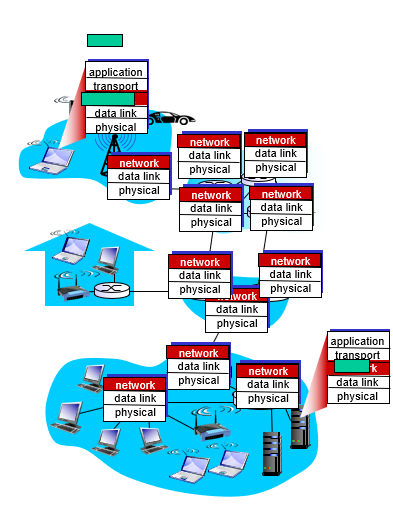

네트워크 계층(Network Layer)는 호스트 간에 트랜스포트 계층 세크먼트를 송수신하는 서비스를 제공한다. sender host는 상위 트랜스포트 계층 세그먼트에 네트워크 계층 헤더를 붙이고, 캡슐화하여 데이터그램(Datagram, 네트워크 계층 패킷)을 생성하고, 전달한다. receiver host는 도착한 Datagram에서 트랜스포트 세그먼트를 추출하여, 상위 트랜스포트 계층에 전달한다.

네트워크 계층은 end-system 뿐만 아니라, 네트워크 코어에 존재하는 라우터 장비가 관여된 시스템이다. 라우터에는 3계층(네트워크 계층)까지 존재하고, 트랜스포트 계층이나, 어플리케이션 계층은 존재하지 않는다.

### 4.1.1 포워딩과 라우팅 : 데이터 평면과 제어 평면

라우터에서는 2가지 중요한 기능이 있는데, 포워딩(forwarding)과 라우팅(routing)이다.

**포워딩(forwarding)** 은 라우터의 입력포트로 들어온 패킷을 목적지로 보낼 수 있도록 적절한 라우터 출력포트로 보내는 작업이다. 라우터에는 포워딩 테이블(forwarding table)을 관리한다. 데이터그램 헤더에 설정된 수신자의 주소가 이 포워딩 테이블의 인덱스로 사용된다. 해당 인덱스에 대응하는 entry에는 그 패킷이 이동해야할 라우터의 외부 링크 인터페이스를 나타낸다. 포워딩은 주로 나노초(ns) 단위로 수행되며 하드웨어를 통해서 수행된다. 포워딩은 네트워크 계층의 데이터 평면에서 수행된다.

**라우팅(routing)** 은 송신자에서 수신자로 데이터 그램이 이동할 경로를 결정하는 알고리즘이다. 라우팅 알고리즘은 각 라우터의 포워딩 테이블을 적절히 결정한다. 이 때 전통적인 방법으로 라우터간 라우팅 프로토콜(routing protocol)을 이용하여 서로 소통하면서 포워딩 테이블을 구성할 수 있다. 다른 방법으로는 각 라우터에 연결되어 있는 원격 네트워크가 라우터의 포워딩 테이블을 구성할 수 있다(SDN). 라우팅 알고리즘은 밀리초(ms)에서 초(s)단위로 수행되며, 소프트웨어를 통해서 수행된다. 라우팅은 네트워크 계층의 제어 평면에서 수행된다.

### 4.1.2 네트워크 서비스 모델

네트워크 서비스 모델은 송수신 호스트간 패킷 전송 특성을 정의한다. 네트워크 계층에서 제공할 수 있는 서비스들에는 어떤것들이 있을까?

- 패킷 전송을 보장 (보장된 전송)
- 패킷이 특정 시간 이내로 전송될 것을 보장 (지연 제한 이내의 보장된 전달)
- 여러 패킷이 전송될 때, 순서대로 전송될 것을 보장 (순서화 패킷 전달)
- 송신과 수신 호스트 사이에 특정한 비스 속도의 전송 링크를 애뮬레이트 (최소 대역폭 보장)

인터넷 네트워크 계층은 최선형 전달 서비스(best-effort) 방식을 사용한다. 이는 패킷이 수신자로 전달되는 것을 보장하지 않는다(패킷 손실 가능). 또한 여러 패킷을 전송할 경우, 패킷의 순서가 지켜지지 않을 수 있다. 보장된 최소 대역폭 또한 없다. 그러나 최선형 전달 서비스만으로도 충분히 좋은 네트워크 계층 서비스가 가능하다는 것이 알려져있다.

## 4.2 Virtual Circuit and Datagram networks

트랜스포트 계층의 TCP와 UDP 처럼 네트워크 계층에서도 데이터를 전송할때 호스트간의 연결(Connection) 여부에 따라서 Datagram Network, Virtual Connection Network로 나눌 수 있다.

### Virtual Connection Network


TCP 처럼 두 호스트가 데이터를 송수신하기 전에 미리 어떤 연결(Connection)을 설정하는 과정이 있다. Virtual Connection은 연결과정에서 두 호스트가 데이터를 송수신하는 경로(path), 이 경로 상에 존재하는 라우터들(Router)를 확정한다. 데이터를 송수신하기 전에 연결과정을 거쳐야 하는 오버헤드가 존재하지만, 한번 연결이 되면 경로상에 존재하는 라우터 자원들이 하나의 연결에 할당되어 predictable한 서비스가 가능하다. 또한 패킷 전송 순서가 일정하게 유지되는 등의 장점이 있다. VC 상의 패킷은 목적지 주소 대신 VC number라는 것을 관리한다. 이 VC number에 대응하는 출력포트를 포워딩 테이블로 관리한다. 또한 각 라우터에는 입력 포트와 출력 포트의 연결에 대한 `state`를 관리한다.


전화 시스템에서 발달된 형태이다. 호스트 사이의 네트워크에 많은 기능을 구현하고, 호스트 시스템은 간단한 기능만을 수행한다. (**dumb endsystem**)

### Datagram Networks

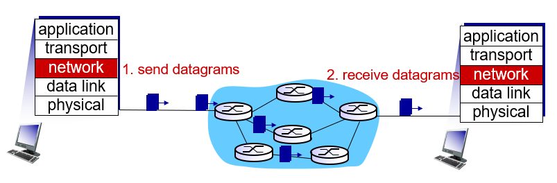

패킷 헤더에 설정된 목적지의 주소를 가지고 라우터에서 나갈 출력 포트를 결정한다. 두 호스트가 통신하기 전에 연결과정이 필요하지 않다.

호스트 사이의 데이터 송수신간 많은 부분을 호스트 시스템에서 구현한다. (**smart endsystem**)

## 4.3 라우터 내부 구조


- **입력 포트** : 입력포트는 다음과 같은 3가지 부분으로 구성되어 있다. 입력포트의 반대편 라우터에서부터 연결되는 링크 신호 송수신에 사용되는 물리 계층 프로토콜(phsical layer protocol), 중간에 링크 계층 프로토콜(link layer protocol)이 있다. 가장 중요한 부분은 맨 오른쪽에 빨간색 상자로 표현된다. 이곳에서는 어떤 출력포트로 패킷을 전송할 것인지를 **검색** 하는 네트워크 계층 구성요소로 되어 있다. 이곳에서 포워딩 테이블을 참조하여 도착된 패킷이 스위칭 구조를 통해 전달되는 라우팅 출력 포트를 결정한다. 제어 패킷은 입력포트에서 라우팅 프로세서로 전달된다.
- **스위치 구조** : 스위칭 구조는 라우터의 입력포트와 출력 포트를 연결한다.
- **출력 포트** : 출력포트에서는 입력포트로부터 받은 데이터그램을 저장할 네트워크 계층 구성요소, 링크 계층, 물리 계층 구성요소가 존재한다. 링크가 양방향일 때, 출력포트는 일반적으로 동일한 링크의 입력포트와 한 쌍을 이룬다.
- **라우팅 프로세서** : 제어 평면 기능을 수행한다. 라우터들과 라우팅 프로토콜을 수행하여 포워딩 테이블을 수정한다. 또는 SDN의 경우 원격 컨트롤러에서 계산된 포워딩 테이블 항목을 수신하고 라우터의 입력 포트에 이러한 항목을 설치한다. 또 네트워크 관리 기능을 수행한다.

### 4.3.1 입력 포트 처리 및 목적지 기반 전달


### 포워딩 테이블

입력 포트에서 들어온 패킷을 어떤 출력 포트로 보낼 것인지 검색하는 것이 라우터 동작의 핵심이다. 이때 포워딩 테이블을 이용한다. 포워딩 테이블은 라우터 프로세서에 의해 계산되거나, 원격 SDN 컨트롤러에서 수신된다. 포워딩 테이블은 각 입력 회선으로 복사되어 각 입력회선에서 분산적으로 사용된다.

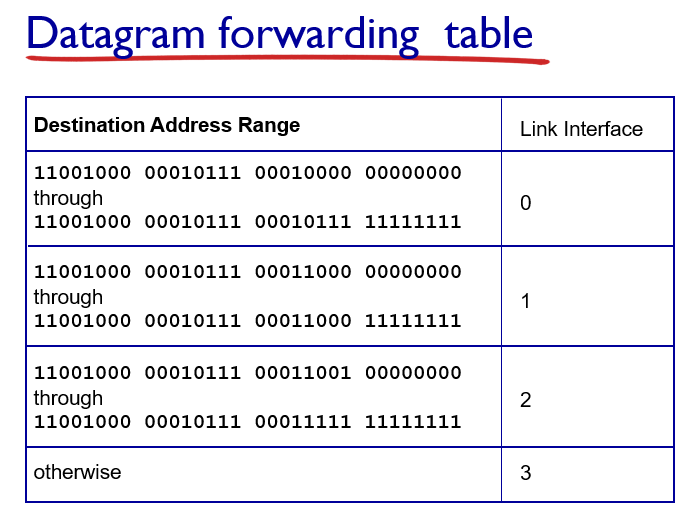

포워딩 테이블의 인덱스는 어떻게 결정될까? 일반적으로 사용하는 IPv4 주소는 32bit로 구성되어있다. 가능한 모든 ip에 대해서 엔트리를 생성하려면 40억개 이상의 엔트리가 필요하기 때문에 현실적으로 불가능하다. 대신 특정 ip 주소 범위를 하나의 entry에 대응시킨다.

#### Longest prefix matching

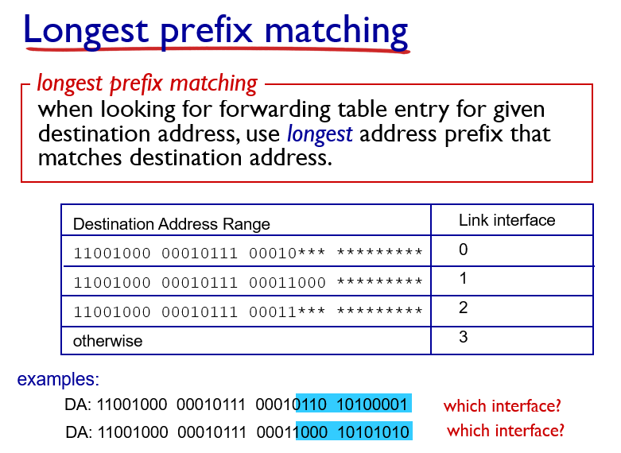

입력포트로 들어온 패킷의 주소를 포워딩 테이블과 매칭시켜 비교할 때 Longest prefix matching 기법을 사용한다. ip 주소의 prefix 부분을 테이블 인덱스와 비교하여 가장 길게 match되는 인덱스의 엔트리를 사용한다.

## 4.3.2 변환기

### 스위치 구조 (Switching fabric)

라우터 내부에서는 어떻게 입력포트로 들어온 패킷을 출력포트로 전송하는가? 다음과 같은 3가지 방법이 존재한다.

- 메모리 구조 (memory)
- 버스 구조 (bus)
- 크로스바 구조 (interconnection cross bar)

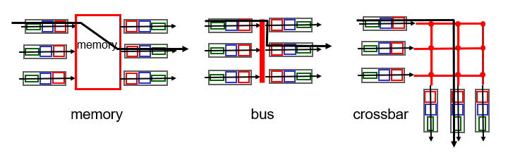

#### 메모리 구조

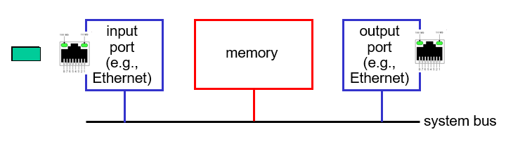

입력 포트에서 패킷이 들어오면 라우터 프로세서에 인터럽트 방식으로 이를 알리고 시스템 메모리에 패킷을 저장한다. 라우터 프로세서는 헤더에서 대상 주소를 추출하고 포워딩 테이블에서 적절한 출력 포트를 찾은 다음 시스템 메모리에 저장되어 있는 패킷을 출력 포트로 저장한다.

메모리 대역폭이 초당 최대 B인 패킷을 메모리에 쓰거나 읽을 수 있는 경우 전체 전달 처리량은 B/2 보다 작아야한다. 또한 목적지 포트가 다른 경우라도 공유 시스템 버스를 통해 한 번에 하나의 메모리 읽기/쓰기 작업을 수행할 수 있기 때문에 두 패킷을 동시에 전달할 수 없다.

#### 버스 구조

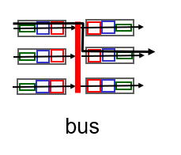

입력 포트에서 패킷이 들어오면 라우팅 프로세서의 개입 없이 버스를 통해서 바로 출력 포트로 전송한다. 입력 포트 스위치 내부 라벨이 로컬 출력 포트를 나타내는 패킷에게 전송되거나, 버스에 패킷을 전송하여 수행된다. 모든 출력 포트에 패킷이 수신되지만 라벨과 일치하는 포트만 패킷을 유지한다. 동시에 여러 패킷이 다른 입력 포트로 도착하면 한번에 하나의 패킷만 버스를 통과할 수 있기 때문에 하나를 제외한 모든 패킷이 대기해야한다.

#### 크로스바 구조

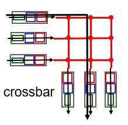

입력포트에서 나오는 버스들과 출력포트로 들어가는 버스들을 서로 연결(interconnection)한다. 이 교차점은 스위치 구조 컨트롤러에 의해 언제든지 열거나 닫혀질 수 있다. 적절한 상황에서 각 입력포트의 패킷이 각각의 출력 포트로 동시에 전송될 수 있게 하였다. 그러나 서로 다른 입력포트에 들어온 패킷이 동일한 출력 포트로 향하는 경우 한 패킷은 여전히 대기해야한다.

### 4.3.3 출력 포트 프로세싱

출력 포트 프로세싱은 출력 포트의 메모리에 저장된 패킷을 가져와서 출력 링크를 통해 전송한다.

### 4.3.4 어디서 큐잉이 일어날까

패킷 큐는 입력 포트와 출력 포트 모두에서 형성 될 수 있다. 대기열의 위치와 범위는 트래픽 로드, 스위칭 구조의 상대 속도 및 회선 속도에 따라서 달라진다. 이 대기열이 더 커지면 라우터의 메모리가 결국 소모될 수 있고 도착하는 패킷을 저장할 수 있는 메모리가 없을 때 패킷 손실이 발생한다.

여기서는 입력 및 출력 회선의 속도는 모두 초당 R<sub>line</sub> 패킷으로 동일한 전송 속도를 가지고 있고, N개의 입력포트와 N개의 출력 포트가 있다고 하자. 단순화를 위해 모든 패킷의 고정 길이가 같다고 하자. 또한 패킷을 송신하는 시간은 임의의 링크 상에서 패킷을 수신하는 시간과 동일하고, 그러한 시간 간격 동안 0 또는 하나의 패킷이 입력 링크 상에 도착할 수 있다. 패킷이 입력 포트에서 출력 포트로 이동할 수 있는 속도로 스위칭 구조 전송속도는 R<sub>switch</sub>로 정의한다. 만약 R<sub>switch</sub>가 R<sub>line</sub>보다 N 배 빠르다면 입력 포트에서 발생하는 큐들은 무시한다. N개의 패킷들이 입력 포트로 들어온다고 하더라도, 다음번 패킷이 도착하기 전까지 N 패킷들의 배치작업이 모두 처리될 수 있기 때문이다.

#### 입력 포트에서의 큐잉

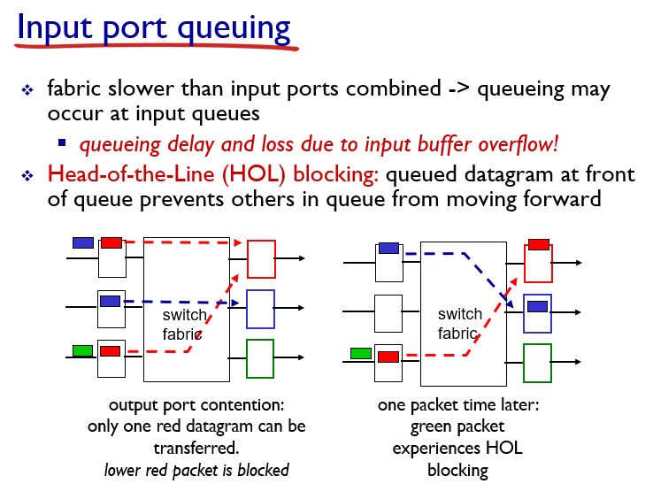

입력포트가 총 N개가 있고, 스위치 구조는 크로스바 형태라고 가정하자. 여기서 스위치 구조의 성능은 하나의 입력포트 성능의 N배가 아니라고 하자.

어느 한 시점에서 두 개의 입력포트가 동일한 하나의 출력 포트로 패킷을 전달한다고 가정해보자. 두 개의 입력포트 중 한 입력포트의 패킷은 다른 입력포트의 패킷이 모두 출력 포트로 전송될 때까지(다음 시간 단위까지) 대기해야 한다.

또한 대기해야 하는 패킷 뒤에 있는 패킷(초록색)은 다음 시점에서는 현재 대기하고 있는 패킷이 없다면 아무런 경쟁없이 바로 출력포트로 전송될 수 있는 패킷이다. 이렇게 입력포트 큐의 맨 앞쪽에서 대기하고 있는 패킷 때문에 뒤쪽 패킷의 전송이 차단되는 것을 **head of line** 차단이라고 한다.

### 출력 포트에서의 큐잉

이번에는 스위치 구조의 성능이 입력 포트 성능의 N배라고 하자. 이런 경우에도 출력 포트에서는 큐잉이 발생할 수 있다. N개의 모든 입력포트에서 동일한 출력 포트로 패킷을 전달하는 경우를 생각해보자. 한 시간단위에서 출력 포트는 하나의 패킷만을 전송할 수 있다. 나머지 N-1개의 패킷은 출력 포트의 버퍼에 저장되게 된다.

출력 포트 버퍼에서 어느 패킷이 먼저 전송될 것인가에 대한 큐칙은 보통 FCFS(또는 FIFO으로 표현) 방식으로 전달되며, 우선순위 방식, 라운드 로빈 방식 등 다른 방법들도 사용될 수 있다.

### 얼마나 큰 버퍼가 필요할까

버퍼링의 양(B)은 평균 왕복 시간(RTT)에 링크 용량(C)를 곱한뒤, flow의 개수(N)으로 나눈 것을 사용한다.

$$
B = {RTT \cdot C} \over \sqrt{N}
$$

## 4.4 인터넷 프로토콜(IP): IPv4, 주소 지정, IPv6 등

### 4.4.1 IPv4 데이터그램 형식

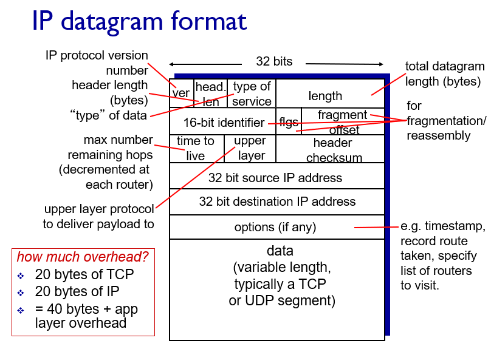

- **IP version(4 bit)** : 데이터그램의 IP 버전을 명시한다. 이 값에 따라서 나머지 헤더를 어떻게 해석할 것인지 결정한다.
- **헤더 길이(4 bit)** : IPv4 데이터그램은 가변길이 옵션을 포함하고 있기 때문에 헤더 길이를 통해서 실제 페이로드가 시작되는 위치를 나타낸다(32비트 워드단위?).
- **서비스 타입(8 bit)** : 서로 다른 유형의 IP 데이터그램을 구별한다.
- **데이터 그램 길이(16 bit)** : 바이트로 계산한 IP 데이터그램의 총 크기(헤더 + 데이터).
- **식별자, 플래그, 단편화 오프셋** : IP 단편화와 관련된 필드들.
- **TTL(Time-to-live)** : 인터넷에서 데이터 그램이 무한히 순환하지 않도록 한다. 라우터가 데이터그램을 처리할 때마다 이 필드의 값이 하나씩 줄어든다. 이 필드가 0이 되면 해당 데이터그램은 폐기된다.
- **프로토콜(upper layer)** : 상위 계층(트랜스포트 계층)에서 어떤 프로토콜에게(TCP 또는 UDP) 전달할지 결정하는 필드. 이 필드는 일반적으로 데이터그램이 최종 목적지에 전달 되었을 경우에만 사용된다.
- **헤더 체크섬** : IP 헤더 필드들을 16bit 단위로 더한다음, 더한값의 1의 보수값을 저장한다. 데이터그램이 라우터에 도착할때마다 헤더 체크섬을 계산하여 비교한다. 만약 체크섬이 일치하지 않는다면 데이터그램은 폐기된다. 라우터를 거치게 될때마다 TTL 값이 변경되기 때문에 헤더 체크섬은 매번 재계산되고 저장되어야 한다.
- **32bit 목적지, 송신지 ip 주소**
- **옵션** : 옵션 필드는 IP 헤더를 확장한다. 보통은 옵션 필드값을 채우지 않고 IP 헤더가 20바이트가 되도록 한다. 옵션 필드가 존재하면 초기에 데이터 필드 시작위치를 계산하는 것을 복잡하게 만들고, 라우터에서 데이터 그램 처리 속도를 느리게 만든다. 이러한 이유로 IPv6에서는 옵션을 포함하지 않는다.
- **데이터(페이로드)** : 목적지에 전달하기 위한 전송계층 세그먼트(TCP, UDP). 또는 특별한 유형의 데이터(ICMP 메시지)를 담기도 한다.

### 4.4.2 IPv4 데이터 그램 파편화(fragment)와 재결합(reassembly)

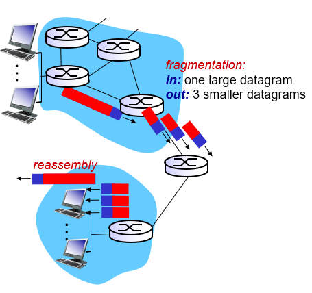

라우터와 라우터를 연결하는 링크들은 다양한 링크 프로토콜을 사용할 수 있다. 이러한 링크의 종류에 따라서 한번에 보낼 수 있는 데이터의 사이즈가 제한되는데 이를 MTU(Maximum Transmission Unit)라고 한다. 한 라우터에서 데이터 그램을 전송하고자 할때, 사용할 링크의 MTT보다 데이터 그램 크기가 클 수 있다. 이때 데이터 그램을 여러개의 파편(fragment)로 나누어서 여러 프레임(링크 계층 패킷 용어)을 생성한 뒤 보내진다.

한번 여러개의 프레임으로 파편화된 데이터 그램은 오직 end system에서만 재조합(reassembly)된다.

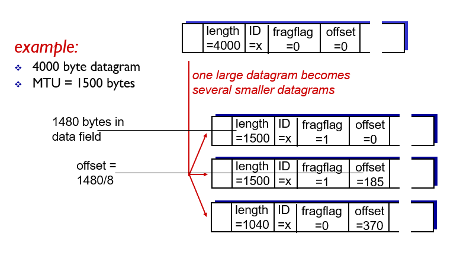

그럼 어떻게 큰 데이터 그램을 조그만한 프레임들로 나누고, 다시 end system에서 복구할까? 이는 데이터 그램 헤더의 offset, flag, index 필드를 통해서 구현된다. 파편화된 데이터 그램들은 모두 같은 index 필드를 갖고 있다. flag 비트는 이 데이터 그램이 파편화 되어 있고, 이 데이터 그램 뒤에 연결되어 있는 파편이 존재함을 알려준다. offset은 해당 데이터 그램이 원래 데이터 그램에서 어느 위치에 있었는지를 알려준다.

### 4.4.3 IPv4 주소체계

현재 사용하고 있는 IPv4는 4바이트로 구성되어 있다. 각 바이트는 0부터 255까지의 십진수로 표현되고, 각 바이트는 점으로 구성된 형태이다.

```txt
165.246.10.1
```

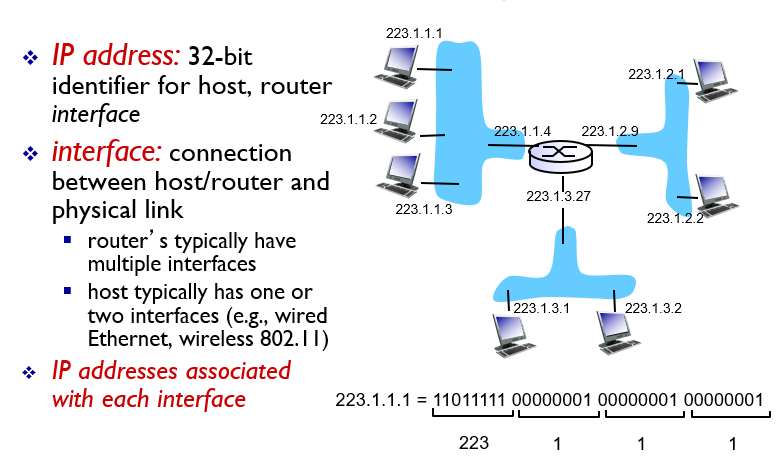

**interface**는 링크와 라우터 또는 링크와 호스트가 연결되는 부분을 뜻한다. IP 주소는 이 인터페이스마다 주어질 필요가 있다. (이러한 인터페이스가 어떻게 연결되는지는 링크계층 chapter에서 배운다.)

IP 주소는 특정한 지역이나 기업에 연관되어 할당될 수 있다. 이와 같은 특징이 나타나는 이유는 IP 주소를 관리하고 판매하는 업체가 IP의 일정 대역을 한번에 판매하고 관리하기 때문이다. 기업이나 기관에서 IP를 구매할 경우 일정 대역을 구매하여 자신들의 호스트에서 IP의 일부분이 동일하게 나타날 수 있다. 위 그림에서 모든 호스트에 부여된 주소가 223.1.x.x 형태로 나타나는 것을 확인할 수 있다.

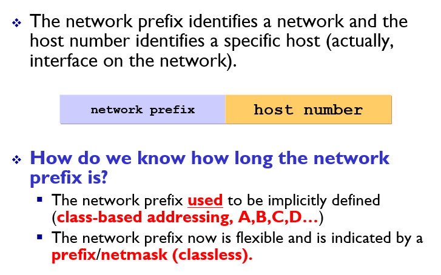

기관에서의 IP 일부가 동일한 형태로 나타나게 하기 위해서 IP의 일부분을 기관을 나타내는 network prefix로, 나머지 일부분은 기관내의 각 호스트를 나타내는 host number로 구성하는 방법을 사용할 수 있다. 그렇다면 IP의 어디까지가 network prefix 인지 어떻게 알 수 있을까?

#### 오래된 방법 : Internet Address Classes

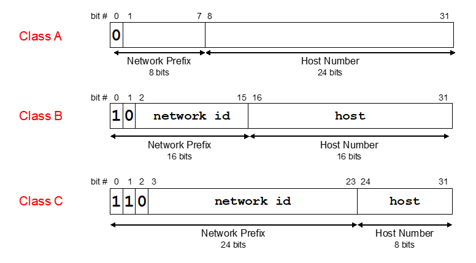

internet addresses가 표준화되던 1980년대에는 IP에 **Class**를 부여하여 network prefix의 길이를 나타내었다. 총 5개(Class A, Class B, Class C, Class D, Class E)가 존재하였으며, Class A, B, C는 각각 **8bit, 16bit, 24bit**의 network prefix를 가지게 되었다. 또한 A, B, C 클래스는 IP의 첫 비트가 각각 **0, 10, 110**으로 시작하게 되어 IP의 앞쪽 비트 일부를 확인해도 클래스를 구분할 수 있도록 되어있다.

IP에 클래스를 부여하는 방식에는 여러가지 문제점이 있다. 호스트 pc의 개수가 20,000 대 정도 되는 중대형 기관에서 ip를 구성하려고 할때, Class C 방식은 모든 호스트를 표현하기에 Host Number가 너무 작고, Class A는 너무 크다. 따라서 Class B를 선택해야 하는데, 6만개의 호스트를 표현할 수 있는 능력에 비해서 기관이 사용하는 ip 주소의 개수(2만개)는 너무 작다. 즉, **유현하지 못한(inflexible) ip 사용으로 인해 사용하지도 않을 ip를 구매해야하는 낭비가 발생한다.**

또한, Class A와 Class B의 경우 8bit, 16bit Network prefix를 통해 표현할 수 있는 네트워크(기관)의 개수는 각각, 128개, 16,384개 뿐이다. **전세계의 모든 중대형 기관이 자신들의 네트워크 ip를 구성하려고 할 때 사용하게 될 Class A, Class B는 빠르게 고갈될 것이며 이는 턱없이 부족한 숫자이다.**

또한 **단순히 network prefix와 host number를 이용한 계층화가 충분하지 않을 경우가 있다.** 예를 들어서 Class B를 사용하는 대학에서 또다시 공대, 의대, 도서관처럼 부서별로 관리되는 부분 네트워크를 구성하고 관리하고 싶은 경우가 있다. 기존의 Two-layer hierarchy(network prefix + host number)로는 부분 네트워크를 구성하기가 쉽지 않다.

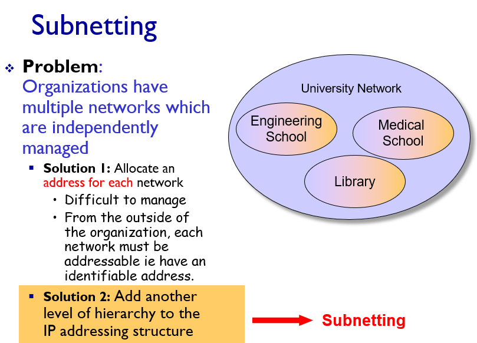

그런데 이같은 문제는 **Subnetting**이라고 하여 IP address에 추가적인 계층을 부여함으로써 해결할 수 있다. 먼저 **Subnet**에 대해서 알아보자.

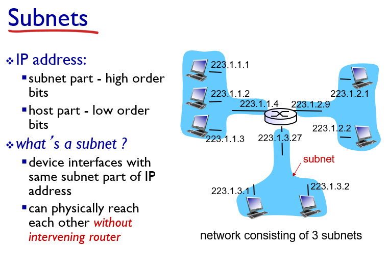

다음과 같이 정의될 수 있다.

> 서브넷을 결정하려면 먼저 호스트나 라우터에서 각 인터페이스를 분리하고 고립된 네트워크를 만든다 이 고립된 네트워크의 종단점은 인터페이스의 끝이 된다. 이렇게 고립된 네트워크 각각을 **서브넷**이라고 부른다.

**Subnet** 안의 인터페이스들은 **라우터의 경유 없이도 서로 도달할 수 있다**.

Subnet 안의 인터페이스들을 IP address의 공통된 상위 비트를 가지고 있는데, 이 부분을 **subnet part** 라고 한다(나머지 부분은 host part).

Subnet을 이용하여 기관에서 또다시 부분 네트워크를 구성하는 Subnetting의 기본 아이디어는 다음과 같다.

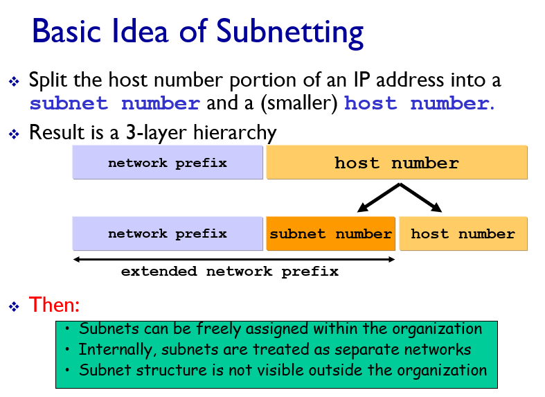

기존의 network prefix와 host number로 나뉘던 2계층에서 host number를 두 부분(subnet number, host number)으로 나누어 3 계층을 이루도록 한다. 이와 같은 방식으로 기관에서는 자유롭게 부분 네트워크를 구성할 수 있게 된다.

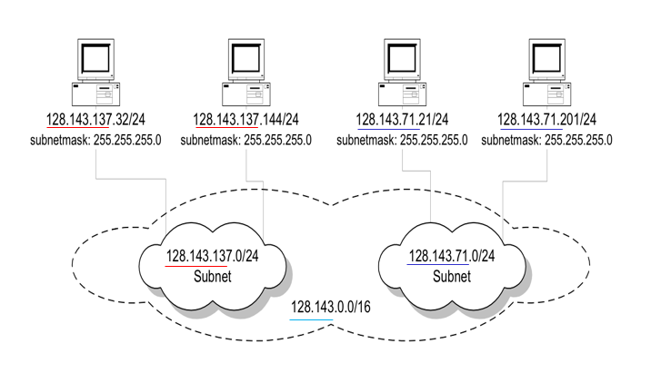

위 그림에서 128.142.137.32/24 처럼 /24(슬래시 24) 가 뒤에 붙은 ip address를 볼 수 있는데, /24(슬래시 24)는 **서브넷 마스크(subnet mask)** 라고 부른다. 이는 ip 32비트 주소 왼쪽 24비트가 서브넷 주소라는 것을 가리킨다.

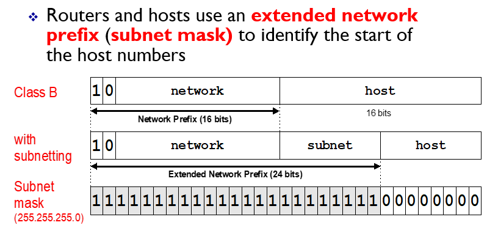

서브넷 마스크는 이름에서 알 수 있듯이 2진수 마스크 형태로 표현되어 서브넷 네트워크 주소를 쉽게 계산할 수 있게 해준다. 앞에서부터 연속적으로 1이 나타나는 서브넷 마스크(ex 255.255.255.0)를 ip address와 논리 and(&) 연산하여 해당 ip가 포함되어 있는 서브넷 주소를 확인할 수 있다.

#### 새로운 방법 : CIDR(Classless Interdomain Routing)

앞에서 언급했듯이 Class를 나누는 ip address 방법은 여러가지 문제점이 있다. 따라서 IP를 효율적으로 사용하고, 또 후에 Routing에도 도움이 될 수 있는 flexible한 주소체계가 개발하였는데 바로 **CIDR**이다.

CIDR는 IP 주소를 클래스 별로 구분하여 network prefix를 나타내지 않는다. 대신 network prefix를 나타내는 비트 수가 flexible하게 나타날 수 있다. 이를 위해서 ip address는 아래 그림과 같이 32비트 주소 뿐만 아니라 network part를 표현하는 앞쪽의 비트 수도 함께 표현되어야 한다.

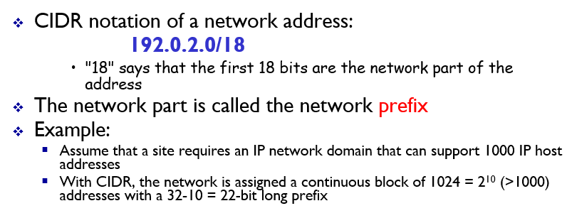

#### 주소 블록 획득

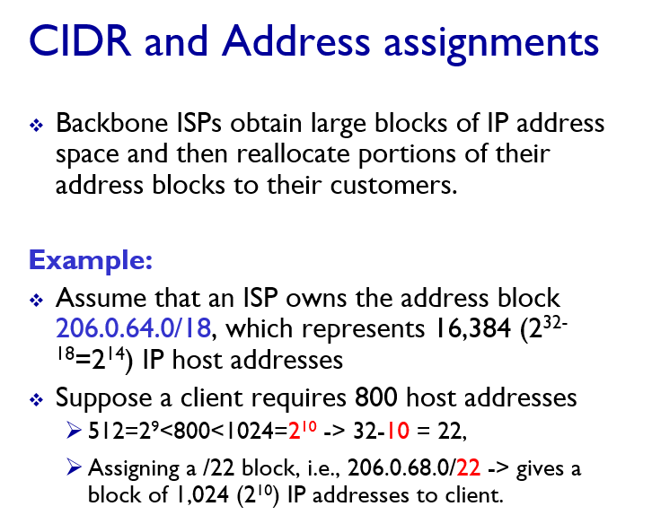

기관이 주소 블록을 획득하기 위해서 자신들이 가지고 있는 주소 블록에서 일정 블록을 제공할 ISP와 만나야 한다. 위 예제를 참고.

> (ISP도 상위 기관을 통해서 주소 블록을 할당받는다. ICANN)

#### 호스트 주소 획득 : DHCP

기관의 네트워크 관리자가 ip 주소 블록을 획득한 후 각 호스트에는 어떻게 ip 주소가 할당될까? 관리자가 수동으로 ip를 설정할 수도 있지만, 호스트에 ip가 자동으로 할당되도록 하는 방법을 더 많이 사용한다. 이러한 방법을 **DHCP(Dynamic Host Configuration Protocol)** 라고 한다. DHCP는 호스트가 네트워크에 연결될때 자동으로 실행되는 **plug and play** 방식의 애플리케이션 프로토콜이다. 네트워크 관리자는 해당 호스트가 네트워크게 접속하고자 할때마다 동일한 IP 주소를 받도록 하거나, 다른 임시 IP 주소를 할당하도록 설정할 수 있다. DHCP는 호스트 ip 주소 뿐만 아니라, 네트워크의 **첫번째 홉 라우터(기본 게이트웨이) 주소, 서브넷 마스크, 로컬 DNS 서버 주소**와 같은 정보도 함께 제공한다.

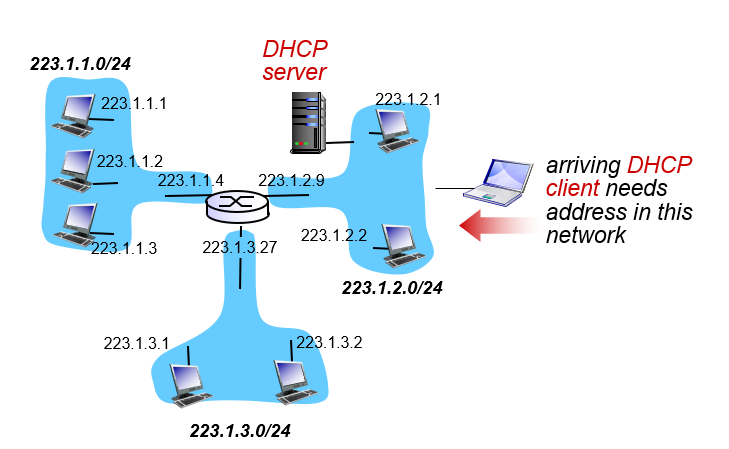

DHCP는 서버/클라이언트 프로토콜이다. 가장 간단한 경우 클라이언트가 접속할 서브넷에 DHCP 서버가 존재할 수 있다(그렇지 않은 경우 해당 네트워크에 대한 DHCP 서버 주소를 알려줄 DHCP 연결 에이전트가 필요하다). DHCP는 총 4단계로 구성된다.

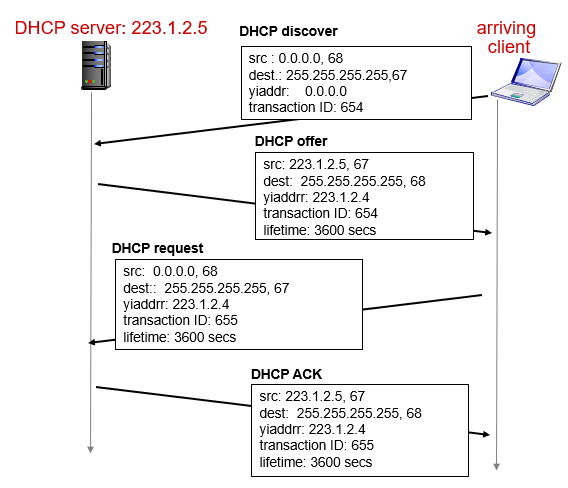

- **DHCP 발견(discovery)** : 네트워크에 연결되고자 하는 클라이언트는 자신이 사용할 DHCP를 발견하고, 자신이 연결될 서브넷에 있는 DHCP 서버에게 포트 67번으로 UDP DHCP 발견 패킷을 전송한다. 이 패킷은 네트워크 계층에서 데이터그램으로 캡슐화된다. 클라이언트는 자신의 ip주소와 DHCP 서버 주소를 모르기 때문에 DHCP 발견 메시지의 자신의 ip 주소는 0.0.0.0 으로 설정하고, 목적지는 255.255.255.255 브로드캐스트 주소로 설정한다. 이와 같은 목적지 주소는 클라이언트가 연결될 서브넷의 모든 인터페이스로 DHCP 발견 메시지에 대한 프레임이 전송되도록한다.
- **DHCP 서버 제공(offer)** : 브로드캐스트를 통해서 연결을 하고자하는 클라이언트의 DHCP 발견메시지를 수신한 DHCP 서버는 DHCP 제공 메시지를 클라이언트로 응답한다. 이때에도 목적지 ip 주소를 255.255.255.255로 설정한다(클라이언트는 아직 자신의 IP 주소를 모르기 때문에). DHCP 서버는 클라이언트가 사용할 IP 주소, 로컬 DNS 주소, 첫번째 홉 라우터 주소, DHCP 서버주소, IP 주소 임대 기간을 DHCP 제공 메시지에 담아 보낸다. 하나의 서브넷에는 여러개의 DHCP 서버가 존재할 수 있기 때문에 클라이언트는 전달받은 DHCP 서버 제공 메시지들 중 하나를 선택할 수 있게된다.
- **DHCP 요청(request)** : 새롭게 도착한 클라이언트는 하나 또는 그 이상의 DHCP 서버 제공자 중 하나를 선택하여 DHCP 요청 메시지를 전송한다.
- **DHCP 응답(Ack)** : 서버는 DHCP 요청 메시지에 대해 요청된 파라미터를 확인하는 DHCP ACK 메시지로 응답한다.

4개의 DHCP 과정 중 앞의 2개(discovery, offer)는 선택사항(optional)이다. 따라서 앞의 2개 과정이 뒤의 2개 과정과 통합되어 동작할 수 있다.

### 4.4.4 네트워크 주소 변환 : NAT(Network Address Transration)

IT 기술의 발달로 인터넷에 연결하고자 하는 디바이스가 폭발적으로 증가하여 마침내 4 바이트 기반의 IP Address로는 모든 디바이스에게 IP 주소를 할당하지 못할 상황까지 발전하였다. 이를 해결하기 위해 새로운 16 바이트 기반의 IPv6 주소가 등장하였지만, 새로운 주소 표기법으로 넘어가기에는 여러 준비가 필요했다.

그래서 새로운 주소 표기법으로 자연스럽게 넘어가기 위해서, 일단은 기존의 사용하던 IPv4 주소들을 효율적으로 사용하기로 한다. 이러한 노력의 일환으로 등장한 기술이 **NAT**이다.

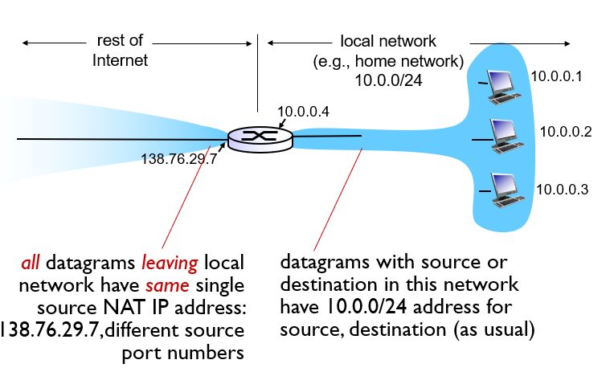

위 그림은 NAT가 가능한 라우터의 동작을 보여준다. NAT 라우터는 로컬 네트워크의 인터페이스를 공유한다. 이 로컬 네트워크 내부는 10.0.0/24 와 같은 네트워크 주소를 갖는다. 이와 같은 주소는 **사설망** 또는 **사설 개인 주소를 갖는 권역**을 위해 예약된 ip 주소 공간 부분 중의 하나이다. 사설 개인 주소를 갖는 권역이란 네트워크 주소가 그 네트워크에 연결되어 있는 장비들에만 의미가 있는 주소라는 뜻이다. 이 주소들은 네트워크 외부에서는 의미가 없다. 다른 네트워크에서도 해당 네트워크 주소를 사용할 수 있기 때문이다. 그렇다면 이렇게 네트워크 내부에서만 사용할 수 있는 주소로 어떻게 외부와 통신할 수 있을까?

NAT 가능 라우터는 이를 위해서 내부에 NAT 변환 테이블을 관리하고, 네트워크 내부의 호스트와 외부 네트워크간의 통신을 지원한다. 외부 세계에서 봤을때 NAT 가능 라우터는 라우터로 보이지 않고, 하나의 IP 주소를 갖는 호스트처럼 보인다. 예를 들어 NAT 라우터가 138.76.29.7의 주소를 갖는다고 하자. 네트워크 내부의 10.0.0.1(3345)의 호스트 프로세스가 127.119.40.186 주소를 갖는 웹서버에게 HTTP 요청메시지를 전송한다면, NAT 라우터는 호스트 프로세스의 ip 주소를 자신의 IP 주소인 138.76.29.7로 바꾸고, 포트 번호 역시 현재 NAT 변환테이블에 존재하지 않는 포트 번호로 바꾸고 외부에 전송한다. 또한 IP와 포트번호를 변경했던 내용을 NAT 변환 테이블에 기록한다. 이 후 동일한 웹서버로 부터 여러개의 응답 메시지가 돌아온다고 하더라도, NAT 라우터는 응답 메시지의 목적지 포트 번호를 확인하여 변환 테이블에서 목적지 호스트와 포트를 캐치하고, 해당 프로세스로 응답 메시지를 전송할 수 있다.

이 같은 NAT 라우터의 동작을 통해서 라우터에 연결된 모든 호스트에게 개별 IP를 부여하지 않고도, 인터넷 통신을 할 수 있게 하여 IPv4 주소를 효율적으로 사용할 수 있다.

### 4.4.5 IPv6

새로운 주소체계의 동기는 앞서 잠깐 언급했듯이 IPv6 주소공간의 고갈이다. 이에 덧붙여서 네트워크 계층의 성능을 높이기 위한 요구도 있었다. 새로운 주소체계인 IPv6는 128비트로 구성되어 있으며 40바이트 고정크기 헤더를 가지고 있다. IPv6의 패킷 포맷은 다음과 같다.

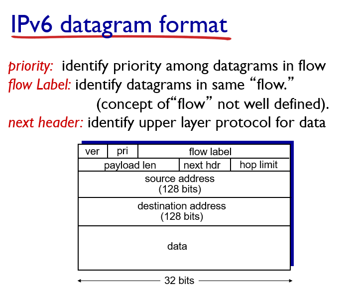

- **4비트 버전 필드** : 이 데이터그램을 어떻게 해석해야할지에 대한 정보를 담고 있는 필드이다.
- **트래픽 클래스(또는 priority)** : IPv4 헤더에서 서비스 타입과 비슷한 필드이다. 트래픽의 유형을 나타낸다. 실시간 전달 서비스(VoIP)인지, SMTP와 같은 일반 서비스인지를 구별하여 데이터그램에 우선 순위를 부여하는데 사용된다.
- **플로우 라벨** : 데이터그램의 흐름을 인식하는데 사용된다.
- **페이로드 길이** : 데이터그램에서 고정 길이 40바이트 헤더 뒤에 나오는 바이트 길이이며 부호 없는 정수이다.
- **다음헤더** : 전달될 상위계층 프로토콜(TCP 또는 UDP)정보를 나타낸다.
- **홉 제한** : 패킷이 네트워크 상에서 좀비 패킷이 되는 것을 방지한다. 라우터를 거칠때마다 1 감소하며, 0이 되면 폐기된다.
- **128비트 목적지, 출발지 주소**
- **data 페이로드**

IPv6의 헤더에는 IPv4에 있던 몇가지 필드가 제거되었다.

- **단편화와 재결합 관련 필드 제거** : IPv6에서 단편화와 재결합은 단말 시스템에서만 이루어진다. 어떤 링크상에서 데이터그램이 너무 커서 전송될 수 없는 경우에 라우터는 송신자 측에 데이터 그램이 너무 크다는 ICMP 메시지를 전송한다. 송신자는 ICMP 메시지를 수신하여 데이터그램을 작은 크기고 단편화하여 재전송한다. 단편화와 재전송은 시간이 걸리기 때문에 라우터에서 이 기능을 삭제하도록 하는 것은 네트워크에서 IP 전달 속도를 향상시킨다.
- **헤더 체크섬 제거** : 트랜스포트 계층과 링크 계층에서 체크섬을 수행하기 때문에 네트워크 계층에서는 체크섬을 생략한다. IPv6의 홉 제한 값은 매 라우터마다 변경 의해서 체크섬도 매 라우터마다 다시 계산되었어야 했는데, 체크섬을 제거함으로써 라우터에서 이러한 계산시간을 줄여 네트워크 성능을 향상시킬 수 있다.
- **옵션** : IPv4에서는 (비록 대부분 옵션 필드를 사용하지는 않더라도) 가변길이의 옵션이 존재하여 이 옵션을 처리하는데 많은 시간이 들 가능성이 있었다. IPv6에서는 옵션 필드를 제거하여 고정 길이의 40바이트 IP헤더를 가질 수 있었다.

#### IPv4에서 IPv6의 전환

지금까지 사용하던 IPv4에서 IPv6로 전환하기 위해서 어떤 방법을 사용할 수 있을까? 먼저 플래그 데이를 생각할 수 있다. 전세계 인터넷 장비를 동시에 끄고, IPv4에서 IPv6로 업그레이드 하는 날짜를 정하는 것이다. 그러나 이는 현실적으로 불가능한 방법이다.

실제로 사용할수 있는 방법은 **터널링(Tunneling)** 이다.

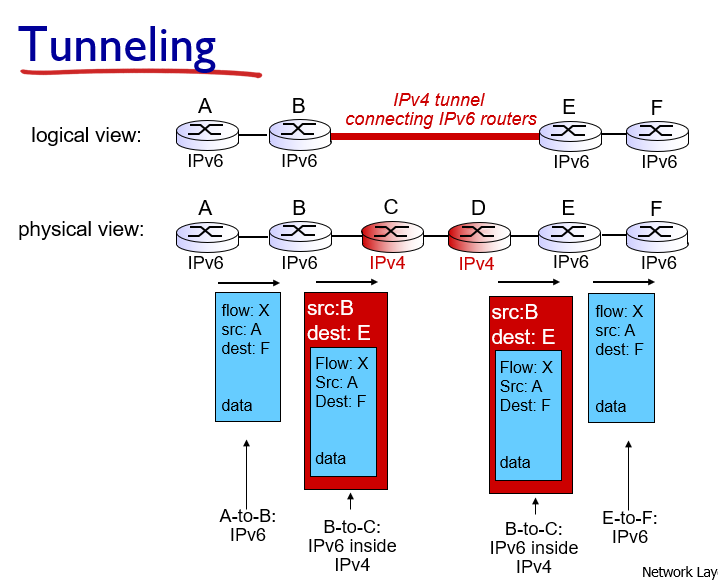

위 그림과 같이 IPv6를 사용하는 노드(B, E) 사이에 IPv4 노드(C, D)가 터널처럼 존재한다고 해보자. 터널의 입구에 위치한 노드 B에서는 새로운 IPv4 데이터그램을 생성한뒤, 출발지는 B, 도착지는 E로 설정한다. 그 다음 IPv6 데이터그램을 새로 생성한 IPv4 데이터그램의 페이로드에 넣는다. 그 다음 노드 C로 새로 생성한 데이터그램을 전송한다. IPv4를 사용하는 노드 C, D는 전송하는 데이터그램이 IPv6라는 것을 알지 못하고, IPv4 데이터그램을 전송하는 방식으로 데이터를 전달할 수 있다. 노드 E에서는 IPv4 데이터그램의 페이로드에 있던 IPv6 데이터그램을 다시 추출하여 나머지 전송을 수행할 수 있다.

## 자료 출처

All material copyright 1996-2012  
J.F Kurose and K.W. Ross, All Rights Reserved
