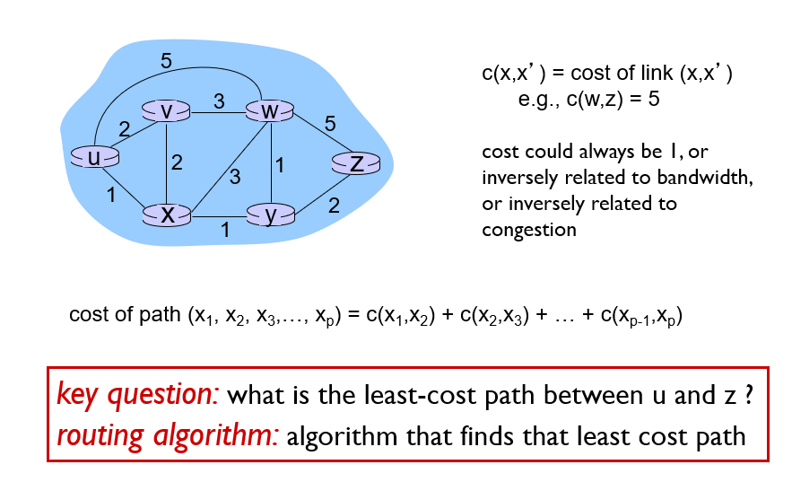
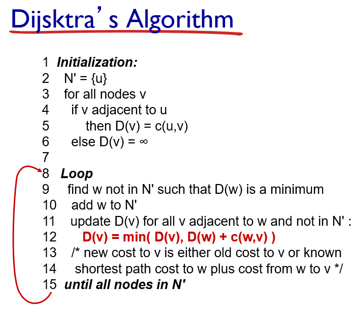

# Ch05 네트워크 계층 : 제어 평면

제어 평면이란 네트워크 전체를 아우르는 구성요로서, 목적지까지 데이터를 전송하는 경로상의 라우터들이 데이터를 어떻게 전송해야 하는지 뿐만 아니라, 네트워크 계층 구성요소들과 서비스들을 어떻게 설정해야하는 지를 포함한다.

## 5.2 라우팅 알고리즘

라우팅 알고리즘의 목표는 송신자부터 수신자까지 라우터의 네트워크를 통과하는 좋은 경로를 결정하는 것이다. 일반적으로 좋은 경로란 최소 비용 경로를 말한다. 그러나 현실적으로는 ISP에서의 정책이나, 국가간 네트워크 정책을 고려할 수도 있다.

최소 비용 경로 또는 최단 경로를 계산하는 방식은 두가지 형태가 존재한다.

- **중앙 집중형 라우팅 알고리즘** : 각 노드와 에지의 정보를 한곳에 모아서 최단 경로를 계산하는 방식이다. 전체 상태 정보를 가지는 알고리즘을 **링크 상태 알고리즘**이라고 하는데, 이는 이 알고리즘이 네트워크 내 각 링크의 비용을 알고 있어야 하기 때문이다.
- **분산 라우팅 알고리즘** : 한 노드와 그 노드에 이웃한 노드들이 가지고 있는 정보들만을 가지고 최단 경로를 반복적으로 갱신해나가는 방법이다. 분산 라우팅 알고리즘에는 **거리 벡터 알고리즘**이 있는데, 니는 각 노드가 네트워크 내 모든 다른노드까지 비용의 추정값을 벡터 형태로 유지하기 때문이다.

라우팅 알고리즘을 구분하는 또다른 기준에는 최단 경로를 계산하는 시점을 이야기 할 수 있다.

- 정적(static) 라우팅 알고리즘 : 예를 들어 사람이 직접 링크 비용을 수정하는 경우와 같이 수작업으로 이루어지거나, 한번 경로가 설정된 이후에 변경이 상당히 느리게 진행되는 경우.
- 동적(dynamic) 라우팅 알고리즘 : 네트워크의 상태 변화에 따라서 이에 반응하여 라우팅 경로를 수정하거나, 주기적으로 경로를 수정하는 경우.

### 5.2.1 링크 상태(LS) 라우팅 알고리즘

다익스트라 알고리즘을 이용해서 한 노드부터 다른 모든 노드들까지의 최단경로를 계산한다.

