# Ch06 링크 계층

ch05 네트워크 계층에서는 한 호스트에서 네트워크로 연결된 다른 호스트로 데이터그램을 어떻게 이동시키는지에 대해서 배웠다. ch06 링크 계층에서는 한 호스트에서 링크로 연결된 다른 호스트 또는 라우터로 데이터를 전송하는 것과 같이 링크 계층에서 제공하는 서비스들에 대해서 배우게 된다. 여기에는 네트워크 계층으로부터 전달받은 데이터그램을 어떻게 링크 계층의 헤더 필드를 붙여서 프레임로 만드는지, 프레임 내의 오류 검출 방법이 있는지, 브로드캐스트 채널에서 전송 충돌을 어떻게 해결하는지, 라우터와 스위치의 차이는 무엇인지, 링크 계층에서 사용하는 주소가 있는지, 있다면 이 주소를 어떻게 확인하고 사용하는지 등에 대해서 배운다.

링크 계층 채널에는 2가지 종류가 있다. **브로드캐스트 채널**을 통한 링크 전달은 무선랜, 위성 네트워크, HFC 등이 있으며 접속망에서 다수의 호스트를 연결해준다. 이 채널을 통해 데이터를 전달하기 위해서는 여러 호스트로부터의 신호가 엉키지 않도록 하는 프로토콜이 필요할 수 있다. 이런 프로토콜을 매체접속프로토콜(medium accesss protocol)이라고 한다.

또 하나의 종류는 호스트와 다른 호스트 또는 호스트와 라우터, 라우터와 라우터가 물리 링크를 통해 1대1로 연결되어 있는 **점대점 링크**(Point to Point link)가 있다.

마지막으로 링크 계층이 구현된 기술들에 대해서 살펴본다.

## 6.1 링크 계층 소개

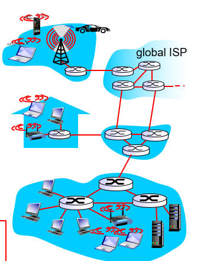

먼저 몇가지 용어를 소개한다. 링크 계층에서는 네트워크에 연결된 호스트 또는 라우터 등을 **노드(Node)** 라고 부른다. 또 통신 경로상의 인접한 노드들을 연결하는 통신 채널은 **링크(Link)** 라고 부른다. 링크 계층에서는 네트워크 계층으로부터 데이터그램을 받고, 여기에 링크 계층에서 쓰이는 헤더 필드를 덧붙여 **프레임(Frame)** 이라는 링크 계층 데이터 전송단위로 캡슐화한다.

링크 계층의 역할은 한 노드에서 링크를 통해 물리적으로 인접한 다른 노드에게 데이터그램을 전달하는 일이다. 데이터그램은 여러 링크를 거쳐 다른 노드로 이동하게 되며 각 링크에서는 각기 다른 링크 계층 프로토콜을 사용할 수 있다.

### 6.1.1 링크 계층에서 제공하는 서비스

- **프레임화** : 네트워크 계층에서 받은 데이터그램에 링크 계층 헤더를 붙여서 프레임으로 캡슐화한다. 프레임의 구조는 링크 계층 프로토콜에 의해서 명시된다.
- **링크 접속** : **매체접속제어(Media accesss control, MAC)** 프로토콜은 링크상으로 프레임을 전송하는 규칙에 대해서 명시한다. 만약 링크가 여러 호스트가 공유할 수 있는 채널이라면, 이들 호스트 간의 데이터 송수신을 제어할 필요가 있다. 링크 계층에서는 이러한 제어 서비스를 제공한다.
- **신뢰성있는 데이터 전달** : 트랜스포트 계층에서와 마찬가지로 링크계층에서도 데이터 송수신간 신뢰성 있는 데이터 전달 서비스를 제공할 수 있다. 그러나 오류가 있는 패킷에 대해서 송신자에게 재전송을 요구하기보다, 오류를 검출하고 또 오류를 정정하기까지 한다. 링크 계층의 신뢰적 전달 서비스는 무선 네트워크와 같이 오류율이 높은 링크에서 주로 사용된다.
- **오류 검출 및 정정** : 수신 노드의 링크 계층 하드웨어는 비트 1을 비트 0으로 잘못 오인할 가능성이 있다. 이러한 오류의 원인은 전자기 간섭, 잡음이나 신호의 약화에 의해서 발생한다. 오류가 있는 패킷은 상위 계층으로 전달할 필요가 없으며 따라서 대부분의 링크 계층 프로토콜은 오류 검출 기능을 가지고 있다. 오류 검출은 송신 노드에서 프레임에 오류 검출 비트를 설정하게 하고, 수신 노드에서 오류 검사를 수행하게 하는 방식으로 구현된다. 링크 계층에서의 오류 검출은 하드웨어를 통해서 구현되며 트랜스포트 계층에서보다 복잡하게 이루어진다.

### 6.1.2 링크 계층이 구현되어 있는 장소

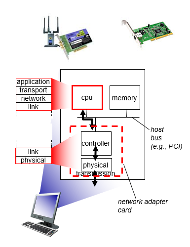

위 그림은 일반적인 호스트 구조를 보여준다. 호스트 상에서 링크 계층이 구현되어 있는 장소는 네트워크 인터페이스 카드(Network Interface Card : NIC) 또는 네트워크 어댑터(Network Adaptor) 라고 불리는 장치이다. 이 장치의 controller 부분에는 생성된 프레임에 적절한 오류 검출 헤더를 붙이거나, 다른 호스트로부터 전달받는 프레임의 오류를 검출하고 정장하는 일 등등 링크계층에서 제공하는 기능을 구현하는 칩이 내장되어 있다. 즉 링크 계층은 하드웨어적으로 구현된 부분이 있다. 예전에는 네트워크 어댑터가 호스트의 보드 슬롯에 분리된 카드 형태로 나왔지만, 요즘에는 마더보드에 내장된 형태로 생산되는 추세이다(**LAN-on-mother-board**).

송신 측의 제어기는 프로토콜의 상위 계층에 의해서 생성되고, 호스트의 메모리에 저장된 데이터그램을 가져와서 링크 계층 헤더를 붙여 프레임으로 캡슐화한 후, 링크 접속 프로토콜에 따라 이 프레임을 통신 링크상으로 전송한다. 수신측에서 제어기는 프레임을 수신한 후 네트워크 계층 데이터그램을 추출한뒤 상위 계층에 전달한다.

링크 계층은 또한 소프트웨어적으로 구현된 부분이 있는데, 링크 계층 주소 정보 조립, 제어기 하드웨어 활성화 등과 같은 상위 수준의 기능들이 그것이다. 이 일은 CPU가 수행하는 소프트웨어 명령을 통해 이루어진다.

## 5.2 Error Detection, Correction

링크 계층에서는 송수신하는 프레임의 특정 비트에 오류가 있는지 검출하고, 오류를 정정하는 기능(**비트 수준 오류 검출과 정정**)은 링크 계층에서 제공하는 대표적인 서비스이다. 이 절에서는 링크 계층에서 어떻게 비트 오류를 검출하고 정정하는지 알아본다. 먼저 오류 검출과 정정의 직관을 얻을 수 있는 내용에 대해서 먼저 살펴보자.

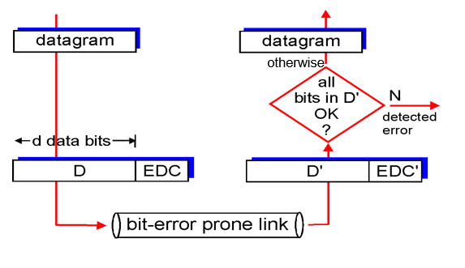

비트 오류가 나타날 수 있는 채널을 통해서 데이터그램을 송수신할때, 오류 검출을 위해서 부가적인 비트(EDC)를 원래의 데이터(D)에 추가하여 송수신 할 수 있다. 수신자가 받은 데이터(D')와 오류 검출 비트(EDC')는 D, EDC와 다를 수 있다. 이 비트들을 비교하여 수신자는 오류가 없는 데이터그램을 상위 계층에 전달한다. 오류가 있는 데이터는 파기하거나 정정해서 상위계층에 전달한다. 오류 검출과 정정 기능은 거의 모든 오류를 검출할 수 있지만 **미검출된 비트 오류가 있을 수 있기** 때문에 낮은 실패 확률의 오류 검출 기능을 사용할 필요가 있다. 일반적으로 더 향상된 오류 검출 기법을 사용할 수록 오버헤드가 커진다.

오류를 검출하는 기술에는 가장 단순한 **패리티(parity) 검사**에서 시작해서, **체크섬(checksum)**, **순환중복검사(cyclic redundancy check)** 등이 있다. 패리티 검사부터 살펴보자.

### 5.2.1 패리티 검사

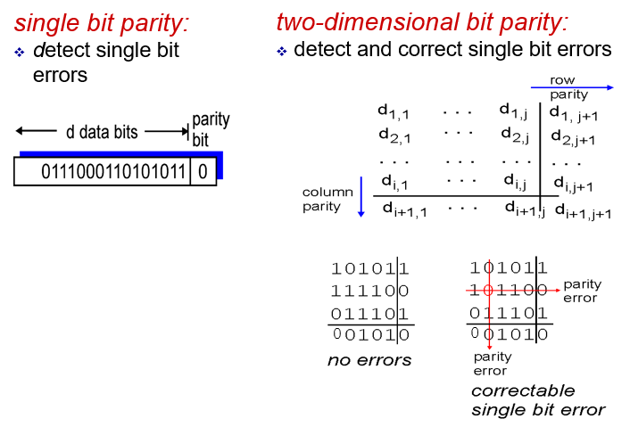

단일 패리티 체크 방법은 먼저 패리티 비트를 포함한 데이터의 비트들 중에서 1로 세팅된 비트의 개수가 짝수개여야 하는지, 홀수개여야 하는지를 약속한다. **짝수 패리티** 의 경우 데이터에 해당하는 비트들에 1로 세팅된 것이 짝수개이면 패리티 비트에 0을, 홀수개이면 패리티 비트에 1를 설정하는 방법이다(같은 논리로 홀수 패리티를 설명할 수 있음). 수신자 측에서도 할 일은 간단하다. 수신된 비트들 중 1로 세팅된 숫자를 세어서 패리티 비트가 정상적으로 설정되어 있는지 확인만 하면 된다.

단일 패리티 체크 방법은 데이터 내에 오류가 있는지 없는지만 검출할 수 있다. 정확히는 데이터 내의 홀수개의 오류를 검출할 수 있다. 만약 데이터 내에 짝수개의 오류가 있다면 단일 패리티 체크 방법은 오류를 검출하지 못한다.

단일 패리티 체크 방법은 링크의 오류 발생 비율이 매우 작고, 오류 발생시 하나의 비트만 오류가 발생하는 경우에 사용될 수 있다. 그러나 대부분의 경우에는 오류가 버스트(burst)하게 발생된다(한번에 여러개의 비트 오류 발생). 이와 같은 경우에 단일 패리티 체크 방법은 50% 정도의 오류만을 검출할 수 있게된다.

패리티 체크 방법의 일반화는 2차원 패리티 비트이다. 2차원 패리티 체크에서는 데이터 비트들을 2차원 행렬 형태로 두고, 각 행과 열에 대해서 패리티 비트를 설정하는 것이다. 이렇게 하면 오류 검출 뿐만아니라 오류가 발생한 비트를 확인하고 정정할 수 있다. 2개의 오류에 대해서도 검출은 가능하지만 정정은 불가능하다.

### 5.2.2 인터넷 체크섬(Internet Checksum)

또 하나의 오류 검출 방법에는 트랜스포트 계층과 네트워크 계층에서 사용된 인터넷 체크섬 방법이 있다. 인터넷 체크섬은 세그먼트를 16bit 단위로 나눈뒤, 이들을 모두 더한값에 1의 보수를 취해서 생성한다. 수신자 측에서는 체크섬 필드를 포함한 모든 16bit 단위의 데이터를 더해서 16bit 모두가 1이 되는지를 체크한다. 만약 모두 1이 된다면 오류가 없다는 뜻이고, 하나라도 1이 아닌게 있다면 오류가 있다는 뜻이다.

인터넷 체크섬 방법은 상대적으로 오류 검출 성능이 다음에 설명할 CRC에 비해서 떨어진다. 인터넷 체크섬 방법은 트랜스포트 계층과 네트워크 계층에서 소프트웨어적으로 실행된다. 따라서 오버헤드가 적은 간단한 오류 검출 기능이 요구된다. 그러나 링크 계층에서는 오류 검출을 위한 하드웨어가 구성되어 있기 때문에 좀 더 많은 오버헤드를 감수할 수 있으며, 따라서 좀 더 성능 좋은 오류 검출 기능을 수행할 수 있는 것이다.

### 5.2.3 순환중복검사(Cyclic Redundancy Check)

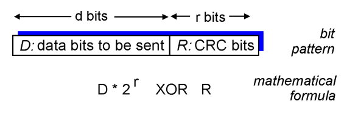

오늘날 컴퓨터 네트워크에서 널리 사용되는 오류 검출 기술은 **순환중복검사(cyclic redundancy check, CRC) 코드**를 사용한다. 순환중복계산은 앞서 소개한 오류검출 기술보다 훨씬 강력한 기술이다. 순환중복계산에서는 데이터를 나타내는 비트들(D)에 오류 검출 비트들(R)를 붙여서 송신한다.

일단 순환중복계산에서 사용하는 연산은 모듈러 2 (Moduler 2)이다. 이 연산에서는 덧셈과 뺄셈을 수행할때 올림과 내림을 무시한다. 따라서 모듈러 2 연산에서 덧셈과 뺄셈은 비트별 XOR 연산과 정확히 일치하게 된다.

송신자가 보내는 데이터의 형식은 다음과 같이 표현할 수 있다.

$$
D * 2^{r} {XOR}\hspace{0.1cm} R
$$

송신자와 수신자는 **생성자(generator)** 라고 불리는 G를 미리 약속한다. G는 r+1개의 비트들로 구성되어있다. 생성자의 최상위 비트는 항상 1이어야한다. G는 mod-2 나눗셈에 의해서 D와 R로 구성된 값을 정확히 나눈다. 즉, 자연수 n에 대해서 다음과 같은 식이 성립한다.

$$
D * 2^{r} {XOR}\hspace{0.1cm} R = nG
$$

CRC를 이용한 오류 검사 절차는 단순하다. 수신자는 d + r개의 수신 비트를 G로 나눈다. 만일 나머지가 0이 아니면 오류가 발생할 것으로, 그렇지 않으면 데이터가 정확한 것으로 판정할 수 있다.

r개의 오류 검출 비트들은 다음과 같은 규칙을 통해서 부여된다. 위 식의 양변에 R을 XOR 하면 다음과 같은 식을 얻는다.

$$
D * 2^{r}= nG \hspace{0.1cm}{XOR}\hspace{0.1cm} R
$$

위 식은 D * 2^r 을 G로 나눈 나머지가 R과 같다는 것을 의미한다. 이렇게 해서 r개의 오류검출 비트들을 구할 수 있다.

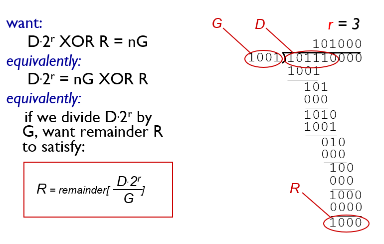

국제 표준으로는 8비트, 12비트, 16비트, 32비트의 생성자 G가 정의되어 있다. 각각의 CRC 표준은 r개 이하의 연속적인 비트 오류를 모두 검출할 수 있다.

## 6.3 다중 접속 링크와 프로토콜

6장의 도입부에서 언급했듯이 링크 계층에서 사용하는 채널에는 2가지 종류가 있다. 첫번째는 **점대점 링크(Point to Point Link)** 로 링크의 한쪽하는 하나의 송신자가, 다른 한쪽에는 하나의 수신자가 존재하는 형태이다. 두번째는 **브로드캐스트 채널(broadcast channel)** 로서 여러 개의 송신 노드와 수신 노드가 채널을 공유하며, 한 노드에서 프레임을 전송하면 다른 모든 노드가 해당 프레임을 들을 수 있는 채널이다.

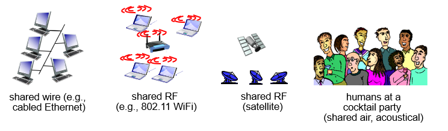

이러한 브로드캐스트 채널에는 무선 엑세스 포인트에 연결된 호스트들, 위성 통신, 지역 케이블 TV 등이 있다. 브로드캐스트 채널에서는 모든 노드가 동시에 프레임을 전송할 수 있고, 따라서 특정 시점에서 한 노드에 여러 프레임이 전송될 수 있다. 이 경우 프레임 신호는 **충돌(Collision)** 하게 되고, 어떤 프레임도 정확히 파악할 수 없는 문제가 생긴다. 그렇게되면 충돌에 관련된 모든 프레임은 손실되며, 브로드캐스트 채널은 충돌 기간만큼 낭비된다. 그렇기 때문에 브로드캐스트 채널에서 노드들간의 프레임 전송을 제어하는 **다중 접속 프로토콜(Multiple Access Protocol)** 이 필요해진다.

초당 R비트의 전송률을 갖는 브로드캐스트 채널에 대한 다중 접속 프로토콜은 다음과 같은 특성을 지니는 것이 바람직하다.

- 단 하나의 노드만이 전송할 데이터가 있을때, 그 노드가 R bps의 처리율을 갖는다.
- M개의 노드가 전송할 데이터가 있을 때는 그 노드가 R/M bps의 처리율을 갖는다. (일정 시간동안의 평균 처리율임)
- 이 프로토콜은 분산되어 있다. 즉, 고장으로 인해 전체  시스템을 정지 시킬수 있는 마스터노드가 없다.
- 이 프로토콜은 단순해서 구현하는 데 비용이 적게 든다.

### 6.3.1 채널 분할 프로토콜 (Channel Partitioning Protocol)

여러가지 채널 분할 프로토콜이 존재하며, 여기서는 중요한 몇가지 프로토콜만 다룬다. 중요한 채널 분할 프로토콜은 **TDMA, FDMA, CDMA** 방식등이 존재한다.

#### TDMA (Time Division Multiple Access) : 시분할 프로토콜

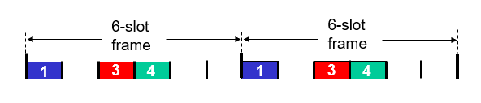

시분할 프토토콜은 시간을 일정 시간 단위인 **프레임(frame)** 으로 나눈다(여기서 사용하는 프레임은 링크 계층에서 사용하는 패킷 용어인 프레임과 다른 것이다. 구분을 쉽게하기 위해서 링크 계층에서의 데이터 단위인 프레임을 여기서는 패킷으로 부르기로 한다). 다시 프레임을 채널에 접속된 노드의 개수(N)로 나누어서 여러개의 **슬롯(Slot)** 으로 구성한다. 그리고 각 프레임마다 하나의 프레임을 하나의 노드에 할당하여, 이 시간에서만 노드가 패킷을 전송할 수 있도록 한다.

TDMA 방식을 사용하면 노드간의 충돌 문제를 해결할 수 있다. 또한 링크의 용량이 R bps 일때, 한 노드에게 할당된 링크 용량은 R/N bps가 된다. 그러나 TDMA 방식의 단점은 채널에서 오직 하나의 노드만이 전송할 패킷을 가지고 있을 때(이 경우 해당 노드를 활성 노드라고 한다), **활성 노드는 자신의 슬롯 타임이 돌아올때까지 기다려야한다.** 또한 **활성 노드가 아닌 노드들에 할당된 슬롯들은 사용되지 않은채 허비된다.** 따라서 활성노드가 하나인 상태에서도 노드 전송률이 평균 R/N bps가 된다.

#### FDMA (Frequency Division Multiple Access) : 주파수 분할 프로토콜

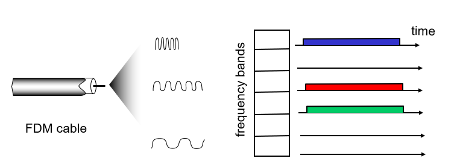

주파수 분할 프로토콜은 링크 채널의 주파수 대역을 여러개의 대역들로 분할에서 채널에 접속한 노드마다 하나씩 할당하는 방식이다. FDMA방식은 TDMA 방식과 마찬가지로 노드간의 충돌 문제를 해결할 수 있으며, 한 노드는 R/N bps의 링크 용량을 사용할 수 있게된다. 또한 FDMA 역시 채널에 활성노드가 하나밖에 없는 상황이라면 다른 노드들에 할당된 주파수 대역이 허비되는 단점이 있다.

### 6.3.2 랜덤 접속 프로토콜 (Random Access Protocol)

랜덤 접속 프로토콜에서는 활성 노드가 프레임을 전송할때, 링크 용량 R bps의 최대 속도로 프레임을 전송하도록 한다. 이렇게 하면 여러 활성 노드가 프레임을 전송할 때 발생할 수 있는 충돌 문제를 해결할 필요가 있다. 일반적으로 충돌이 발생한 프레임은 재전송하게 되며, 또다시 충돌이 발생하지 않도록 프레임의 재전송 시점을 결정하는 것이 랜덤 접속 프로토콜의 핵심이다.

여기서는 많은 랜점 접속 프로토콜 중 중요한 몇가지만 살펴볼것이다. **슬롯 알로하, 순수 알로하, CSMA, CSMA/CD** 가 그것들이다.

#### 슬롯 알로하 (Slotted ALOHA)

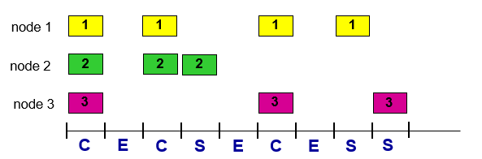

슬롯된 알로하 프로토콜을 사용하기 위해서는 몇가지 가정을 할 필요가 있다.

- 프레임의 길이는 L bits로 모두 동일하다.
- 시간은 여러개의 슬롯들로 나뉜다. 이때 슬롯의 길이는 L/R 초가 된다. 즉, 하나의 프레임이 모두 전송될 수 있는 시간 단위를 슬롯의 길이로한다.
- 모든 노드는 슬롯의 시작시점에서는 프레임을 전송하기 시작한다.
- 각 노드는 언제 슬롯이 시작하는지 알 수 있게끔 동기화되어 있다.
- 모든 노드들은 다른 노드들이 전송하는 프레임을 감지할 수 있다. 또한 자신이 프레임을 전송하고 있는 중간에 다른 노드가 프레임을 전송하여 충돌이 일어나면, 슬롯이 끝나기 전에 이를 감지할 수 있다.

슬롯된 알로하 방식에서 노드의 동작은 다음과 같이 단순하다.

- 전송할 프레임이 있는 노드는 슬롯의 시작시점에서 프레임을 전송하기 시작한다.
- 만일 노드가 충돌을 감지하면, 노드는 그 프레임이 충돌 없이 전송될 때까지 확률 p로 해당 프레임을 다음 슬롯들에서 재전송한다.

슬롯 알로하는 여러가지 장점을 가지고 있다. 채널 분할과 달리, 슬롯 알로하는 하나의 활성 노드로 하여금 채널의 **전속력 R로 계속해서 프레임을 전송할 수 있도록 허용**한다. 또한 **각 노드가 충돌을 감지하고 언제 재전송할지 각자 결정하므로 상당히 분산**되어 있다. 또한 매우 단순하여 **구현이 쉽다.**

슬롯은 충돌이 일어나거나, 하나의 노드만 프레임을 전송해서 성공을 한 경우, 또는 어떤 노드도 프레임을 전송하지 않아서 idle 타임의 되어 버린 경우의 3가지로 분로할 수 있다. 슬롯된 알로하 방식의 효율은 전체 슬롯에서 성공한 슬롯의 비율로 표현된다.

슬롯된 알로하 방식의 효율을 계산해보자. 브로드캐스트 채널에는 총 N개의 노드가 접속하고 있다고 가정하자. 또한 계산의 용이성을 위해서 노드는 전송에 실패한 프레임뿐만 아니라 새로 전송하는 프레임에 대해서도 슬롯에서 p의 확률로 전송한다고 가정한다.

한 노드가 프레임을 성공적으로 전송하기 위해서는 해당 노드는 전송을 하고(p의 확률), 나머지 노드는 전송을 하지 말아야한다(1-p의 확률). 이러한 사건이 일어날 확률은 다음과 같다.

$$
p(1-p)^{N-1}
$$

또한 슬롯이 성공한 슬롯이 되기 위해서는 N개의 노드 중 임의의 노드가 프레임 전송에 성공해야 하기 때문에 다음과 같은 확률로 슬롯이 성공하게 된다.

$$
Np(1-p)^{N-1}
$$

위 식이 슬롯된 알로하 방식에서 전송효율을 나타내는 식이 된다. 효율을 최대로 하기 위해서는 위 식을 최대로 하는 p*값을 찾는 것이 중요하다. 또한 N의 개수가 무한대로 가는 극한값에서 위 식이 최대값을 가질 수 있도록 해야한다. 이러한 계산에 의해만 슬롯된 알로하 방식의 최대 효율은 1/e, 즉 **0.37** 이라는 값이 된다고 한다. 즉, 전체 링크 용량의 37% 만이 프레임을 전송하는데 사용될 수 있다.

#### 순수 알로하(Pure ALOHA)

슬롯 알로하 방식에서는 다음과 같은 가정이 사용되었다.

- 모든 노드는 슬롯의 시작시점에서는 프레임을 전송하기 시작한다.

위와 같은 동기화 제약은 맨 처음 제시된 순수 알로하 방식에서는 없었다. 슬롯 또한 없었다. 따라서 노드는 전송할 프레임이 생기면 슬롯의 시작시점까지 기다리지 않고 곧바로 전송을 시작하였다. 이렇게 되면 한 프레임 시간에서 프레임이 충돌할 수 있는 경우가 훨씬 많아지게 된다.

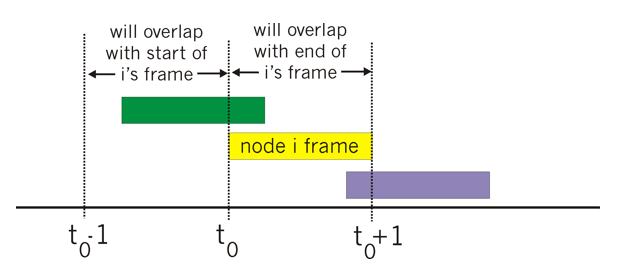

한 활성노드가 t0 시점에서 프레임을 전송하기 시작했다고 해보자. 이 프레임은 [t0 - 1, t0] 사이에서 전송되기 시작한 프레임과 [t0, t0 + 1] 에서 전송되기 시작한 프레임에 의해서 충돌할 수 있게 된다. 노드가 프레임 전송에 성공하기 위해서는 [t0 - 1, t0], [t0, t0 + 1] 구간에서 다른 모든 노드가 프레임을 전송하지 말아야 한다. 이는 다음과 같은 확률을 갖는다.

$$
p(1-p)^{2(N-1)}
$$

따라서 순수 알로하 방식의 효율은 다음과 같다.

$$
Np(1-p)^{2(N-1)}
$$

이 식의 최적값은 1/2e로 슬롯된 알로하 방식의 정확히 반절이 된다. 이것이 완전히 분산된 알로하 프로토콜이 지불할 대가이다.

#### CSMA (Carrier Sense Multiple Access)

알로하 프로토콜은 현재 채널의 상태가 어떤지 살펴보지 않고 프레임을 전송하며, 충돌이 일어난 경우에도 프레임 전송을 중단하지 않고 끝까지 이어나가는 데에 있다. 이는 칵테일 파티에서 상대방이 말하고 있는 와중에 끼어들고, 다른 사람이 말을 시작해도, 이를 무시하고 계속 떠들어 대는 무례한 사람에 비유할 수 있다.

CSMA와 CSMA/CD는 위와 같은 문제점을 해결하여 성능을 높였다. CSMA와 CSMA/CD는 공통적으로 활성노드가 현재 채널에 다른 노드가 프레임을 전송하고 있는지를 체크해서(**Carrier Sensing**), 만약 그렇다면 프레임 전송을 일정한 랜덤 시간동안 미룬뒤, 채널이 idle 할때 프레임을 전송하기 시작한다. CSMA/CD는 여기에 추가적으로 프레임 전송 도중에 다른 노드가 전송한 프레임으로 인해 충돌을 감지하면 즉시 프레임 전송을 중지하고(**Collision Detection**), 랜덤한 시간을 대기한 뒤 유후 시 감지 및 전송 과정을 반복한다.

CSMA는 그럼 충돌이 일어나지 않을까? 그렇지 않다. 다음 그림은 한 노드에서 브로드캐스트 채널로 프레임을 전송할때, 시간과 공간축에 따른 신호 전달을 나타낸 그래프이다.

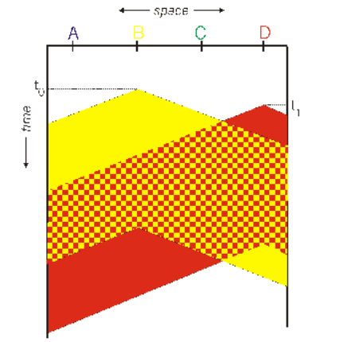

t0 시점에서 B 노드는 채널을 사용하는 노드가 없다는 것을 알고 프레임을 전송하기 시작한다. 이 때 프레임의 신호가 시간에 따라서 공간에 부채꼴 형태로 퍼져나가는 그래프가 나타난다. 이는 전송 매체에서 프레임 신호가 전달되는 시간인 **전파지연(propagation delay)** 에 따른 것이다. 노드 D는 t1 시점에서 활성노드가 되었고, 전파지연에 의해 노드 B가 전송한 프레임 신호를 아직 감지하지 않았기 때문에 프레임을 전송하기 시작한다. 결과적으로 이 두 프레임 신호는 충돌하게 된다. 이 예에서 알 수 있듯이 노드가 Carrier Sensing을 수행한다 하더라고, 전송 매체의 전파 지연에 의해서 충돌이 발생할 수 있다는 것이다. 이러한 전파 지연이 길수록 네트워크의 다른 노드에서 이미 시작된 전송을 캐리어 감지 노드가 감지할 수 없는 경우가 더 증가한다.

#### CSMA/CD (Carrier Sense Multiple Access with Collsion Detection)

CSMA에서는 충돌이 일어난 후에도 프레임 전송을 멈추지 않는다. 그 결과 위 그림에서 체크 무늬로 표시된 상당 부분은 충돌이 발생하고, 많은 링크 용량을 허비하게 된다. CSMA/CD는 이 문제를 해결하기 위해서 충돌이 발생한 경우 즉각 프레임 전송을 중단한 뒤, 각 노드는 랜덤한 시간을 기다리고, 유후시 감지 및 전송에 돌입한다.

그 결과 위 그림에서와 같이 충돌이 일어나는 부분이 상당히 줄어들어 허비되는 링크용량 또한 줄어들게 된다.

CSMA/CD 프로토콜의 동작

- 어댑터는 네트워크 계층으로부터 데이터그램을 받고, 여러 헤더를 추가하여 링크 계층 프레임으로 캡슐화한 후 어댑터 버퍼에 저장한다.
- 어댑터는 채널이 유휴한 것을 감지하면 프레임 전송을 시작한다. 만일 어댑터가 채널이 바쁜것을 감지하면, 어떤 신호 에너지도 감지되지 않을때까지 더 기다렸다가 프레임을 전송하기 시작한다.
- 전송하는 동안 어댑터는 브로드캐스트 채널을 사용하는 다른 어댑터로부터의 신호 에너지가 있는지 감시한다.
- 프레임 전체를 전송하는 동안 다른 어댑터로부터 신호 에너지가 감지되지 않으면 프레임 전송을 완료한다. 그러나 전송 도중에 다른 어댑터로부터의 신호 에너지를 감지하면, 자신의 프레임 전송을 취소한다.
- 어댑터는 전송을 취소한 후 임의의 랜덤 시간만큼 기다린 후 단계 2로 돌아간다.

여기서 궁금한 점은 왜 랜덤한 시간을 기다리냐는 것이다. 만약 두 노드가 동시에 프레임을 전송하기 시작했고, 동시에 충돌을 감지하여 동일한 시간을 기다린뒤, 재전송에 돌입하면 충돌은 계속해서 일어나게 된다. 이러한 문제를 해결하기 위해서 노드는 충돌 감지시 랜덤한 시간을 기다리게 된다.

충돌이 적게 일어나는 곳에서 선택할 수 있는 대기시간의 폭을 길게 잡으면 많은 시간이 허비되고 링크 효율을 떨어뜨린다. 반대로 충돌이 많이 일어나는 곳에서 선택할 수 있는 대기시간의 폭을 작게 잡으면 다시 충돌할 확률이 높아서 역시 링크 효율을 떨어뜨린다. 따라서 효율적으로 랜덤한 대기 시간을 선택해야한다. 랜덤한 시간을 선택하는 방법 중 이더넷과 같은 곳에서 많이 사용하는 방법은 **이진 지수적 백오프(binary exponetial backoff)** 이다. 이 방법에서는 n번 충돌을 경험한 프레임에 대해서 {0, 1, 2, ..., 2^n - 1} 중 하나를 랜덤하게 선택하여 K로 설정 한다(n은 10까지로 제한). 그 다음 K * 512 비트를 전송할 시간을 대기한 뒤 재전송 프로세스에 돌입하게 한다.

### 6.3.3 순차 접속 프로토콜

랜점 접속 프로토콜은 채널에서 활성 노드가 하나일때, R bps의 전송 속도를 갖게하지만, 채널에 N개의 노드가 연결되어 있을때 R/N bps의 전송속도를 갖게 하지는 않는다. 이러한 문제제기에 의해서 새로운 프로토콜이 개발되었으며 그것이 바로 순차 접속 프로토콜이다.

#### 폴링 방식

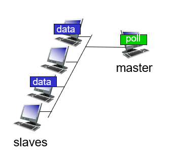

폴링 방식은 브로드캐스트 채널에서 프레임을 전송할 수 있는 권한을 하나의 마스터 노드에서 여러 노드에게 번갈아 가며 할당하는 방식이다. 폴링 프로토콜은 충돌뿐만 아니라 랜덤 접속 프로토콜의 단점인 빈 슬롯을 제거함으로써 훨씬 높은 효율을 제공한다. 이 방식의 가장 큰 문제점 중 하나는 마스터 노드가 고장이 나는 경우 전체 시스템이 망가지게 된다는 점이다. 또한 채널에 활성 노드가 하나인 경우에도 해당 노드는 마스터 노드가 다른 모든 노드들을 체크하고 전송 권한을 줄때까지 대기해야 하기 때문에 R bps보다 작은 전송속도를 갖게 된다는 문제점이 있다.

#### 토큰 링 방식

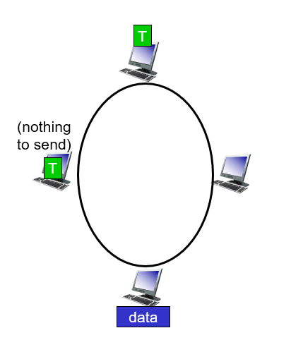

토큰 링 방식은 채널에서 프레임을 전송하는 권한(토큰)을 원 모양으로 돌아가면서 전달하는 방식이다. 이는 앞서 소개한 폴링 방식보다 분산된 형태이다. 그러나 이 역시 문제가 되는 상황이 발생할 수 있다. 하나의 노드가 망가지는 경우 역시 전체 시스템이 망가지게 되며, 한 노드가 토큰을 버리거나, 옆의 노드에 전달하지 않는 상황이 발생할 수도 있다. 또한 활성노드가 하나인 상황일때 역시 자신에게 토큰이 돌아올때까지 기다려야하는 문제점이 있다.

## 6.4 스위치 근거리 네트워크 (LAN)

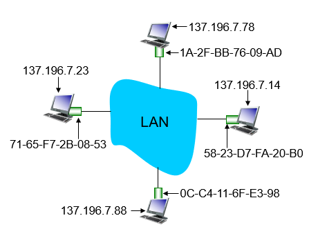

앞 절에서 브로드캐스트 채널에서의 MAC 프로토콜에 대해서 배웠다. 이번절에서는 스위치 근거리 네트워크(LAN)에 대해서 배운다. 먼저 링크계층에서 사용하는 주소체계에 대해서 배운 다음, 이 주소체계를 이용해서 같은 서브넷에 있는 다른 노드에게 프레임을 전송하는 방법에 대해서 배운다. 그 다음 이더넷(Ethernet) 프로토콜에 대해서 배우고, 가상 근거리 네트워크(VLAN)에 대해서 배운다.

### 6.4.1 링크 계층 주소 체계

네트워크 계층에서는 네트워크 계층 주소 체계로 ip 주소를 사용한다. 이와 비슷하게 링크 계층에서는 **MAC 주소**(또는 물리 주소, 랜 주소로도 불린다)를 사용한다. MAC 주소는 6바이트로 구성되며 16진수 코드로 표현한다. NIC (네트워크 인터페이스 카드 또는 네트워크 어댑터) 회사는 자신들이 생산하는 어댑터에 다른 어댑터와 구분할 수 있는 MAC 주소를 할당해야 한다. 이는 IEEE가 일정 부분의 MAC 주소를 사용할 수 있는 권한을 적절히 분배하여 어댑터 생산 회사에 판매함으로써 이루어질 수 있다.

MAC 주소에는 IP 주소와는 다르게 계층 구조가 없는 flat한 형태이다. 또한 MAC 주소는 네트워크 어댑터에 반영구적으로(요즘은 소프트웨어적으로 변경할 수 있음) 할당되어 있기 때문에 노드가 이동해도 노드와 함께 따라갈 수 있다. MAC 주소는 주민등록번호에, IP 주소는 우편 주소에 비유할 수 있다. 송신 노드는 데이터그램을 받을 노드의 MAC 주소를 프레임 헤더에 붙여서 물리 계층을 통해 전송하면, 수신 노드는 물리 계층으로부터 받은 프레임에 MAC 주소를 확인하여 자신의 MAC 주소와 동일한 경우 프레임에서 데이터그램을 추출하여 상위 계층으로 전달한다.

여기서 의문이 드는 것은 어떻게 송신노드가 수신노드의 MAC 주소를 알아낼수 있는지이다. 이를 해결하는 기술이 바로 **ARP(Address Resolution Protocol)** 이다.

#### ARP(Address Resolution Protocol)

각 호스트와 라우터는 ARP 테이블을 관리한다. 이 테이블 엔트리 구성에는 호스트나 라우터 인터페이스의 IP 주소가 있고, 그와 연관된 MAC 주소, 해당 엔트리가 테이블에 추가된 시간이 있다. ARP 모듈은 다른 호스트 또는 라우터로 데이터그램을 전송할 경우 먼저 IP주소를 인덱스로 하여 ARP 테이블을 살펴본다. 만약 해당 IP에 대한 엔트리가 있다면 이 IP에 해당하는 MAC 주소를 프레임 헤더에 추가하여 물리 계층에 전달한다.

만일 ARP 테이블에 IP에 대한 엔트리가 존재하지 않는다면 호스트에 포함되어 있는 ARP 모듈이 다음과 같은 과정을 진행한다. 먼저 ARP 요청 패킷을 생성하고, 이곳에 송수신자의 ip 주소, 송신자의 MAC 주소를 할당한다. 그 다음 프레임 헤더의 목적지 MAC 주소에는 FF-FF-FF-FF-FF-FF 브로드캐스팅 주소를 할당하여 동일 서브넷의 모든 노드에게 ARP 요청 패킷이 전달되도록 한다. 해당 서브넷에 있는 모든 노드는 브로드캐스팅 주소를 확인하고 이를 ARP 모듈에 전달하며, 이 ARP 요청 패킷에 담긴 IP 주소가 자신의 IP 주소와 일치하는 노드가 다시 ARP 응답 패킷을 생성한다. 이곳에는 당연히 자신의 MAC 주소를 포함하며, 이 패킷을 프레임으로 캡슐화 한 다음 목적지 MAC 주소에 방금 ARP 요청 패킷을 전달한 노드의 MAC 주소를 할당하여 전달하면된다.

#### 다른 서브넷에 있는 노드로의 프레임 전송

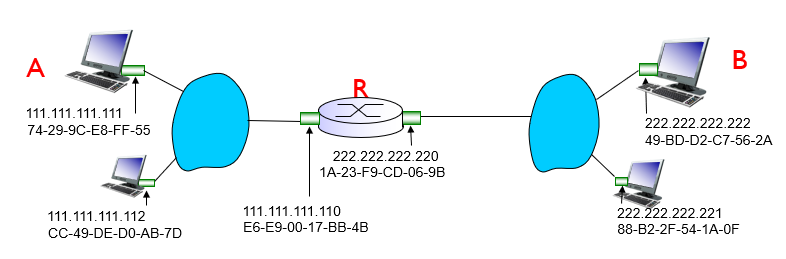

만일 다른 서브넷에 있는 노드로 프레임을 전송하고자 할때는 프레임 헤더의 MAC 주소에 어떤 주소를 할당해야 할까? 이 때는 ARP 로도 목적지 노드의 MAC 주소를 알 수 없다. 이 경우에는 **목적지 노드까지 가는 최종경로의 첫번째 홉 라우터 인터페이스의 MAC 주소를 프레임 헤더에 추가**하면 된다. 프레임을 전달받은 라우터의 인터페이스는 MAC 주소가 자신의 MAC 주소와 일치하는 것을 확인하고, 데이터그램을 추출하여 상위 계층으로 전달한다. 이 후 과정은 앞 장에서 배웠던 라우팅 알고리즘과 매칭 - 전달 알고리즘을 이용해서 최종 목적지로 이동하게 된다. 최종 목적지 노드가 연결된 라우터 인터페이스에 도착했을때, 해당 라우터 인터페이스는 목적지 노드의 MAC 주소를 이용해서 데이터그램을 캡슐화하여 노드에 전송하게 된다. 이때 라우터 인터페이스가 목적지 노드의 MAC 주소를 알아내는 것 역시 ARP 기술을 이용하면 된다.

### 6.4.2 이더넷 (Ethernet)

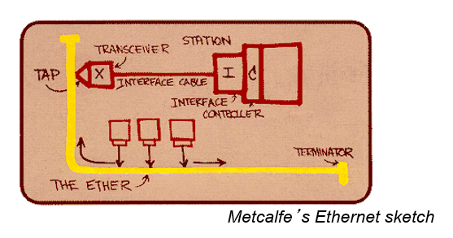

링크 계층 프로토콜에서 가장 많이 사용되는 기술은 이더넷이다. 이더넷이 주로 사용되는 이유는 1. 가장 먼저 제시된 고속 랜 기술이었으며, 2. 다른 기술에 비해서 간단한 형태였다. 3. 또한 다른 기술이 빠른 속도의 랜 기술을 고안할때마다 그에 발 맞춰서 이더넷 또한 발전했다. 4. 또한 가격이 저렴하고 인기가 좋았다.

이더넷은 링크 계층뿐만 아니라 물리 계층까지 명세하는 프로토콜이다. 브로드캐스트 채널에서의 충돌 문제를 해결하기 위해서는 CSMA/CD 기술을 사용한다. 동축 케이블, 광랜, 꼬임쌍선 등 다양한 물리 매체를 사용할 수 있고, 이들간의 호환도 가능하다. 그리고 예전 버전과 최신 버전 사이의 호환도 가능하다.

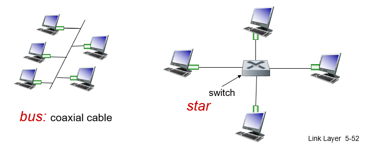

초기에는 동축 케이블을 이용해서 노드를 브로드캐스트 채널에 연결하는 버스 구조를 많이 사용했다. 그 다음에는 중앙에 허브가 존재하는 star 토폴로지로 발전했고, 최근에는 허브가 스위치로 바뀌어서 사용되고 있다. 허브는 한 인터페이스로 들어온 0, 1 신호를 증폭하여 신호가 들어온 인터페이스를 제외한 모든 인터페이스에 브로드캐스팅 하는 반면, 스위치는 노드와 인터페이스를 점대점으로 연결하며 정확한 목적지를 가진 프레임은 브로드캐스팅하지 않고 단일 인터페이스로만 전달한다. 또한 스위치는 하나 이상의 프레임이 단일 인터페이스로 들어오지 않아서 충돌이 일어나지 않는다.

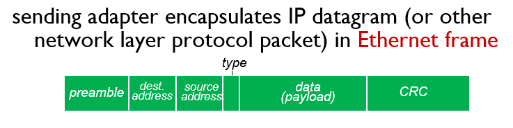

이더넷에서 사용하는 프레임의 구조는 위 그림과 같다.

- **preamble(8바이트)** : 10101010 으로 구성된 7바이트와 10101011로 구성된 1바이트이다. 이 신호는 송신 노드와 수신 노드 어댑터의 클록 신호를 동기화 하는데 사용된다.
- **dest address(6바이트), source address(6바이트)** : 수신노드와 송신 노드의 MAC 주소가 할당된다. 수신 노드의 MAC 주소는 ARP를 이용해서 할당된다.
- **type(2바이트)** : 링크 계층을 통해서 전달된 프레임은 IP 네트워크 뿐만 아니라 다양한 네트워크 계층으로 전달될 수 있다. 따라서 4 계층 세그먼트 헤더의 포트와 3 계층 데이터그램 헤더의 상위 계층 프로토콜 필드와 같이 어떤 네트워크 계층으로 전달할 지에 대한 정보가 필요하다. 이 정보가 type에 담기게 된다. 앞서 소개한 ARP의 경우도 type을 통해서 구분될 수 있다.
- **data(46바이트 ~ 1500바이트)** : 링크 계층 프레임의 페이로드는 데이터그램이다. 앞장에서 배웠듯이 링크의 종류 마다 한번에 보낼 수 있는 프레임 페이로드 크기(MTU)가 있는데, 이 크기보다 크다면 데이터그램은 단편화가 되어야 한다. 또한 46바이트보다 작은 데이터그램은 의미없는 데이터가 보내져서 보내지게되며, 데이터그램의 경계는 데이터그램 헤더의 길이 필드를 통해서 구분될 수 있다.
- **CRC** : 이 장의 초반에서 소개한대로 링크 계층은 오류 검출 서비스를 제공하며 이를 위해서 CRC 비트들이 뒤쪽에 추가되어 보내진다.

이더넷이 제공하는 서비스의 특징으로는 다음과 같은 것들이 있다.

이더넷은 비연결지향형 데이터 전달을 수행한다. 즉, 서로 통신을 하기전에 핸드쉐이킹 과정이 존재하지 않는다.

또한 이더넷은 비신뢰적인 데이터 전달을 수행한다. 수신 노드에서는 송신 노드가 보내온 프레임에 대해서 ACK이나 NAK 신호와 같은 응답을 전송하지 않는다. 또한 오류가 존재하는 프레임에 대해서는 상위 계층으로 전달하지 않고 폐기한다. 이렇게 전달되지 않는 데이터에 대한 처리는 상위계층에 맡긴다. UDP의 경우에는 이러한 폐기가 발생한 경우에 문제가 될 수 있지만, TCP의 경우에는 해당 계층에서의 신뢰적 서비스 기능을 통해서 이를 해결할 수 있다.

이더넷에서 사용하는 MAC 프로토콜은 슬롯이 없는 CSMA/CD 이며, 백오프는 이진 지수적 백오프를 사용한다.

### 6.4.3 링크 계층 스위치

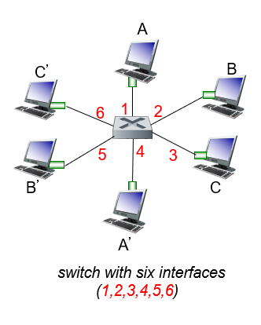

이번에는 링크 계층에서 스위치가 어떤 역할을 하는지 알아보자. 기본적으로 스위치는 인터페이스로 들어온 패킷을 적절한 다른 인터페이스로 전달하는 역할을 한다. 이러한 스위치에는 3계층 라우터 스위치와 2계층 링크 스위치가 있다. 그러나 이 두가지 스위치에는 중요한 차이점이 있는데, 3계층 라우터 스위치는 데이터그램 헤더에 들어있는 ip 주소를 가지고 스위칭하는 반면, **링크 계층 스위치는 프레임 헤더에 들어있는 MAC 주소를 가지고 패킷을 스위칭**한다는 것이다. 그리고 패킷을 어느 인터페이스로 전달할 것인지를 결정하는 방법 또한 다르다. 라우터의 경우 라우팅 알고리즘을 통해서 내부의 포워딩 테이블을 구성한다. 스위치에서는 어떨까?

스위치는 그 자체가 서브넷에 있는 호스트와 라우터들에게 투명하다. 스위치의 각 인터페이스에는 MAC 주소가 없다! 스위치는 인터페이스로 들어온 프레임을 다른 호스트나 라우터에 전달하는 역할만을 하기 때문이다. 그리고 스위치로 들어오는 프레임의 속도로 출력 인터페이스의 전달 속도를 순간적으로 넘을 수 있기 때문에 스위치의 출력 인터페이스도 버퍼를 가지고 있다. 그리고 스위치와 연결된 호스트나 라우터들은 각각 스위치와 점대점으로 연결되어 있고, 이들이 보내는 신호가 서로 충돌하지 않는다.

#### 전달 및 여과

스위치는 인터페이스로 들어온 프레임에 대해서 이를 폐기하거나 적절한 인터페이스로 전달할지를 결정하는 여과(filtering) 기능을 수행한다. 전달(forwarding)은 프레임이 전송될 인터페이스를 결정하고 프레임을 해당 인터페이스로 내보내는 기능이다. 이러한 여과와 전달은 **스위치 테이블(switch table)** 을 이용해서 실행된다.

스위치 테이블의 엔트리는 다음과 같이 구성된다. 엔트리를 인덱싱하는 MAC 주소와 해당 MAC 주소로 연결되어 있는 인터페이스 넘버, 그리고 해당 엔트리가 테이블에 추가된 시간이 명시되어 있다. 이 스위치 테이블을 이용해서 스위치로 들어온 프레임을 다음과 같이 여과하거나 전달하게 된다. 만약 인터페이스 x번에서 프레임이 들어왔을때

- 들어온 프레임의 MAC 주소에 대한 엔트리가 없는 경우 x번 인터페이스를 제외한 나머지 모든 인터페이스에 프레임을 브로드캐스트 한다.
- 들어온 프레임의 MAC 주소에 대한 엔트리가 있을때
  - 만약 이 주소에 해당하는 테이블 엔트리의 인터페이스 넘버 y 가 x로 동일하다면 해당 프레임은 폐기한다. 이는 프레임이 목적지가 있는 랜 세그먼트로 이미 브로드캐스트 됐음을 의미한다.
  - 인터페이스 넘버 y 가 x가 아닌 경우에는 해당 프레임을 인터페이스 y로 전달한다.

그렇다면 이 스위치 테이블은 어떻게 구성되는 것일까?

#### 자가학습(Self Learning)

스위치는 놀랍게도 스위치 테이블을 스스로 구성한다. 이를 **자가학습**이라고 하며, 이는 링크 계층 스위치가 **플러그 앤 플레이** 기능을 구현할 수 있도록 해준다. 이는 다음과 같은 과정으로 이루어진다.

- 초기에 스위치 테이블은 비어있다.
- 어떤 인터페이스 x에서 프레임이 들어오면, 이 프레임의 출발지 MAC 주소와 인터페이스 x, 이 프레임이 들어온 시간에 대한 엔트리를 생성한다. 이런 식으로 스위치는 테이블에 송신 노드가 상주하는 랜 세그먼트를 기록한다.
- 엔트리가 생성된 시점부터 일정한 시간내에 동일한 엔트리를 구성하게 하는 프레임이 들어오면 계속 유지하고, 그렇지 않으면 해당 엔트리를 파기한다. 이렇게 함으로써 해당 스위치를 벗어난 호스트에 대한 엔트리를 계속 유지하지 않게한다.

#### 스위치 대 라우터

사실 스위치로 구성하는 LAN 네트워크를 라우터로 연결할 수도 있다. 스위치와 라우터의 장단점은 무엇일까?

스위치는 **플러그 앤 플레이** 기능을 구현한다. 또한 스위치는 상대적으로 높은 패킷 여과 및 전달률을 가진다. 그러나, 브로드캐스트 프레임의 순환을 방지하기 위해서 스위치 네트워크의 실제 사용되는 토폴로지는 스패닝 트리로 제한된다. 또한 대규모 스위치 네트워크에서는 호스트와 라우터가 커다란 ARP 테이블을 갖게 되며 상당한 양의 ARP 트래픽이 생성되고 처리된다. 또한 스위치는 브로드캐스트 트래픽의 폭주에 대비한 방안을 제공하지 않는다.

라우터는 평면적인 MAC 주소가 아닌 계층적 IP주소를 사용한다. 따라서 네트워크에 중복된 경로가 있을때라도 데이터그램은 순환하지 않는다(잘못 경로가 지정된 경우에는 순환할 수 있지만, TTL 값을 이용해서 해결할 수 있다). 따라서 패킷은 스패닝 트리로 제한받지 않고 출발지와 목적지 간의 최상의 경로를 사용할 수 있다. 라우터의 또다른 특징은 2계층 브로드 캐스트 트래픽 폭주에 대비한 방화벽 보호 기능이다. 라우터의 가장 큰 단점은 플러그 앤 플레이가 아니라는 점이다. 또한 라우터는 3계층 장비이기 때문에 2계층 프레임보다 더 많은 정보를 처리해야한다.

### 6.4.4 가상 근거리 네트워크(VLAN)

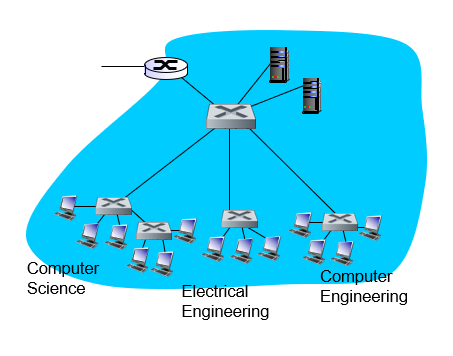

위 그림에서 여러개의 학과와 서버를 연결하기 위해 스위치를 계층적으로 사용하였다. 이와 같은 구조는 다음과 같은 문제점이 있을 수 있다.

- 트래픽 격리 부족 : 호스트들을 특정 그룹으로 분류하고 싶은 경우 단순히 스위치 구조로는 분류할 수 없다. 모든 브로드캐스트 프레임이 모든 노드에게 전달 되기 때문이다.
- 스위치의 비효율적인 사용 : 10개의 그룹을 만들고 싶은 경우 10개의 스위치를 설치해야한다. 만약 100개의 포트를 갖는 스위치가 있다면, 이를 10개 사지 않고 100개의 포트를 10개의 그룹으로 나누고 싶다.
- 한 그룹에 속한 사용자의 이동시 문제점 : 한 그룹에 속한 사용자가 다른 스위치를 사용하는 건물로 이동하는 경우 문제가 생길 수 있다.

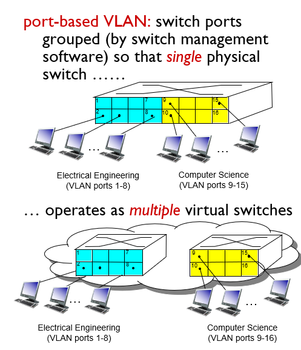

위에서 제시한 문제점을 해결하기 위해서 가상 근거리 네트워크(Virtual Local Area Network)가 나타났다. 포트 기반 VLAN 기술은 소프트웨어적으로 스위치 포트를 분류하여 특정 그룹을 나타내게 할 수 있다. 위 그림에서 포면 16개의 포트가 2가지 색상의 그룹으로 나뉜것을 볼 수 있다. 각 색상의 포트에 연결된 노드들은 자신들이 다른 색상과 구분되는 스위치에 연결된 것 처럼 처리될 수 있다. 예를 들어 1번 포트로 브로드캐스트 프레임이 들어온 경우 이는 파란색 포트로만 전달된다.

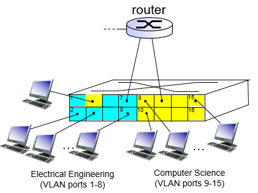

그렇다면 파란색 그룹에서 노란색 그룹으로 패킷을 어떻게 전달할까? 이는 라우터용 스위치 포트를 모든 VLAN 그룹에 속하게 하고, 이를 라우터에 연결시키면 된다. 이제 노란색 그룹 노드에서 파란색 그룹 노드로 패킷을 전달할 경우 일단 라우터로 이동한 다음 다시 스위치로 들어와서 파란색 그룹의 노드로 이동하게 된다.

이런식으로 VLAN을 구성하면 앞서 언급했던 트래픽 격리 문제, 스위치의 비효율적인 사용, 특정 그룹 사용자의 이동 문제를 해결할 수 있다. 특정 그룹 사용자가 다른 그룹으로 이동하면 그 사용자의 포트를 소프트웨어적으로 다른 그룹에 속하도록 변경만 하면 된다.

이번에는 여러개의 스위치에 하나의 그룹 포트를 설정하고 싶은 경우를 생각해보자. 이는 멀리 떨어진 건물에 다른 스위치를 사용하고 있는 사용자들이 하나의 그룹에 속하고 싶은 경우에 해당할 수 있다. 이 경우에는 **VLAN 트렁킹(VLAN trunking)** 을 사용할 수 있다. VLAN 트렁킹에서는 하나의 포트를 트렁크 포트로 구성하여 다른 스위치의 트렁크 포트와 연결시키고, 모든 VLAN에 속하도록 한다. 그 다음 한 VLAN에서 들어온 프레임을 트렁크 링크를 통해 다른 스위치로 전달해준다. 그런데 트렁크 포트로 들어온 프레임이 어느 VLAN의 프레임인지 어떻게 구분할 수 있을까? IEEE는 트렁크 포트를 통해 들어오는 프레임을 구분하기 위해서 특별한 헤더(VLAN 태그)가 추가된 확장된 프레임 구성을 정의하였다.

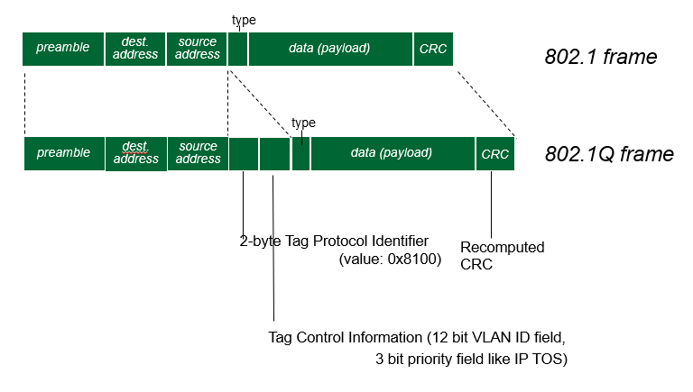

## 5.5 링크 가상화

### 6.5.1 다중 프로토콜 레이블 스위칭(MPLS)

원래는 ip 주소의 참조없이 레이블이라는 추가적인 헤더를 통해서 IP 포워딩을 빠르게 하기 위해 고안된 기술이다.

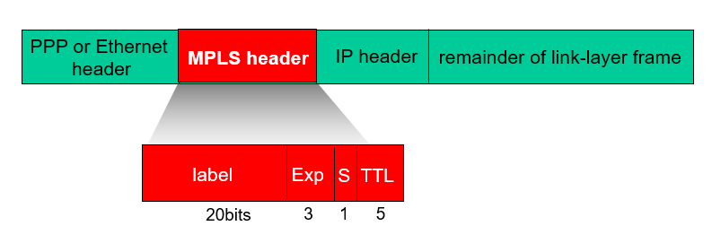

MPLS는 추가적인 MPLS 헤더에 들어있는 정보를 통해서 기존에 IP 목적지 주소로만 포워딩을 하던것에서 더 강화된 기능을 제공할 수 있다.

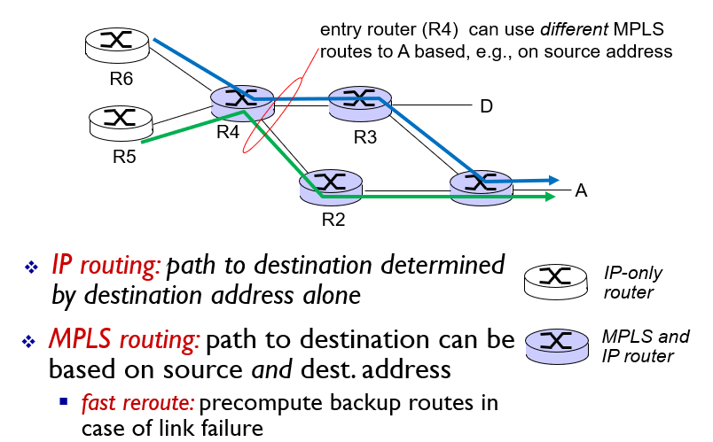

MPLS는 입력 레이블과 출력 레이블 2가지 정보로 포워딩을 결정한다. 이같은 동작의 장점은 패킷이 전달되는 경로를 여러개 설정할 수 있다는 것이다. 이에 반해서 기존의 IP 주소 기반 포워딩에서는 하나의 최소비용 경로가 결정되면 계속 그 경로로만 패킷이 전송된다. **MPLS의 장점을 통해서 패킷 트래픽을 여러 경로로 분산시킬수 있게되었다.** 이러한 기능을 **트래픽 엔지니어링(traffic engineering)** 이라고 한다.
